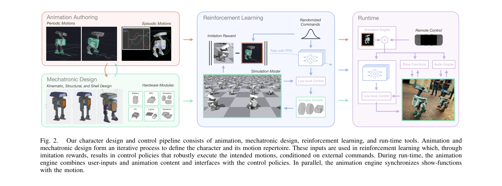
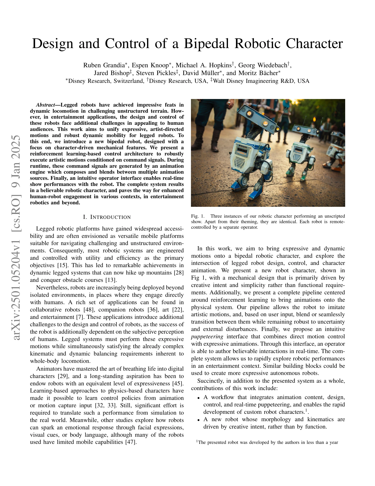

# Design and Control of a Bipedal Robotic Character

> **저자**: Ruben Grandia, Espen Knoop, Michael A. Hopkins, Georg Wiedebach, Jared Bishop, Steven Pickles, David Müller, Moritz Bächer | **날짜**: 2025-01-09 | **URL**: [https://arxiv.org/abs/2501.05204](https://arxiv.org/abs/2501.05204)

---

## Essence

*Fig. 2.*

이 논문은 표현력 있는 예술적 동작과 강건한 동적 이동성을 결합한 이족 로봇 캐릭터의 설계 및 제어 시스템을 제시한다. Reinforcement Learning 기반 제어 구조와 실시간 애니메이션 엔진을 통해 로봇이 연극적 성능을 수행할 수 있도록 한다.

## Motivation

- **Known**: 이족 로봇은 동적 이동성 분야에서 인상적인 성과를 이루었으며, 로봇의 움직임이 인간의 인식에 영향을 미친다는 것이 널리 알려져 있다. 또한 애니메이션 원리를 로봇에 적용하는 연구와 Reinforcement Learning을 통한 운동 제어 연구가 존재한다.
- **Gap**: 기존 연구는 주로 일반 목적의 플랫폼으로 설계된 로봇들을 사용했거나, 동적 이동성과 표현적 동작을 동시에 달성하는 통합 시스템이 부족했다. 또한 기계적 설계와 운동이 예술적 비전에 따라 공동으로 개발된 사례가 제한적이다.
- **Why**: 엔터테인ment 응용에서 로봇의 성공은 인간의 주관적 인식에 의존하므로, 표현성과 동적 능력의 통합이 중요하다. 이는 휴먼-로봇 상호작용의 질을 크게 향상시키고 로봇의 실제 활용 범위를 확장할 수 있다.
- **Approach**: 기계적 설계와 애니메이션을 반복적으로 진행하면서 creative intent를 우선시하고, PPO를 사용한 imitation reward 기반 Reinforcement Learning으로 여러 개의 정책을 훈련한다. 실시간에서 animation engine이 사용자 입력과 애니메이션 콘텐츠를 합성하여 제어 신호를 생성하고, 직관적인 조종 인터페이스로 로봇 성능을 실현한다.

## Achievement

*Fig. 1.*

- **통합 워크플로우**: 애니메이션 콘텐츠, 설계, 제어, 실시간 조종을 통합하여 맞춤형 로봇 캐릭터의 빠른 개발 (1년 이내)을 가능하게 했다.
- **창의적 기반 설계**: 기능 요구사항보다는 창의적 의도에 의해 주도된 새로운 로봇의 형태와 운동학을 개발했다.
- **분류 기반 제어**: 다양한 동작을 별도의 범주로 분류하고 각각에 대한 제어 정책을 훈련하여 실시간에 전환할 수 있도록 했다.
- **조종 인터페이스**: 조건부 정책 입력을 활용한 직관적인 조종 인터페이스로 실시간 로봇 성능을 가능하게 했다.
- **강건한 실행**: 예술적 동작을 불확실성과 외부 교란에 강건하게 실행할 수 있음을 입증했다.

## How

*Fig. 2.*

- Animation tools (classical rig 기반)를 사용하여 캐릭터의 비율과 운동 범위 연구
- Procedural gait generation tool로 물리적으로 타당한 주기적 보행 사이클 생성
- Joint positions, velocities, torques를 mechanical design에 피드백하여 geometry, actuators, structural analysis 최적화
- 시뮬레이션 모델에 actuator models과 domain randomization을 통합
- Animation tools에서 kinematic motion references를 추출하여 imitation rewards 정의
- PPO (Proximal Policy Optimization)를 사용하여 각 동작 또는 동작 유형별로 독립적인 정책 훈련
- 고수준 제어 신호 (commands)로 정책을 조건화하여 runtime에서 seamless 전환 및 blending 구현
- Animation engine이 user inputs과 animation content를 합성하여 제어 신호 생성
- IMU 피드백을 통해 저수준 제어기에서 안정성 유지

## Originality

- **공동 설계 패러다임**: 기능 요구사항이 아닌 창의적 의도가 기계적 설계를 주도하는 새로운 접근법
- **분할 정복 전략**: 단일 정책 대신 여러 정책을 훈련하고 runtime에 전환하는 구조
- **Animation-Mechatronics 통합 워크플로우**: 애니메이션과 기계적 설계의 반복적 상호작용으로 빠른 개발 순환
- **조종 기반 인터페이스**: 고정된 autonomous behavior 대신 puppeteer가 실시간으로 show를 author할 수 있는 인터페이스
- **Conditional policy 활용**: 고수준 control commands로 여러 동작의 seamless blending 및 전환 실현

## Limitation & Further Study

- 제시된 로봇은 특정 엔터테인ment 응용에 맞춤화되어 일반화 가능성이 제한적일 수 있다.
- 여러 개의 독립적 정책을 훈련해야 하므로 새로운 동작 추가 시 재훈련 비용이 발생한다.
- Domain randomization을 사용했지만 sim-to-real gap의 완전한 해결은 제시되지 않았다.
- 외부 환경 또는 복잡한 지형에서의 강건성 평가가 제한적이다.
- 후속 연구는 더 큰 동작 레퍼토리에 대한 통합 정책 학습 방법 개발, 비인간형 캐릭터에 대한 일반화, 그리고 fully autonomous behavior planning 시스템으로의 확장을 고려할 수 있다.

## Evaluation

- Novelty: 4/5
- Technical Soundness: 3/5
- Significance: 4/5
- Clarity: 4/5
- Overall: 4/5

**총평**: 이 논문은 이족 로봇의 표현성과 동적 능력을 통합하는 혁신적인 설계 및 제어 파이프라인을 제시하며, 애니메이션과 로봇 공학의 교점에서 새로운 패러다임을 제안한다. 엔터테인ment 로보틱스와 휴먼-로봇 상호작용 분야에 중요한 기여를 하면서도 실제 시스템 구현을 통해 실용성을 입증했다.

## Related Papers

- 🔄 다른 접근: [[papers/1912_EMOTION_Expressive_Motion_Sequence_Generation_for_Humanoid_R/review]] — Design and Control of Bipedal Robotic Character와 EMOTION 모두 휴머노이드의 표현적 동작을 다루지만 연극적 성능 vs 감정적 동작 시퀀스로 서로 다른 예술적 목표를 추구한다.
- 🔗 후속 연구: [[papers/1882_Do_You_Have_Freestyle_Expressive_Humanoid_Locomotion_via_Aud/review]] — 이족 로봇 캐릭터의 표현적 동작이 Do You Have Freestyle의 자율적 표현형 휴머노이드 로코모션으로 확장되어 더 자유로운 동작 표현을 가능하게 한다.
- 🏛 기반 연구: [[papers/2116_Olaf_Bringing_an_Animated_Character_to_Life_in_the_Physical/review]] — Olaf의 애니메이션 캐릭터를 물리적 세계로 구현하는 기술이 이족 로봇 캐릭터의 표현적 동작과 강건한 제어 시스템 설계에 기초적 프레임워크를 제공한다.
- 🔄 다른 접근: [[papers/1972_Hierarchical_Intention-Aware_Expressive_Motion_Generation_fo/review]] — 이족 로봇 캐릭터의 연극적 성능과 계층적 의도 인식 표현 동작 생성은 휴머노이드의 감정적 표현에서 서로 다른 제어 아키텍처를 사용한다.
- 🔗 후속 연구: [[papers/1918_ExBody2_Advanced_Expressive_Humanoid_Whole-Body_Control/review]] — 고급 표현적 인간형 전신 제어로 발전됩니다.
- 🔄 다른 접근: [[papers/1882_Do_You_Have_Freestyle_Expressive_Humanoid_Locomotion_via_Aud/review]] — 표현적 인간형 운동을 위한 다른 실시간 제어 방식을 제시합니다.
- 🔄 다른 접근: [[papers/2001_Humanoid_Robot_Acrobatics_Utilizing_Complete_Articulated_Rig/review]] — 이족 로봇 캐릭터 제어를 이 논문은 아크로바틱에, Design and Control은 일반적 설계에 특화한다.
