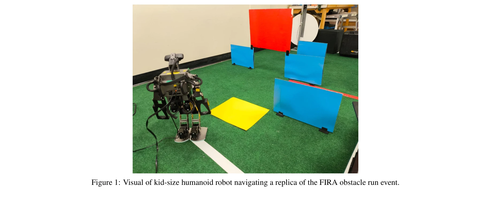
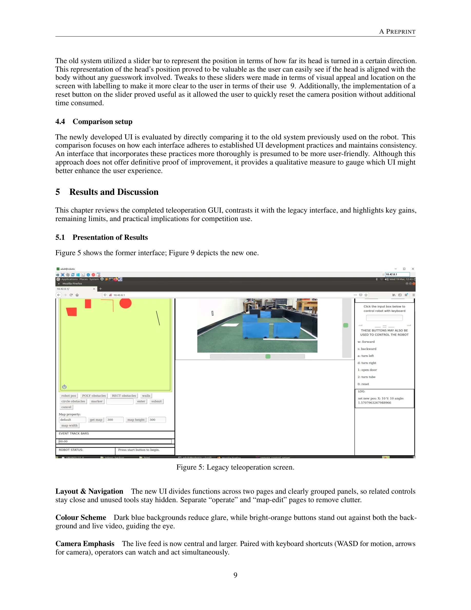
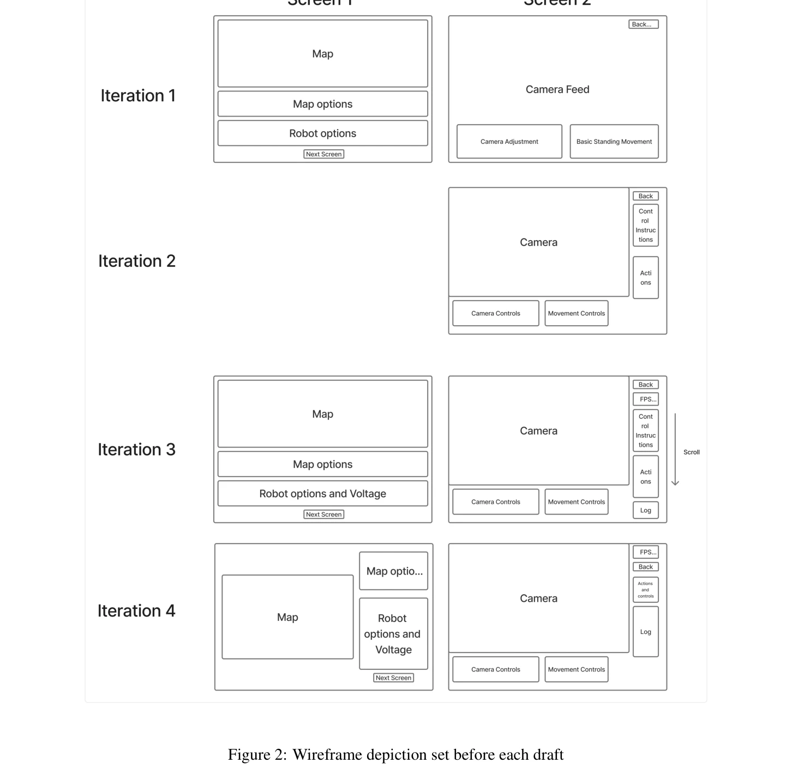

# Development of an Intuitive GUI for Non-Expert Teleoperation of Humanoid Robots

> **저자**: Austin Barret, Meng Cheng Lau | **날짜**: 2025-10-15 | **URL**: [https://arxiv.org/abs/2510.13594](https://arxiv.org/abs/2510.13594)

---

## Essence

*Figure 1: Visual of kid-size humanoid robot navigating a replica of the FIRA obstacle run event.*

FIRA HuroCup 경기에서 비전문가 운영자가 인형형 로봇을 텔레조작할 수 있도록 사용자 친화적인 GUI를 개발했다. HTML, CSS, JavaScript를 사용하여 직관적인 인터페이스를 반복적으로 설계하고 테스트했다.

## Motivation

- **Known**: 텔레조작 로봇 시스템은 의료, 채광, 우주탐사 등 다양한 실용 분야에서 활용되고 있으며, FIRA RoboWorld Cup 같은 경기는 텔레조작 기술의 테스트 플랫폼으로 역할한다. 직관적인 GUI 설계는 운영자의 인지 부하를 줄이고 성능을 향상시킬 수 있다.
- **Gap**: 기존 인형형 로봇 시스템들은 비전문가를 중심으로 한 GUI 개발에 충분히 투자하지 않고 있으며, 대부분 훈련된 전문 운영자를 대상으로 설계되어 있다. 실제 경합 환경에서 사용 가능한 간단하고 확장 가능하며 직관적인 인터페이스가 부족하다.
- **Why**: 새로운 팀원들이 기존 시스템을 상속받아야 하는 경합 환경에서 사용자 친화적인 인터페이스는 재교육 필요성을 줄이고 인지 부하를 낮춘다. 또한 보안이 중요한 채광, 우주탐사 같은 고위험 영역에서도 인직관적인 텔레조작이 필수적이다.
- **Approach**: HRI(Human-Robot Interaction) 가이드라인과 웹 디자인 모범 사례를 기반으로 반복적 사용자 중심 설계(UCD) 방법론을 적용했다. 카메라 기반 시각화에 중점을 두고, wireframe 작성 → 구현 → 테스트 → 개선의 순환적 개발 사이클을 거쳤다.

## Achievement

*Figure 5 shows the former interface; Figure 9 depicts the new one.*

- **직관적 인터페이스 설계**: 명확한 레이블, 일관된 레이아웃, crawl 기능 등 핵심 액션을 통합하여 비전문가도 쉽게 조작 가능하도록 구현
- **개선된 카메라 시각화**: 로봇의 환경 인식을 최적화하여 카메라 기반 피드백만으로도 효과적인 텔레조작 가능
- **실시간 상태 피드백**: 전압 지시계, 진단 로그 등을 추가하여 운영자가 로봇 상태를 즉시 파악 가능
- **FIRA 규정 호환 시스템**: regulation-compliant turf track에서 테스트되어 실제 경합 환경에서의 유효성 검증

## How

*Figure 2: Wireframe depiction set before each draft*

- HTML, CSS, JavaScript를 사용한 custom 개발로 높은 제어 가능성 확보
- HTTP 및 WebSocket 통신과 JSON 메시지 포맷을 통해 로봇과 실시간 양방향 통신
- ROS1 기반 publisher-subscriber 모델로 기존 텔레조작 노드(Python 2.7, C++)와 통합
- Wireframe 기반 레이아웃 가이드와 반복적 testing을 통한 지속적 개선
- 외부 라이브러리 없이 순수 개발로 커스터마이제이션 극대화

## Originality

- 기존 Bootstrap 기반 GUI에서 벗어나 완전한 custom 개발로 FIRA HuroCup 경합에 특화된 인터페이스 구축
- 카메라 단독 피드백 제약 조건 하에서 실시간 환경 인식을 위한 최적화된 시각화 전략 개발
- 경합팀 환경의 빠른 인수인계를 염두에 둔 직관성 중심의 설계 철학 적용
- HRI 원칙과 웹 디자인 모범 사례를 텔레로봇 컨텍스트에 통합적으로 적용한 사례

## Limitation & Further Study

- 윤리 승인 없이 개발자에 의한 주관적 평가만 수행되어, 외부 사용자 테스트 및 정량적 메트릭(예: SUS 점수) 부재
- 비전문가 운영자 대상 형식적 사용성 평가 미실시로 실제 비전문가 그룹의 성능 개선 정량화 불가
- 다른 사용자의 로봇 수정으로 인한 불일치한 로봇 동작이 테스트에 영향
- Ubuntu Mint 16.04, ROS1, Python 2.7 등 레거시 환경에 의존하여 향후 확장성 제한
- **후속연구**: 제3자 평가 및 비전문가 사용자 그룹을 포함한 정량적 사용성 테스트, SUS 척도 기반 평가, 다양한 로봇 플랫폼으로의 확장 검증

## Evaluation

- Novelty: 4/5
- Technical Soundness: 3/5
- Significance: 4/5
- Clarity: 4/5
- Overall: 4/5

**총평**: 본 연구는 경합 환경에서 실제로 필요한 비전문가 중심의 텔로봇 GUI를 반복적 개발 방식으로 체계적으로 구축한 의미 있는 실무 기여이다. 다만 외부 사용자 평가 부재로 주장의 일반화 가능성이 제한되며, 향후 형식적인 사용성 평가를 통한 정량적 검증이 필요하다.

## Related Papers

- 🏛 기반 연구: [[papers/2070_Learning_to_Look_Around_Enhancing_Teleoperation_and_Learning/review]] — 텔레조작과 학습을 향상시키는 look-around 기술이 비전문가 GUI의 직관적인 인터페이스 설계에 필요한 시각적 피드백 기반을 제공한다
- 🔗 후속 연구: [[papers/1707_Teleoperation_of_Humanoid_Robots_A_Survey/review]] — 휴머노이드 로봇 텔레조작 설문 연구가 FIRA HuroCup용 비전문가 GUI 개발을 더욱 포괄적이고 체계적인 관점에서 확장한다
- 🧪 응용 사례: [[papers/1991_Human-Robot_Collaboration_for_the_Remote_Control_of_Mobile_H/review]] — 모바일 휴머노이드 원격 제어를 위한 인간-로봇 협업 기술이 비전문가 텔레조작 GUI를 실제 협업 시나리오에서 활용할 수 있다
- 🔄 다른 접근: [[papers/1835_CHILD_Controller_for_Humanoid_Imitation_and_Live_Demonstrati/review]] — 직관적 GUI의 소프트웨어 기반 비전문가 인터페이스와 CHILD의 물리적 장치 기반 직접 제어는 휴머노이드 텔레오퍼레이션에서 서로 다른 사용자 인터페이스 접근법이다.
- 🏛 기반 연구: [[papers/2124_Open-TeleVision_Teleoperation_with_Immersive_Active_Visual_F/review]] — Open-TeleVision의 몰입형 능동 시각 텔레오퍼레이션 기술이 비전문가를 위한 직관적 GUI 설계에 필요한 시각적 피드백과 인터페이스 설계 원칙을 제공한다.
- 🔗 후속 연구: [[papers/2043_Learning_Adaptive_Neural_Teleoperation_for_Humanoid_Robots_F/review]] — 비전문가용 GUI가 적응형 신경 텔레오퍼레이션으로 발전하여 사용자 친화성과 지능형 보조 기능을 결합한 더 고도화된 인터페이스를 구현한다.
- 🔄 다른 접근: [[papers/1631_RAPID_Hand_A_Robust_Affordable_Perception-Integrated_Dextero/review]] — GUI 기반 텔레오퍼레이션과 RAPID Hand의 지각 통합 정교한 손 제어는 휴머노이드 조작에서 인터페이스 vs 하드웨어 중심의 서로 다른 접근법이다.
- 🔄 다른 접근: [[papers/1835_CHILD_Controller_for_Humanoid_Imitation_and_Live_Demonstrati/review]] — CHILD는 물리적 장치로 직접 관절 매핑을, 직관적 GUI는 소프트웨어 인터페이스로 비전문가 조작을 가능하게 하는 서로 다른 접근법이다.
- 🏛 기반 연구: [[papers/1781_A_Rapid_Instrument_Exchange_System_for_Humanoid_Robots_in_Mi/review]] — 비전문가를 위한 직관적 원격조작 GUI가 외과의사를 위한 HMD 기반 몰입형 인터페이스의 기반 기술을 제공합니다.
- 🏛 기반 연구: [[papers/1991_Human-Robot_Collaboration_for_the_Remote_Control_of_Mobile_H/review]] — Intuitive GUI for teleoperation이 human-robot collaboration의 사용자 인터페이스 기반이 됩니다.
- 🏛 기반 연구: [[papers/2118_OmniClone_Engineering_a_Robust_All-Rounder_Whole-Body_Humano/review]] — OmniClone의 최적화된 텔레오퍼레이션 시스템이 Development of an Intuitive GUI의 비전문가용 직관적 인터페이스 개발에 필요한 기술적 기반을 제공한다.
