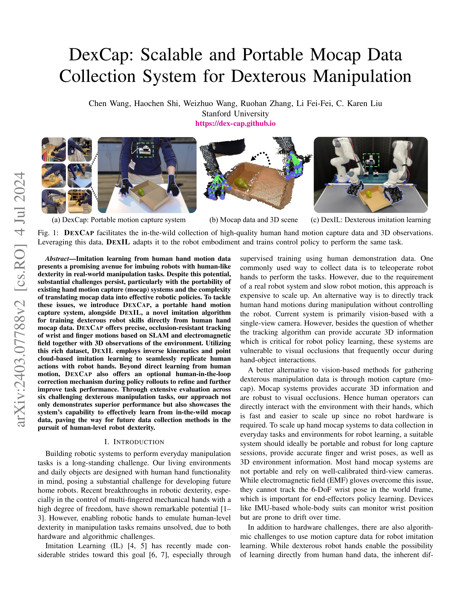
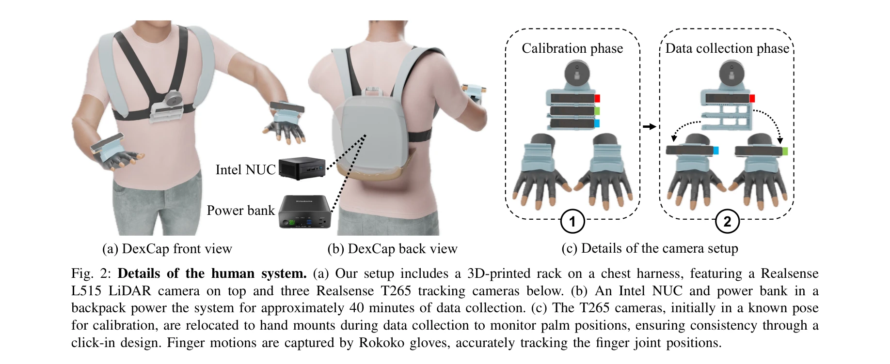
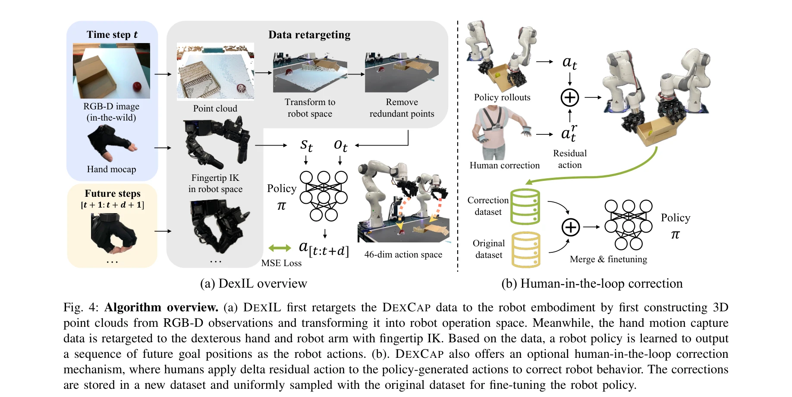

# DexCap: Scalable and Portable Mocap Data Collection System for Dexterous Manipulation

> **저자**: Chen Wang, Haochen Shi, Weizhuo Wang, Ruohan Zhang, Li Fei-Fei, C. Karen Liu | **날짜**: 2024-03-12 | **URL**: [https://arxiv.org/abs/2403.07788](https://arxiv.org/abs/2403.07788)

---

## Essence

*Fig. 1: DEXCAP facilitates the in-the-wild collection of high-quality human hand motion capture data and 3D observations*

DexCap은 SLAM과 전자기장을 활용한 휴대용 손 모션캡처 시스템이며, DexIL은 이 데이터로부터 역운동학과 point cloud 기반 모방학습을 통해 로봇이 손가락 조작을 직접 학습하도록 하는 알고리즘이다.

## Motivation

- **Known**: 모방학습(imitation learning)은 인간 시연 데이터로부터 로봇 정책을 학습할 수 있으나, 기존 모션캡처 시스템은 휴대성이 낮고 모션캡처 데이터를 로봇 정책으로 변환하는 것이 복잡하다.
- **Gap**: 기존 hand mocap 시스템은 휴대성이 부족하거나(카메라 기반), 6-DoF 손목 자세를 추적하지 못하거나(EMF 장갑), 시간 경과에 따른 드리프트가 발생한다(IMU 기반). 또한 인간 손과 로봇 손의 embodiment gap을 극복하는 저수준 제어 학습 알고리즘이 부족하다.
- **Why**: 휴대용 mocap 시스템과 효과적인 retargeting 알고리즘이 있으면 로봇이 일상 환경에서 인간 수준의 손가락 조작 기술을 습득할 수 있어 가정용 로봇의 실용화를 앞당길 수 있다.
- **Approach**: DexCap은 mocap 장갑, SLAM 카메라, RGB-D LiDAR 카메라를 통합한 휴대용 시스템이고, DexIL은 역운동학으로 retargeting한 후 Diffusion Policy 기반 point cloud behavior cloning으로 정책을 학습하며, 필요시 human-in-the-loop 보정 메커니즘을 적용한다.

## Achievement

*Fig. 2: Details of the human system. (a) Our setup includes a 3D-printed rack on a chest harness, featuring a Realsense*

- **DexCap 시스템**: 60Hz 실시간 추적, occlusion 저항성, 6-DoF 손목 자세 및 손가락 관절 추적, 휴대 가능한 설계로 in-the-wild 데이터 수집 가능
- **DexIL 알고리즘**: 인간 mocap 데이터를 역운동학으로 로봇에 retarget하고 point cloud 기반 imitation learning으로 6가지 복잡한 조작 작업 수행
- **Human-in-the-Loop 메커니즘**: 정책 롤아웃 중 인간이 개입하여 motion correction 데이터를 수집하고 정책을 fine-tuning할 수 있는 메커니즘 제시

## How

*Fig. 4: Algorithm overview. (a) DEXIL first retargets the DEXCAP data to the robot embodiment by first constructing 3D*

- **하드웨어 구성**: Rokoko EMF 장갑으로 손가락 관절 추적, 손등 장착 Intel Realsense T265 카메라로 SLAM 기반 손목 6-DoF 자세 추적, 가슴 장착 Realsense L515 LiDAR 카메라로 환경 3D 관찰
- **Data retargeting**: 인간의 손가락 끝점과 로봇 손가락 끝점을 동일 3D 위치로 맞추기 위해 역운동학(IK) 사용, 손목 6-DoF 자세로 IK 초기화
- **정책 학습**: RGB-D 이미지를 point cloud 표현으로 변환, Diffusion Policy 기반 generative behavior cloning으로 visuomotor 정책 학습
- **Human-in-the-loop 보정**: 로봇 정책 실행 중 인간이 DexCap 착용 상태에서 비정상 동작 시 개입, 개입 데이터로 정책 fine-tuning

## Originality

- SLAM과 electromagnetic field 기술을 결합한 hybrid mocap 시스템으로 occlusion 강건성과 휴대성 동시 달성
- 손목 6-DoF 자세 정보를 활용한 inverse kinematics 기반 data retargeting으로 embodiment gap 해결
- Point cloud 기반 Diffusion Policy로 시각-운동 정책을 직접 학습하는 novel imitation learning 접근
- 정책 학습 중 human-in-the-loop 보정 메커니즘으로 iterative 성능 개선

## Limitation & Further Study

- 시스템이 약 40분 배터리 수명으로 제한되어 장시간 데이터 수집이 어려움
- 6가지 작업 평가로 제한되어 다양한 조작 작업에 대한 일반화 능력 검증 필요
- Embodiment gap이 큰 경우 IK만으로는 부족하여 human-in-the-loop 개입이 필요한 한계
- Point cloud 기반 학습이 high-frequency force control 등 세밀한 물리적 피드백을 반영하지 못할 수 있음
- 후속 연구로 더 긴 배터리, 다양한 로봇 손(Shadow Hand, Allegro Hand 등) 지원, 멀티모달 데이터 통합(촉각, 힘 피드백) 등이 필요

## Evaluation

- Novelty: 4/5
- Technical Soundness: 3/5
- Significance: 4/5
- Clarity: 4/5
- Overall: 4/5

**총평**: DexCap과 DexIL은 휴대용 mocap 시스템과 embodiment gap을 극복하는 imitation learning을 처음으로 통합하여 in-the-wild 환경에서 로봇 손가락 조작 학습을 가능하게 한 우수한 기여이며, 6가지 조작 작업에서 일관된 성과를 보여준다.
