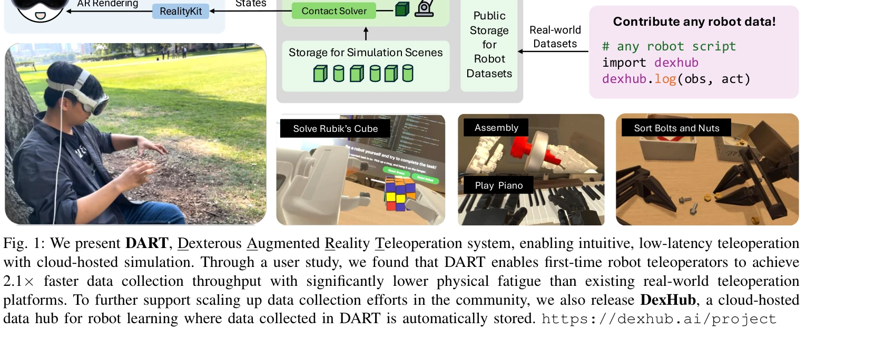
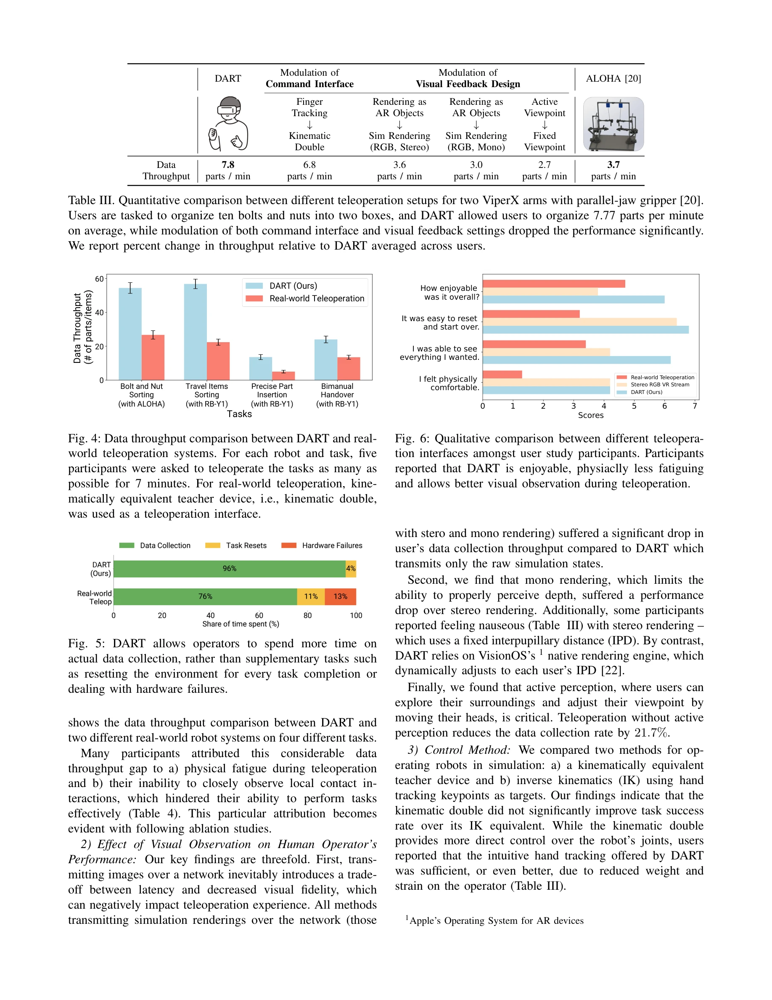

# DexHub and DART: Towards Internet Scale Robot Data Collection

> **저자**: Younghyo Park, Jagdeep Singh Bhatia, Lars Ankile, Pulkit Agrawal | **날짜**: 2024-11-04 | **URL**: [https://arxiv.org/abs/2411.02214](https://arxiv.org/abs/2411.02214)

---

## Essence

*Fig. 1: We present DART, Dexterous Augmented Reality Teleoperation system, enabling intuitive, low-latency teleoperation*

DART는 클라우드 기반 시뮬레이션과 AR을 활용한 군중기반 로봇 데이터 수집 플랫폼이며, DexHub는 수집된 데이터를 저장하는 공개 클라우드 데이터베이스이다.

## Motivation

- **Known**: 기존 로봇 데이터 수집은 실세계 환경 구축, 하드웨어 요구사항, 빈번한 리셋 등으로 인해 확장성이 제한된다. VR/AR 기반 시뮬레이션 수집 시스템들이 존재하나, 네트워크 지연과 시각적 충실도 간의 트레이드오프 문제가 있다.
- **Gap**: 기존 시뮬레이션 기반 수집 방식은 비디오 스트림 전송으로 인한 지연 문제가 있으며, 공개적이고 접근 가능한 대규모 데이터 수집 플랫폼이 부족하다. 또한 대부분의 기존 대규모 데이터셋이 단일 팔 로봇에만 집중되어 있다.
- **Why**: 생성로봇(generalist robotic system) 개발을 위해서는 대규모 다양한 고품질 데이터가 필수적이며, 인터넷 규모의 유기적 데이터 증가 메커니즘이 필요하다. 효율적인 데이터 수집은 로봇 학습의 성능과 일반화를 크게 향상시킨다.
- **Approach**: DART는 AR 렌더링을 통해 클라우드 시뮬레이션의 시각적 피드백을 제공하여 네트워크 지연을 최소화하고, hand tracking으로 직관적 원격조종을 가능하게 한다. 수집된 모든 데이터는 DexHub에 자동 저장되어 공동체가 접근할 수 있도록 한다.

## Achievement

*Fig. 4: Data throughput comparison between DART and real-*

- **2.1배 높은 데이터 수집 처리량**: 사용자 연구에서 DART가 실세계 원격조종 대비 2.1배 빠른 데이터 수집 속도를 달성함을 입증
- **물리적·인지적 피로 감소**: 버튼 클릭으로 환경 리셋이 가능하고 AR 인터페이스가 직관적이어서 작업자 피로가 크게 감소
- **시뮬-투-리얼 전이 성공**: DART로 수집한 데이터로 훈련한 정책이 실제 로봇으로 성공적으로 전이되며 미시각화 왜곡에 강건함
- **다양한 작업 지원**: Rubik's Cube 풀기, 조립, 피아노 연주, 부품 정렬 등 복잡한 손재주 작업 지연 없이 수행 가능", '**공개 데이터 플랫폼**: DexHub는 커뮤니티의 모든 로봇 데이터를 수용하고 계속 성장하는 데이터 허브로 기능

## How

*Fig. 1: We present DART, Dexterous Augmented Reality Teleoperation system, enabling intuitive, low-latency teleoperation*

- **AR 기반 시각적 피드백**: RealityKit과 ARKit을 활용해 raw 비디오 스트림 대신 AR 객체로 렌더링하여 네트워크 지연 최소화
- **Hand tracking 및 Retargeting**: ARKit의 hand tracking으로 사용자 손 움직임 추적, Differential IK 기반 hand retargeter로 로봇 움직임으로 변환
- **클라우드 기반 Physics Engine**: 클라우드 시뮬레이션 환경에서 물리 계산 수행, contact solver로 접촉 상호작용 처리
- **환경 리셋 자동화**: 시뮬레이션의 상태 저장/복원으로 클릭 한 번에 환경 초기화 가능
- **데이터 자동 로깅**: 수집 중인 관측(obs)과 행동(act)이 DexHub에 자동으로 저장되는 통합 파이프라인
- **사용자 연구**: 사용성, 처리량, 피로도 등을 정량적으로 비교분석하는 사용자 연구 수행

## Originality

- **AR 렌더링의 창의적 활용**: 기존의 시뮬레이션 데이터 수집이 비디오 스트림 전송에 의존한 반면, AR 객체 렌더링으로 지연을 획기적으로 감소시킴
- **통합 플랫폼 아키텍처**: 데이터 수집(DART)과 저장/공유(DexHub)를 단일 시스템으로 통합하여 폐쇄 루프 데이터 생태계 구축
- **대규모 공개 데이터 철학**: 기존의 프로젝트별 폐쇄 데이터셋과 달리 인터넷 규모의 유기적 증가를 목표로 설계
- **손재주 작업 중심**: 기존 단팔 로봇 중심에서 양손 및 손가락 수준의 정밀 조종으로 확장

## Limitation & Further Study

- **시뮬레이션-현실 갭**: 시뮬레이션에서 학습한 정책이 실제 환경의 예상치 못한 왜곡에 강건하다고 했으나, 더 극단적인 도메인 차이 테스트 필요
- **하드웨어 의존성**: AR 데이터 수집을 위해서는 ARKit 호환 디바이스(iOS)가 필요하며, Android 등 다른 플랫폼 확장이 미명시
- **스케일 평가 부족**: 논문 제출 시점(2024년 11월)에 DexHub의 실제 공개 여부와 커뮤니티 채택도가 불명확함
- **정책 훈련 파이프라인 상세 부족**: 시뮬 데이터로 훈련한 정책이 실제로 어떤 강화학습 알고리즘을 사용했는지, 베이스라인과의 비교가 제한적
- **후속 연구 방향**: (1) 더 다양한 로봇 형태(다족 로봇, 이동 로봇)로의 확장, (2) 온라인 강화학습을 통한 자동 데이터 개선 파이프라인 구축, (3) 멀티모달 피드백(촉각, 음향) 통합, (4) 데이터 품질 관리 및 큐레이션 전략 수립

## Evaluation

- Novelty: 4/5
- Technical Soundness: 4/5
- Significance: 4/5
- Clarity: 4/5
- Overall: 4/5

**총평**: 본 논문은 AR과 클라우드 시뮬레이션을 창의적으로 결합하여 로봇 데이터 수집의 실질적 문제(지연, 피로, 확장성)를 해결하는 DART 플랫폼을 제시하며, DexHub를 통해 커뮤니티 규모의 데이터 생태계 구축을 시도한 점에서 높은 기여도를 가진다.

## Related Papers

- 🏛 기반 연구: [[papers/1951_Genie_Sim_30__A_High-Fidelity_Comprehensive_Simulation_Platf/review]] — Genie Sim 3.0의 고충실도 시뮬레이션 플랫폼이 DART의 클라우드 기반 데이터 수집을 위한 핵심 인프라를 제공한다.
- 🔄 다른 접근: [[papers/2164_TWIST2_Scalable_Portable_and_Holistic_Humanoid_Data_Collecti/review]] — TWIST2가 humanoid 데이터 수집을 위한 다른 접근법을 제시하여 DexHub와 상호 보완적인 데이터 생태계를 구축할 수 있다.
- 🧪 응용 사례: [[papers/1644_RoboCasa_Large-Scale_Simulation_of_Everyday_Tasks_for_Genera/review]] — RoboCasa의 large-scale simulation이 DexHub 데이터베이스와 연계되어 더 포괄적인 로봇 학습 환경을 조성한다.
- 🔗 후속 연구: [[papers/1869_DexMimicGen_Automated_Data_Generation_for_Bimanual_Dexterous/review]] — DexHub의 클라우드 데이터베이스가 DexMimicGen의 자동 생성된 양손 정교 조작 데이터를 저장하고 공유하는 플랫폼으로 확장되어 더 큰 규모의 데이터 생태계를 구축한다.
- 🏛 기반 연구: [[papers/1824_BiGym_A_Demo-Driven_Mobile_Bi-Manual_Manipulation_Benchmark/review]] — DART의 클라우드 기반 군중 데이터 수집이 BiGym의 다양한 이족 조작 작업에 필요한 대규모 시연 데이터를 효율적으로 수집하는 플랫폼을 제공한다.
- 🏛 기반 연구: [[papers/2104_MolmoSpaces_A_Large-Scale_Open_Ecosystem_for_Robot_Navigatio/review]] — MolmoSpaces의 대규모 개방형 로봇 생태계가 DexHub의 클라우드 데이터베이스와 DART의 데이터 수집 플랫폼 구축에 필요한 인프라와 설계 원칙을 제공한다.
- 🏛 기반 연구: [[papers/1670_SENTINEL_A_Fully_End-to-End_Language-Action_Model_for_Humano/review]] — 언어-행동 모델 학습을 위한 데이터 수집 플랫폼을 제공합니다.
- 🏛 기반 연구: [[papers/1869_DexMimicGen_Automated_Data_Generation_for_Bimanual_Dexterous/review]] — DexHub의 클라우드 데이터베이스 플랫폼이 DexMimicGen으로 자동 생성된 대규모 양손 정교 조작 데이터를 저장하고 배포하는 데 필요한 인프라를 제공한다.
- 🔗 후속 연구: [[papers/1900_EgoDex_Learning_Dexterous_Manipulation_from_Large-Scale_Egoc/review]] — DexHub의 대규모 로봇 데이터 수집 시스템이 EgoDex의 자아중심 비디오 데이터셋을 로봇 도메인으로 확장한 개념입니다.
- 🏛 기반 연구: [[papers/1967_HandX_Scaling_Bimanual_Motion_and_Interaction_Generation/review]] — DexHub의 인터넷 규모 로봇 데이터 수집이 HandX의 대규모 bimanual motion 데이터셋 구축에 기반이 됩니다.
- 🏛 기반 연구: [[papers/2089_ManiSkill-HAB_A_Benchmark_for_Low-Level_Manipulation_in_Home/review]] — DexHub의 internet scale data collection 개념이 MS-HAB의 자동화된 궤적 필터링 시스템 설계에 영감을 제공했다
- 🏛 기반 연구: [[papers/2114_Object-Centric_Dexterous_Manipulation_from_Human_Motion_Data/review]] — DexHub의 대규모 로봇 데이터 수집이 인간 손 모션 데이터 기반 다지털 조작 학습의 데이터 인프라 기반을 제공한다.
- 🔗 후속 연구: [[papers/2164_TWIST2_Scalable_Portable_and_Holistic_Humanoid_Data_Collecti/review]] — DexHub의 internet-scale 데이터 수집과 TWIST2의 scalable 데이터 수집을 결합하면 더 포괄적인 휴머노이드 데이터셋 구축 가능
