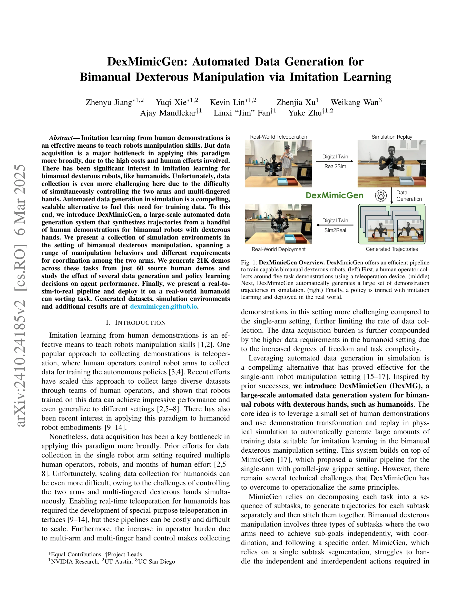
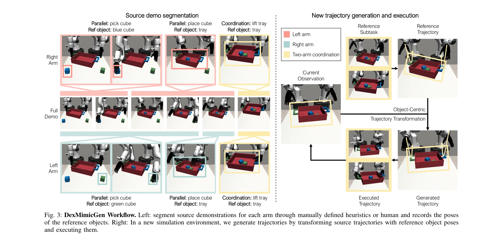

# DexMimicGen: Automated Data Generation for Bimanual Dexterous Manipulation via Imitation Learning

> **저자**: Zhenyu Jiang, Yuqi Xie, Kevin Lin, Zhenjia Xu, Weikang Wan, Ajay Mandlekar, Linxi Fan, Yuke Zhu | **날짜**: 2024-10-31 | **URL**: [https://arxiv.org/abs/2410.24185](https://arxiv.org/abs/2410.24185)

---

## Essence

*Fig. 1: DexMimicGen Overview. DexMimicGen offers an efficient pipeline*

DexMimicGen은 소수의 인간 시연으로부터 simulation에서 자동으로 대규모 궤적 데이터를 생성하여 양손 dexterous 로봇 조작 학습을 위한 imitation learning 데이터 수집 병목을 해결하는 시스템이다.

## Motivation

- **Known**: Imitation learning은 인간 시연으로부터 로봇 조작 기술을 학습하는 효과적인 방법이며, MimicGen은 단일 팔 로봇에 대해 자동 데이터 생성을 성공적으로 적용했다.
- **Gap**: 양손 dexterous 로봇의 경우 두 팔과 multi-fingered 손을 동시에 제어해야 하고 팔 간 조정이 필요하여, 기존 MimicGen 접근법을 직접 적용할 수 없으며 전문화된 해결책이 필요하다.
- **Why**: 양손 humanoid 로봇의 teleoperation 데이터 수집은 높은 비용과 인력이 소요되며 operator의 부담이 크기 때문에, 자동화된 simulation 기반 데이터 생성은 대규모 dataset 구축을 가능하게 한다.
- **Approach**: DexMimicGen은 per-arm 기반 subtask 분할, 동기화 전략, 순서 제약 메커니즘을 도입하여 parallel, coordination, sequential 세 가지 유형의 양손 조작 subtask를 처리한다.

## Achievement

*Fig. 1: DexMimicGen Overview. DexMimicGen offers an efficient pipeline*

- **자동 데이터 생성 시스템**: 60개의 인간 시연으로부터 21K개의 생성된 데모를 9개의 simulation 환경에서 생성
- **양손 조정 메커니즘**: Asynchronous per-arm 실행, 동기화, 순서 제약을 통해 independent, coordinated, sequential subtask 처리 가능
- **실제 배포 검증**: Real-to-sim-to-real 파이프라인을 통해 can sorting 작업에서 90% 성공률 달성 (인간 시연만 사용시 0%)

## How

*Fig. 3: DexMimicGen Workflow. Left: segment source demonstrations for each arm through manually defined heuristics or hu*

- 각 팔에 대해 독립적으로 subtask를 분할하는 per-arm 분할 전략 적용
- Coordination subtask에서 두 팔의 정렬을 위한 동기화 메커니즘 구현
- Sequential subtask에서 올바른 action 순서를 보장하는 ordering constraint 메커니즘
- Source demonstration으로부터 변환된 객체 중심의 manipulation segment를 simulation에서 replay
- 성공한 생성 궤적만 dataset에 유지하여 물리적 타당성 보증
- Behavioral Cloning으로 생성된 dataset에서 policy 학습

## Originality

- MimicGen의 단일 팔 접근법을 양손 dexterous 조작으로 확장한 첫 시도
- Parallel, coordination, sequential 세 가지 subtask 유형을 명시적으로 정의하고 각각 다른 메커니즘으로 처리
- Per-arm 기반 asynchronous 실행 전략으로 두 팔의 독립적이면서도 조정된 행동 가능하게 함
- Real-to-sim-to-real 파이프라인으로 실제 humanoid 로봇 배포 달성

## Limitation & Further Study

- 세 가지 subtask 유형의 분류가 모든 양손 작업을 포괄하는지 불명확하며, 더 복잡한 상호작용 패턴이 있을 수 있음
- 가정 A3 (object pose 관찰 가능성)이 모든 실제 시나리오에서 만족되기 어려울 수 있음
- Simulation 대 실제 환경 간의 domain gap이 완전히 해결되지 않음
- 대규모 dataset 생성 시 computation cost 분석 부재
- 단일 can sorting 작업만 실제 배포하여 다양한 작업에서의 일반화 능력 미검증
- 후속 연구: 더 복잡한 양손 조정 패턴, 자동 subtask 분할, vision-based state estimation 통합 필요

## Evaluation

- Novelty: 4/5
- Technical Soundness: 3/5
- Significance: 4/5
- Clarity: 4/5
- Overall: 4/5

**총평**: DexMimicGen은 양손 dexterous 로봇 조작을 위한 자동 데이터 생성의 실질적인 해결책을 제시하며, MimicGen을 의미 있게 확장하고 실제 humanoid 배포로 그 효과를 입증했으나, 한계된 실제 작업 검증과 일반화 능력 평가가 필요하다.

## Related Papers

- 🔗 후속 연구: [[papers/2009_HumanoidGen_Data_Generation_for_Bimanual_Dexterous_Manipulat/review]] — HumanoidGen이 bimanual dexterous manipulation 데이터 생성을 humanoid 전체로 확장하여 DexMimicGen의 응용 범위를 넓힌다.
- 🏛 기반 연구: [[papers/1887_DreamGen_Unlocking_Generalization_in_Robot_Learning_through/review]] — DreamGen의 video world model이 DexMimicGen의 자동 데이터 생성을 위한 더 강력한 생성 모델 기반을 제공한다.
- 🔄 다른 접근: [[papers/2031_Iterative_Closed-Loop_Motion_Synthesis_for_Scaling_the_Capab/review]] — iterative closed-loop motion synthesis가 DexMimicGen과 다른 방식으로 대규모 조작 데이터를 생성하는 접근법을 제시한다.
- 🏛 기반 연구: [[papers/1853_Coordinated_Humanoid_Manipulation_with_Choice_Policies/review]] — Choice Policy의 다중 후보 행동 생성 방식이 DexMimicGen의 소수 인간 시연으로부터 대규모 양손 조작 궤적을 자동 생성하는 데 필요한 행동 다양성 확보 방법론을 제공한다.
- 🏛 기반 연구: [[papers/1868_DexHub_and_DART_Towards_Internet_Scale_Robot_Data_Collection/review]] — DexHub의 클라우드 데이터베이스 플랫폼이 DexMimicGen으로 자동 생성된 대규모 양손 정교 조작 데이터를 저장하고 배포하는 데 필요한 인프라를 제공한다.
- 🔗 후속 연구: [[papers/1967_HandX_Scaling_Bimanual_Motion_and_Interaction_Generation/review]] — DexMimicGen의 양손 정교 조작 데이터 생성이 HandX의 양손 동작과 상호작용 생성으로 확장되어 더 복잡하고 다양한 양손 조작 시나리오를 구현한다.
- 🧪 응용 사례: [[papers/1616_PICO_Reconstructing_3D_People_In_Contact_with_Objects/review]] — PICO의 신체-물체 접촉 정보가 DexMimicGen의 bimanual manipulation 데이터 생성에서 물리적으로 타당한 접촉 제약을 제공할 수 있다
- 🔗 후속 연구: [[papers/1631_RAPID_Hand_A_Robust_Affordable_Perception-Integrated_Dextero/review]] — RAPID Hand의 고품질 데이터 수집과 DexMimicGen의 자동화된 쌍손 조작 데이터 생성을 결합하면 대규모 학습이 가능하다
- 🔗 후속 연구: [[papers/1824_BiGym_A_Demo-Driven_Mobile_Bi-Manual_Manipulation_Benchmark/review]] — BiGym의 데모 기반 학습 개념을 DexMimicGen이 양손 정교 조작으로 확장하여 자동화된 대규모 궤적 생성을 가능하게 한다.
- 🏛 기반 연구: [[papers/1853_Coordinated_Humanoid_Manipulation_with_Choice_Policies/review]] — Choice Policy의 모듈식 모방 학습 방식이 DexMimicGen의 대규모 양손 정교 조작 데이터 생성에서 다중 행동 후보 생성의 이론적 기반을 제공한다.
- 🔗 후속 연구: [[papers/1868_DexHub_and_DART_Towards_Internet_Scale_Robot_Data_Collection/review]] — DexHub의 클라우드 데이터베이스가 DexMimicGen의 자동 생성된 양손 정교 조작 데이터를 저장하고 공유하는 플랫폼으로 확장되어 더 큰 규모의 데이터 생태계를 구축한다.
- 🔄 다른 접근: [[papers/1887_DreamGen_Unlocking_Generalization_in_Robot_Learning_through/review]] — 최소한의 원격조종 데이터 활용과 대규모 시뮬레이션 데이터 생성이라는 정반대의 데이터 효율성 접근법을 제시한다.
- 🔗 후속 연구: [[papers/1947_Generalizable_Humanoid_Manipulation_with_3D_Diffusion_Polici/review]] — DexMimicGen의 bimanual dexterous manipulation 데이터 생성 연구를 단일 장면 데이터로부터 다양한 환경에서 작동하는 3D diffusion policy로 발전시켰습니다.
- 🧪 응용 사례: [[papers/1967_HandX_Scaling_Bimanual_Motion_and_Interaction_Generation/review]] — DexMimicGen의 자동화된 양손 조작 데이터 생성이 HandX dataset의 실제 적용 사례를 제시합니다.
- 🔄 다른 접근: [[papers/2009_HumanoidGen_Data_Generation_for_Bimanual_Dexterous_Manipulat/review]] — LLM 기반 양손 데이터 생성과 자동화된 양손 정교 조작 데이터 생성은 유사한 목표를 서로 다른 접근법으로 달성한다.
- 🔄 다른 접근: [[papers/2075_Learning_Visuotactile_Skills_with_Two_Multifingered_Hands/review]] — Learning Visuotactile Skills는 VR 기반 저가형 시스템, DexMimicGen은 자동화된 데이터 생성으로 서로 다른 방식의 양손 민첐 조작 학습을 제공한다.
- 🔄 다른 접근: [[papers/2169_UniDex_A_Robot_Foundation_Suite_for_Universal_Dexterous_Hand/review]] — 둘 다 이중 손재주 조작을 다루지만 이 논문은 8종 로봇 핸드 범용 제어에, DexMimicGen은 자동화된 이중 손재주 데이터 생성에 중점을 둡니다.
