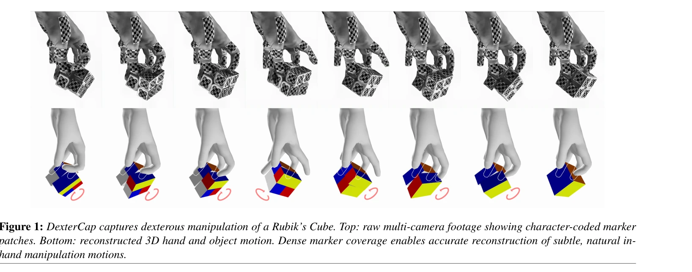
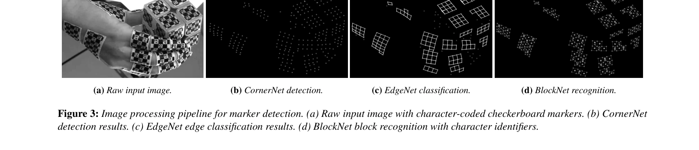

# DexterCap: An Affordable and Automated System for Capturing Dexterous Hand-Object Manipulation

> **저자**: Yutong Liang, Shiyi Xu, Yulong Zhang, Bowen Zhan, He Zhang, Libin Liu | **날짜**: 2026-01-09 | **URL**: [https://arxiv.org/abs/2601.05844](https://arxiv.org/abs/2601.05844)

---

## Essence

*Figure 1: DexterCap captures dexterous manipulation of a Rubik’s Cube. Top: raw multi-camera footage showing character-c*

DexterCap는 문자 코드화된 마커 패치를 사용하는 저비용 광학 모션 캡처 시스템으로, 심한 자기 폐색 상황에서도 손가락의 섬세한 조작 동작을 정확하게 추적하며 최소한의 수동 작업으로 자동 재구성 파이프라인을 제공한다.

## Motivation

- **Known**: 기존 고비용 광학 모션 캡처 시스템은 정확하지만 광범위한 수동 후처리가 필요하고, 저비용 비전 기반 방법은 폐색에 취약하다. 손-물체 상호작용(HOI) 데이터셋이 증가하고 있지만 대부분 단순한 파악과 이동에만 집중한다.
- **Gap**: 손가락 간 심한 자기 폐색으로 인한 섬세한 손-물체 조작 추적의 어려움과 고비용 하드웨어 대비 저렴하면서도 정확한 포즈 복원을 동시에 달성하는 시스템의 부재, 그리고 루빅스 큐브 같은 복잡한 조작 데이터의 부족이 있다.
- **Why**: 손의 섬세한 조작은 일상 작업부터 정밀 제조까지 광범위한 활동의 핵심인데, 이를 정확하게 캡처하고 합성할 수 있는 자료와 기술이 부족하여 손 기술 이해와 애니메이션 생성의 발전을 제약한다.
- **Approach**: 밀집된 문자 코드화 마커 패치를 손과 물체에 부착하고, 마커 검출-모서리-태그를 계단식으로 수행하는 3단계 이미지 처리 파이프라인으로 다중 스케일 폐색 하에서 강건한 추적을 달성하며, MANO 형태 모델을 활용한 자동 캘리브레이션 및 포즈 복원을 수행한다.

## Achievement

*Figure 2: Our marker system: (a) Markers are attached to rigid*

- **저비용 하드웨어 기반 시스템**: 고가의 상용 모션 캡처 장비 대신 저비용 카메라로 구성된 실용적인 광학 캡처 시스템 구현
- **자동화 파이프라인**: 초기 라벨링 후 누적 학습을 통해 후속 세션에서 완전 자동 처리 가능하도록 설계하여 수동 작업 최소화
- **강건한 폐색 처리**: 밀집 마커 배치와 문자 코딩 기법으로 심한 손가락 자기 폐색 상황에서도 정확한 추적 실현
- **대규모 다양한 데이터셋 구축**: 원시 형태부터 루빅스 큐브 같은 복잡한 조절 가능 물체까지 포함하며 대부분 10분 이상의 길이를 가진 DexterHand 데이터셋 공개
- **코드 및 데이터 공개**: 처리 파이프라인, 학습된 모델, 전체 데이터셋을 오픈소스로 공개하여 후속 연구 지원

## How

*Figure 3: Image processing pipeline for marker detection. (a) Raw input image with character-coded checkerboard markers.*

- 문자 코드화된 마커 패치 설계: 각 마커에 고유한 2D 바코드 패턴을 인쇄하여 개별 식별 가능
- 3단계 이미지 처리 파이프라인: (1) 마커 검출, (2) 마커 모서리 추적, (3) 바코드 태그 디코딩 순서로 강건성 확보
- 다중 스케일 처리: 카메라 근거리 촬영으로 인한 손의 이동 시 스케일 변화에 대응하는 마커 검출 메커니즘
- MANO 기반 포즈 복원: morphable hand model MANO를 활용한 손 형태 추정 및 자동 캘리브레이션
- 결측 마커 처리: occlusion과 노이즈로 인한 결측 마커에 대해 robust solving 절차로 완전한 손-물체 포즈 복원
- 데이터 누적 학습: 이전 세션들로부터 수집된 라벨 데이터를 활용하여 새로운 세션에서의 모델 일반화 성능 향상

## Originality

- **문자 코드화 마커 활용의 확장**: 기존 전신 동작 캡처 시스템(CPMK21)의 아이디어를 손 조작 특화로 전환하되, 손의 극단적 자기 폐색 환경에 맞춘 3단계 마커 인식 파이프라인 개발
- **저비용-자동화의 동시 달성**: 단순히 저비용이 아닌 최소 라벨링으로 자동화 가능한 설계로 스케일 가능한 데이터 수집 체계 구현
- **조절 가능 물체 포함**: 기존 HOI 데이터셋(ManipNet, ContactPose 등)의 rigid object 위주 제약을 벗어나 루빅스 큐브 같은 복잡한 조절 가능 물체 포함
- **완전 공개 생태계**: 하드웨어 설계, 처리 파이프라인, 학습 모델, 평가 벤치마크, 전체 데이터셋을 모두 공개하는 포괄적 오픈소스 기여

## Limitation & Further Study

- **마커 부착의 물리적 제약**: 밀집 마커 부착이 손의 자연스러운 접촉 감각과 움직임을 제약할 수 있으며, 마커 손상 또는 박리 시 재작업 필요
- **카메라 근거리 촬영의 한계**: 깊이 필드 제약으로 인해 손의 급속한 움직임이나 카메라에서 큰 거리 변화는 추적 어려움
- **물체 유형의 확장성**: 현재 rigid objects와 루빅스 큐브 수준의 조절 가능 물체만 포함되어 있으며, 변형 가능(deformable) 물체나 복잡한 다중 조절 물체 확장 필요
- **초기 라벨링 의존성**: 각 새로운 환경이나 카메라 설정에서 일부 프레임 수동 라벨링 필요로 완전 자동화는 아직 미달성
- **정량적 검증 한계**: 논문에서 제시된 정량적 평가 메트릭이 제한적이며, 기존 고가 상용 시스템과의 직접 비교 분석 필요
- **후속 연구 방향**: 손-물체 상호작용의 물리 시뮬레이션 통합, 더 복잡한 도구 사용 동작 캡처, 실시간 처리 파이프라인 개발

## Evaluation

- Novelty: 4/5
- Technical Soundness: 3/5
- Significance: 4/5
- Clarity: 4/5
- Overall: 4/5

**총평**: DexterCap은 문자 코드화 마커와 자동화 파이프라인을 통해 저비용으로도 섬세한 손 조작을 정확하게 캡처할 수 있음을 보여주며, 공개된 DexterHand 데이터셋과 함께 손-물체 상호작용 연구의 중요한 리소스로 기여한다.
