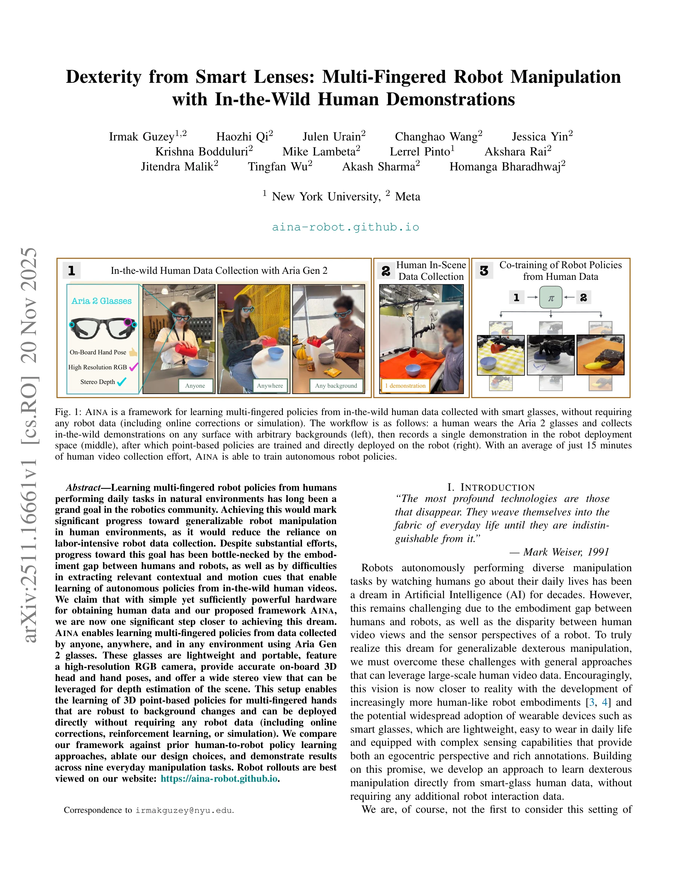
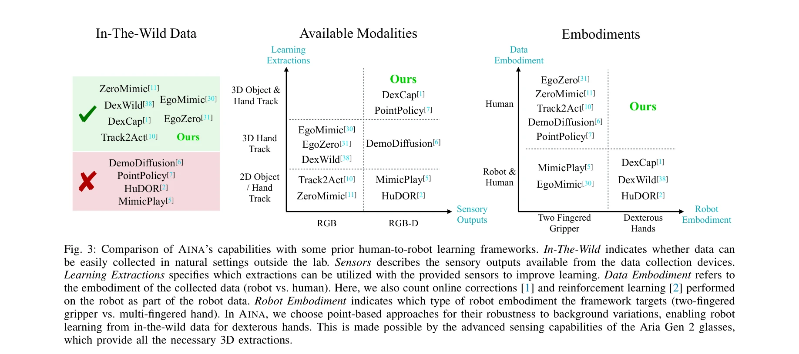
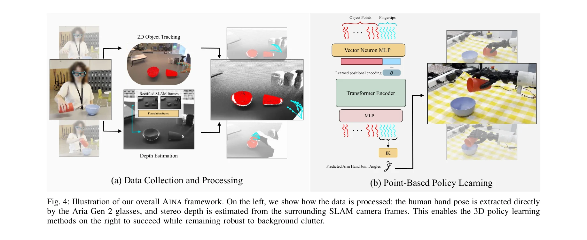

# Dexterity from Smart Lenses: Multi-Fingered Robot Manipulation with In-the-Wild Human Demonstrations

> **저자**: Irmak Guzey, Haozhi Qi, Julen Urain, Changhao Wang, Jessica Yin, Krishna Bodduluri, Mike Lambeta, Lerrel Pinto, Akshara Rai, Jitendra Malik, Tingfan Wu, Akash Sharma, Homanga Bharadhwaj | **날짜**: 2025-11-20 | **URL**: [https://arxiv.org/abs/2511.16661](https://arxiv.org/abs/2511.16661)

---

## Essence

*Fig. 1: AINA is a framework for learning multi-fingered policies from in-the-wild human data collected with smart glasse*

Aria Gen 2 스마트 글래스로 수집한 in-the-wild 인간 영상만으로 로봇용 다중 손가락 조작 정책을 학습하는 AINA 프레임워크를 제안한다. 이는 로봇 데이터나 시뮬레이션 없이도 직접 배포 가능한 3D point-based 정책을 생성한다.

## Motivation

- **Known**: 인간 비디오에서 로봇 정책을 학습하는 것은 오랫동안 추구되어 왔으나, embodiment gap과 신뢰할 수 있는 3D 주석 추출의 어려움으로 인해 다중 손가락 손에 대해서는 성공하지 못했다. 기존 접근법은 구조화된 환경에서의 데이터 수집(확장성 낮음)이거나 웹 비디오 활용(정밀한 3D 주석 부족)이었다.
- **Gap**: 스마트 글래스의 고급 센싱 능력(고해상도 RGB, 정확한 3D 손 자세, 스테레오 깊이)을 활용하여 in-the-wild 데이터의 확장성과 구조화된 데이터의 정확성을 동시에 달성할 수 있는 방법이 부재했다. 특히 다중 손가락 손을 위한 폐루프 정책을 순수 인간 데이터만으로 학습하는 것은 미해결 과제였다.
- **Why**: 로봇이 일상 환경에서 수행되는 자연스러운 인간 활동을 모방하여 조작할 수 있다면, 로봇 데이터 수집에 대한 의존도를 크게 줄일 수 있어 로봇 조작의 대규모 배포가 가능해진다. 스마트 글래스를 활용한 접근은 누구나, 어디서나 수집 가능하므로 매우 높은 실용적 가치가 있다.
- **Approach**: 인간이 착용한 Aria Gen 2 글래스로부터 얻은 3D hand keypoint(직접 제공), stereo depth estimation, 3D object pointcloud를 통해 인간 영상을 '근사 4D'로 변환한다. 이후 3D point-based policy learning 방식을 이용하여 미래 손가락 키포인트 예측 정책을 학습하고, 로봇 배포 공간에서의 단일 시연만으로 로봇에 직접 적용한다.

## Achievement

*Fig. 3: Comparison of AINA’s capabilities with some prior human-to-robot learning frameworks. In-The-Wild indicates whet*

- **첫 다중 손가락 손을 위한 순수 인간 데이터 학습**: 로봇 데이터, 온라인 보정, reinforcement learning, 시뮬레이션을 전혀 사용하지 않으면서도 폐루프 조작 정책을 학습하는 최초의 프레임워크 구현
- **9개 일상 작업에서의 실증적 성공**: 다양한 일상 조작 작업에서 기존 human-to-robot learning 방법들(Track2Act, PointPolicy, DemoDiffusion 등)을 능가하는 성능 달성
- **배경 변화에 대한 견고성**: 3D point-based 표현 덕분에 배경 변화에 강건하며, 배포 공간과 데이터 수집 공간이 다른 경우에도 일반화 가능
- **최소한의 데이터로 효율적 학습**: 평균 약 15분의 인간 영상 수집 노력만으로 자율 로봇 정책 훈련 가능

## How

*Fig. 4: Illustration of our overall AINA framework. On the left, we show how the data is processed: the human hand pose *

- Aria Gen 2 글래스의 on-board hand pose estimation으로 3D 손 keypoint를 직접 추출
- SLAM camera 프레임으로부터 FoundationStereo를 이용한 stereo depth estimation 수행
- 2D object tracking과 depth 정보를 결합하여 3D object pointcloud 생성
- Vector Neuron MLP 기반 Transformer Encoder와 positional encoding을 포함한 3D point-based policy 네트워크 설계
- 인간 손 자세에서 로봇 관절각도로의 변환을 위해 inverse kinematics(IK) 적용
- 로봇 배포 공간에서의 단일 시연을 통해 배포 시점의 환경 맥락 보정

## Originality

- **스마트 글래스의 완전한 활용**: Aria Gen 2의 high-resolution RGB, on-board 3D hand pose, stereo vision을 통합하여 in-the-wild 데이터에서 신뢰할 수 있는 3D 주석을 자동으로 추출
- **순수 인간 데이터 학습**: 로봇 데이터(온라인 보정, RL, 시뮬레이션 포함)를 전혀 사용하지 않으면서도 다중 손가락 손 조작 정책 학습이라는 새로운 패러다임 제시
- **3D point-based 표현의 적절한 적용**: background clutter에 강건한 점구름 표현을 이용하여 in-the-wild 데이터의 가변성을 효과적으로 처리
- **최소한의 배포 시 적응**: 로봇 환경에서 단 한 번의 인간 시연만으로 배포 가능한 실용적 설계

## Limitation & Further Study

- **embodiment gap의 완전한 해결 부재**: 손 크기와 운동 범위의 인간-로봇 차이를 IK 변환만으로 처리하므로, 극단적으로 다른 embodiment에서는 성능 저하 가능
- **단일 로봇 플랫폼 평가**: Aria Gen 2와 특정 다중 손가락 로봇 손에 대해서만 실증했으며, 다른 로봇 embodiment로의 일반화 검증 부재
- **배포 공간 시연의 필요성**: 각 새로운 배포 환경마다 단일 시연이 필요하므로, 완전한 zero-shot 학습은 아님
- **복잡한 손-물체 상호작용 처리 한계**: 폐쇄된 grasp나 매우 섬세한 조작은 keypoint 기반 표현으로 충분하지 않을 수 있음
- **후속 연구**: Aria Gen 2 이외의 다른 스마트 글래스나 저비용 웨어러블의 적용 탐색, 여러 로봇 embodiment에 대한 일반화 방법 연구, zero-shot 또는 few-shot 배포 능력 강화 필요

## Evaluation

- Novelty: 4/5
- Technical Soundness: 3/5
- Significance: 4/5
- Clarity: 4/5
- Overall: 4/5

**총평**: 이 논문은 스마트 글래스의 고급 센싱 능력을 창의적으로 활용하여 순수 인간 비디오만으로 다중 손가락 로봇 조작 정책을 학습하는 실질적이고 확장 가능한 해법을 제시한다. 강력한 실증 결과와 명확한 방법론으로 인간-로봇 모방 학습 분야에 상당한 진전을 이루었으며, 로봇 조작의 대규모 실용화를 향한 중요한 한 걸음을 제공한다.

## Related Papers

- 🏛 기반 연구: [[papers/1903_EgoMimic_Scaling_Imitation_Learning_via_Egocentric_Video/review]] — EgoMimic의 egocentric video 학습 프레임워크가 smart lens 기반 manipulation 정책 학습의 이론적 토대를 마련한다.
- 🔗 후속 연구: [[papers/1899_EgoDemoGen_Egocentric_Demonstration_Generation_for_Viewpoint/review]] — EgoDemoGen이 viewpoint variation을 통해 smart lens로 수집한 데이터의 다양성을 증강하여 더 robust한 정책 학습을 가능하게 한다.
- 🔄 다른 접근: [[papers/1901_EgoHumanoid_Unlocking_In-the-Wild_Loco-Manipulation_with_Rob/review]] — EgoHumanoid가 robot-free egocentric 시연을 loco-manipulation으로 확장하여 AINA보다 더 포괄적인 embodiment 정렬을 다룬다.
- 🏛 기반 연구: [[papers/1902_EgoMI_Learning_Active_Vision_and_Whole-Body_Manipulation_fro/review]] — Aria Gen 2를 통한 egocentric vision 기반 조작 학습이 EgoMI의 active vision과 whole-body manipulation의 기본 원리와 일치한다.
- 🏛 기반 연구: [[papers/1807_ARMOR_Egocentric_Perception_for_Humanoid_Robot_Collision_Avo/review]] — 분산 센서를 활용한 dexterous manipulation의 기초 기술이 전신 충돌 회피 시스템에 응용된다.
- 🏛 기반 연구: [[papers/1946_Generalizable_Geometric_Prior_and_Recurrent_Spiking_Feature/review]] — multi-fingered robot manipulation의 smart lens 기반 dexterity 연구가 RGMP-S의 고수준 의미론적 추론과 저수준 동작 생성의 기초를 제공합니다.
- 🔗 후속 연구: [[papers/2114_Object-Centric_Dexterous_Manipulation_from_Human_Motion_Data/review]] — Dexterity from Smart Lenses의 multi-fingered manipulation이 Object-Centric의 hierarchical policy로 더욱 체계화된 것이다
