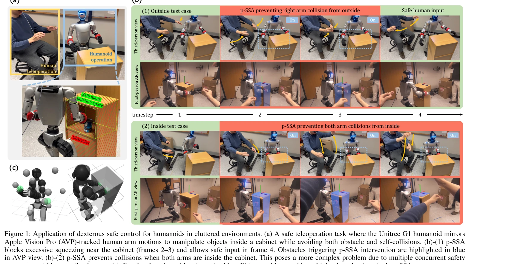
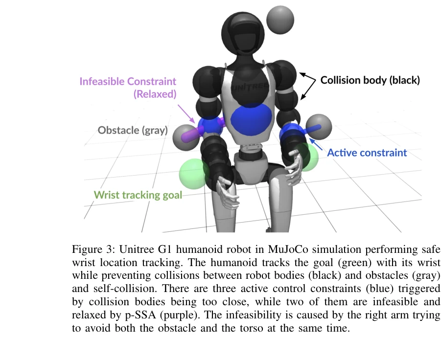

# Dexterous Safe Control for Humanoids in Cluttered Environments via Projected Safe Set Algorithm

> **저자**: Rui Chen, Yifan Sun, Changliu Liu | **날짜**: 2025-02-05 | **URL**: [https://arxiv.org/abs/2502.02858](https://arxiv.org/abs/2502.02858)

---

## Essence

*Figure 1: Application of dexterous safe control for humanoids in cluttered environments. (a) A safe teleoperation task w*

인간형 로봇이 복잡한 환경에서 다중 충돌 회피를 수행할 때 발생하는 제어 제약의 불가능성 문제를 해결하기 위해 Projected Safe Set Algorithm (p-SSA)을 제안한다.

## Motivation

- **Known**: Safe Set Algorithm (SSA), Control Barrier Functions (CBF), Hamilton-Jacobi reachability 등의 간접 방식 안전 제어 방법들이 존재하지만, 대부분 단일 에너지 함수로 희소 환경의 단순 기하학적 모델에만 적용되어왔다.
- **Gap**: 다중 강체(multi-body)와 밀집된 장애물(dense obstacles)을 동시에 고려하는 인간형 로봇의 섬세한 안전 제어(dexterous safety) 문제는 미해결 상태이며, 다중 제약 QP의 불가능성(infeasibility)에 대한 효과적인 해결책이 없다.
- **Why**: 인간형 로봇의 실제 배포 시 안전성을 보장하면서도 작업 성능을 유지해야 하며, 특히 캐비닛 내부 조작과 같은 근접 상호작용 작업에서 팔, 손 등 개별 링크 간의 자체 충돌과 외부 장애물 충돌을 동시에 피해야 한다.
- **Approach**: 여러 충돌 쌍에 대해 각각 에너지 함수를 설계하여 다중 제약 QP를 구성하되, QP 불가능성 발생 시 가중치 있는 슬랙 정규화로 제약을 완화하고, 이를 개선한 p-SSA에서 분리된 최적화를 통해 매개변수 튜닝 없이 최적 해를 찾는다.

## Achievement

*Figure 4: Comparison of safe control methods in G1FixedBase DO v0 task. Spheres and lines follow the convention in fig. *

- **새로운 문제 정의**: 밀집된 환경에서의 인간형 로봇 섬세한 안전 제어 문제를 정식화하고 다중 제약 환경에서의 불가능성 원인을 분석
- **p-SSA 알고리즘**: 충돌하는 제약을 최소한의 위반으로 완화하는 혁신적 안전 제어 방법으로, 200개 이상의 제약을 포함한 고차원 문제에서도 계산 가능
- **실증 검증**: Unitree G1 인간형 로봇의 실제 하드웨어에서 복잡한 충돌 회피 작업 수행 및 시뮬레이션 검증으로 무매개변수(zero parameter tuning) 일반화 가능성 입증

## How

*Figure 3: Unitree G1 humanoid robot in MuJoCo simulation performing safe*

- 각 충돌 쌍(robot link-obstacle 및 robot link-robot link)에 대해 독립적인 에너지 함수를 정의하여 다중 제어 제약 생성
- QP가 불가능할 때 가중 슬랙 변수를 도입하는 Relaxed SSA (r-SSA) 제안
- 목적 함수와 실현 가능성을 분리하여 최적화하는 Projected SSA (p-SSA) 개발
- MuJoCo 시뮬레이션 환경과 실제 Unitree G1 로봇에서 여러 작업(고정 기저 목표 도달, 전신 조작, 사람 모방)에 대해 평가
- 기존 baseline 방법들과 성능-안전성 균형 비교 분석

## Originality

- 다중 강체 로봇과 밀집 장애물 환경의 결합이라는 미해결 문제를 명확히 정의하고 실제 인간형 로봇에 처음 적용
- 기존 SSA를 다중 제약 상황으로 확장하면서, 이론적 보장 대신 실질적 실현 가능성을 추구하는 새로운 철학 제시
- 분리된 최적화(decoupled optimization) 구조로 매개변수 튜닝 없이 다양한 작업에 일반화 가능한 방식 개발

## Limitation & Further Study

- 이론적 안전 보장(forward invariance 등)을 포기하고 실질적 제약 완화에 의존하므로, 극단적 상황에서 순간적 충돌 가능성 존재
- 19개 충돌 볼륨과 200+ 제약이 필요한 고차원 문제에서의 계산 복잡도 및 온라인 실시간 성능에 대한 명시적 분석 부족
- 제약 완화의 우선순위 결정 메커니즘이 启발식(heuristic)에 의존하여, 더 체계적인 우선순위 할당 방안 연구 필요
- 단일 인간형 로봇에서만 검증되었으므로 다양한 형태의 로봇(quadruped, manipulator arm 등)으로의 확장성 확인 필요

## Evaluation

- Novelty: 4/5
- Technical Soundness: 3/5
- Significance: 4/5
- Clarity: 4/5
- Overall: 4/5

**총평**: 밀집된 환경에서 인간형 로봇의 섬세한 다중 충돌 회피라는 현실적이고 중요한 문제를 처음 체계적으로 다루었으며, p-SSA 알고리즘은 실제 로봇 배포에 즉시 활용 가능한 실용적 해결책을 제시한다. 이론적 보장은 제한적이지만 광범위한 실증 검증과 무매개변수 일반화 능력이 인간형 로봇 안전 제어의 중요한 진전을 보여준다.
