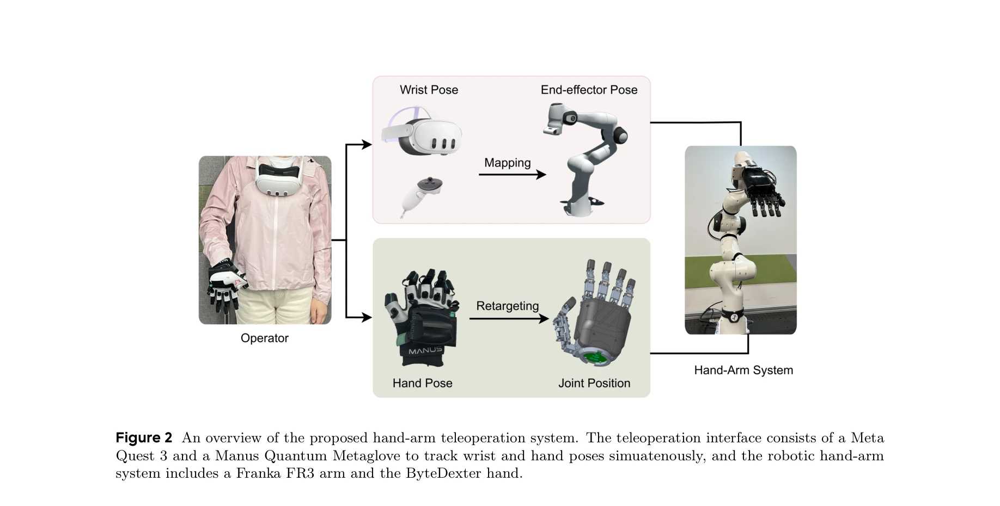
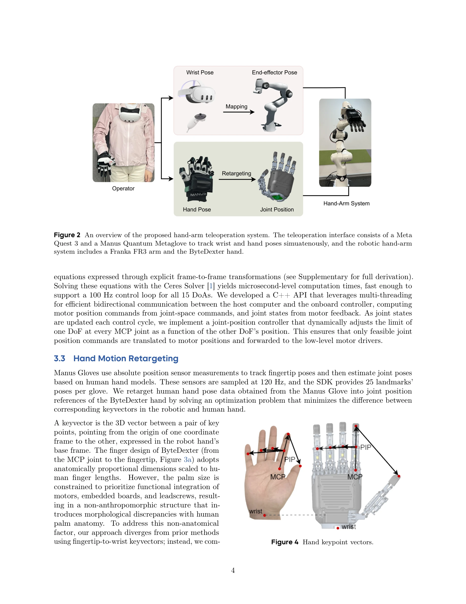

# Dexterous Teleoperation of 20-DoF ByteDexter Hand via Human Motion Retargeting

> **저자**: Ruoshi Wen, Jiajun Zhang, Guangzeng Chen, Zhongren Cui, Min Du, Yang Gou, Zhigang Han, Junkai Hu, Liqun Huang, Hao Niu, Wei Xu, Haoxiang Zhang, Zhengming Zhu, Hang Li, Zeyu Ren | **날짜**: 2025-07-04 | **URL**: [https://arxiv.org/abs/2507.03227](https://arxiv.org/abs/2507.03227)

---

## Essence

*Figure 2 An overview of the proposed hand-arm teleoperation system. The teleoperation interface consists of a Meta*

ByteDexter라는 20-DoF 링크구동 로봇 손과 optimization 기반 motion retargeting을 이용하여 인간의 손 움직임을 실시간으로 로봇에 재현하는 원격조종 시스템을 제시한다.

## Motivation

- **Known**: Imitation learning은 인간의 손재주를 로봇에 전이할 수 있는 유망한 방식이나, 고품질의 인간 시연 데이터 획득이 과제이다. 기존 teleoperation 시스템은 인간-로봇 간 kinematic 불일치로 인해 operator의 인지 부담이 크고 오류가 발생하기 쉽다.
- **Gap**: 고-DoF 로봇 손의 제어와 실시간 motion retargeting 기술이 충분히 발달하지 않아, 인간 수준의 섬세한 손재주를 로봇이 정확히 재현하기 어렵고, 고품질의 demonstration 데이터 생성이 제한적이다.
- **Why**: 로봇이 인간의 생활 환경에서 일상적인 조작 작업을 수행하려면 높은 수준의 손재주가 필수적이며, 고품질의 demonstration data는 imitation learning 정책의 효과를 결정하는 핵심 요소이다.
- **Approach**: ByteDexter 손과 Meta Quest 3 + Manus Quantum Metaglove를 통해 human hand pose를 추적하고, optimization 기반 motion retargeting으로 human-robot kinematic 차이를 해결하여 실시간 고충실도 재현을 달성한다.

## Achievement

*Figure 1 Our hand-arm teleoperation system achieves dexterous in-hand manipulation, including multi-object grasping,*

- **20-DoF 링크구동 로봇 손 설계**: 새로운 thumb mechanism으로 인간 같은 decoupled thumb mobility를 구현하고, 컴팩트한 형태(255×118×77 mm³, 1.3 kg)에서 20 DoF를 달성
- **실시간 kinematics solver**: Ceres Solver를 이용하여 forward/inverse kinematics를 microsecond 수준에서 계산하여 100 Hz 제어 루프 지원
- **Motion retargeting 프레임워크**: Human hand pose로부터 ByteDexter joint position을 optimization으로 계산하여 kinematic 불일치를 효과적으로 해결
- **통합 hand-arm system**: 27 DoF(손 20 + 팔 7)의 seamless coordination으로 장시간 복잡한 조작 작업 수행
- **실증적 성능**: 9개 물체가 있는 복잡한 메이크업 테이블 정리 작업을 포함한 in-hand manipulation 및 multi-object grasping 성공

## How

*Figure 4 Hand keypoint vectors.*

- Meta Quest 3로 wrist pose 추적, Manus Quantum Metaglove로 hand motion 추적 (120 Hz sampling)
- Human hand pose를 25개 landmarks로 표현하고 keyvector 기반 optimization formulation 적용
- Keyvector discrepancy를 최소화하는 constrained nonlinear equations를 Ceres Solver로 해결
- ByteDexter의 parallel-serial finger topology와 novel thumb mechanism으로 human-like dexterity 구현
- Dynamic joint position limit 조정으로 feasible joint command만 motor drivers로 전달
- Franka FR3 arm과 통합하여 wrist pose는 직접 매핑, hand motion은 retargeting으로 처리

## Originality

- 기존 parallel-serial topology를 개선한 **새로운 thumb mechanism**: 세 개 actuator로 네 개 DoF를 구동하며 MCP/PIP flexion과 abduction-adduction을 decoupled로 달성
- **Explicit frame-to-frame transformation 기반 kinematics**: 기존의 frame-specific trigonometric expansion 대신 체계적인 forward/inverse kinematics 유도로 broader applicability 확보
- **Keyvector 기반 motion retargeting**: Hand keypoint 간 3D vector를 최소화하여 기존 one-to-one joint mapping의 한계를 극복
- **Integrated teleoperation + high-DoF control**: Quest와 Manus glove를 결합하여 natural, intuitive interface 제공하면서 27 DoF seamless coordination 달성

## Limitation & Further Study

- **Glove 기반 추적의 한계**: 사용자 편의성 저하, calibration 오버헤드 존재 (vision 기반의 occlusion 문제는 회피하나 다른 제약)
- **Motion retargeting의 일반화 한계**: Hand size 차이에 대한 scaling 메커니즘이 구체적으로 기술되지 않음. 다양한 인간 손 크기에 대한 robustness 평가 부족
- **실험 범위의 제한성**: Makeup table organization 등 제한된 task에서만 평가. 다양한 object property(material, mass, shape)의 조작에 대한 systematic evaluation 부재
- **Contact-rich manipulation의 안정성**: Optimization 기반 retargeting이 항상 stable grasp를 보장하는지, collision risk handling의 explicit mechanism 불명확
- **후속 연구**: (1) Vision-based hand tracking과의 fusion으로 glove의존도 감소, (2) Imitation learning과의 integration으로 demonstration data 활용 실증, (3) 다양한 object와 환경에서의 robustness 평가, (4) 힘 제어(force feedback) 통합으로 원격조종 몰입감 강화

## Evaluation

- Novelty: 4/5
- Technical Soundness: 4/5
- Significance: 4/5
- Clarity: 4/5
- Overall: 4/5

**총평**: ByteDexter 시스템은 linkage-driven 손의 mechanical design, fast kinematics solver, 그리고 optimization 기반 motion retargeting을 정교하게 통합하여 고-DoF 로봇 손의 원격조종을 실현하는 의미 있는 기여를 제시한다. 실시간 제어와 고품질 demonstration data 생성이라는 실용적 가치가 높지만, 다양한 task 환경에서의 general robustness와 imitation learning 결과의 실증이 필요하다.
