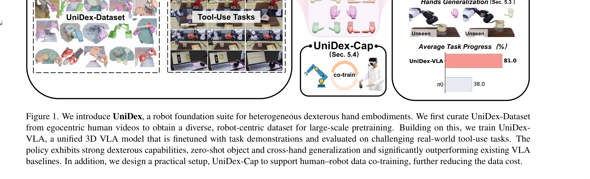
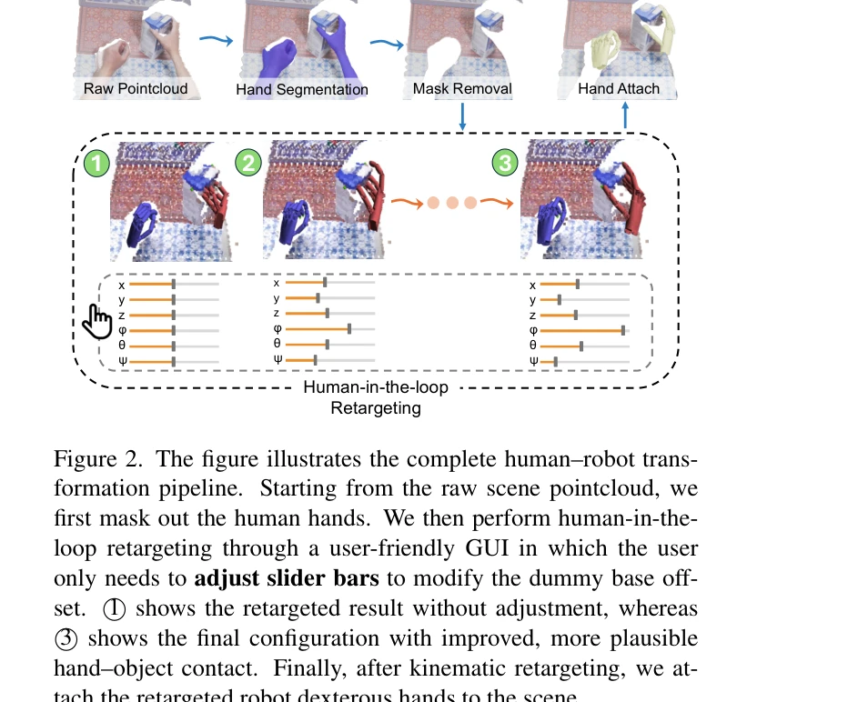

# DexUMI: Using Human Hand as the Universal Manipulation Interface for Dexterous Manipulation

> **저자**:  | **날짜**:  | **URL**: [https://dex-umi.github.io/](https://dex-umi.github.io/)

---

## Essence

*Figure 1. We introduce UniDex, a robot foundation suite for heterogeneous dexterous hand embodiments. We first curate Un*

UniDex는 인간의 손 동영상으로부터 수집한 데이터를 기반으로 다양한 손가락 로봇 팔(dexterous hand)을 통일된 방식으로 제어하는 기초 모델 스위트(foundation suite)이다. UniDex-Dataset, FAAS 통일 행동 공간, UniDex-VLA 정책 모델, 그리고 human-robot 공동 학습을 지원하는 UniDex-Cap 캡처 시스템으로 구성된다.

## Motivation

- **Known**: gripper 기반 VLA 모델들은 잘 발전했으나, dexterous hand를 위한 기초 모델은 부족하다. 실제 로봇 원격조종 데이터 수집은 비용이 높고 확장성이 낮으며, 다양한 손 형태 간 전이가 어렵다.
- **Gap**: dexterous hand 데이터 부족, 손의 높은 자유도(DoF) 제어 난제, 이질적 손 구조 간 일반화 부족이다. 현존 방법들은 gripper 중심이거나 제한된 데이터로 시뮬레이션에 의존한다.
- **Why**: 일상의 도구 사용(가위질, 분무 등)은 dexterous hand가 필수이며, 손 로봇의 확장 가능한 학습 기초 모델이 필요하다. 인간 동영상 활용은 저비용 데이터 확보와 scale-up을 가능하게 한다.
- **Approach**: 인간 egocentric RGB-D 동영상을 human-in-the-loop retargeting으로 로봇 실행 가능한 궤적으로 변환하여 UniDex-Dataset을 구축했다. FAAS 통일 행동 공간으로 이질적 손 구조를 매핑하고, 3D pointcloud 기반 VLA 정책을 pre-train 후 task-specific fine-tuning한다.

## Achievement

*Figure 1. We introduce UniDex, a robot foundation suite for heterogeneous dexterous hand embodiments. We first curate Un*

- **UniDex-Dataset**: 8종 dexterous hand(6-24 DoFs)에 걸친 9M 프레임, 50K+ 궤적의 통일된 대규모 사전학습 데이터셋 구축
- **FAAS & UniDex-VLA**: 기능 중심의 통일 행동 공간으로 손 간 전이를 가능하게 하며, 실로봇 도구 사용 작업에서 81% 평균 진행도 달성(π0 대비 38%→81%)
- **강력한 일반화**: 공간적, 객체, 손 간 zero-shot 일반화 능력 입증
- **Human-Robot Co-training**: UniDex-Cap 휴대용 캡처 시스템으로 변환된 인간 데이터가 로봇 데이터를 부분 대체하여 post-training 비용 감소 입증

## How

*Figure 2. The figure illustrates the complete human–robot trans-*

- Egocentric human video 기반 hand trajectory 추출 및 human-in-the-loop retargeting으로 fingertip 궤적 정렬(역기구학+대화형 조정)
- 3D pointcloud 기반 표현으로 시각적 차이 최소화(인간 손 마스킹, 로봇 손 재부착)
- FAAS: 기능적으로 유사한 actuator를 공유 좌표로 매핑하여 cross-hand 전이 가능하게 함
- 3D vision-language-action 정책: image와 3D pointcloud를 입력으로 받아 FAAS 행동 공간에서 출력
- UniDex-Cap: RGB-D 카메라와 human hand pose 추적으로 동기화된 데이터 기록 후 동일 변환 파이프라인 적용
- Pre-training on UniDex-Dataset 후 task demonstration으로 fine-tuning하여 최종 정책 도출

## Originality

- 첫 시도로 egocentric human video를 체계적인 human-in-the-loop retargeting으로 8종 다양한 dexterous hand용 대규모 데이터로 변환함
- FAAS: 기존 손-정렬(left-aligned) 또는 잠재 행동 공간과 달리 기능 중심의 post-processing 불필요한 통일 행동 공간 제안
- Portable UniDex-Cap 캡처 시스템으로 인간-로봇 공동 학습을 실제로 구현하여 비용 감소 정량화
- 3D pointcloud 기반 VLA로 다중 손 형태에 걸친 공간적 이해를 통합

## Limitation & Further Study

- 변환된 인간 데이터가 실제 로봇 데이터와의 domain gap을 완벽히 제거하지 못할 수 있음 → 혼합 학습 전략의 최적 비율 탐색 필요
- 8종 손에만 검증했으며, 추가 손 형태(손가락 개수 크게 다른 경우)로의 확장성 미검증
- 도구 사용 작업 5개로 평가 범위가 제한적 → 더 광범위한 조작 과제(식기류 정렬, 복잡 조립)로 확장 필요
- human-robot co-training 최적 비율(인간 vs 로봇 데이터)에 대한 심화 분석 부족
- 실패 사례 분석 및 failure mode 논의 부재

## Evaluation

- Novelty: 4/5
- Technical Soundness: 3/5
- Significance: 4/5
- Clarity: 4/5
- Overall: 4/5

**총평**: UniDex는 인간 egocentric 동영상을 활용한 대규모 dexterous hand 데이터셋과 FAAS 통일 행동 공간으로 손 간 일반화를 달성한 혁신적 작업이다. 실로봇 검증과 human-robot co-training의 실제 구현으로 실용성이 높으나, 더 다양한 손과 조작 과제로의 확장이 후속 과제이다.
