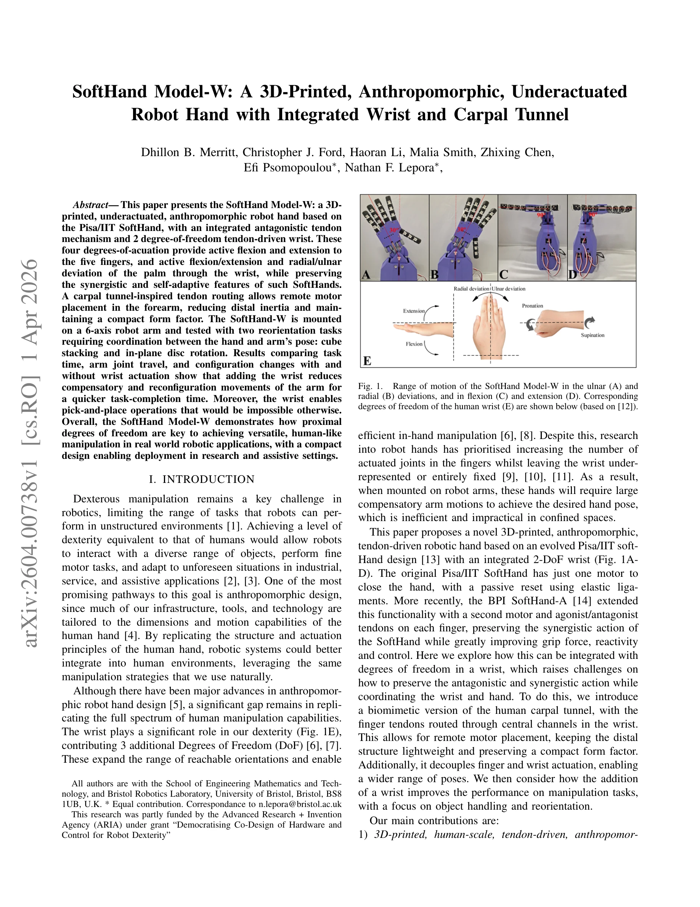
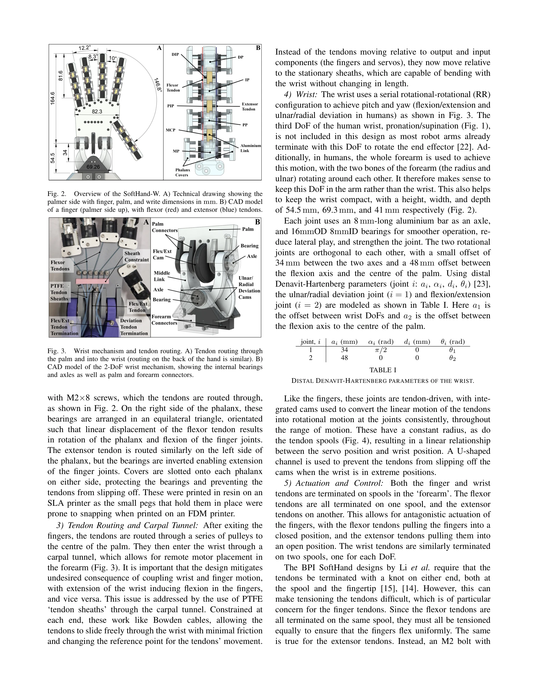

# DIAL: Distilling Intent-Aware Latents for Vision-Language-Action on Humanoid Robots

> **저자**:  | **날짜**: 2026-03-31 | **URL**: [https://arxiv.org/list/cs.RO/current](https://arxiv.org/list/cs.RO/current)

---

## Essence

*Fig. 2.*

SoftHand Model-W는 3D 프린팅 기반의 인간형 로봇 손으로, 2-DoF 손목을 통합하여 손가락의 underactuated tendon-driven 구조와 손목의 능동적 제어를 결합했다. Carpal tunnel 영감의 힘줄 라우팅을 통해 원격 모터 배치를 가능하게 하면서 compact한 형태를 유지한다.

## Motivation

- **Known**: Pisa/IIT SoftHand는 adaptive synergies를 통해 단일 액추에이터로 robust한 파지를 구현했으나 손목이 없어 비효율적인 팔의 보상 운동이 필요했다. 기존 손목 설계들은 능동성 부족이나 복잡성으로 인해 한계가 있었다.
- **Gap**: 로봇 손 연구는 손가락의 actuated joints를 증가시키는 데 집중했으나 손목의 3-DoF 활용이 부족했다. Soft hand 설계에서 손목의 능동성과 fingers의 협력을 동시에 달성한 integrated design이 미흡했다.
- **Why**: 인간과 같은 dexterous manipulation을 실현하려면 손목의 추가 자유도가 필수적이며, 손목 없이는 제한된 공간에서 팔의 보상 운동이 증가하여 비효율적이다. 이는 산업, 서비스, assistive 로봇 응용에서 실용성을 크게 제약한다.
- **Approach**: BPI SoftHand-A의 agonist/antagonist tendon 설계에 2-DoF serial wrist를 통합하되, carpal tunnel 구조의 힘줄 라우팅으로 손가락과 손목 액추에이션을 분리했다. Cube stacking과 in-plane disc rotation 작업을 통해 손목 추가의 효과를 검증했다.

## Achievement

*Fig. 1.*

- **3D-printed anthropomorphic soft hand**: 인간 손 크기(164.6mm)에 가까운 형태로 underactuated, tendon-driven fingers를 갖춘 저비용 설계
- **Integrated 2-DoF wrist with carpal tunnel routing**: 손가락 힘줄이 손목 중앙 채널을 통과하도록 하여 액추에이션 분리 및 원격 모터 배치로 distal inertia 감소
- **Task performance improvement**: 손목 추가로 arm joint travel과 reconfiguration movements 감소, 작업 완료 시간 단축, 및 손목 없이는 불가능한 pick-and-place 작업 가능화

## How

*Fig. 3.*

- 4개 phalanx (distal, intermediate, proximal, metacarpal)를 aluminium links와 gear engagement로 연결하여 각 손가락 3-DoF 구성
- Nylon flexor/extensor tendon 쌍으로 능동적 굽힘과 펼침 구현
- U-groove bearings를 통한 힘줄 라우팅으로 palm과 wrist를 거쳐 remote motor 연결
- Serial wrist 설계로 tendon과 servo를 통한 일관된 액추에이션
- Cube stacking (다양한 초기 위치/방향)과 in-plane disc rotation (90°) 작업으로 hand-arm 협력 성능 측정

## Originality

- Pisa/IIT 및 BRL SoftHand의 antagonistic tendon 메커니즘에 처음으로 integrated active 2-DoF wrist를 추가하여 손가락-손목 협력의 새로운 paradigm 제시
- Carpal tunnel 영감의 biomimetic tendon routing으로 손가락과 손목 액추에이션의 분리 및 decoupling 실현
- 3D-printed construction으로 접근성을 높이면서 anthropomorphic design 유지하여 human-scale tooling과의 호환성 확보

## Limitation & Further Study

- 손가락 splay 기능 부재로 고정된 손가락 각도만 가능하여 손가락 외전/내전 제어 불가
- 2-DoF 손목으로 인간의 3-DoF 손목(flexion/extension, radial/ulnar deviation, pronation/supination)을 완전히 복제하지 못함
- Validation이 cube stacking과 disc rotation 두 가지 작업에 제한되어 다양한 조작 시나리오에서의 일반화 능력 미검증
- 후속 연구: 손가락 splay 추가, pronation/supination 능력 확장, tactile sensing 통합, 다양한 물체 조작 작업에서의 성능 평가, 실제 assistive 로봇 시나리오에서의 사용자 평가

## Evaluation

- Novelty: 4/5
- Technical Soundness: 4/5
- Significance: 4/5
- Clarity: 4/5
- Overall: 4/5

**총평**: SoftHand Model-W는 soft robotics의 adaptive synergies 개념을 유지하면서 능동적 손목을 처음 통합한 혁신적 설계이며, 3D 프린팅과 carpal tunnel routing을 통해 실용성과 anthropomorphism을 동시에 달성했다. 손목 추가의 명확한 성능 개선 효과를 입증하여 dexterous manipulation 분야에 의미 있는 기여를 한다.

## Related Papers

- 🔄 다른 접근: [[papers/1659_RUKA_Rethinking_the_Design_of_Humanoid_Hands_with_Learning/review]] — 휴머노이드 손 설계에서 SoftHand Model-W와 RUKA라는 서로 다른 설계 철학과 학습 기반 접근법을 제시한다
- 🔗 후속 연구: [[papers/2014_HumDex_Humanoid_Dexterous_Manipulation_Made_Easy/review]] — HumDex의 dexterous manipulation 간편화가 SoftHand Model-W의 underactuated 구조를 더욱 효과적으로 활용할 수 있는 제어 방법을 제공한다
- 🏛 기반 연구: [[papers/2113_NuExo_A_Wearable_Exoskeleton_Covering_all_Upper_Limb_ROM_for/review]] — 상지 전체 ROM을 다루는 착용형 외골격이 SoftHand Model-W의 손목 통합 설계에 필요한 인간공학적 기초를 제공한다
- 🔄 다른 접근: [[papers/1873_Dexterous_Teleoperation_of_20-DoF_ByteDexter_Hand_via_Human/review]] — ByteDexter Hand의 20-DoF 텔레오퍼레이션과 SoftHand의 underactuated tendon-driven 구조는 서로 다른 손 원격제어 접근법을 제시합니다.
- 🔗 후속 연구: [[papers/1631_RAPID_Hand_A_Robust_Affordable_Perception-Integrated_Dextero/review]] — RAPID Hand의 perception-integrated 디자인은 SoftHand Model-W의 물리적 구조에 지각 능력을 추가한 확장형태로 볼 수 있습니다.
- 🏛 기반 연구: [[papers/1947_Generalizable_Humanoid_Manipulation_with_3D_Diffusion_Polici/review]] — vision-language-action 모델의 latent 표현이 3D diffusion policy의 기반이 된다.
