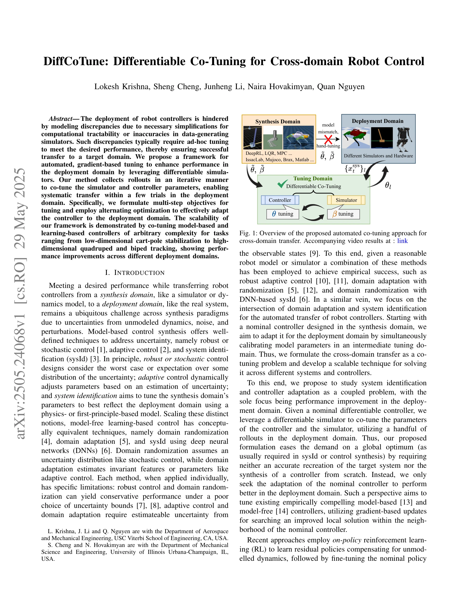
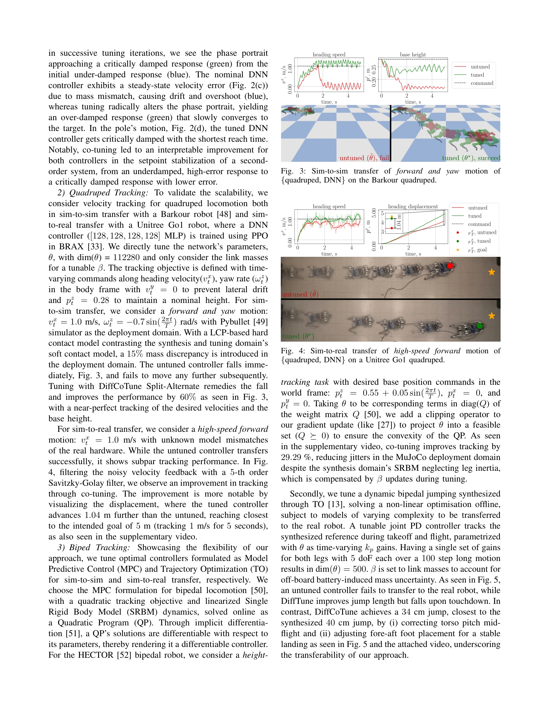
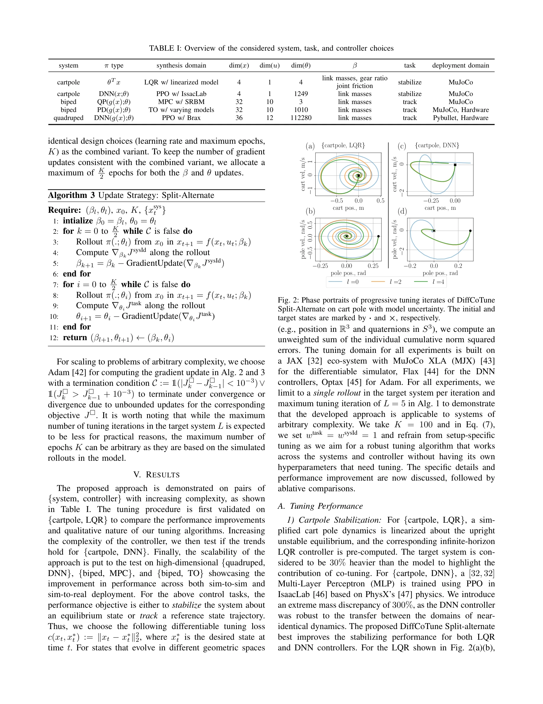

# DiffCoTune: Differentiable Co-Tuning for Cross-domain Robot Control

> **저자**: Lokesh Krishna, Sheng Cheng, Junheng Li, Naira Hovakimyan, Quan Nguyen | **날짜**: 2025-05-29 | **URL**: [https://arxiv.org/abs/2505.24068](https://arxiv.org/abs/2505.24068)

---

## Essence

*Fig. 1: Overview of the proposed automated co-tuning approach for*

로봇 컨트롤러의 시뮬레이션-실제 환경 간 성능 격차를 해결하기 위해 differentiable simulator를 활용한 gradient 기반 co-tuning 프레임워크를 제안하며, 컨트롤러와 시뮬레이터 매개변수를 동시에 최적화하여 적은 시행횟수로 체계적인 도메인 전이를 가능하게 한다.

## Motivation

- **Known**: 로봇 컨트롤러의 도메인 전이를 위해 강건 제어, 적응 제어, 시스템 식별, 도메인 랜더마이제이션 등 다양한 방법들이 개별적으로 적용되어 왔으나, 각 방법은 보수적 성능이나 불충분한 불확실성 추정 등의 한계를 가진다.
- **Gap**: 기존의 다단계 최적화 기반 fine-tuning 방법들은 보상 설계가 필요하거나 특정 시스템에만 적용 가능한 반면, 순수 gradient 기반의 일반화된 co-tuning 프레임워크가 부족하다.
- **Why**: 로봇 배포 시 시뮬레이터의 모델 불일치로 인한 성능 저하를 자동으로 보정할 수 있는 체계적 방법이 필요하며, 이는 실제 로봇 시스템의 실용적 배포를 가능하게 한다.
- **Approach**: DiffCoTune은 differentiable simulator와 controller를 활용하여 배포 도메인에서 수집한 롤아웃으로 시뮬레이터 매개변수 β와 컨트롤러 매개변수 θ를 교대로 최적화하는 multi-step objective 기반 최적화를 수행한다.

## Achievement

*Fig. 3: Sim-to-sim transfer of forward and yaw motion of*

- **일반화된 co-tuning 프레임워크**: 모델 기반 및 학습 기반 컨트롤러 모두에 적용 가능한 순수 gradient 기반의 자동화된 tuning 방법 개발
- **적은 시행횟수로의 효과적 전이**: 배포 도메인에서 5회 미만의 시행으로 체계적인 도메인 전이 달성
- **광범위한 확장성 검증**: cart-pole 저차원 안정화부터 quadruped 및 biped 고차원 추적까지 다양한 작업에서 성능 개선 입증
- **다중 도메인 전이**: 다양한 시뮬레이터와 실제 하드웨어 간의 sim-to-sim 및 sim-to-real 전이 모두 성공

## How

*Fig. 2: Phase portraits of progressive tuning iterates of DiffCoTune*

- Differentiable simulator f(x_t, u_t; β)를 통해 모든 상태, 입력, 매개변수에 대한 gradient 계산 가능
- System identification objective J_sysId를 통해 폐루프 동역학에서 모델과 실제 시스템의 불일치 정량화
- Task objective J_task로 배포 도메인에서의 실제 성능 평가
- 교대 최적화(alternating optimization)를 통해 β와 θ를 반복적으로 업데이트
- 배포 도메인에서 수집한 실제 롤아웃 데이터로 gradient 기반 업데이트 수행
- 다단계 목적 함수 설계로 시뮬레이터 보정과 컨트롤러 적응을 동시에 달성

## Originality

- 기존의 순차적 최적화(RL → fine-tuning)가 아닌 동시 co-tuning으로 시뮬레이터-컨트롤러 간의 상호 의존성 명시적 고려
- 폐루프 동역학 기반의 system identification으로 종래의 개루프 sysId와 차별화
- Task-specific 설계 없이 임의 복잡도의 컨트롤러에 적용 가능한 범용적 framework 제시
- Differentiable simulator의 gradient 정보를 효과적으로 활용한 scalable gradient 기반 최적화 전략

## Limitation & Further Study

- Differentiable simulator의 미분가능성 요구로 인한 시뮬레이터 선택의 제약
- 초기 nominal controller의 품질에 의존하는 local optimization 특성으로 인해 크게 부족한 초기 컨트롤러에서의 성능 미보증
- 배포 도메인에서의 롤아웃 수집 필요로 인한 실제 시스템 시간 소요
- High-dimensional 매개변수 공간에서의 수렴성 및 전역 최적성 보장 부재
- 후속 연구로 모델 구조 자체의 학습, 다중 작업 동시 전이, 비연속적 도메인 변화에 대한 적응 방법 필요

## Evaluation

- Novelty: 4/5
- Technical Soundness: 3/5
- Significance: 4/5
- Clarity: 4/5
- Overall: 4/5

**총평**: 본 논문은 로봇 도메인 전이의 실질적 문제를 differentiable simulator 기반의 우아한 co-tuning 프레임워크로 해결하며, 다양한 컨트롤러와 시스템에서의 광범위한 실험을 통해 실용성을 입증한 기여도 높은 연구이다.

## Related Papers

- 🏛 기반 연구: [[papers/2151_Toward_Reliable_Sim-to-Real_Predictability_for_MoE-based_Rob/review]] — MoE-based robot control의 신뢰성 있는 sim-to-real 예측이 DiffCoTune의 도메인 전이 최적화 방법론에 이론적 근거를 제공한다.
- 🧪 응용 사례: [[papers/1829_Bridging_the_Sim-to-Real_Gap_for_Athletic_Loco-Manipulation/review]] — athletic loco-manipulation의 sim-to-real gap 해결이 DiffCoTune의 differentiable co-tuning 접근법의 실제 적용 사례를 보여준다.
- 🔄 다른 접근: [[papers/1858_cuRoboV2_Dynamics-Aware_Motion_Generation_with_Depth-Fused_D/review]] — cuRoboV2의 dynamics-aware motion generation이 differentiable simulator 없이도 도메인 전이 문제를 해결하는 다른 접근법을 제시한다.
- 🔄 다른 접근: [[papers/1675_Sim-to-Real_of_Humanoid_Locomotion_Policies_via_Joint_Torque/review]] — 조인트 토크 매칭을 통한 다른 시뮬레이션-현실 학습 방식을 제시합니다.
- 🔗 후속 연구: [[papers/2155_Towards_bridging_the_gap_Systematic_sim-to-real_transfer_for/review]] — 체계적 시뮬레이션-현실 전이 격차 해소로 발전됩니다.
- 🏛 기반 연구: [[papers/1942_GaussGym_An_open-source_real-to-sim_framework_for_learning_l/review]] — 실제-시뮬레이션 학습 프레임워크의 기본 구조를 제공합니다.
- 🔄 다른 접근: [[papers/1947_Generalizable_Humanoid_Manipulation_with_3D_Diffusion_Polici/review]] — 둘 다 3D 환경에서의 diffusion 기반 정책을 다루지만 Generalizable Humanoid는 조작에, DiffCoTune은 cross-domain 튜닝에 초점을 맞춘다.
- 🔄 다른 접근: [[papers/1931_Flow_Matching_Imitation_Learning_for_Multi-Support_Manipulat/review]] — Flow Matching과 확산 기반 공동 튜닝은 모두 생성 모델을 활용한 모방 학습이지만 서로 다른 생성 메커니즘을 사용한다.
- 🔗 후속 연구: [[papers/1971_Heracles_Bridging_Precise_Tracking_and_Generative_Synthesis/review]] — DiffCoTune의 differentiable co-tuning 방식을 Heracles의 state-conditioned diffusion에 적용하여 도메인 적응 성능을 향상시킬 수 있다.
