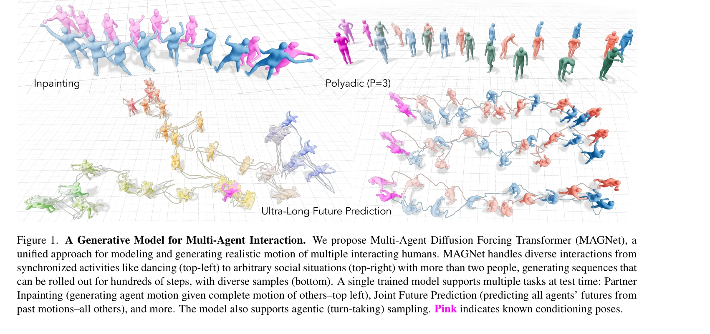
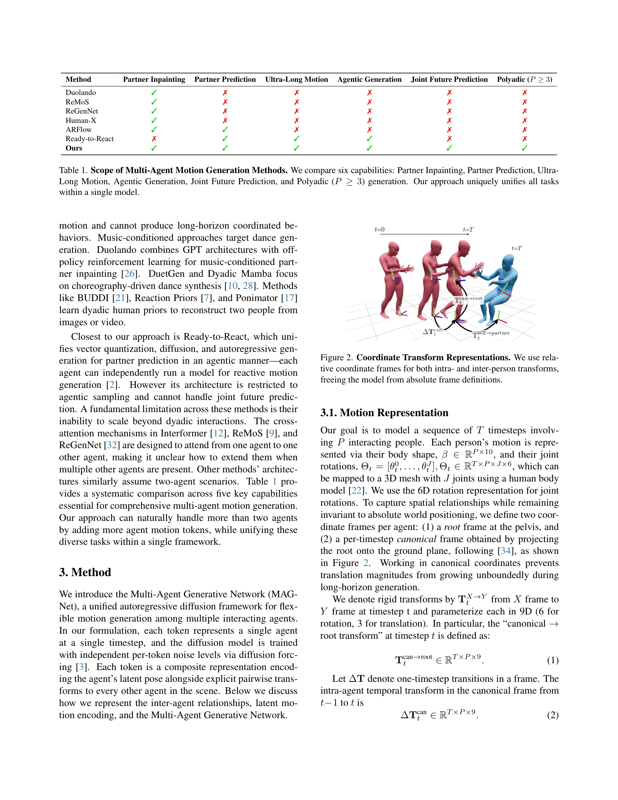

# Diffusion Forcing for Multi-Agent Interaction Sequence Modeling

> **저자**: Vongani H. Maluleke, Kie Horiuchi, Lea Wilken, Evonne Ng, Jitendra Malik, Angjoo Kanazawa | **날짜**: 2025-12-19 | **URL**: [https://arxiv.org/abs/2512.17900](https://arxiv.org/abs/2512.17900)

---

## Essence

*Figure 1. A Generative Model for Multi-Agent Interaction. We propose Multi-Agent Diffusion Forcing Transformer (MAGNet),*

MAGNet은 diffusion forcing을 활용한 통합 autoregressive diffusion framework로, 다양한 multi-agent interaction 시나리오를 하나의 모델로 처리하며 dyadic부터 polyadic 상황까지 확장 가능한 long-horizon motion generation을 수행한다.

## Motivation

- **Known**: Single-agent motion generation에서 diffusion model이 breakthrough를 이루었고, dyadic motion generation도 cross-attention 기반의 특화된 방법들이 존재하지만, 이들은 대부분 특정 task에 최적화되어 있고 polyadic 시나리오로의 확장이 어렵다.
- **Gap**: 기존 multi-agent motion generation 방법들은 task별로 특화되어 있어 유연성이 부족하고, dyadic 이상의 다중 agent 상황에 대한 통합적 해결책과 long-horizon coherent coordination이 부족하다.
- **Why**: Multi-person interaction 이해 및 생성은 robotics와 social computing에 광범위한 영향을 미치며, 다양한 interaction 형태(동기화된 활동부터 느슨한 사회적 상호작용까지)를 처리하기 위해 통합 프레임워크가 필수적이다.
- **Approach**: Agent-time motion token을 설계하여 각 token이 VQ-VAE latent pose와 모든 다른 agent에 대한 명시적 pairwise relative transforms를 포함하도록 하고, diffusion forcing으로 독립적인 per-token noise level을 할당하여 다양한 conditioning과 sampling을 지원한다.

## Achievement

*Figure 1. A Generative Model for Multi-Agent Interaction. We propose Multi-Agent Diffusion Forcing Transformer (MAGNet),*

- **통합 프레임워크**: Partner inpainting, partner prediction, joint future prediction, agentic generation, ultra-long sequence generation을 모두 하나의 모델에서 수행
- **Polyadic 확장성**: Cross-attention 의존성 제거로 agent 수에 관계없이 P≥3인 polyadic scenario를 자연스럽게 처리
- **Long-horizon 성능**: 수백 step의 ultra-long sequence를 autoregressive하게 생성하면서 temporal coherence 유지
- **성능 향상**: Ready-to-React 대비 dyadic generation에서 FD 89% 향상 달성하면서 specialized method 수준의 성능 유지
- **Coordination 모델링**: Inter-agent coupling을 explicitly model하여 synchronized activities(dancing, boxing)부터 loosely structured social interactions까지 포착

## How

*Figure 2. Coordinate Transform Representations. We use rela-*

- Agent-time motion token 설계: 각 token은 단일 agent의 단일 timestep을 represent하며 VQ-VAE latent pose와 pairwise relative transforms 포함
- Relational coordinate frame 구성: Per-frame canonical coordinate에 embedding된 relative transform으로 world-agnostic representation 구현
- Diffusion forcing 적용: 각 token에 독립적인 noise level 할당하여 임의의 agent/timestep subset에 대한 조건부 분포 학습
- Explicit pairwise transform 유지: 어떤 noise configuration에서도 inter-agent geometry 정보 보존으로 독립적 denoising 가능
- Agentic inference 지원: 각 agent가 독립적으로 model 실행 가능하여 distributed deployment 지원

## Originality

- World-agnostic multi-agent motion representation으로 agent 수에 관계없이 동작하는 architecture 설계 (기존은 fixed pair 가정)
- Diffusion forcing을 multi-agent 시나리오에 확장하면서 inter-agent coordination을 explicit pairwise transform으로 유지하는 방식
- Cross-attention 제거를 통해 polyadic scenario에서 quadratic complexity 문제 해결
- Partner inpainting과 joint prediction을 동일 model으로 통합 (기존은 별도 모델 또는 unidirectional 처리)

## Limitation & Further Study

- 평가가 주로 dyadic benchmark와 정성적 visual quality에 집중되어 있어 polyadic scenario의 정량적 벤치마크 부족
- VQ-VAE 기반 quantization으로 인한 motion quality loss와 latent space의 표현력 한계 가능성
- Long-horizon generation의 error accumulation에 대한 명시적 분석 및 회복 메커니즘 부재
- Social interaction의 의미적 다양성을 충분히 capture하기 위한 text나 semantic conditioning의 부재
- Real-world deployment를 위한 occlusion handling, imperfect input, sensor noise에 대한 robustness 평가 미흡

## Evaluation

- Novelty: 4/5
- Technical Soundness: 3/5
- Significance: 4/5
- Clarity: 4/5
- Overall: 4/5

**총평**: MAGNet은 multi-agent motion generation의 근본적인 문제인 task fragmentation을 해결하는 우아한 통합 프레임워크를 제시하며, relational representation과 diffusion forcing의 조합으로 polyadic scenario까지 자연스럽게 확장 가능한 점이 탁월하다. 다만 polyadic scenario의 정량적 평가 강화와 practical deployment에 필요한 robustness 평가가 향후 과제이다.

## Related Papers

- 🔄 다른 접근: [[papers/1930_Flexible_Motion_In-betweening_with_Diffusion_Models/review]] — multi-agent interaction modeling에서 diffusion forcing과 flexible motion in-betweening이 서로 다른 시퀀스 생성 방법론을 제시한다.
- 🔗 후속 연구: [[papers/2119_OmniControl_Control_Any_Joint_at_Any_Time_for_Human_Motion_G/review]] — MAGNet의 multi-agent diffusion framework가 OmniControl의 joint-level 제어로 확장되어 더 세밀한 상호작용 제어를 가능하게 한다.
- 🔗 후속 연구: [[papers/2067_Learning_to_Control_Physically-simulated_3D_Characters_via_G/review]] — 2D 데이터에서의 3D 캐릭터 제어가 다중 에이전트 상호작용 시퀀스 모델링으로 확장된다.
- 🔗 후속 연구: [[papers/2093_Masquerade_Learning_from_In-the-wild_Human_Videos_using_Data/review]] — Masquerade의 데이터 편집 접근법을 다중 에이전트 상호작용 시퀀스 모델링으로 확장하여 더 복잡한 상호작용을 학습할 수 있다.
- 🔗 후속 연구: [[papers/2171_Unified_Humanoid_Fall-Safety_Policy_from_a_Few_Demonstration/review]] — 통합 낙상 안전 정책에 Diffusion Forcing의 multi-agent interaction 모델링을 적용하여 복잡한 환경에서의 협력적 낙상 회복 전략을 개발할 수 있습니다.
- 🏛 기반 연구: [[papers/2122_One_Policy_but_Many_Worlds_A_Scalable_Unified_Policy_for_Ver/review]] — Diffusion Forcing의 multi-agent sequence modeling이 DreamPolicy의 terrain-aware autoregressive diffusion planner 설계에 방법론적 기반을 제공했다
