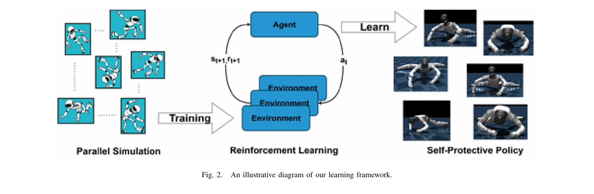

# Discovering Self-Protective Falling Policy for Humanoid Robot via Deep Reinforcement Learning

> **저자**: Diyuan Shi, Shangke Lyu, Donglin Wang | **날짜**: 2025-12-01 | **DOI**: [10.48550/arXiv.2512.01336](https://doi.org/10.48550/arXiv.2512.01336)

---

## Essence

*Fig. 1.*

Deep Reinforcement Learning과 Curriculum Learning을 이용하여 인간형 로봇이 낙상 상황에서 자체적으로 보호 행동을 발견하도록 학습시키며, 팔을 삼각형 구조로 형성하여 낙상 손상을 최소화하는 방법을 제시한다.

## Motivation

- **Known**: 인간형 로봇의 낙상 제어는 주로 제어 기반 방법이나 사전 정의된 운동 궤적에 의존하며, 기존 연구는 제한된 시뮬레이션 평가와 인간의 선험적 지식을 강하게 적용한다.
- **Gap**: 기존 제어 기반 방법은 다양한 낙상 시나리오에 대응하기 어렵고, 금속 기반 강체 재질의 인간형 로봇은 인간의 부드러운 신체와 근본적으로 다르기 때문에 적절한 낙상 보호 정책의 자동 발견이 필요하다.
- **Why**: 인간형 로봇의 높은 무게, 높은 무게중심, 많은 자유도로 인해 제어되지 않은 낙상 시 로봇 자신과 주변 물체에 심각한 하드웨어 손상을 초래할 수 있어, 안전한 낙상 보호 정책이 실용적으로 중요하다.
- **Approach**: PPO와 LCP를 활용한 대규모 DRL 학습과 domain randomization 기반 Curriculum Learning으로 Nvidia Isaacgym에서 다양한 낙상 시나리오를 시뮬레이션한 후, 신중하게 설계된 보상 함수를 통해 로봇이 자체 물리적 특성에 맞는 낙상 보호 정책을 발견하도록 한다.

## Achievement

*Fig. 1.*

- **포괄적 벤치마크 구성**: 서있기, 걷기, 외부 섭동, 작동 실패 등 다양한 낙상 시나리오에서 성능을 평가할 수 있는 대표적 메트릭을 개발
- **삼각형 구조 발견**: DRL 학습을 통해 로봇이 팔을 삼각형 구조로 형성하여 낙상 손상을 현저히 감소시키는 자기보호 행동을 자율적으로 발견
- **실제 로봇 전이 성공**: 시뮬레이션에서 학습한 정책을 Unitree G1 실제 로봇 플랫폼에 성공적으로 전이하여 합리적이고 자기보호적 행동을 시연

## How

*Fig. 2.*

- Proximal Policy Optimization (PPO)과 Lipschitz-Constrained Policies (LCP)를 사용한 DRL 알고리즘 적용
- Domain randomization 기반 Curriculum Learning으로 다양한 낙상 시나리오에 대한 일반화 능력 향상
- Nvidia Isaacgym에서 병렬 시뮬레이션을 통한 대규모 학습
- Regularized Online Adaptation (ROA) 프레임워크를 따르며 학습 중 특권화된 정보 제공 및 배포 시 관찰에서 추론
- 전신 제어(WBC)로 Unitree G1의 29 자유도 제어
- 관찰 공간: 토르소 각속도, 롤/피치 각도, 관절 위치/속도, 이전 행동 포함
- PD 제어기로 DRL 정책 출력을 토크로 변환 (50Hz 정책, 200Hz PD 제어기)

## Originality

- 인간형 로봇의 금속 기반 강체 특성에 맞는 자율적 낙상 보호 정책 발견이라는 새로운 관점 제시
- 기존의 인간 선험적 지식 기반 접근과 달리, DRL을 통해 로봇 자체의 물리적 특성을 존중하는 최적 행동 발견
- 포괄적 낙상 시나리오 벤치마크와 대표적 성능 메트릭 개발
- 삼각형 구조라는 기하학적으로 간단하지만 효과적인 보호 전략의 자동 발견

## Limitation & Further Study

- 현재 평가는 주로 Unitree G1 플랫폼에 국한되어 다른 인간형 로봇 형태로의 일반화 가능성 미검증
- 실제 로봇에서의 낙상 테스트는 하드웨어 손상 위험으로 제한적이며, 시뮬레이션-현실 간 격차 완전히 제거되지 않음
- 보상 함수 설계의 민감도 분석 부재로 최적성 검증 불충분
- 다양한 외부 환경(슬리핑, 표면 특성)이나 극단적 낙상 방향에 대한 평가 추가 필요
- 후속 연구: 더 다양한 로봇 형태에 대한 적용, 실제 환경에서의 검증, 다중 에이전트 학습을 통한 성능 향상

## Evaluation

- Novelty: 4/5
- Technical Soundness: 4/5
- Significance: 4/5
- Clarity: 4/5
- Overall: 4/5

**총평**: 이 논문은 DRL과 Curriculum Learning을 통해 인간형 로봇이 자신의 물리적 특성에 맞는 낙상 보호 정책을 자율적으로 발견하도록 하는 혁신적 접근을 제시하며, 실제 로봇 플랫폼으로의 성공적 전이와 포괄적 벤치마크 구성으로 인간형 로봇의 안전성 향상에 중요한 기여를 한다.
