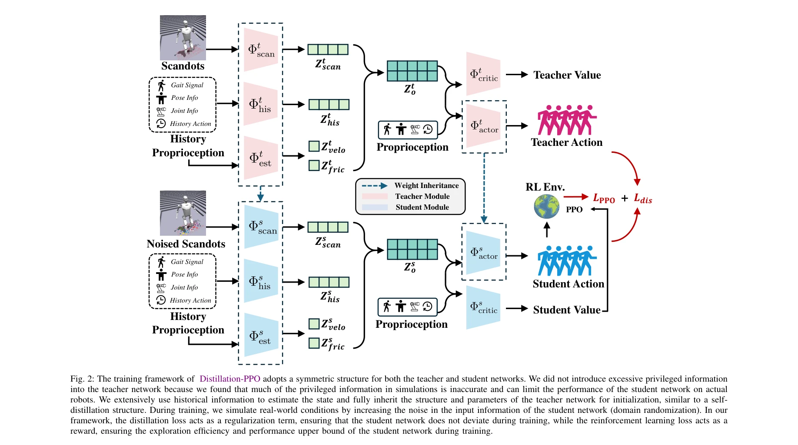
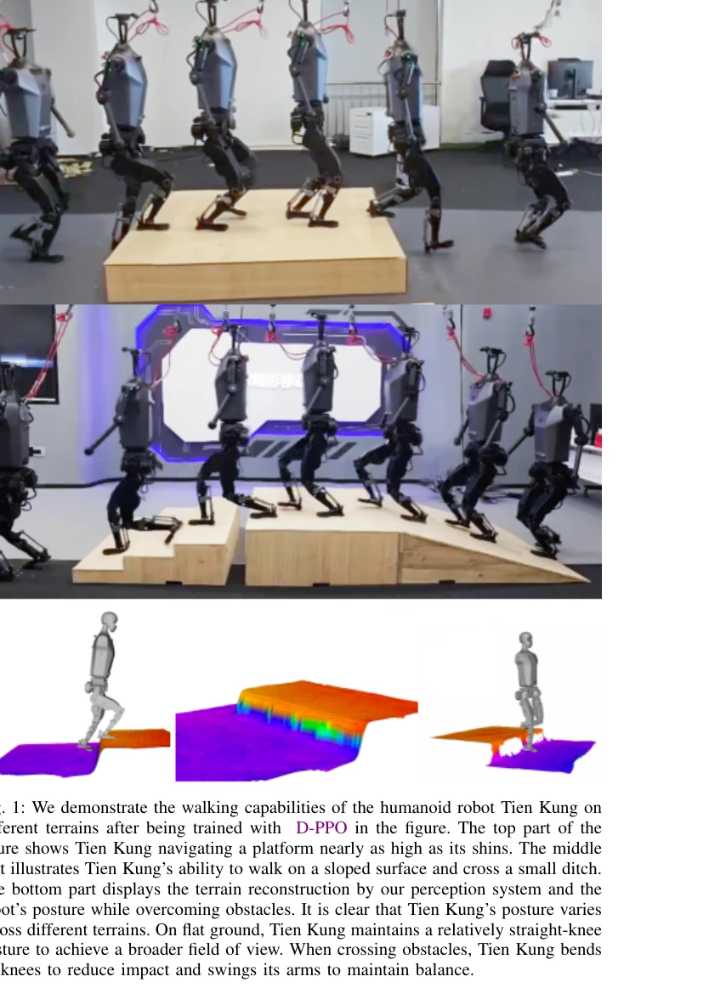

# Distillation-PPO: A Novel Two-Stage Reinforcement Learning Framework for Humanoid Robot Perceptive Locomotion

> **저자**: Qiang Zhang, Gang Han, Jingkai Sun, Wen Zhao, Chenghao Sun, Jiahang Cao, Jiaxu Wang, Yijie Guo, Renjing Xu | **날짜**: 2025-03-11 | **URL**: [https://arxiv.org/abs/2503.08299](https://arxiv.org/abs/2503.08299)

---

## Essence

*Fig. 2: The training framework of Distillation-PPO adopts a symmetric structure for both the teacher and student network*

인문형 로봇의 지각 기반 보행을 위해 교사 정책과 강화학습을 결합한 2단계 프레임워크 Distillation-PPO (D-PPO)를 제안하며, 시뮬레이션에서의 안정성과 실제 로봇의 강건성을 동시에 확보한다.

## Motivation

- **Known**: 인문형 로봇의 보행 제어는 2단계 방식(교사-학생 정책 기반 지식 증류)과 엔드투엔드 방식(POMDP 직접 학습)으로 나뉘어 있으며, 전자는 높은 성능이지만 학생의 잠재력을 제한하고 후자는 자유도가 높지만 불안정하다.
- **Gap**: 기존 2단계 방식은 교사 정책의 제약으로 학생 정책이 초과 성능을 낼 수 없으며, 시뮬레이션-실제 간극으로 인한 오류 지도와 미학습 시나리오에서의 실패 문제가 있다. 또한 엔드투엔드 방식은 POMDP 학습의 어려움과 낮은 성능이라는 내재적 한계가 있다.
- **Why**: 인문형 로봇이 복잡한 환경과 불규칙한 지형에서 안정적으로 보행할 수 있는 능력은 현실 적용의 핵심 과제이며, 2단계와 엔드투엔드 방식의 강점을 통합한 프레임워크의 개발은 이 문제의 근본적 해결책이 될 수 있다.
- **Approach**: D-PPO는 1단계에서 완전 관측 가능 MDP 환경에서 교사 정책을 훈련하고, 2단계에서 부분 관측 가능 POMDP 환경에서 교사의 감독 신호와 PPO 기반 강화학습 보상을 결합하여 학생 정책을 훈련한다. 이를 통해 교사의 정규화 효과를 유지하면서도 학생이 독립적으로 학습할 수 있게 한다.

## Achievement

*Fig. 1: We demonstrate the walking capabilities of the humanoid robot Tien Kung on*

- **통합 학습 프레임워크**: 교사 정책의 감독 신호(정규화 역할)와 강화학습 보상(상한선 향상)을 결합하여 2단계 방식의 한계를 극복
- **시뮬레이션 성능**: 시뮬레이션 환경에서 기존 방식 대비 높은 훈련 효율성과 수렴 안정성 달성
- **실제 로봇 성능**: 실제 인문형 로봇 Tien Kung에서 다양한 지형(평지, 경사면, 계단, 장애물 등)에서의 우수한 강건성과 일반화 능력 입증
- **확장 가능성**: 인문형 로봇뿐만 아니라 다리 로봇 전반으로의 확장 가능성 제시

## How

*Fig. 2: The training framework of Distillation-PPO adopts a symmetric structure for both the teacher and student network*

- 대칭적 구조의 교사-학생 네트워크 설계로 가중치 상속을 통한 효율적 초기화
- 역사 정보(History)를 활용하여 부분 관측 상태에서의 추정 개선
- 시뮬레이션 조건에 현실 왜곡(noised sensor inputs)을 추가하여 sim-to-real gap 감소
- 다양한 특성 벡터 활용: 고유감각 정보, 스캔 데이터, 속도, 마찰, 이전 행동 등을 조합
- PPO 알고리즘과 지식 증류 손실함수(L_dis)를 결합한 다중 목적 최적화

## Originality

- 기존 2단계 방식의 '학생이 교사를 넘을 수 없다'는 근본적 한계를 강화학습 보상을 추가함으로써 극복한 아이디어", '대칭적 네트워크 구조와 자기-지식 증류(self-distillation) 개념의 적용
- 시뮬레이션에서 센서 노이즈를 의도적으로 도입하는 현실성 강화 전략
- 시뮬레이션의 특권 정보(privileged information)의 부정확성을 인식하고 이를 제한적으로 사용하는 설계 철학

## Limitation & Further Study

- 실제 로봇 실험이 단일 플랫폼(Tien Kung)에서만 수행되어 다양한 인문형 로봇 체형에 대한 일반화 검증 부족
- 교사 정책의 'privileged information'을 제한적으로 사용하는 설계로 인해 교사의 이점을 최대화하지 못할 가능성", 'POMDP 환경에서의 상태 추정에 RNN 등의 고급 시계열 모델이 아닌 역사 정보만 사용하는 단순성
- 다양한 강화학습 알고리즘(SAC, TD3 등)과의 비교 실험 부재로 PPO 결합의 필수성 미검증
- 후속 연구 방향: (1) 다중 로봇 플랫폼에서의 검증, (2) 동적 환경에서의 온라인 적응 학습, (3) 더 복잡한 고수준 작업(달리기, 점프 등)으로의 확장

## Evaluation

- Novelty: 4/5
- Technical Soundness: 3/5
- Significance: 4/5
- Clarity: 4/5
- Overall: 4/5

**총평**: 본 논문은 강화학습과 지식 증류의 강점을 결합한 균형잡힌 접근법으로, 시뮬레이션과 실제 로봇 양쪽에서 검증된 실질적 성과를 보여준다. 다만 이론적 분석이 부족하고 단일 로봇 플랫폼의 실험만 제시된 점이 아쉽지만, 인문형 로봇 보행 제어의 실질적 문제 해결에 기여하는 의미 있는 연구다.
