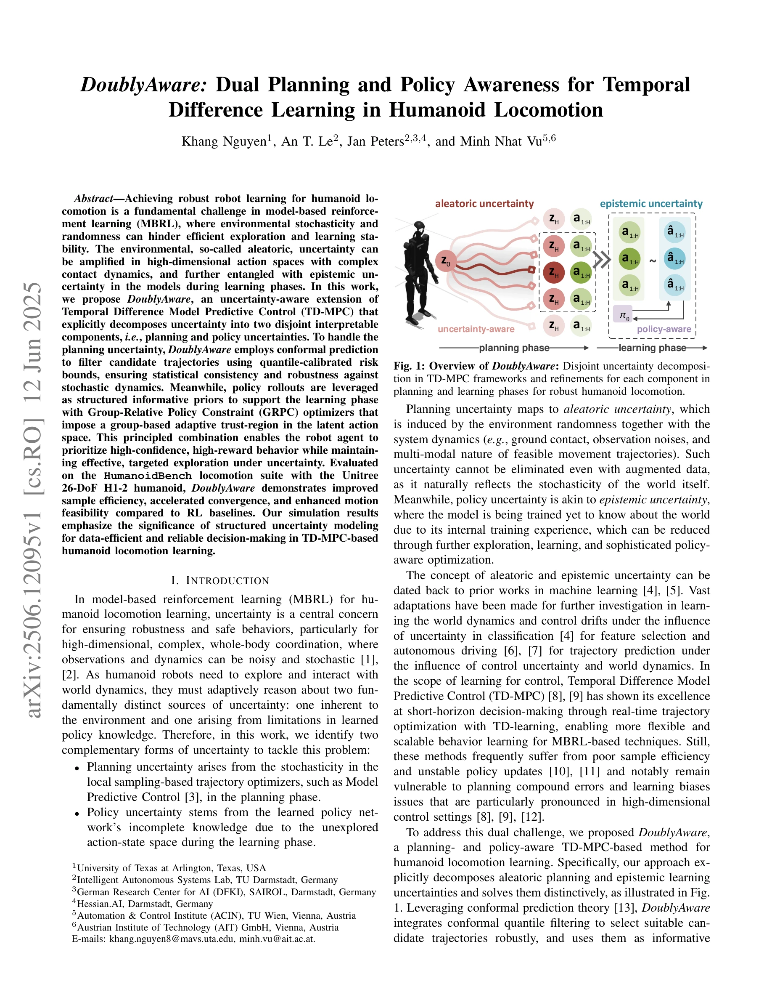
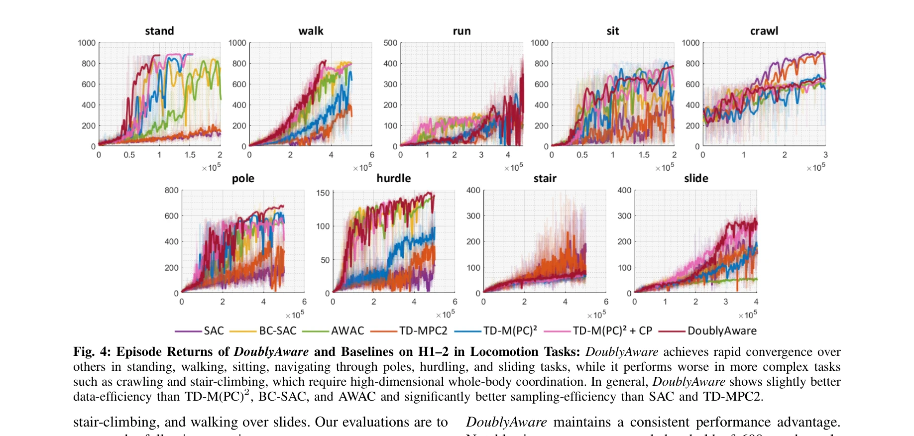
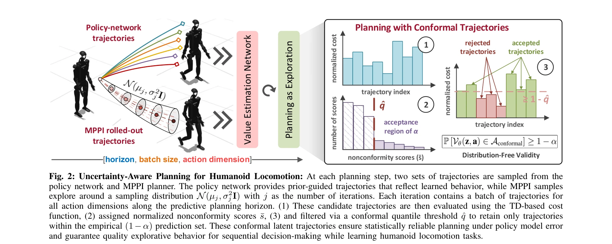

# DoublyAware: Dual Planning and Policy Awareness for Temporal Difference Learning in Humanoid Locomotion

> **저자**: Khang Nguyen, An T. Le, Jan Peters, Minh Nhat Vu | **날짜**: 2025-06-12 | **URL**: [https://arxiv.org/abs/2506.12095](https://arxiv.org/abs/2506.12095)

---

## Essence

*Fig. 1: Overview of DoublyAware: Disjoint uncertainty decomposi-*

DoublyAware는 TD-MPC 프레임워크에서 불확실성을 planning uncertainty와 policy uncertainty로 명시적으로 분해하여, conformal prediction과 Group-Relative Policy Constraint를 통해 휴머노이드 로봇의 샘플 효율적이고 안정적인 학습을 실현한다.

## Motivation

- **Known**: TD-MPC는 MPC의 단기 최적화 능력과 RL의 샘플 효율성을 결합하여 고차원 연속 제어에서 우수한 성능을 보여주었으나, 불확실성 누적으로 인한 성능 저하와 학습 불안정성 문제가 지속되고 있다.
- **Gap**: 기존 TD-MPC 기반 방법들은 환경의 stochasticity(aleatoric uncertainty)와 모델의 불완전한 지식(epistemic uncertainty)을 구분하지 않고 처리하여, 휴머노이드 로봇의 복잡한 접촉 역학에서 planning compound errors와 learning biases가 증폭되는 문제가 있다.
- **Why**: 휴머노이드 로봇 제어는 고차원 연속 동작공간, 복잡한 접촉 역학, 다중 모달 궤적 특성을 갖추고 있어 구조화된 불확실성 모델링이 데이터 효율성과 신뢰성 있는 의사결정을 위해 필수적이다.
- **Approach**: DoublyAware는 두 가지 불확실성을 분리하여 처리한다: (1) planning phase에서 conformal prediction을 활용해 quantile-calibrated risk bounds로 궤적을 필터링하고, (2) learning phase에서 policy rollout을 정보적 사전으로 활용하며 Group-Relative Policy Constraint optimizer로 적응형 신뢰영역을 설정한다.

## Achievement

*Fig. 4: Episode Returns of DoublyAware and Baselines on H1–2 in Locomotion Tasks: DoublyAware achieves rapid convergence*

- **불확실성 분해 프레임워크**: aleatoric과 epistemic 불확실성을 planning과 policy 불확실성으로 명시적으로 분해하여 각각 맞춤형 솔루션을 적용
- **Planning-Aware 메커니즘**: conformal prediction 기반 궤적 필터링으로 stochastic 환경에 대한 통계적 일관성과 강건성 보장
- **Policy-Aware 최적화**: Group-Relative Policy Constraint를 통해 정책 선행 오차를 완화하고 학습 안정성 향상
- **실험적 성능 개선**: HumanoidBench에서 샘플 효율성, 수렴 속도, 운동학적 실현 가능성 측면에서 기존 RL baseline 대비 개선

## How

*Fig. 2: Uncertainty-Aware Planning for Humanoid Locomotion: At each planning step, two sets of trajectories are sampled *

- **Conformal Prediction 적용**: 양자화된 위험 경계를 통해 후보 궤적을 필터링하여 planning 단계의 aleatoric 불확실성 처리
- **Policy Rollout 활용**: 학습된 정책의 rollout을 구조화된 정보적 사전으로 활용하여 high-confidence, high-reward 행동 유도
- **GRPC Optimizer 통합**: latent action space에서 그룹 기반 적응형 신뢰영역을 설정하여 정책 업데이트의 분포 일관성 보장
- **Latent World Model**: TD-MPC2의 확장으로 고차원 접촉 역학의 복잡성을 저차원 표현으로 축소하여 오차 누적 완화
- **이중 단계 최적화**: planning 단계와 learning 단계를 분리하여 각 단계의 불확실성 특성에 맞는 최적화 수행

## Originality

- 기존 연구와 달리 aleatoric/epistemic 불확실성을 MBRL 맥락에서 planning/policy 불확실성으로 명시적으로 재정의하고, 이를 TD-MPC 프레임워크에 직접 통합
- Conformal prediction을 latent trajectory selection에 적용하여 distribution-free 통계적 보장을 제공하는 새로운 접근법
- Group-Relative Policy Optimization을 단순 정책 정규화가 아닌 적응형 신뢰영역 제약으로 구현하여 유연한 계획 수립과 학습 안정성 동시 달성
- 계획과 학습의 불확실성을 분리하되 policy rollout을 사전으로 활용하여 두 단계를 통합하는 우아한 설계

## Limitation & Further Study

- 실험이 시뮬레이션(HumanoidBench, Unitree H1-2)에만 제한되어 실제 로봇 하드웨어에서의 성능 검증 부족
- Conformal prediction의 quantile 보정 비용과 GRPC optimizer의 계산 복잡도에 대한 논의 부재로 실시간성 영향 불명확
- 기존 baseline(SAC, PPO 등)과의 비교에서 동일 계산 예산 조건 명시 부족 및 통계적 유의성 검정 미흡
- Policy uncertainty 측정의 명시적 정의 및 검증 메커니즘이 명확하지 않아 policy awareness의 효과 분리 어려움
- **후속 연구**: (1) 실제 휴머노이드 로봇에서의 실험, (2) 비용-효율성 분석, (3) 더 복잡한 동적 환경(외란, 모델 미스매치)에서의 강건성 검증, (4) 다른 고차원 제어 문제(조작, 멀티에이전트)로의 일반화

## Evaluation

- Novelty: 4/5
- Technical Soundness: 3/5
- Significance: 4/5
- Clarity: 4/5
- Overall: 4/5

**총평**: 본 논문은 MBRL의 핵심 문제인 불확실성을 planning과 policy로 분해하고 각각에 맞는 엄밀한 해법(conformal prediction, GRPC)을 제시함으로써 개념적 명확성과 기술적 우수성을 동시에 달성했다. 휴머노이드 로봇 제어라는 도전적 문제에서 실증적 개선을 보여주었으나, 실제 로봇 검증과 계산 비용 분석이 보완되면 더욱 강력한 기여가 될 것으로 판단된다.
