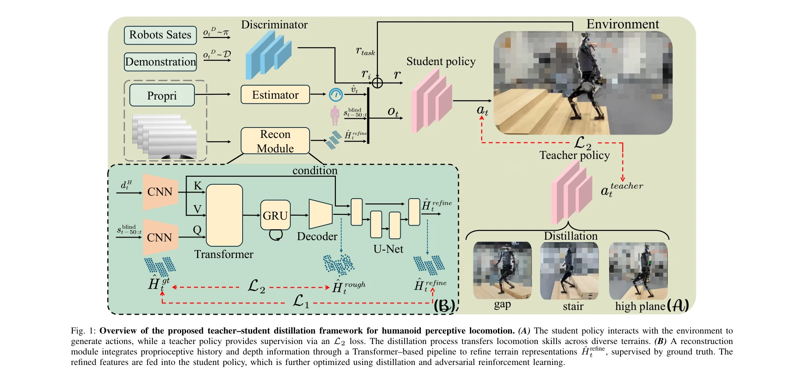
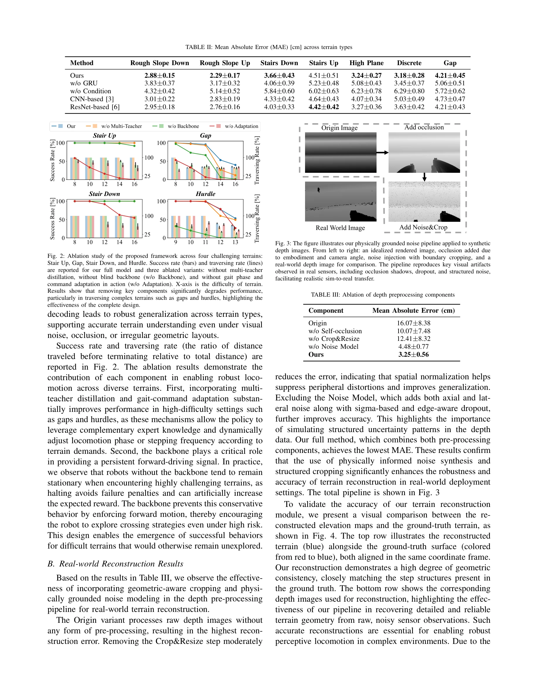

# DPL: Depth-only Perceptive Humanoid Locomotion via Realistic Depth Synthesis and Cross-Attention Terrain Reconstruction

> **저자**: Jingkai Sun, Gang Han, Pihai Sun, Wen Zhao, Jiahang Cao, Jiaxu Wang, Yijie Guo, Qiang Zhang | **날짜**: 2025-10-08 | **URL**: [https://arxiv.org/abs/2510.07152](https://arxiv.org/abs/2510.07152)

---

## Essence

*Fig. 1: Overview of the proposed teacher–student distillation framework for humanoid perceptive locomotion. (A) The stud*

휴머노이드 로봇의 깊이 이미지만을 사용한 지형 인식 보행을 위해, 현실적인 깊이 합성과 cross-attention transformer를 결합하여 사전 학습된 blind policy를 기반으로 효율적인 정책 학습을 가능하게 한다.

## Motivation

- **Known**: quadruped 로봇의 지형 인식 보행은 발전했으나, humanoid 로봇 보행은 깊이 이미지 기반 end-to-end 학습(sim-to-real gap 문제) 또는 elevation map 기반 방법(다중 센서 및 localization 의존)의 두 가지 패러다임에 제약되어 있다.
- **Gap**: 기존 방법들은 효율성 저하, domain gap, 센서 노이즈에 대한 취약성, 외부 localization 시스템 의존성 등의 문제를 안고 있으며, 단일 깊이 카메라만으로 end-to-end fine-tuning을 지원하는 통합 프레임워크가 부재하다.
- **Why**: 휴머노이드 로봇의 자율 이동을 위해서는 시각 지각과 제어의 통합이 필수이며, 단일 센서로 실시간 gait 적응을 달성하면 현장 배포의 강건성과 응답성이 크게 향상된다.
- **Approach**: blind backbone policy에 vision-based modulator를 통합하는 teacher-student 구조와, 자기 occlusion을 고려한 ray casting 및 noise 모델링으로 현실적인 깊이 이미지를 합성하며, multi-modal cross-attention transformer로 노이즈 있는 깊이 이미지로부터 지형 기하학을 재구성한다.

## Achievement

*Fig. 2: Ablation study of the proposed framework across four challenging terrains:*

- **다단계 학습 프레임워크**: 사전 학습된 정책을 기반으로 외부 localization 없이 end-to-end fine-tuning을 가능하게 하여 training 효율성을 대폭 향상시킴
- **현실적 깊이 합성**: self-occlusion-aware ray casting과 noise-aware 모델링으로 깊이 재구성 오류를 30% 이상 감소
- **cross-modal transformer**: 부분적 깊이 및 proprioceptive 입력으로부터 구조화된 지형 표현을 재구성
- **실제 로봇 검증**: 실제 크기 humanoid 로봇에서 경사, 계단, 갭, 불균등한 야외 지면 등 다양한 지형에서 agile하고 adaptive한 보행 달성

## How

*Fig. 3: The figure illustrates our physically grounded noise pipeline applied to synthetic*

- Terrain-aware locomotion policy: proprioceptive 피드백(각속도, 관절 위치/속도, 중력, 선속도), 1.0m × 1.0m heightmap (5cm 해상도), 명령 입력, periodic gait 신호를 결합한 observation space 설계
- Teacher-student 구조: pretrained blind policy와 vision-based modulator를 학생/교사 정책에 통합하여 시각 정보 없이도 안정적 보행 제공
- Multi-modal cross-attention transformer: 노이즈가 있는 깊이 이미지와 proprioceptive 상태 이력으로부터 local terrain geometry 재구성
- Realistic depth synthesis: self-occlusion-aware geometry와 physically grounded noise pipeline을 통해 simulation 환경에서 실제 센서 특성 모방
- Adversarial motion prior (AMP) framework: 동작 discriminator를 사용하여 인간 consistent한 보행 양식 유도
- 강화 학습 기반 정책 최적화: MDP 공식화와 누적 discounted reward 최대화

## Originality

- 기존 연구(특히 [6]과 비교)와 달리, 깊이 생성 모듈이 단순 데이터 수집이 아닌 end-to-end fine-tuning을 지원하여 vision-based modulator와의 domain gap 감소
- Self-occlusion-aware ray casting을 통한 깊이 합성으로 실제 depth camera의 자기 차폐(self-occlusion) 현상을 모의하는 새로운 접근
- Global localization 없이 local heightmap과 첫 인칭 깊이 이미지만으로 지형 인식을 수행하는 단일 센서 기반 설계
- Cross-modal attention transformer로 noisy하고 부분적(partial)인 깊이 정보를 구조화된 지형 표현으로 변환하는 기법

## Limitation & Further Study

- 깊이 카메라의 시야 제약으로 인한 부분적(partial) 관찰의 근본적 한계—먼 거리 계단이나 큰 갭의 조기 감지 어려움
- 현실적 깊이 모델의 완전성 검증 부족—실제 다양한 depth camera 종류에 대한 generalization 성능 미상
- Cross-attention transformer의 실시간 추론 latency 분석 부재—control loop 응답성에 미치는 영향 평가 필요
- 야외 환경의 빛 간섭, 반사 특성, 극저온 조건 등 extreme 상황에서의 robust성 검증 제한적
- 후속 연구: 여러 깊이 카메라 또는 event camera 등 이종 센서 fusion으로 시야 확대, 다양한 로봇 플랫폼으로의 generalization 연구, 동적 환경에서의 real-time 성능 개선

## Evaluation

- Novelty: 4/5
- Technical Soundness: 4/5
- Significance: 4/5
- Clarity: 4/5
- Overall: 4/5

**총평**: 이 논문은 humanoid 로봇의 깊이 기반 보행에서 sim-to-real gap과 효율성 문제를 체계적으로 해결하는 통합 프레임워크를 제시하며, self-occlusion-aware 깊이 합성, cross-modal transformer, end-to-end fine-tuning의 조합으로 높은 독창성과 실용성을 달성했다. 실제 로봇 검증과 명확한 기술 기여가 돋보이는 우수한 연구이다.

## Related Papers

- 🔄 다른 접근: [[papers/1856_CReF_Cross-modal_and_Recurrent_Fusion_for_Depth-conditioned/review]] — 깊이 정보만을 사용한 지형 인식과 cross-modal fusion을 통한 접근법이 센서 데이터 활용에서 서로 다른 전략을 보여준다.
- 🧪 응용 사례: [[papers/1633_Real-Time_Polygonal_Semantic_Mapping_for_Humanoid_Robot_Stai/review]] — DPL의 현실적인 깊이 합성 기술이 polygonal semantic mapping과 결합되어 휴머노이드의 실내 네비게이션 성능을 향상시킬 수 있다.
- 🔄 다른 접근: [[papers/1939_Gait-Adaptive_Perceptive_Humanoid_Locomotion_with_Real-Time/review]] — 실시간 지형 추정을 통한 다른 지각적 인간형 보행 방식을 제시합니다.
- 🔗 후속 연구: [[papers/2010_HumanoidPano_Hybrid_Spherical_Panoramic-LiDAR_Cross-Modal_Pe/review]] — 하이브리드 구형 파노라마-LiDAR 교차 모달 지각으로 발전됩니다.
- 🏛 기반 연구: [[papers/1884_DPL_Depth-only_Perceptive_Humanoid_Locomotion_via_Realistic/review]] — 깊이 전용 지각적 보행의 기본 개념과 방법론을 제공합니다.
- 🏛 기반 연구: [[papers/1658_RPL_Learning_Robust_Humanoid_Perceptive_Locomotion_on_Challe/review]] — RPL의 depth 카메라 기반 transformer 정책이 DPL의 depth-only perceptive locomotion 방법론을 확장한 것이다
- 🧪 응용 사례: [[papers/1798_AME-2_Agile_and_Generalized_Legged_Locomotion_via_Attention-/review]] — depth-only perceptive locomotion 기법이 AME-2의 elevation mapping 파이프라인을 더 효율적이고 실용적으로 만드는 데 활용될 수 있다.
- 🔄 다른 접근: [[papers/1856_CReF_Cross-modal_and_Recurrent_Fusion_for_Depth-conditioned/review]] — 깊이 정보를 활용한 지형 인식 보행에서 cross-modal fusion과 depth-only 접근법의 서로 다른 센서 융합 전략을 비교한다.
- 🔄 다른 접근: [[papers/1998_Humanoid_Occupancy_Enabling_A_Generalized_Multimodal_Occupan/review]] — Humanoid Occupancy의 multimodal fusion과 DPL의 depth-only 접근법은 humanoid 환경 인식을 위한 서로 다른 센서 융합 전략입니다.
- 🔗 후속 연구: [[papers/2042_Learning_a_Vision-Based_Footstep_Planner_for_Hierarchical_Wa/review]] — 깊이 인식 휴머노이드 보행의 계층적 제어로의 확장된 접근
- 🔗 후속 연구: [[papers/2073_Learning_to_Walk_in_Costume_Adversarial_Motion_Priors_for_Ae/review]] — 깊이 기반 지각을 통해 극한 제약 조건에서도 환경 적응 보행을 가능하게 하는 확장된 방법론이다.
- 🏛 기반 연구: [[papers/2112_Now_You_See_That_Learning_End-to-End_Humanoid_Locomotion_fro/review]] — DPL의 depth-only 지각 기반 보행 학습 기법이 Now You See That의 raw depth 이미지 기반 end-to-end 학습에 방법론적 기반을 제공한다.
