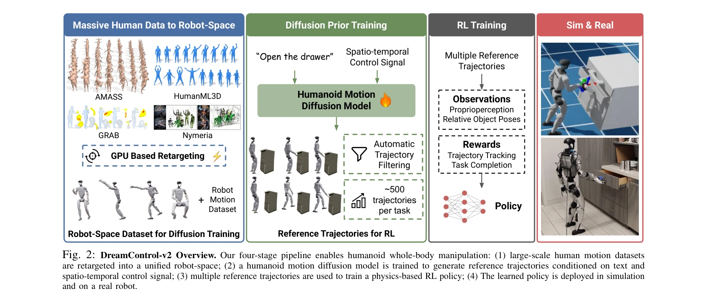
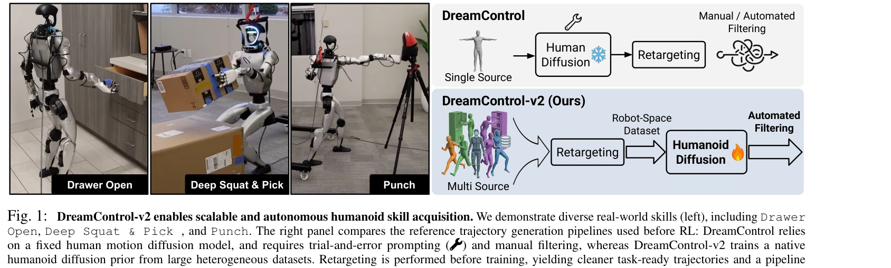

# DreamControl-v2: Simpler and Scalable Autonomous Humanoid Skills via Trainable Guided Diffusion Priors

> **저자**:  | **날짜**: 2026-03-31 | **URL**: [https://arxiv.org/abs/2604.00202](https://arxiv.org/abs/2604.00202)

---

## Essence

*Fig. 2: DreamControl-v2 Overview. Our four-stage pipeline enables humanoid whole-body manipulation: (1) large-scale huma*

humanoid 로봇의 복잡한 manipulation 작업을 위해 guided diffusion 모델을 로봇의 motion space에 직접 학습하여, 다양한 인간과 로봇 데이터를 통합하고 RL 정책을 자동으로 생성하는 확장 가능한 프레임워크를 제시한다.

## Motivation

- **Known**: DreamControl은 human motion diffusion 모델(OmniControl)로부터 생성된 reference 궤적을 RL로 추적하게 함으로써 humanoid 로봇의 loco-manipulation 기술을 학습할 수 있음이 알려져 있다. 그러나 human space에서 robot space로의 retargeting 과정에서 spatial constraint가 손실되고 trial-and-error 튜닝이 필요하다는 한계가 있다.
- **Gap**: 기존 DreamControl의 generate-then-retarget 파이프라인은 spatial conditioning 손실, task-specific 수정(IK), 수동 필터링 등으로 인해 확장성이 제한되며, AMASS 스타일 동작만 생성할 수 있어 다양한 로보틱 작업에 적용하기 어렵다.
- **Why**: humanoid 로봇이 현실 세계의 다양한 복잡한 manipulation 작업을 자율적으로 수행하기 위해서는 수동 개입 없이 확장 가능하고 자동화된 reference trajectory 생성이 필수적이며, 이를 통해 실제 로봇 배포의 효율성과 일반화 성능이 크게 향상될 수 있다.
- **Approach**: robot space에 직접 학습된 humanoid diffusion prior를 훈련하기 위해 AMASS, HumanML3D, GRAB, Nymeria 등 다양한 human motion 데이터셋을 GPU 기반 retargeting으로 Unitree-G1 embodiment으로 사전 변환하고, 자동화된 trajectory filtering을 통해 RL 훈련용 reference 궤적을 생성한다.

## Achievement

*Fig. 1: DreamControl-v2 enables scalable and autonomous humanoid skill acquisition. We demonstrate diverse real-world sk*

- **Spatial constraint 보존**: robot space에서 직접 spatial conditioning을 수행하여 retargeting 후에도 spatio-temporal 제약 조건이 유지되어 trial-and-error 튜닝 제거
- **확장성 향상**: 다양한 데이터셋 통합과 자동화된 filtering으로 task-specific IK와 수동 개입 불필요
- **다양한 기술 습득**: AMASS 스타일 동작을 벗어나 drawer opening, deep squat & pick, punch 등 상호작용이 많은 manipulation 작업 수행 가능
- **실제 로봇 검증**: Unitree-G1에서 시뮬레이션과 실세계 모두에서 성공적으로 동작 입증
- **자동 파이프라인**: 간소화되고 자동화된 생성 파이프라인으로 practitioner의 개입 최소화

## How

*Fig. 2: DreamControl-v2 Overview. Our four-stage pipeline enables humanoid whole-body manipulation: (1) large-scale huma*

- 다양한 human motion 데이터셋(AMASS, HumanML3D, GRAB, Nymeria)을 GPU 기반 retargeting으로 Unitree-G1 형태로 사전 변환하여 robot-space dataset 구성
- robot-space dataset을 사용하여 text와 spatio-temporal constraint에 조건화된 guided diffusion 모델을 직접 훈련
- 학습된 diffusion 모델에서 다수의 reference trajectory 생성(~500개/작업)
- 자동화된 filtering 메커니즘으로 생성된 궤적의 품질을 평가하여 RL 훈련용 최적 궤적 선택
- 선택된 reference trajectory를 추적하도록 RL 정책 훈련하며, trajectory tracking을 reward signal로 설정하여 inference 시 자율 실행 가능
- Diffusion model의 trajectory 생성 규모와 downstream RL 성능의 관계를 상세히 분석

## Originality

- 기존 DreamControl의 generate-then-retarget 패러다임에서 벗어나 robot space에서 직접 diffusion 모델 훈련하는 새로운 접근
- heterogeneous human motion 데이터셋을 unified embodiment space로 통합하는 체계적인 데이터 처리 방법론
- robot space에서의 spatial conditioning으로 retargeting 오류 제거 및 constraint 보존이라는 근본적 문제 해결
- 자동화된 trajectory filtering으로 수동 개입과 task-specific workaround 완전히 제거
- 대규모 reference trajectory 생성(~500개/작업)의 중요성을 정량적으로 분석하고 증명

## Limitation & Further Study

- 현재 Unitree-G1 단일 로봇에만 검증되었으므로 다른 humanoid embodiment으로의 일반화 검증 필요
- robot-space dataset 구성 시 고품질 retargeting이 전제되어야 하므로, retargeting 오류가 누적될 수 있는 위험 존재
- 자동화된 filtering의 정확한 기준과 성능에 대한 상세 분석 부족으로, filtering 실패 사례에 대한 robustness 평가 미흡
- real-world 실험이 제한적이므로 더 복잡한 환경과 task에서의 성능 검증 필요
- diffusion 모델 훈련에 필요한 computational cost와 시간에 대한 분석 부족
- 여러 로봇 형태를 동시에 지원하는 unified diffusion 모델 학습 가능성 탐색 필요

## Evaluation

- Novelty: 4/5
- Technical Soundness: 3/5
- Significance: 4/5
- Clarity: 4/5
- Overall: 4/5

**총평**: DreamControl-v2는 robot-space diffusion prior 훈련이라는 명확한 아이디어로 기존의 확장성 문제를 근본적으로 해결하며, 자동화된 파이프라인과 다양한 skill 습득을 통해 humanoid 로봇의 자율적 loco-manipulation에 실질적인 진전을 이루었다. 다만 다중 로봇 embodiment 일반화와 실제 환경에서의 광범위한 검증이 추가되면 더욱 강력한 기여가 될 것이다.
