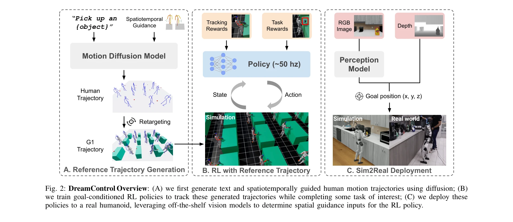
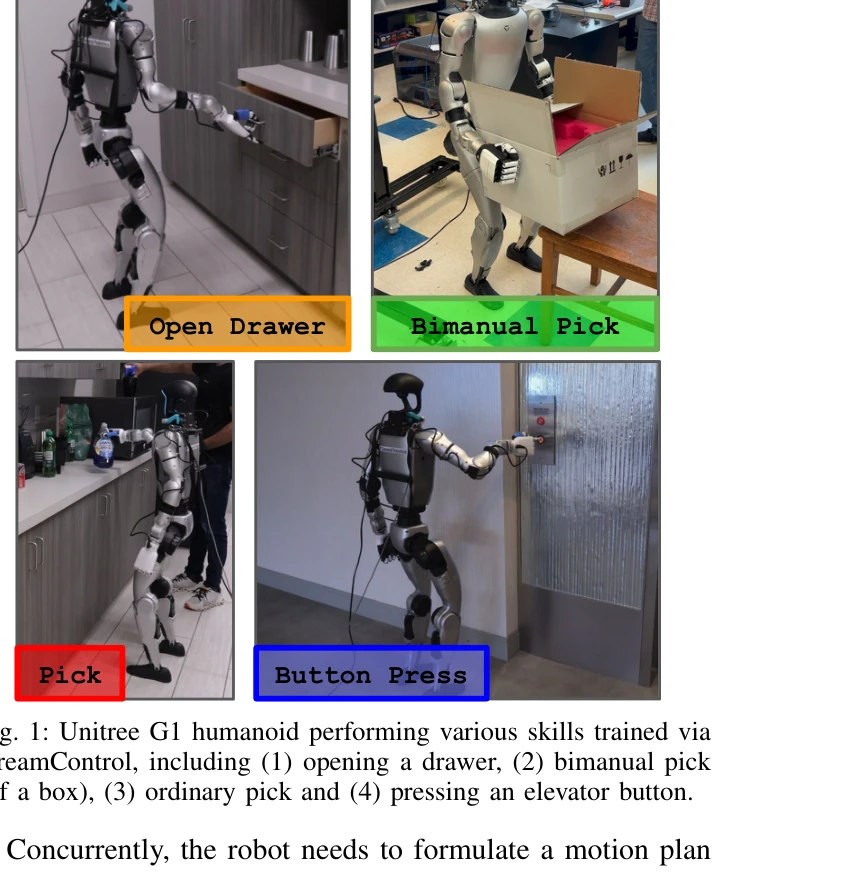

# DreamControl: Human-Inspired Whole-Body Humanoid Control for Scene Interaction via Guided Diffusion

> **저자**: Dvij Kalaria, Sudarshan S. Harithas, Pushkal Katara, Sangkyung Kwak, Sarthak Bhagat, Shankar Sastry, Srinath Sridhar, Sai Vemprala, Ashish Kapoor, Jonathan Chung-Kuan Huang | **날짜**: 2025-09-30 | **DOI**: [10.48550/arXiv.2509.14353](https://doi.org/10.48550/arXiv.2509.14353)

---

## Essence

*Fig. 2: DreamControl Overview: (A) we first generate text and spatiotemporally guided human motion trajectories using di*

DreamControl은 human motion 기반 diffusion prior를 RL과 결합하여 humanoid robot의 whole-body 조작 작업을 학습하는 방법론을 제안한다.

## Motivation

- **Known**: Diffusion model은 조작 작업에서 장시간의 일관된 temporal data를 생성할 수 있으며, RL은 시뮬레이션에서 안정적인 제어 정책을 학습할 수 있다. 그러나 직접 RL은 높은 자유도의 whole-body loco-manipulation에서 탐색 문제로 인해 비자연스러운 행동을 야기한다.
- **Gap**: 기존 연구는 teleoperation data에 의존하거나 상체/하체를 분리하여 학습하는 제약이 있으며, human motion data를 활용한 diffusion prior를 RL 정책 학습에 체계적으로 통합한 방법이 부족하다.
- **Why**: Humanoid robot이 drawer 열기, 물건 집기 등 실제 환경과의 상호작용을 수행하려면 balance, stability, 정교한 manipulation을 동시에 제어해야 하며, 이는 sim-to-real transfer에 어려움을 야기한다.
- **Approach**: OmniControl diffusion model을 사용하여 text와 spatiotemporal guidance로부터 human motion trajectory를 생성하고, 이를 robot form factor로 retarget한 후 task completion과 trajectory tracking을 모두 보상하는 RL 정책을 학습한다.

## Achievement

*Fig. 1: Unitree G1 humanoid performing various skills trained via*

- **Human motion prior 활용**: Teleoperation data 대신 풍부한 human motion data를 diffusion prior로 활용하여 RL이 발견 불가능한 해결책을 찾을 수 있음을 입증
- **Whole-body manipulation 성공**: Unitree G1 robot에서 drawer 열기, bimanual pick, button press 등 동시적 상하체 제어와 object interaction을 포함한 다양한 작업 수행
- **Sim-to-real transfer 개선**: Diffusion model이 자연스러운 동작을 유도하여 극단적 motion을 회피하고, 비privileged policy로도 실제 로봇 배포 가능
- **Scalability**: 큰 규모의 teleoperation data 없이도 multiple tasks를 학습할 수 있는 확장 가능한 방법론 제시

## How

*Fig. 2: DreamControl Overview: (A) we first generate text and spatiotemporally guided human motion trajectories using di*

- Stage A: OmniControl diffusion model에 text condition ("open the drawer")과 spatiotemporal guidance (특정 시간의 손목 위치)를 입력하여 human motion trajectory 생성
- Motion retargeting: 생성된 human trajectory를 Unitree G1의 형태로 retarget
- Stage B: 시뮬레이션에서 RL policy를 training reward (task completion) + tracking reward (retargeted trajectory 추적)로 학습
- Dual policy variant: Privileged (simulation state 접근) 및 non-privileged (RGB/depth image 기반) 정책 모두 구성 가능
- Stage C: Vision model을 사용하여 spatiotemporal guidance를 자동 생성하고 실제 로봇에 배포

## Originality

- OmniControl의 spatiotemporal guidance를 RL training에 처음으로 체계적으로 통합하여 fine-grained control을 실현
- Diffusion prior as inductive bias: 직접 RL이 아닌 인간의 움직임 패턴으로부터 학습된 사전지식을 RL 탐색을 안내하는 메커니즘으로 활용
- Whole-body loco-manipulation의 multi-timescale 문제를 diffusion (long-horizon planning) + RL (short-horizon stability) 조합으로 해결
- 실제 로봇 배포를 위해 reference trajectory 의존성을 제거하는 설계 (vision-based spatiotemporal guidance 자동 생성)

## Limitation & Further Study

- Diffusion prior의 품질이 최종 성능에 크게 의존하며, OmniControl의 제약사항 (예: guidance type, text description coverage)이 전파될 수 있음
- Motion retargeting 단계에서 human-to-robot 간의 형태학적 차이 처리 방법이 상세히 설명되지 않음
- 실험은 Unitree G1 단일 로봇에만 수행되어 다른 humanoid form factor로의 일반화 가능성 미검증
- Sim-to-real gap은 부분적으로 해결되지만, contact dynamics, friction 변화 등에 대한 robustness 평가 미흡
- 후속 연구: 다양한 humanoid morphology에 대한 적응 방법, dynamic environment에서의 task generalization, 연속적 다중 작업 학습 (continual learning) 메커니즘 필요

## Evaluation

- Novelty: 4/5
- Technical Soundness: 3/5
- Significance: 4/5
- Clarity: 4/5
- Overall: 4/5

**총평**: DreamControl은 human motion diffusion prior와 RL의 장점을 효과적으로 결합하여 humanoid robot의 whole-body manipulation을 학습하는 창의적이고 실용적인 방법론을 제시하며, 실제 로봇에서의 다양한 작업 수행으로 그 가치를 입증했다.

## Related Papers

- 🔗 후속 연구: [[papers/1885_DreamControl-v2_Simpler_and_Scalable_Autonomous_Humanoid_Ski/review]] — DreamControl-v2가 DreamControl의 human-inspired whole-body control을 더 단순하고 확장 가능한 형태로 발전시킨 후속 연구이다.
- 🏛 기반 연구: [[papers/2146_TEDi_Temporally-Entangled_Diffusion_for_Long-Term_Motion_Syn/review]] — temporally-entangled diffusion이 DreamControl의 whole-body manipulation 작업을 위한 long-term motion synthesis 능력을 강화한다.
- 🔄 다른 접근: [[papers/1701_Taming_Diffusion_Probabilistic_Models_for_Character_Control/review]] — diffusion model을 character control에 적용하는 다른 접근법을 제시하여 DreamControl과 상호 보완적인 관점을 제공한다.
- 🔗 후속 연구: [[papers/2013_HumanX_Toward_Agile_and_Generalizable_Humanoid_Interaction_S/review]] — 민첩하고 일반화 가능한 인간형 상호작용으로 발전됩니다.
- 🧪 응용 사례: [[papers/2168_UniAct_Unified_Motion_Generation_and_Action_Streaming_for_Hu/review]] — 통합 모션 생성과 행동 스트리밍의 실제 구현 사례를 보여줍니다.
- 🏛 기반 연구: [[papers/1885_DreamControl-v2_Simpler_and_Scalable_Autonomous_Humanoid_Ski/review]] — DreamControl의 diffusion-based motion generation이 DreamControl-v2의 더 단순하고 확장 가능한 프레임워크 개발을 위한 직접적 기반을 제공한다.
- 🏛 기반 연구: [[papers/2081_LeVERB_Humanoid_Whole-Body_Control_with_Latent_Vision-Langua/review]] — DreamControl의 whole-body humanoid control 기법이 LeVERB의 계층적 전신 제어 프레임워크 설계에 기반이 되었다
