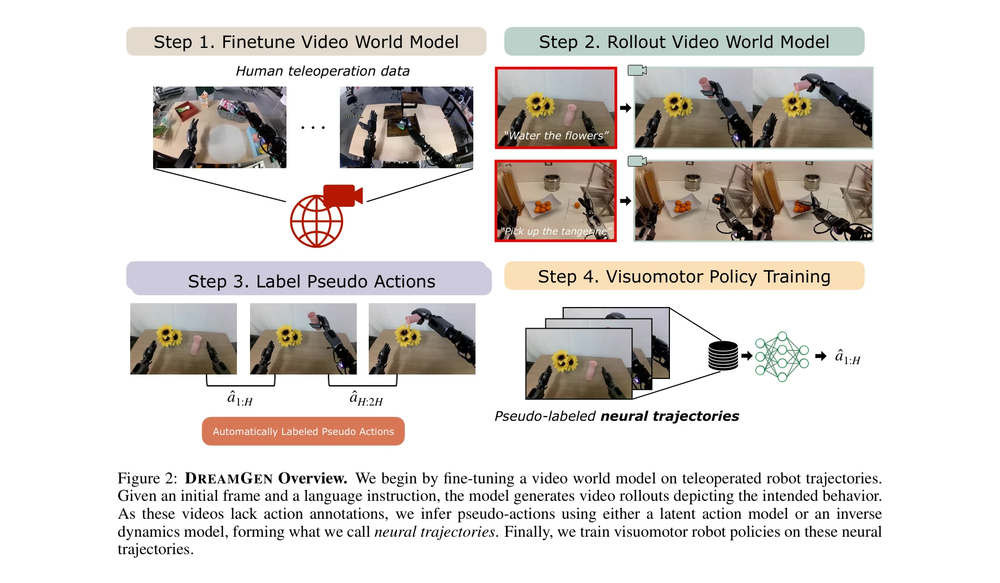
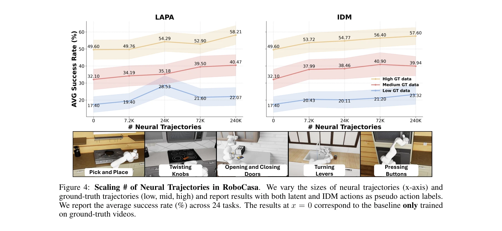
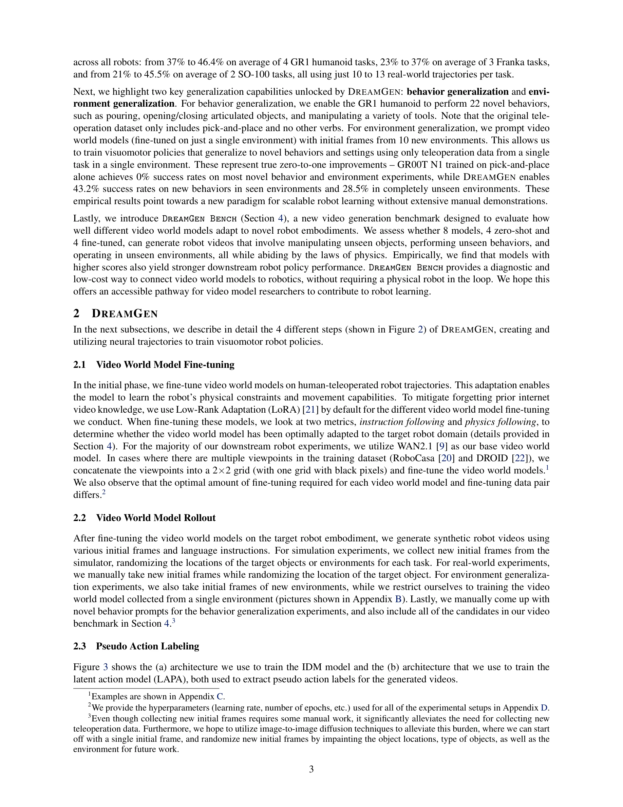

# DreamGen: Unlocking Generalization in Robot Learning through Video World Models

> **저자**: Joel Jang, Seonghyeon Ye, Zongyu Lin, Jiannan Xiang, Johan Bjorck, Yu Fang, Fengyuan Hu, Spencer Huang, Kaushil Kundalia, Yen-Chen Lin, Loic Magne, Ajay Mandlekar, Avnish Narayan, You Liang Tan, Guanzhi Wang, Jing Wang, Qi Wang, Yinzhen Xu, Xiaohui Zeng, Kaiyuan Zheng, Ruijie Zheng, Ming-Yu Liu, Luke Zettlemoyer, Dieter Fox, Jan Kautz, Scott Reed, Yuke Zhu, Linxi Fan | **날짜**: 2025-05-19 | **URL**: [https://arxiv.org/abs/2505.12705](https://arxiv.org/abs/2505.12705)

---

## Essence

*Figure 2: DREAMGEN Overview. We begin by fine-tuning a video world model on teleoperated robot trajectories.*

DreamGen은 비디오 월드 모델(video world model)을 활용하여 최소한의 원격조종 데이터로부터 로봇 정책을 학습하는 4단계 파이프라인으로, 신규 행동과 환경에 대한 일반화를 달성한다.

## Motivation

- **Known**: 로봇 파운데이션 모델은 대규모 인간 원격조종 데이터를 통해 학습되어 왔으나, 새로운 작업과 환경마다 데이터 수집이 필요하다는 한계가 있다. 시뮬레이션 기반 합성 데이터는 sim2real gap 문제를 야기한다.
- **Gap**: 비디오 생성 모델의 강력한 물리 추론 능력을 로봇 학습의 데이터 생성 source로 활용하는 체계적 방법론과, 이러한 접근의 효과성을 평가하는 벤치마크가 부재하다.
- **Why**: 원격조종 데이터 수집의 비용과 노동 집약성을 크게 감소시키면서도 다양한 행동과 환경에서의 로봇 일반화 능력을 획기적으로 향상시킬 수 있기 때문이다.
- **Approach**: 최신 image-to-video 생성 모델을 대상 로봇 embodiment에 맞게 fine-tuning한 후, 언어 명령과 초기 프레임으로부터 합성 로봇 비디오를 생성하고, Inverse Dynamics Model 또는 latent action model을 통해 pseudo-action을 추출하여 정책 학습에 사용한다.

## Achievement

*Figure 4: Scaling # of Neural Trajectories in RoboCasa. We vary the sizes of neural trajectories (x-axis) and*

- **시뮬레이션 성능**: RoboCasa에서 합성 데이터를 333배까지 확장하여 log-linear 성능 개선 달성
- **실세계 다중 embodiment 검증**: Fourier GR1, Franka Emika, SO-100 로봇에서 평균 성공률 향상 (GR1: 37% → 46.4%, Franka: 23% → 37%, SO-100: 21% → 45.5%)
- **신규 행동 일반화**: 단일 pick-and-place 데이터만으로 humanoid 로봇이 22가지 새로운 행동 수행 가능 (seen 환경 43.2%, unseen 환경 28.5% 성공률)
- **환경 일반화**: 단일 환경에서 수집된 데이터로 10개 신규 환경에 대한 일반화 달성
- **DreamGen Bench 도입**: 비디오 생성 모델의 로봇 적응 성능을 평가하는 벤치마크로서 downstream 정책 성능과의 강한 상관관계 입증

## How

*Figure 3 shows the (a) architecture we use to train the IDM model and the (b) architecture that we use to train the*

- 비디오 월드 모델을 Low-Rank Adaptation(LoRA)을 활용하여 target robot 데이터에 fine-tuning
- Fine-tuned 모델로부터 다양한 초기 프레임과 언어 명령을 통해 대규모 synthetic robot 비디오 생성
- Inverse Dynamics Model(diffusion transformer + SigLIP vision encoder)을 사용한 pseudo-action 추출 또는 latent action model(LAPA)을 통한 action 복구
- 추출된 pseudo-action과 생성 비디오로 구성된 neural trajectories를 visuomotor policy 학습에 활용
- DreamGen Bench에서 instruction following과 physics following 메트릭으로 모델 평가

## Originality

- 비디오 월드 모델을 real-time planner가 아닌 synthetic data generator로 활용하는 새로운 패러다임 제시
- 기존 video foundation model의 물리 추론과 자연스러운 모션 능력을 로봇 학습에 적응시키는 체계적 파이프라인 개발
- Pseudo-action 추출을 통해 action annotation 없이 생성된 비디오를 정책 학습에 직접 활용하는 방법론
- 로봇 embodiment 관점에서 비디오 생성 모델의 성능을 평가하는 DreamGen Bench 도입
- 단일 환경의 단일 작업 데이터로부터 다중 환경 다중 행동 일반화를 달성하는 0-to-1 개선

## Limitation & Further Study

- 초기 프레임 수집이 여전히 수동으로 필요하며, 향후 image-to-image diffusion을 통한 자동화 계획
- 비디오 생성 모델의 fine-tuning 최적 정도가 각 모델과 데이터 조합마다 다르므로 일관된 가이드라인 부족
- 언어 명령의 정확성에 따라 생성 품질이 영향을 받을 수 있는 점 미해결
- 극단적으로 복잡한 dexterous 작업(예: 미세 조작)에서의 성능이 제한적일 수 있음
- 동적 환경이나 multi-agent 시나리오에서의 일반화 능력 검증 부재
- Pseudo-action 추출 과정에서 발생할 수 있는 노이즈가 정책 성능에 미치는 영향 분석 부족

## Evaluation

- Novelty: 4/5
- Technical Soundness: 4/5
- Significance: 4/5
- Clarity: 4/5
- Overall: 4/5

**총평**: DreamGen은 비디오 월드 모델을 로봇 학습의 효율적인 데이터 생성 도구로 재정의하여, 최소한의 원격조종 데이터로 다양한 행동과 환경 일반화를 달성하는 혁신적이고 실용적인 접근법을 제시한다. 다중 embodiment 실세계 검증과 DreamGen Bench라는 체계적 평가 도구까지 제공하여 로봇 학습 확장의 새로운 방향을 제시한다.
