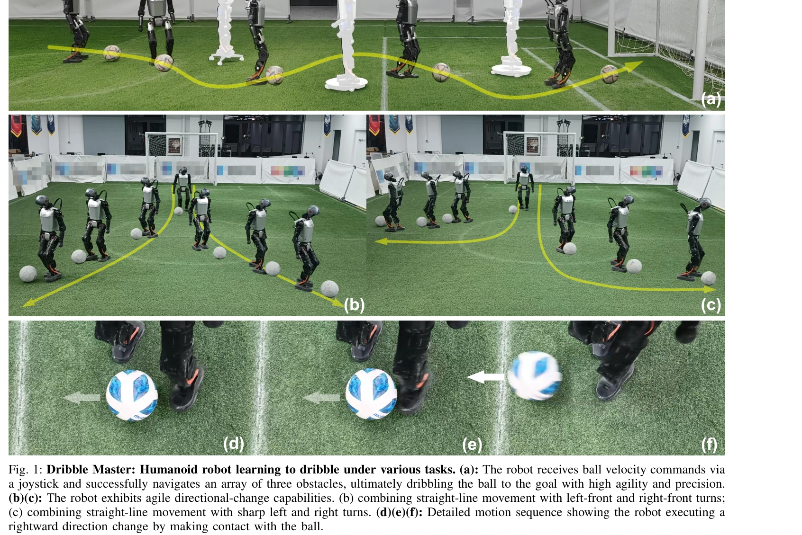

# Dribble Master: Learning Agile Humanoid Dribbling through Legged Locomotion

> **저자**: Zhuoheng Wang, Jinyin Zhou, Qi Wu | **날짜**: 2025-05-19 | **URL**: [https://arxiv.org/abs/2505.12679](https://arxiv.org/abs/2505.12679)

---

## Essence

*Fig. 1: Dribble Master: Humanoid robot learning to dribble under various tasks. (a): The robot receives ball velocity co*

두 단계 curriculum learning과 virtual camera 모델을 이용하여 humanoid 로봇이 시뮬레이션에서 학습한 드리블링 정책을 실제 로봇에 성공적으로 전이하는 방법을 제안한다.

## Motivation

- **Known**: Humanoid 로봇의 동적 보행은 RL로 성공적이며, quadruped 로봇은 드리블링 기술을 습득했다. 그러나 인간형 로봇의 지속적이고 민첩한 드리블링은 동적 균형 유지와 정밀한 볼 조작의 어려움으로 덜 탐구되었다.
- **Gap**: 기존 humanoid soccer 연구는 시뮬레이션 환경에 한정되거나 이산적인 킹 동작만 가능했으며, 다양한 실제 지형에서 연속적인 드리블링을 수행하는 학습 기반 방법이 부족했다.
- **Why**: Humanoid 로봇이 실제 환경에서 복잡한 loco-manipulation 작업을 수행할 수 있다면 로봇공학의 실용성을 크게 향상시킬 수 있으며, 이는 RL의 가능성을 입증한다.
- **Approach**: Two-stage curriculum learning으로 기본 보행 학습 후 드리블링 미세조정을 수행하고, virtual camera 모델과 active sensing 보상을 통해 현실적인 시각 제약을 학습에 반영한다.

## Achievement

*Fig. 1: Dribble Master: Humanoid robot learning to dribble under various tasks. (a): The robot receives ball velocity co*

- **Two-stage curriculum learning 프레임워크**: 불안정한 접촉과 희소 보상 문제를 해결하여 단계적 학습을 통해 드리블링 기술 습득
- **Virtual camera 모델**: 실제 로봇의 시야각과 지각 제약을 시뮬레이션에서 구현하여 현실적인 볼 인식 학습 가능
- **Active sensing 보상**: 시각 범위 확대와 불연속적 지각에 대한 강건성 향상
- **실제 로봇 전이 성공**: Booster T1 humanoid 로봇에서 다양한 지형 환경에서 민첩하고 정밀한 드리블링 시연 (학습 기반 방법으로는 최초)

## How

*Fig. 2: System Architecture of Dribble Master. In the phase of training in simulation, we use a two-stage learning appro*

- **상태 공간**: 볼 속도 명령, proprioception (관절 위치/속도, 신체 방향), 시계 신호로 구성
- **행동 공간**: 14차원으로 머리(2-DOF)와 다리(12-DOF) 관절 목표 위치 제어
- **두 단계 보상 함수**: 1단계는 기본 보행, 2단계는 세밀한 볼 조작 보상
- **Virtual camera 모델**: 렌즈 왜곡, 시야각 제약 시뮬레이션
- **Active sensing 보상**: 볼이 시야 범위 내 있을 때 추가 보상으로 광각 탐색 유도
- **PPO 알고리즘**: Asymmetric actor-critic 아키텍처로 훈련 시 privileged information 활용

## Originality

- Humanoid 로봇의 발을 이용한 continuous loco-manipulation의 첫 번째 학습 기반 구현
- 실제 카메라 제약을 시뮬레이션에서 모델링하는 virtual camera 접근법
- Active sensing을 드리블링 학습에 명시적으로 통합한 새로운 보상 설계
- Ball velocity 명령 기반의 직관적 제어 목표 설정

## Limitation & Further Study

- 논문에서 제시된 정량적 비교 평가가 제한적 (전통적 방법과의 직접 비교 부족)
- 다양한 공의 특성(크기, 무게, 표면)에 대한 일반화 성능 미검증
- Real-to-sim gap에 대한 상세한 분석 부족
- 계산 복잡도와 배포 시 실시간 성능에 대한 정보 없음
- **후속연구**: (1) 다양한 humanoid 플랫폼으로의 확대, (2) 멀티-에이전트 협력 드리블링, (3) 복잡한 동적 환경(풍속, 야외 지형)에서의 성능 개선

## Evaluation

- Novelty: 4/5
- Technical Soundness: 3/5
- Significance: 4/5
- Clarity: 4/5
- Overall: 4/5

**총평**: 본 논문은 humanoid 로봇의 지속적이고 민첩한 드리블링을 최초로 실현한 의미 있는 연구로, 현실적 시각 제약 모델링과 실제 로봇 전이 성공은 높은 가치가 있다. 다만 정량적 평가와 방법의 일반화 가능성 검증이 보강되면 더욱 완성도 있을 것이다.
