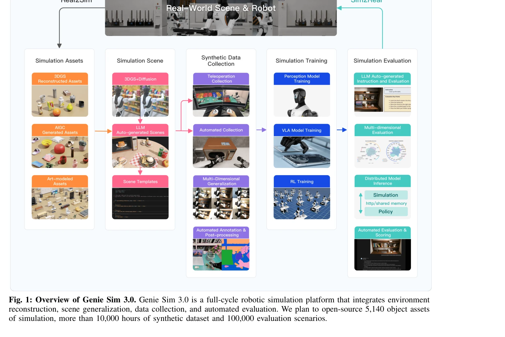

# DualTHOR: A Dual-Arm Humanoid Simulation Platform for Contingency-Aware Planning

> **저자**: Boyu Li, Siyuan He, Hang Xu, Haoqi Yuan, Yu Zang, Liwei Hu, Junpeng Yue, Zhenxiong Jiang, Pengbo Hu, Börje F. Karlsson, Yehui Tang, Zongqing Lu | **날짜**: 2025-06-19 | **URL**: [https://arxiv.org/abs/2506.16012](https://arxiv.org/abs/2506.16012)

---

## Essence

*Fig. 1: Overview of Genie Sim 3.0. Genie Sim 3.0 is a full-cycle robotic simulation platform that integrates environment*

DualTHOR는 복잡한 dual-arm humanoid 로봇을 위한 physics 기반 시뮬레이션 플랫폼으로, 실제 로봇 자산, contingency 메커니즘, inverse kinematics 솔버를 포함하여 현실 세계 시나리오로의 전이성을 향상시킨다.

## Motivation

- **Known**: 최근 시뮬레이션 플랫폼들이 Vision Language Model(VLM) 학습을 위한 태스크 다양성을 크게 향상시켰으나, 대부분 간소화된 로봇 형태와 낮은 수준의 실행의 확률적 특성을 무시한다.
- **Gap**: 현존하는 플랫폼들은 simplified robot morphologies에 의존하고 stochastic low-level execution의 실패 시나리오를 반영하지 못하여 실제 로봇으로의 전이 능력이 제한되어 있다.
- **Why**: dual-arm coordination과 contingency-aware planning 능력은 실제 가정용 환경에서의 복잡한 상호작용 태스크를 수행하는 데 필수적이며, 이를 평가하기 위한 신뢰할 수 있는 시뮬레이션 환경이 필요하다.
- **Approach**: AI2-THOR의 확장 버전을 기반으로 real-world robot assets, dual-arm collaboration task suite, humanoid inverse kinematics solver, 그리고 physics 기반 execution failure를 포함하는 contingency mechanism을 통합한 DualTHOR 플랫폼을 개발했다.

## Achievement

- **Real-world 시뮬레이션 충실도**: 실제 로봇 자산과 physics 기반 low-level execution을 통해 sim-to-real gap을 감소시킴
- **Dual-arm 협력 평가**: dual-arm humanoid 로봇을 위한 전용 task suite 및 inverse kinematics solver 제공
- **Contingency 메커니즘**: 실행 실패와 stochastic 요소를 시뮬레이션에 포함시켜 현실적 평가 가능
- **VLM 성능 진단**: 현재 VLM의 dual-arm coordination 능력과 contingency 상황에서의 robustness 한계를 명확히 드러냄

## How

- AI2-THOR 플랫폼을 확장하여 dual-arm humanoid 로봇 지원
- Real-world robot assets 통합으로 시각적 및 물리적 충실도 향상
- Humanoid 로봇을 위한 inverse kinematics solver 구현
- Physics 기반 contingency mechanism으로 execution failure 시나리오 모델링
- Household environment에서의 interactive task suite 설계
- Extensive evaluation을 통해 VLM의 robustness와 generalization 평가

## Originality

- Dual-arm humanoid 로봇을 위한 specialized 시뮬레이션 플랫폼은 기존 평면적 조작 중심의 플랫폼과 차별화됨
- Physics 기반 contingency mechanism을 통한 현실적 failure 모델링은 기존 deterministic 시뮬레이션에서의 혁신
- Humanoid 로봇을 위한 inverse kinematics solver 통합으로 whole-body coordination 가능
- VLM을 embodied AI 평가의 중심으로 하는 평가 프레임워크 제시

## Limitation & Further Study

- 논문이 Genie Sim 3.0 본문을 포함하여 두 플랫폼의 구체적인 기술적 비교가 부족함
- Contingency mechanism의 구체적 구현 방식과 validation 세부사항이 abstract에서 미흡
- Real-world robot experiments를 통한 sim-to-real transfer 검증 부재
- Dual-arm coordination을 위한 구체적인 제어 알고리즘 설명 필요
- **후속연구**: 실제 humanoid 로봇에서의 검증, 더 복잡한 contingency scenario 모델링, multimodal perception 통합 필요

## Evaluation

- Novelty: 4/5
- Technical Soundness: 3/5
- Significance: 4/5
- Clarity: 3/5
- Overall: 3/5

**총평**: DualTHOR는 dual-arm humanoid 로봇과 contingency-aware planning을 위한 중요한 시뮬레이션 플랫폼을 제시하며, 현재 VLM의 한계를 명확히 드러내는 데 기여한다. 다만 기술적 세부사항과 실제 로봇 검증이 강화되면 더욱 영향력 있는 작업이 될 것이다.
