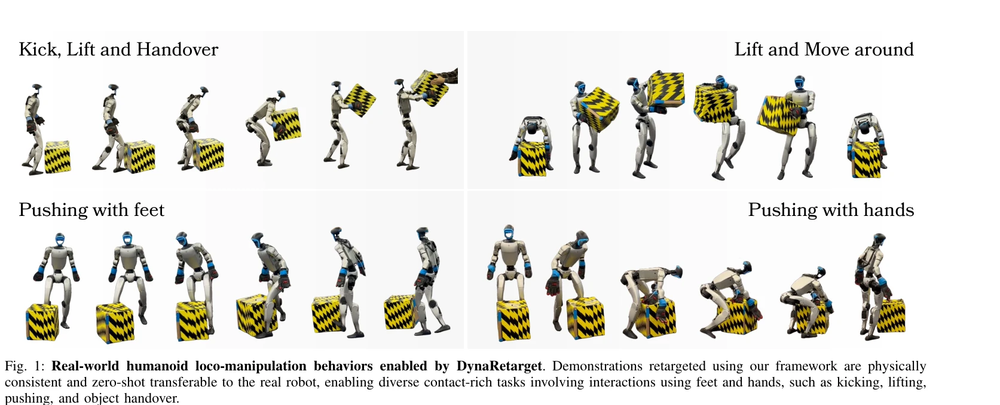

# DynaRetarget: Dynamically-Feasible Retargeting using Sampling-Based Trajectory Optimization

> **저자**: Victor Dhedin, Ilyass Taouil, Shafeef Omar, Dian Yu, Kun Tao, Angela Dai, Majid Khadiv | **날짜**: 2026-02-06 | **DOI**: [10.48550/arXiv.2602.06827](https://doi.org/10.48550/arXiv.2602.06827)

---

## Essence

*Fig. 2: DynaRetarget overview. Given a human–object demonstration, we first perform IK-based retargeting to obtain a kin*

DynaRetarget은 Sampling-Based Trajectory Optimization (SBTO)을 통해 운동학적으로 부정확한 인간 동작을 휴머노이드 로봇이 동적으로 실행 가능한 loco-manipulation 행동으로 변환하는 완전한 파이프라인을 제시한다.

## Motivation

- **Known**: 인간 동작을 휴머노이드 로봇에 retarget하는 방식은 IK 기반 최적화 또는 RL을 통해 연구되어 왔으며, 최근 SBMPC를 활용한 동적 정제 방법이 제안되었다.
- **Gap**: 기존 SBMPC 기반 방법은 짧은 horizon에서만 최적화하기 때문에 myopic하며, 장시간의 loco-manipulation 작업에서 동적 실행 가능성을 완전히 보장하지 못한다.
- **Why**: 대규모 휴머노이드 loco-manipulation 합성 데이터셋 생성은 실제 로봇 데이터 수집의 주요 병목이며, 동적으로 실행 가능한 trajectories가 RL 정책 학습과 현실 로봇 배포의 품질을 크게 향상시킨다.
- **Approach**: IK 기반 초기 retargeting을 수행한 후, SBTO 프레임워크가 optimization horizon을 점진적으로 확장하여 전체 trajectory에 대한 동적 가능성을 보장하고, 최종 궤적을 RL 정책 학습에 사용한다.

## Achievement

*Fig. 1: Real-world humanoid loco-manipulation behaviors enabled by DynaRetarget. Demonstrations retargeted using our fra*

- **첫 전체 horizon SBTO 방법**: 동적 실행 가능성을 보장하면서 긴 horizont을 처리하는 첫 sampling-based trajectory optimization 방법
- **높은 성공률**: 수백 개의 humanoid-object 시연에 대해 기존 최신 기술보다 훨씬 높은 retargeting 성공률 달성
- **강화된 RL 학습**: 동적으로 정제된 trajectories가 RL 정책 학습을 개선하고 다운스트림 작업 성능 향상
- **일반화 가능성**: 동일한 tracking objective로 질량, 크기, 기하학 등 다양한 물체 속성에 대해 일반화
- **현실 로봇 전이**: 수정된 motions이 sim-to-real 전이를 통해 실제 humanoid 로봇에서 zero-shot으로 이동 가능한 다양한 loco-manipulation 작업 실현 (kicking, lifting, pushing, handover)

## How

*Fig. 2: DynaRetarget overview. Given a human–object demonstration, we first perform IK-based retargeting to obtain a kin*

- IK 기반 retargeting으로 human skeleton을 humanoid 로봇의 kinematic 구조에 매핑
- Sampling-Based Trajectory Optimization (SBTO)에서 Cross-Entropy Method (CEM) 또는 Model Predictive Path Integral (MPPI) 활용
- Interpolation knots k를 샘플링하여 optimization space 축소 및 효율성 증대
- Horizon을 점진적으로 확장하는 incremental optimization 전략으로 초기 horizon h₀에서 시작하여 최종 full horizon T까지 도달
- Dynamics constraints (xt+1 = fdyn(xt, ut))를 명시적으로 만족하는 single-shooting 방식의 trajectory 롤아웃
- Contact-rich task를 위해 collision penalties와 contact 기반 reward terms 포함
- DeepMimic 스타일의 RL tracking controller로 domain randomization을 적용하여 sim-to-real 전이 수행

## Originality

- **첫 full-horizon SBTO retargeting**: 기존 SBMPC의 myopic receding horizon 문제를 해결하기 위해 incremental horizon expansion 도입
- **완전한 파이프라인**: kinematic retargeting에서 dynamic refinement, RL 학습, 실제 로봇 배포까지의 end-to-end 시스템 구축
- **물체 일반화**: 고정된 tracking objective만으로 다양한 object properties에 대한 강화된 generalization 능력
- **Contact-rich 작업 처리**: loco-manipulation에서 발과 손을 모두 사용하는 복잡한 contact interactions를 명시적으로 처리

## Limitation & Further Study

- **Computational complexity**: Full horizon optimization을 위한 incremental approach의 계산 비용 분석 및 scalability 논의 부족
- **Simulator dependency**: Black-box simulator에 의존하므로 simulator accuracy와 domain gap이 결과에 미치는 영향 미분석
- **Hyperparameter sensitivity**: σmin과 αΣ 같은 SBTO hyperparameters에 대한 민감도 분석이 제한적
- **Human morphology assumption**: 인간과 humanoid의 유사한 형태라는 가정이 다른 로봇 형태에 대한 적용성 제한
- **후속 연구 방향**: 더 복잡한 접촉 상황, 다중 객체 상호작용, 비정적 환경에서의 일반화 필요

## Evaluation

- Novelty: 4/5
- Technical Soundness: 3/5
- Significance: 4/5
- Clarity: 4/5
- Overall: 4/5

**총평**: DynaRetarget은 sampling-based trajectory optimization의 incremental horizon 확장 개념을 통해 humanoid loco-manipulation retargeting의 동적 실행 가능성 문제를 효과적으로 해결하며, 광범위한 실험과 실제 로봇 배포를 통해 그 효과를 입증한 의미 있는 기여이다.

## Related Papers

- 🏛 기반 연구: [[papers/2088_Make_Tracking_Easy_Neural_Motion_Retargeting_for_Humanoid_Wh/review]] — neural motion retargeting이 DynaRetarget의 인간 동작을 humanoid 실행 가능한 행동으로 변환하는 기본 원리를 제공한다.
- 🔄 다른 접근: [[papers/2126_Opt2Skill_Imitating_Dynamically-feasible_Whole-Body_Trajecto/review]] — Opt2Skill이 dynamically-feasible trajectory imitation을 다른 최적화 접근법으로 해결하여 DynaRetarget과 비교 연구가 가능하다.
- 🔗 후속 연구: [[papers/2021_Implicit_Kinodynamic_Motion_Retargeting_for_Human-to-humanoi/review]] — implicit kinodynamic motion retargeting이 DynaRetarget의 sampling-based 접근법을 암시적 표현으로 발전시켜 더 효율적인 변환을 가능하게 한다.
- 🔄 다른 접근: [[papers/1858_cuRoboV2_Dynamics-Aware_Motion_Generation_with_Depth-Fused_D/review]] — 동적 실행 가능성 보장을 위한 sampling-based trajectory optimization과 unified dynamics-aware motion generation의 서로 다른 최적화 접근법을 제시한다.
- 🔄 다른 접근: [[papers/1775_A_Closed-Form_Geometric_Retargeting_Solver_for_Upper_Body_Hu/review]] — DynaRetarget의 SBTO 기반 동작 변환과 closed-form 기하학적 리타겟팅은 서로 다른 인간-로봇 동작 변환 방식입니다.
- 🔄 다른 접근: [[papers/1628_PyRoki_A_Modular_Toolkit_for_Robot_Kinematic_Optimization/review]] — DynaRetarget의 샘플링 기반 동역학 타당성 보장 방법이 PyRoki의 최적화 기반 접근과 상호 보완적인 대안을 제시한다.
- 🔄 다른 접근: [[papers/1858_cuRoboV2_Dynamics-Aware_Motion_Generation_with_Depth-Fused_D/review]] — 고자유도 로봇의 동역학 인식 운동 생성에서 unified framework와 sampling-based trajectory optimization의 서로 다른 최적화 접근법을 보여준다.
- 🏛 기반 연구: [[papers/2021_Implicit_Kinodynamic_Motion_Retargeting_for_Human-to-humanoi/review]] — 동적 타당성을 고려한 모션 리타겟팅의 이론적 기반을 제공하는 샘플링 기반 방법론
