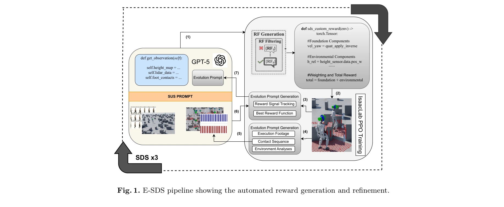
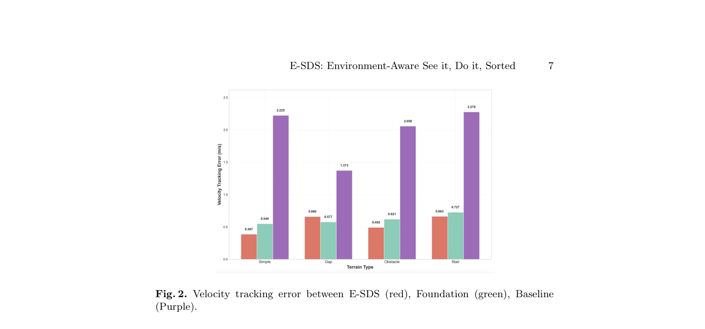

# E-SDS: Environment-aware See it, Do it, Sorted - Automated Environment-Aware Reinforcement Learning for Humanoid Locomotion

> **저자**: Enis Yalcin, Joshua O'Hara, Maria Stamatopoulou, Chengxu Zhou, Dimitrios Kanoulas | **날짜**: 2025-12-18 | **URL**: [https://arxiv.org/abs/2512.16446](https://arxiv.org/abs/2512.16446)

---

## Essence

*Fig. 1. E-SDS pipeline showing the automated reward generation and refinement.*

E-SDS는 Vision-Language Model과 실시간 지형 센서 분석을 통합하여 휴머노이드 로봇의 환경 인식 보행 정책을 자동으로 학습할 수 있는 프레임워크를 제시한다. 환경 통계 기반 보상 함수 자동 생성으로 수동 엔지니어링 시간을 대폭 단축하면서도 더 강건한 보행 정책을 실현한다.

## Motivation

- **Known**: VLM 기반 자동 보상 설계는 수동 엔지니어링의 부담을 줄였으나 환경 인식이 부족하며, 반대로 지형 센서 기반 지각형 보행 제어는 강건하지만 여전히 수동 보상 설계를 요구한다.
- **Gap**: 기존 자동화 방법은 환경 인식 없이 작동하고, 지각형 보행 제어는 여전히 수동 보상 튜닝에 의존하여 두 방향이 통합되지 못했다.
- **Why**: 휴머노이드 로봇의 복잡한 지형 보행 능력 확보와 보상 엔지니어링 시간 단축은 실제 로봇 시스템 배포의 핵심 장애물이기 때문이다.
- **Approach**: E-SDS는 VLM 기반 SUS 프롬팅을 확장하여 Environment Analysis Agent를 도입하고, 시뮬레이션 내 1000개 로봇을 배치하여 수집한 지형 통계(장애물 밀도, 갭 비율 등)를 프롬팅에 통합함으로써 환경 인식 보상 함수를 자동 생성한다.

## Achievement

*Fig. 2. Velocity tracking error between E-SDS (red), Foundation (green), Baseline*

- **계단 하강 성공**: E-SDS는 유일하게 계단 하강을 완료했으며, 수동 설계 또는 비지각형 자동 기준선은 실패했다.
- **속도 추적 오차 감소**: 모든 지형에서 51.9-82.6% 속도 추적 오차 감소를 달성했다.
- **엔지니어링 시간 단축**: 보상 설계 시간을 수일에서 2시간 미만으로 단축했다.
- **다양한 지형 평가**: 단순, 갭, 장애물, 계단 등 4개 지형에서 평가하여 일반화 능력을 입증했다.

## How

*Fig. 1. E-SDS pipeline showing the automated reward generation and refinement.*

- Grid-Frame Prompting으로 동영상을 프레임 그리드로 인코딩한다.
- SUS(See it, Understand it, Sorted) 프롬팅 전략으로 Contact Sequence, Gait, Task Requirement를 추출한다.
- Environment Analysis Agent가 1000개 로봇 시뮬레이션(10초)으로 장애물 밀도, 갭 비율, 지형 거칠기 등 통계를 계산한다.
- 환경 통계와 행동 설명을 결합한 프롬팅을 VLM(GPT-5)에 전달하여 Python 보상 함수 코드를 생성한다.
- 생성된 보상 함수로 Isaac Lab에서 PPO 기반 RL 훈련을 수행한다.
- 훈련 피드백(실패 모드, 보상 신호 추적)으로 반복 개선하는 폐루프 프로세스를 구현한다.

## Originality

- VLM 기반 자동 보상 생성과 환경 인식 제어를 처음으로 통합한 프레임워크이다.
- Environment Analysis Agent를 도입하여 정량적 지형 통계를 프롬팅에 직접 조건화하는 새로운 접근법이다.
- 다중 에이전트 VLM 시스템과 대규모 병렬 센서 시뮬레이션을 결합한 독창적 설계이다.
- 보행 피드백과 학습 신호를 활용한 자동 반복 개선 프로세스를 제시한다.

## Limitation & Further Study

- GPT-5 접근 제약: 논문 작성 시점 GPT-5 이용 가능성 불명확하여 재현성 우려가 있다.
- 계산 비용: 1000개 로봇 시뮬레이션(매 반복마다)의 계산 비용이 상세히 분석되지 않았다.
- 일반화 한계: Unitree G1 단일 로봇에서만 평가되어 다른 플랫폼 이전성 미확인이다.
- 지형 다양성: 평가 지형이 시뮬레이션 환경 4개로 제한적이며 실제 야외 환경 성능 미검증이다.
- 후속 연구: 실제 로봇 하드웨어에서의 sim-to-real transfer, 더 복잡한 복합 지형 평가, VLM 모델 의존성 완화 필요하다.

## Evaluation

- Novelty: 4/5
- Technical Soundness: 3/5
- Significance: 4/5
- Clarity: 4/5
- Overall: 4/5

**총평**: E-SDS는 VLM 기반 자동 보상 설계와 환경 인식 지각형 제어를 혁신적으로 통합하여 휴머노이드 보행의 자동화 및 강건성을 획기적으로 개선했다. 다만 최신 VLM 모델 의존성, 계산 비용, 실제 하드웨어 검증 부재 등은 실용화를 위한 과제로 남아있다.
