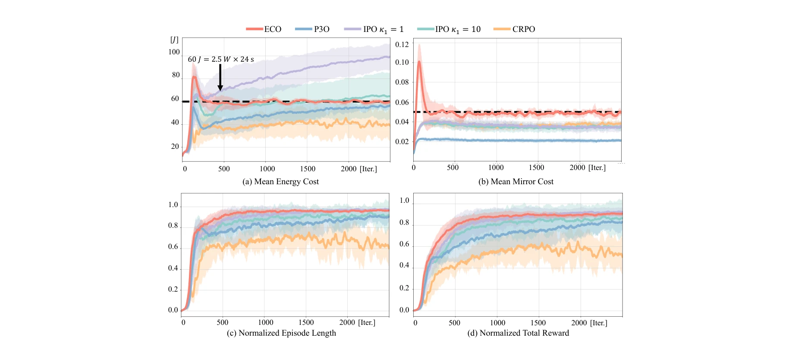
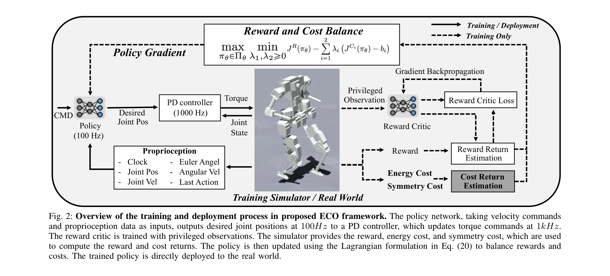

# ECO: Energy-Constrained Optimization with Reinforcement Learning for Humanoid Walking

> **저자**: Weidong Huang, Jingwen Zhang, Jiongye Li, Shibowen Zhang, Jiayang Wu, Jiayi Wang, Hangxin Liu, Yaodong Yang, Yao Su | **날짜**: 2026-02-06 | **URL**: [https://arxiv.org/abs/2602.06445](https://arxiv.org/abs/2602.06445)

---

## Essence

*Fig. 1: Comparison between the proposed constrained RL frame-*

ECO는 에너지 소비를 보상 함수의 가중치가 아닌 명시적 부등식 제약 조건으로 reformulate한 constrained RL 프레임워크로, 휴머노이드 로봇의 에너지 효율적 보행을 달성한다.

## Motivation

- **Known**: MPC와 RL 기반 휴머노이드 보행 제어는 다중 목적 최적화에서 에너지 관련 메트릭을 보상에 포함시키며, 이는 광범위한 하이퍼파라미터 튜닝이 필요하고 하위 최적 정책을 초래한다.
- **Gap**: 기존 방법들은 에너지 최소화와 안정성 간 충돌하는 목표를 동시에 최적화하려 하여 직관적이지 않은 튜닝 프로세스와 수렴 실패 문제가 발생한다.
- **Why**: 휴머노이드 로봇의 실제 응용에서 연속 운영을 위해 안정적이고 에너지 효율적인 보행이 필수적이며, 에너지 효율 향상은 작동 범위와 지속성을 크게 증대시킨다.
- **Approach**: ECO는 에너지 소비 및 참조 모션을 명시적 제약 조건으로 분리하고 Lagrangian 방법으로 강제하여, 에너지 제약 임계값을 선형 탐색으로 직관적으로 튜닝한다.

## Achievement

*Fig. 3: Comparison of training metrics for ECO, P3O, IPO, and CRPO. The energy consumption and mirror reference motion t*

- **에너지 효율성 혁신**: MPC 대비 약 6배, PPO 대비 2.3배 낮은 에너지 소비를 달성하며 robust한 보행 성능 유지
- **직관적 하이퍼파라미터 튜닝**: 에너지 제약을 명시적으로 표현하여 물리적 의미가 명확하고 선형 탐색 기반 튜닝 프로세스로 효율성 향상
- **Emergent 행동 발현**: extended knee movements, lighter steps, reduced body shaking 등 설계되지 않은 에너지 효율적 행동 자동 생성
- **실제 하드웨어 검증**: BRUCE 휴머노이드 로봇에서 sim-to-real transfer를 통해 첫 constrained RL 기반 에너지 효율 보행 달성
- **Constrained RL 분석**: PPO-Lagrangian이 네 가지 constrained RL 알고리즘 중 가장 빠른 수렴과 안정적 제약 강제 성능 입증

## How

*Fig. 2: Overview of the training and deployment process in proposed ECO framework. The policy network, taking velocity c*

- Constrained RL formulation으로 에너지 소비를 보상에서 분리하여 명시적 부등식 제약으로 reformulate
- Lagrangian 방법을 통해 에너지 소비 제약과 참조 모션 제약을 강제
- 선형 탐색 알고리즘으로 에너지 제약 임계값을 incrementally 조정하는 물리 직관적 튜닝 프로세스 수행
- PPO-Lagrangian 알고리즘 적용으로 빠르고 안정적인 수렴 달성
- 시뮬레이션에서 4개 constrained RL 알고리즘 및 다양한 제약 설정 비교 평가
- sim-to-sim 및 sim-to-real transfer를 통해 BRUCE 로봇 플랫폼에서 실제 검증

## Originality

- 에너지를 다중 목적 보상 항이 아닌 명시적 부등식 제약으로 reformulate한 novel한 접근법
- 선형 탐색 기반의 직관적이고 물리적으로 해석 가능한 하이퍼파라미터 튜닝 방법론 제시
- Constrained RL을 실제 휴머노이드 로봇에 처음으로 적용한 실험적 기여
- 제약 선택과 학습 설정에 대한 실증적 분석으로 constrained RL 연구에 대한 통찰 제공

## Limitation & Further Study

- 선형 탐색 기반 튜닝은 여전히 수동 프로세스이며 자동화된 제약 임계값 결정 방법이 부재
- BRUCE는 kid-sized 휴머노이드이므로 adult-sized 로봇으로의 확장 가능성 미검증
- 다양한 지형(slippery, inclined surfaces)에서의 강건성이 제한적으로 평가됨
- Loco-manipulation 작업에서의 emergent 행동(lighter steps, reduced body shaking) 정량적 이점 측정 부재
- 제약 다중화(multi-constraint) 시나리오에서의 확장성과 성능 trade-off 분석 필요

## Evaluation

- Novelty: 4/5
- Technical Soundness: 3/5
- Significance: 4/5
- Clarity: 4/5
- Overall: 4/5

**총평**: ECO는 에너지 최적화를 constrained RL로 reformulate한 novel한 접근법으로 휴머노이드 보행의 에너지 효율성에서 획기적 성과를 달성했으며, 실제 로봇 플랫폼 검증과 constrained RL에 대한 실증적 분석은 로봇 공학 및 최적 제어 커뮤니티에 중대한 기여를 한다.

## Related Papers

- 🔄 다른 접근: [[papers/1709_The_Duke_Humanoid_Design_and_Control_For_Energy_Efficient_Bi/review]] — 에너지 효율적인 휴머노이드 보행에서 constrained RL과 하드웨어 설계 최적화라는 서로 다른 에너지 효율성 접근법을 제시한다.
- 🏛 기반 연구: [[papers/2065_Learning_Symmetric_and_Low-energy_Locomotion/review]] — ECO의 에너지 제약 조건 최적화가 symmetric and low-energy locomotion의 기본적인 에너지 효율성 원리와 일치한다.
- 🏛 기반 연구: [[papers/1671_SHIELD_Safety_on_Humanoids_via_CBFs_In_Expectation_on_Learne/review]] — SHIELD의 CBF 기반 안전성 보장 방법론이 ECO의 에너지 제약 조건을 안전하게 강제하는 기술적 기반을 제공한다.
- 🔄 다른 접근: [[papers/1623_Preference-Conditioned_Multi-Objective_RL_for_Integrated_Com/review]] — 다목적 강화학습을 통한 통합 제어 접근 방식으로, 에너지 효율성과 다른 목표들 간의 균형을 다른 관점에서 다룬다.
- 🏛 기반 연구: [[papers/1677_SKATER_Synthesized_Kinematics_for_Advanced_Traversing_Effici/review]] — 에너지 효율적인 traversal이 에너지 제약 최적화 강화학습의 실제 적용 사례입니다.
