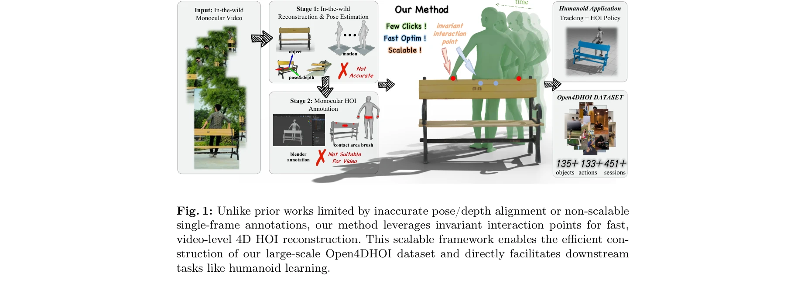

# Efficient and Scalable Monocular Human-Object Interaction Motion Reconstruction

> **저자**: Boran Wen, Ye Lu, Sirui Wang, Keyan Wan, Jiahong Zhou, Junxuan Liang, Xinpeng Liu, Bang Xiao, Ruiyang Liu, Yong-Lu Li | **날짜**: 2025-11-30 | **URL**: [https://arxiv.org/abs/2512.00960](https://arxiv.org/abs/2512.00960)

---

## Essence

*Fig. 1: Unlike prior works limited by inaccurate pose/depth alignment or non-scalable*

단안 비디오에서 4D 인간-물체 상호작용(HOI) 데이터를 효율적으로 추출하기 위해 sparse contact annotation paradigm과 human-in-the-loop 데이터 엔진을 제안하고, 4DHOISolver 최적화 프레임워크를 통해 시공간적으로 일관성 있는 재구성을 수행한다.

## Motivation

- **Known**: 기존 다중 센서 기반 HOI 캡처 시스템(BEHAVE 등)은 높은 정밀도를 제공하지만 비용과 확장성 문제가 있으며, 단안 이미지 기반 방법들(Open3DHOI, PICO)은 물리적 정확성과 시간적 일관성 부재 문제가 있다.
- **Gap**: 단안 동영상에서 정확하고 확장 가능한 4D HOI 데이터 추출이 미해결 과제이며, 기존 annotation 전략은 비디오 시퀀스에서 프레임 간 시공간적 일관성을 강제하기 어렵다.
- **Why**: 로봇이 다양한 실제 환경에서 견고하게 작동하려면 대규모 HOI 데이터가 필수이고, 인터넷 동영상은 거의 무한의 다양한 활동, 물체, 환경을 포함하므로 이를 효율적으로 활용할 수 있다면 로봇 학습에 혁신적 영향을 미칠 수 있다.
- **Approach**: 시간적으로 불변인 interaction point 쌍에 대한 lightweight annotation과 multi-modal 접촉 예측기 InterPoint를 통한 human-in-the-loop 데이터 엔진으로 annotation 비용을 감소시키고, 두 단계의 4DHOISolver 최적화 프레임워크(기하 정렬 + 물리적 타당성 정제)로 고품질 재구성을 달성한다.

## Achievement

- **InterPoint 예측기**: 자동으로 인간-물체 접촉 쌍을 제안하고 데이터 피드백 루프를 통해 점진적으로 개선되는 human-in-the-loop 데이터 엔진 개발
- **4DHOISolver 프레임워크**: sparse contact point annotation으로 제약된 두 단계 최적화(least-squares 기하 정렬 + gradient 기반 물리 정제)를 통해 시공간적으로 일관성 있는 고품질 4D HOI 재구성 달성
- **Open4DHOI 데이터셋**: 451개 비디오, 135개 물체 카테고리, 133개 행동을 포함하는 대규모 4D HOI 데이터셋 구축 및 공개
- **RL 기반 응용**: contact-guided reward function을 통해 학습된 RL 에이전트가 복잡한 HOI 모션 모방에 성공, 데이터셋의 로봇 학습 유용성 검증

## How

- 단계 1: SAM 3D Objects와 GVHMR을 이용한 자동화된 4D 재구성 파이프라인 구성 (tracking → 3D reconstruction → depth-aware alignment)
- 단계 2: annotation app을 통해 비디오 레벨에서 시간적으로 불변인 interaction point를 효율적으로 주석 처리
- 단계 3: InterPoint multi-modal 예측기가 모달별 feature를 결합하여 초기 접촉 쌍을 자동 제안, human validation으로 피드백 루프 형성
- 단계 4: 4DHOISolver의 least-squares 기하 정렬로 빠른 초기화 후, gradient 기반 최적화로 물리적 타당성(penetration, contact quality) 정제
- 단계 5: 재구성된 HOI 데이터로 training하는 RL 에이전트에 contact-guided reward function 적용하여 다운스트림 응용 검증

## Originality

- dense contact map 대신 sparse discrete contact point로 전환하여 annotation 효율성과 확장성을 획기적으로 개선한 paradigm shift
- 시간적으로 불변인 interaction point를 활용한 novel annotation 전략으로 비디오 시퀀스의 시공간적 일관성을 자연스럽게 보장
- human-in-the-loop data engine의 positive feedback loop 설계로 데이터 엔진이 자동으로 개선되는 혁신적 scalability 메커니즘
- sparse annotation 기반의 두 단계 최적화 프레임워크(geometric alignment + physical refinement)로 효율성과 정확성의 균형 달성
- contact-guided reward function을 통해 4D HOI 데이터의 로봇 학습 유용성을 직접 검증하는 end-to-end 평가 방식

## Limitation & Further Study

- 단일 카메라 모노큘러 설정으로 인한 occlusion 문제 - 인간과 물체의 겹침이 심한 상황에서 정확도 저하 가능성
- sparse contact point annotation의 충분성 검증 부족 - dense contact 정보가 필요한 특정 작업에서의 성능 미평가
- InterPoint의 초기 성능이 낮을 경우 human annotation 부담이 여전할 수 있는 cold-start 문제
- Open4DHOI 데이터셋의 도메인 편향 - 특정 물체/행동 카테고리의 불균형 분포 가능성
- 후속 연구: multi-view 또는 depth sensor 활용한 하이브리드 접근법, dense contact refinement 모듈 추가, 더 다양한 도메인의 데이터 확충, 다른 downstream task(grasp prediction, trajectory forecasting)에서의 검증

## Evaluation

- Novelty: 4/5
- Technical Soundness: 3/5
- Significance: 4/5
- Clarity: 4/5
- Overall: 4/5

**총평**: 이 논문은 단안 비디오에서 4D HOI 데이터 수집의 annotation 병목을 sparse contact point와 human-in-the-loop 엔진으로 혁신적으로 해결하고, 4DHOISolver를 통해 시공간적 일관성을 유지하면서 대규모 고품질 데이터셋 Open4DHOI를 구축했다. 로봇 학습의 데이터 병목을 실질적으로 해결하는 높은 실용성과 완성도로 컴퓨터 비전 및 로봇 학습 분야에 중대한 기여를 한다.

## Related Papers

- 🔄 다른 접근: [[papers/1857_CRISP_Contact-Guided_Real2Sim_from_Monocular_Video_with_Plan/review]] — 단안 비디오 기반 인간-물체 상호작용 재구성에서 4D HOI 최적화와 planar primitive 기반 접근법의 서로 다른 기하학적 모델링 전략을 비교한다.
- 🔗 후속 연구: [[papers/2148_TokenHSI_Unified_Synthesis_of_Physical_Human-Scene_Interacti/review]] — 4DHOISolver의 시공간적 일관성 재구성이 TokenHSI의 unified human-scene interaction synthesis로 발전하여 더 포괄적인 상호작용 모델링을 제공한다.
- 🔄 다른 접근: [[papers/1856_CReF_Cross-modal_and_Recurrent_Fusion_for_Depth-conditioned/review]] — CReF의 깊이 조건부 cross-modal fusion 방법이 단안 비디오 기반 HOI 재구성에 대한 다른 기술적 접근을 제시한다.
- 🔗 후속 연구: [[papers/2022_In-N-On_Scaling_Egocentric_Manipulation_with_in-the-wild_and/review]] — In-N-On의 실제 환경 egocentric 조작 스케일링 연구가 4D HOI 재구성 데이터를 실제 로봇 학습에 활용하는 확장 방향을 제시한다.
- 🔗 후속 연구: [[papers/1751_Visual_Imitation_Enables_Contextual_Humanoid_Control/review]] — 효율적이고 확장 가능한 단안 인간-객체 상호작용 모델링을 휴머노이드 제어로 확장하여 단순한 휴대폰 영상에서 복잡한 맥락적 제어를 실현했다.
- 🔄 다른 접근: [[papers/1857_CRISP_Contact-Guided_Real2Sim_from_Monocular_Video_with_Plan/review]] — 단안 비디오에서의 human-scene reconstruction에서 planar primitive 기반 접근법과 4D HOI 재구성의 서로 다른 기하학적 표현 방법을 제시한다.
