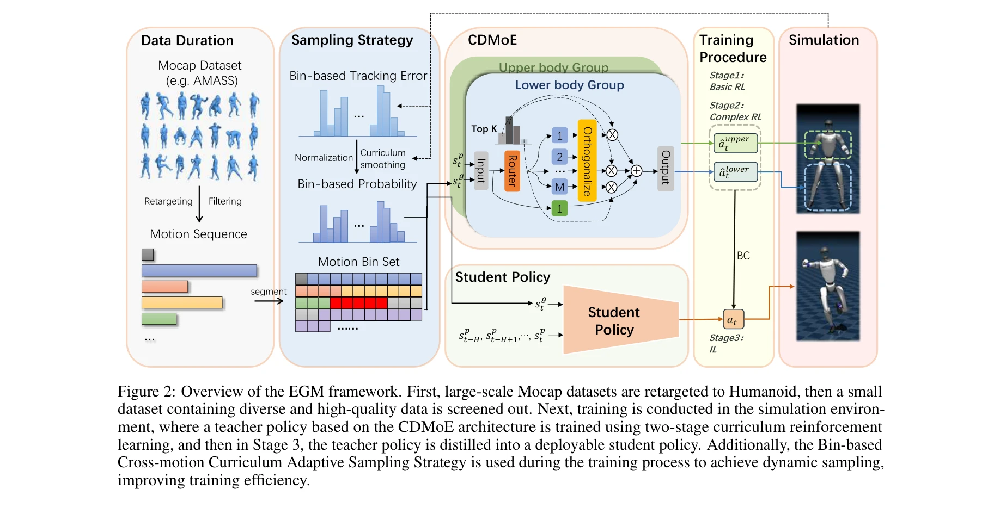
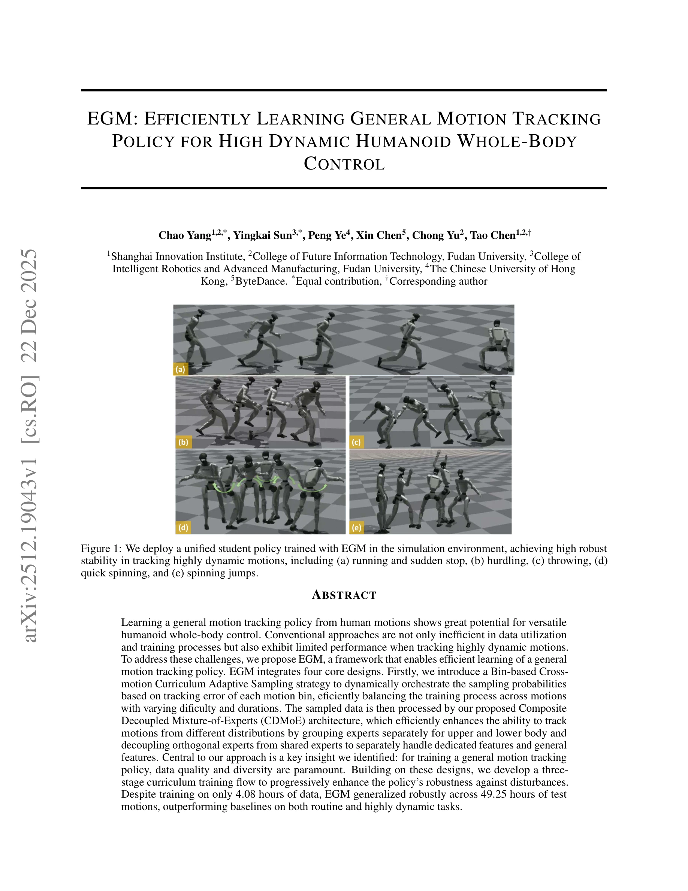

# EGM: Efficiently Learning General Motion Tracking Policy for High Dynamic Humanoid Whole-Body Control

> **저자**: Chao Yang, Yingkai Sun, Peng Ye, Xin Chen, Chong Yu, Tao Chen | **날짜**: 2025-12-22 | **DOI**: [10.48550/arXiv.2512.19043](https://doi.org/10.48550/arXiv.2512.19043)

---

## Essence

*Figure 2: Overview of the EGM framework. First, large-scale Mocap datasets are retargeted to Humanoid, then a small*

EGM은 Bin-based Cross-motion Curriculum Adaptive Sampling과 Composite Decoupled Mixture-of-Experts 아키텍처를 통해 4.08시간의 소량 데이터로 49.25시간의 다양한 모션을 효율적으로 추적하는 일반화된 휴머노이드 제어 정책을 학습한다.

## Motivation

- **Known**: DeepMimic 이후 humanoid motion tracking이 발전했으나, 대부분의 기존 방법은 단일 모션 추적에 국한되거나 대규모 mocap 데이터의 비효율성과 동적 모션 추적 성능 부족 문제를 해결하지 못했다.
- **Gap**: 기존 방법들은 AMASS 같은 대규모 데이터셋의 중복성과 불균형을 활용하지 못하며, 고도로 동적인 모션 추적 시 일반 특징과 전용 특징 간의 균형을 맞추지 못한다.
- **Why**: 다목적 휴머노이드 로봇의 실용적 가치는 다양한 모션 간의 seamless한 전환에 있으며, 데이터 효율성과 고도적 동작의 안정적 추적은 실제 배포에 필수적이다.
- **Approach**: 데이터 품질과 다양성을 우선시하는 세 단계 curriculum learning framework를 제안하며, motion bin별 추적 오류에 기반한 적응형 샘플링과 신체 부위별로 분리된 Mixture-of-Experts 아키텍처를 통합한다.

## Achievement

*Figure 1: We deploy a unified student policy trained with EGM in the simulation environment, achieving high robust*

- **Bin-based Cross-motion Curriculum Adaptive Sampling (BCCAS)**: motion bin의 추적 오류에 따라 동적으로 샘플링 확률을 조정하여 난이도와 지속시간이 다양한 모션들 간의 학습 균형을 효율적으로 달성
- **Composite Decoupled Mixture-of-Experts (CDMoE)**: 상체와 하체의 expert를 독립적으로 그룹화하고, 전용 expert와 공유 expert를 분리하여 dedicated feature와 general feature를 효과적으로 처리
- **세 단계 curriculum training flow**: 정책의 perturbation에 대한 robustness를 점진적으로 강화하여 다양한 모션 유형에서의 추적 성능 향상
- **데이터 효율성**: 4.08시간의 소량 학습 데이터로 49.25시간의 테스트 모션에서 robust하게 일반화되며, routine 및 highly dynamic task 모두에서 baseline 방법들을 능가

## How

*Figure 2: Overview of the EGM framework. First, large-scale Mocap datasets are retargeted to Humanoid, then a small*

- AMASS 같은 대규모 mocap 데이터를 motion bin으로 분할하고 각 bin의 추적 오류를 모니터링하여 샘플링 확률을 동적으로 조정
- 상체와 하체 제어의 다른 특성을 반영하여 CDMoE에서 신체 부위별 expert group을 분리
- orthogonal expert와 shared expert를 명시적으로 분리하여 motion-specific feature와 general feature(예: balance maintenance)를 동시에 학습
- PPO 알고리즘으로 privileged teacher policy를 단계적으로 학습하고, DAgger 알고리즘을 통해 deployable student policy로 distill
- data curation 단계에서 중복되거나 저품질 샘플을 필터링하여 고품질의 다양한 데이터만 선별

## Originality

- motion bin별 tracking error에 기반한 adaptive sampling은 기존의 단순한 imbalance correction 방식보다 더 정교한 curriculum learning 전략을 제시
- CDMoE 아키텍처의 신체 부위별 expert 분리와 orthogonal expert 분리는 MoE, OMoE 같은 기존 mixture-of-experts 방법들과 차별화된 새로운 구조
- dedicated feature와 general feature의 explicit decoupling이라는 통찰은 highly dynamic motion 추적에서의 안정성과 정확성 간의 trade-off를 새로운 방식으로 해결
- 소량 데이터(4.08시간)로 대규모 테스트셋(49.25시간)에 일반화되는 성과는 기존 방법들의 데이터 비효율성을 크게 개선

## Limitation & Further Study

- 연구는 simulation 환경에서의 성능만 검증되었으며, 실제 로봇(Unitree G1 등)에서의 sim-to-real transfer 성능에 대한 검증이 부재
- AMASS 데이터셋에 특화된 학습으로, 다른 종류의 mocap 데이터셋이나 매우 이질적인 모션 도메인에 대한 generalization 능력이 불명확
- teacher-student distillation 프레임워크에서 teacher policy의 성능이 상한선으로 작용하므로, teacher 학습의 효율성 개선 여지가 있음
- 각 motion bin의 최적 크기 설정과 BCCAS의 샘플링 확률 조정 메커니즘의 hyperparameter sensitivity에 대한 분석 부족
- 후속 연구로는 실제 로봇 배포 및 실시간 environment adaptation, 매우 새로운 모션 유형에 대한 online learning 능력 향상이 필요

## Evaluation

- Novelty: 4/5
- Technical Soundness: 3/5
- Significance: 4/5
- Clarity: 4/5
- Overall: 4/5

**총평**: EGM은 Bin-based adaptive sampling과 CDMoE 아키텍처의 새로운 조합으로 humanoid motion tracking의 데이터 효율성과 dynamic motion 성능을 획기적으로 개선하며, 소량 데이터 학습의 실용성을 입증하는 강력한 기여를 제시한다.
