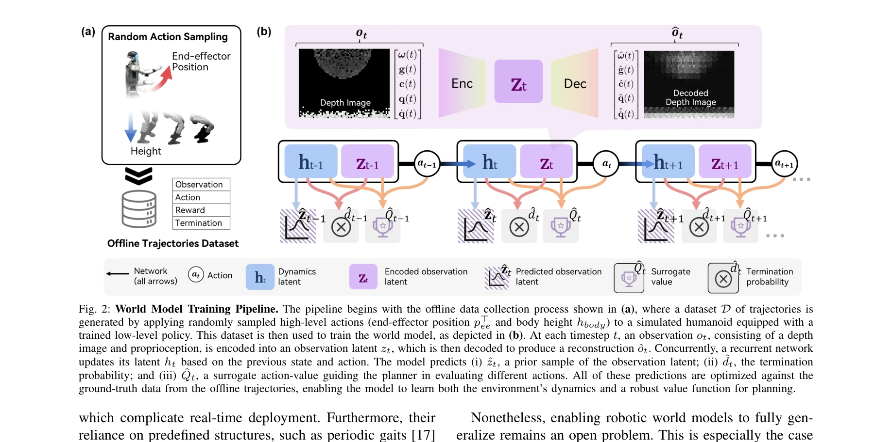
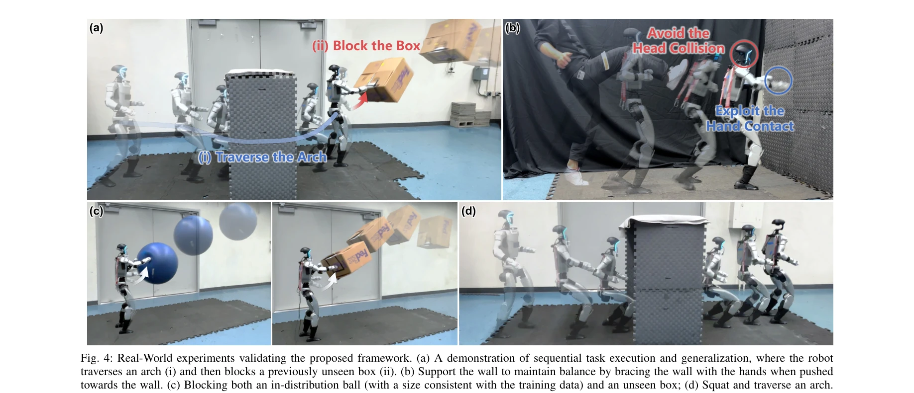

# Ego-Vision World Model for Humanoid Contact Planning

> **저자**: Hang Liu, Yuman Gao, Sangli Teng, Yufeng Chi, Yakun Sophia Shao, Zhongyu Li, Maani Ghaffari, Koushil Sreenath | **날짜**: 2026-03-08 | **DOI**: [10.48550/arXiv.2510.11682](https://doi.org/10.48550/arXiv.2510.11682)

---

## Essence

*Fig. 2: World Model Training Pipeline. The pipeline begins with the offline data collection process shown in (a), where *

휴머노이드 로봇이 접촉을 활용하는 지능형 계획을 수립하기 위해 학습된 world model을 sampling-based MPC와 결합한 프레임워크를 제안하며, 오프라인 데이터셋으로부터 압축된 latent space에서 미래 결과를 예측한다.

## Motivation

- **Known**: on-policy RL은 시각 입력을 포함할 때 샘플 비효율성이 높고 다중 작업 학습에 제한적이며, 전통적 최적화 기반 계획자는 접촉의 복잡성으로 어려움을 겪는다.
- **Gap**: 접촉이 풍부한 동역학에서 샘플 효율성을 유지하면서도 다중 작업 적응성을 갖춘 시각 기반 계획 방법의 부재, 특히 부분적이고 노이즈가 있는 센서 데이터로부터 관찰 불가능한 접촉 상태를 예측하는 일반화 문제.
- **Why**: 휴머노이드 로봇이 비구조화된 환경에서 자율성을 달성하려면 벽에 기대기, 물체 차단하기 등 의도적인 접촉 활용이 필수적이며, 이를 위해서는 샘플 효율성과 실시간 실행 가능성이 동시에 요구된다.
- **Approach**: 오프라인 데이터셋으로 world model과 surrogate value function을 동시에 학습한 후, value-guided sampling MPC를 통해 latent space에서 action sequence를 탐색하고 Cross-Entropy Method로 최적화한다.

## Achievement

*Fig. 4: Real-World experiments validating the proposed framework. (a) A demonstration of sequential task execution and g*

- **확장 가능한 시각 world model**: demonstration-free 오프라인 데이터셋만으로 다양한 접촉 작업의 동역학을 포괄적으로 학습
- **값 기반 계획 프레임워크**: surrogate value function을 통한 dense guidance로 sparse contact reward 문제 해결
- **실제 로봇 배포**: 고유 감각과 ego-centric depth image만으로 벽 지지, 물체 차단, 아치 통과 등 다양한 접촉 회피 기술 실현
- **샘플 효율성 및 다중 작업 능력**: 단일 model로 여러 작업을 수행하면서 on-policy RL 대비 향상된 샘플 효율성 달성

## How

*Fig. 2: World Model Training Pipeline. The pipeline begins with the offline data collection process shown in (a), where *

- 저수준 controller는 high-level command [v, p_ee, h_body]를 tracking하여 proprioceptive 피드백만으로 모터 제어 수행
- 오프라인 dataset D는 시뮬레이션에서 low-level policy에 무작위 high-level action을 적용하여 수집되며, 유한 차분으로 jittery 행동 제거
- World model은 observation encoder로 depth와 proprioception을 latent z_t로 변환하고, recurrent network가 동역학을 업데이트하며, 동시에 관찰 latent ẑ_t, 종료 확률 d̂_t, surrogate action-value Q̂_t 예측
- Value-guided MPC는 M=1024개의 후보 action sequence를 N=4 steps 계획 수평선에서 샘플링하고, world model의 예측값들로 각 궤적을 평가한 후 CEM으로 최적화
- 종료 확률이 0.9를 초과하면 해당 궤적의 이후 값들을 0으로 설정하여 로봇 실패(낙상) 예측

## Originality

- **demonstration-free 오프라인 학습**: 값비싼 demonstration 없이 무작위 action으로 수집한 오프라인 데이터로 world model 훈련
- **latent space planning with value guidance**: 원시 픽셀 예측이 아닌 압축된 latent space에서 planning하고 surrogate value function으로 dense guidance 제공하는 결합
- **end-to-end 접촉 회피 계획**: 관찰 불가능한 접촉 상태를 부분 관찰 센서 데이터로부터 암묵적으로 학습하여 예측
- **실제 휴머노이드에서 다중 접촉 작업**: 단일 model로 서로 다른 접촉 양식(벽, 물체, 아치)을 모두 처리

## Limitation & Further Study

- **단기 계획 수평선**: 4 steps의 제한된 계획 수평선은 장기 동작이나 순차적 접촉이 필요한 복잡한 작업에 확장 어려움
- **시뮬레이션-현실 갭**: 오프라인 데이터가 시뮬레이션에서 수집되므로 현실 세계의 접촉 역학, 마찰, 센서 노이즈와의 불일치 가능성
- **surrogate value function의 일반화**: 학습 데이터에 포함되지 않은 새로운 객체나 환경에서 value 예측의 신뢰성 미검증
- **계산 비용 분석 부재**: M=1024 샘플로 N=4 steps planning의 실제 계산 시간, 로봇 대역폭 요구사항 상세 분석 필요
- **후속 연구 방향**: (1) 더 긴 계획 수평선을 위한 hierarchical planning, (2) 시뮬-현실 전이를 위한 domain randomization 또는 fine-tuning, (3) 새로운 작업에 대한 적응적 value function 업데이트, (4) 타 로봇 플랫폼으로의 일반화

## Evaluation

- Novelty: 4/5
- Technical Soundness: 3/5
- Significance: 4/5
- Clarity: 4/5
- Overall: 4/5

**총평**: 휴머노이드의 접촉 활용 계획을 위해 world model과 value-guided MPC를 효과적으로 결합하여 샘플 효율성과 다중 작업 능력을 동시에 달성한 우수한 연구로, 실제 로봇 배포를 통해 실용성을 입증했으나 계획 수평선 제약과 시뮬-현실 갭에 대한 추가 분석이 필요하다.
