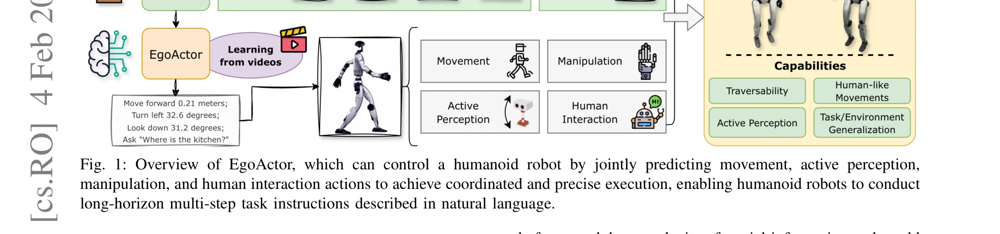
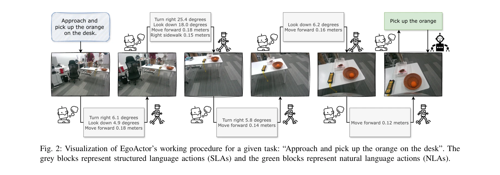
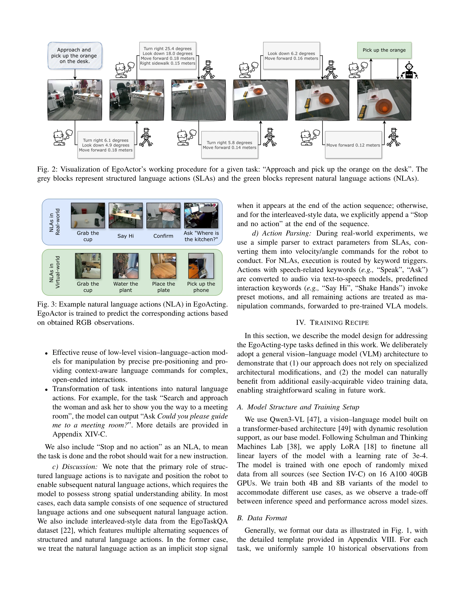

# EgoActor: Grounding Task Planning into Spatial-aware Egocentric Actions for Humanoid Robots via Visual-Language Models

> **저자**: Yu Bai, MingMing Yu, Chaojie Li, Ziyi Bai, Xinlong Wang, Börje F. Karlsson | **날짜**: 2026-02-04 | **URL**: [https://arxiv.org/abs/2602.04515](https://arxiv.org/abs/2602.04515)

---

## Essence

*Fig. 1: Overview of EgoActor, which can control a humanoid robot by jointly predicting movement, active perception,*

EgoActor는 VLM 기반의 통합 모델로서 고수준 자연어 명령어를 휴머노이드 로봇의 저수준 공간 인식 동작(보행, 조작, 지각, 인간-로봇 상호작용)으로 직접 변환하는 EgoActing 태스크를 제안한다.

## Motivation

- **Known**: VLM 기반 구체화 에이전트들이 자연어를 로봇 동작으로 변환하는 연구가 진행되어 왔으며, 모바일 조작과 vision-language navigation도 개별적으로 발전해왔다.
- **Gap**: 기존 접근법들은 사전 정의된 스킬 라이브러리에 의존하거나 특정 태스크에만 집중하므로, 휴머노이드 로봇의 복잡한 구체화와 보행·조작·지각·인간 상호작용의 유기적 조정이 부족하다.
- **Why**: 휴머노이드 로봇을 실제 환경에 배치하려면 불완전한 정보 관찰 하에서 인식, 이동, 조작을 통합하면서도 부분 작업 간 견고한 전환이 필요한데, 이는 고차원적 태스크 계획과 저수준 모터 제어의 간극을 메우는 것이 핵심이다.
- **Approach**: EgoActor는 실제 시연, 공간 추론 QA, 시뮬레이션 데이터를 활용한 광범위한 감시 학습을 통해 이동 원시 동작, 헤드 움직임, 조작 명령, 인간-로봇 상호작용을 통합 예측하는 VLM을 구축하며, 8B와 4B 모델 모두 1초 이내의 추론 지연으로 실시간 제어를 가능하게 한다.

## Achievement

*Fig. 2: Visualization of EgoActor’s working procedure for a given task: “Approach and pick up the orange on the desk”. T*

- **새로운 태스크 정의**: EgoActing이라는 태스크를 제안하여 자연어 명령어를 에고센트릭 관찰 기반의 실행 가능한 동작 시퀀스로 직접 변환하는 문제를 형식화함
- **통합 동작 예측**: 보행 원시 동작(전진, 회전, 측면 이동, 높이 변경), 헤드 움직임, 조작, 인간-로봇 상호작용을 단일 VLM 내에서 통일적으로 예측
- **효율적 실시간 제어**: 8B 및 4B 매개변수 모델 모두 1초 이내의 추론 지연을 달성하여 실시간 휴머노이드 제어 가능
- **광범위한 평가와 검증**: 시뮬레이션 및 실제 환경에서 인간-로봇 상호작용, 모바일 조작, 이동성(traversability)을 포함한 다양한 설정에서 검증
- **오픈소스 공개**: 코드, 모델, 데이터셋, 벤치마크를 공개하여 재현성과 향후 연구를 촉진

## How

*Fig. 3: Example natural language actions (NLA) in EgoActing.*

- VLM의 추론 능력을 활용하면서 공간 이해를 강화하여 저수준 동작을 자연어 형태로 직접 예측
- 실제 세계 비디오 시연, 공간 추론 궤적, 동작 타이밍 주석, 가상 환경 예제를 포함한 다양한 감시 신호로 학습
- 에고센트릭 RGB 관찰, 동작 이력, 이용 가능한 스킬 세트 및 자연어 명령어를 입력으로 활용
- 다양한 실제 환경 시나리오와 보지 않은 환경에서의 일반화 성능 평가
- 능동적 지각과 인간다운 움직임 패턴 같은 구체적 행동에 대한 정성적 사례 연구 수행

## Originality

- 휴머노이드 로봇의 보행, 조작, 지각, 인간-로봇 상호작용을 단일 VLM으로 통합하는 최초의 시도로, 기존의 개별 모듈식 접근과 차별화됨
- 에고센트릭 관점에서 직접 저수준 동작을 예측하는 방식은 기존 계획-스킬 분해 방식과 근본적으로 다름
- 공간 추론 QA와 실제 시연, 시뮬레이션을 혼합한 이종 감시 학습 전략이 독창적
- 이동성(traversability) 같은 휴머노이드 특화 평가 지표를 도입하여 실제 로봇 배치 관점의 검증을 강조

## Limitation & Further Study

- 현재 평가는 주로 제한된 실제 환경과 시뮬레이션에 기반하므로, 더욱 복잡한 동적 멀티에이전트 환경에서의 성능이 불명확
- 휴머노이드 로봇의 동역학적 제약(안정성, 균형)이 완전히 통합되지 않았으므로, 저수준 제어 정책과의 인터페이스 견고성이 미지수
- 데이터 스케일, 다양성, 주석 품질에 대한 상세 정보가 부족하여 재현성과 확장성 평가가 제한적
- 후속 연구에서는 더 큰 규모의 다양한 실제 환경 데이터 수집, 동역학 기반 검증, 다중 로봇 시나리오 확장이 필요

## Evaluation

- Novelty: 4/5
- Technical Soundness: 3/5
- Significance: 4/5
- Clarity: 4/5
- Overall: 4/5

**총평**: EgoActor는 VLM을 활용한 휴머노이드 로봇 제어에서 보행, 조작, 지각, 상호작용을 통합하는 새로운 접근을 제시하며, 광범위한 실제 및 시뮬레이션 검증을 통해 그 가능성을 입증한다. 오픈소스 공개와 함께 휴머노이드 구체화 AI의 실질적 발전에 기여할 것으로 예상된다.

## Related Papers

- 🔄 다른 접근: [[papers/1670_SENTINEL_A_Fully_End-to-End_Language-Action_Model_for_Humano/review]] — VLM 기반 통합 제어에서 spatial-aware egocentric action과 end-to-end language-action model의 서로 다른 언어 기반 제어 접근법을 비교한다.
- 🧪 응용 사례: [[papers/2161_Trinity_A_Modular_Humanoid_Robot_AI_System/review]] — EgoActor의 VLM 기반 공간 인식 동작 변환이 Trinity의 modular humanoid AI system에서 핵심 구성 요소로 활용될 수 있다.
- 🔄 다른 접근: [[papers/1937_FRoM-W1_Towards_General_Humanoid_Whole-Body_Control_with_Lan/review]] — EgoActor의 통합 VLM 모델과 FRoM-W1의 2단계 구조는 자연어 명령 기반 휴머노이드 제어의 서로 다른 설계 철학입니다.
- 🏛 기반 연구: [[papers/1646_RoboMirror_Understand_Before_You_Imitate_for_Video_to_Humano/review]] — EgoActor의 공간 인식 egocentric 작업 계획이 RoboMirror의 egocentric 비디오 기반 locomotion 제어의 기초가 됨
- 🏛 기반 연구: [[papers/1933_FRAME_Floor-aligned_Representation_for_Avatar_Motion_from_Eg/review]] — 일인칭 시점 기반 태스크 계획이 FRAME의 VR/AR 자세 추정에 이론적 기반을 제공한다.
- 🔄 다른 접근: [[papers/1937_FRoM-W1_Towards_General_Humanoid_Whole-Body_Control_with_Lan/review]] — FRoM-W1의 2단계 구조와 EgoActor의 통합 VLM 모델은 언어 지시문 기반 휴머노이드 제어의 서로 다른 아키텍처입니다.
