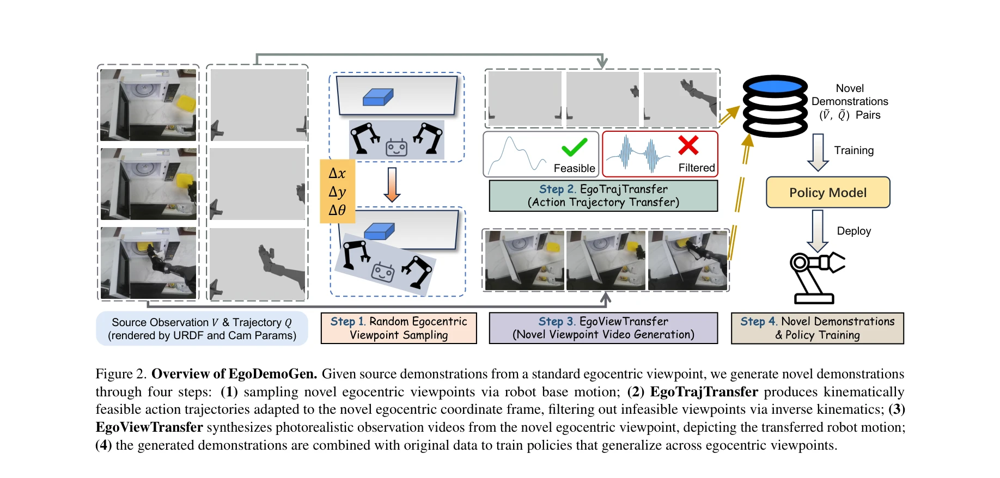

# EgoDemoGen: Egocentric Demonstration Generation for Viewpoint Generalization in Robotic Manipulation

> **저자**: Yuan Xu, Jiabing Yang, Xiaofeng Wang, Yixiang Chen, Zheng Zhu, Bowen Fang, Guan Huang, Xinze Chen, Yun Ye, Qiang Zhang, Peiyan Li, Xiangnan Wu, Kai Wang, Bing Zhan, Shuo Lu, Jing Liu, Nianfeng Liu, Yan Huang, Liang Wang | **날짜**: 2025-09-26 | **URL**: [https://arxiv.org/abs/2509.22578](https://arxiv.org/abs/2509.22578)

---

## Essence

*Figure 2. Overview of EgoDemoGen. Given source demonstrations from a standard egocentric viewpoint, we generate novel de*

EgoDemoGen은 egocentric viewpoint 변화에 대응하는 로봇 조작 정책의 일반화를 위해, 궤적 전송과 영상 합성을 통해 새로운 egocentric 관점에서 정렬된 observation-action 시연을 생성하는 프레임워크이다.

## Motivation

- **Known**: Imitation learning 기반 visuomotor 정책은 강한 성능을 보이지만 egocentric viewpoint 변화에 민감하다. 기존 novel-view synthesis 방법들은 관찰만 생성하고 동작을 전송하지 않아 visual-action 불일치가 발생한다.
- **Gap**: Egocentric viewpoint 변화는 카메라 이동뿐 아니라 로봇 base 좌표계도 함께 변경되므로, 기존 third-person viewpoint 변환 방법으로는 해결 불가능하다. 관찰과 동작을 동시에 일관성 있게 생성하는 방법이 없다.
- **Why**: Egocentric viewpoint 변화는 로봇 기저 위치 부정확성, 플랫폼 재구성, 환경 레이아웃 변경 등에서 자연스럽게 발생하므로, 모든 가능한 관점에서 시연을 수집하는 것은 비용이 많이 든다.
- **Approach**: EgoTrajTransfer를 통해 동작 궤적을 새로운 egocentric 좌표계로 전송하고, EgoViewTransfer라는 조건부 video generation 모델로 전송된 궤적을 반영하는 photorealistic 영상을 합성한다.

## Achievement

*Figure 2. Overview of EgoDemoGen. Given source demonstrations from a standard egocentric viewpoint, we generate novel de*

- **EgoDemoGen 프레임워크**: Egocentric viewpoint 변화 하에서 정렬된 observation-action 시연 쌍을 생성하여 정책 일반화 성능 향상
- **EgoTrajTransfer**: Motion-skill segmentation, geometry-aware transformation, inverse kinematics feasibility filtering을 통해 새로운 egocentric 좌표계에 적응적인 로봇 궤적 전송
- **EgoViewTransfer**: Reprojected scene video와 rendered robot motion video를 융합하는 conditional video diffusion 모델로 novel egocentric 관점의 photorealistic 영상 합성
- **Self-supervised 학습**: Multi-viewpoint 데이터 없이 double reprojection 전략으로 EgoViewTransfer 학습
- **실험 성과**: 시뮬레이션에서 +24.6%, +16.9%, 실제 로봇에서 +16.0%, +23.0%의 정책 성공률 향상

## How

*Figure 2. Overview of EgoDemoGen. Given source demonstrations from a standard egocentric viewpoint, we generate novel de*

- Novel egocentric viewpoint를 로봇 base 변환(Δx, Δy, Δθ)으로 샘플링
- Source trajectory를 gripper 상태 기반 motion과 skill phase로 세분화
- 각 phase별로 geometry-aware transformation 적용하여 새로운 base 좌표계로 변환
- Inverse kinematics를 통해 joint actions 복원하고 feasibility filtering으로 실현 가능한 viewpoint만 선택
- URDF와 카메라 파라미터로 로봇 모션 영상 렌더링
- Source observation을 새로운 viewpoint로 reprojection하여 scene 영상 생성
- Video diffusion 모델에 reprojected scene video와 rendered robot motion video를 조건으로 입력하여 합성 영상 생성
- Double reprojection self-supervised 전략으로 모델 학습 (multi-view 데이터 불필요)
- 생성된 시연을 원본 데이터와 혼합하여 viewpoint generalization을 위한 정책 학습

## Originality

- Egocentric viewpoint 변화의 특수성 인식: 카메라와 로봇 base의 동시 변환으로 인한 action coordinate frame 변화를 명시적으로 모델링한 최초의 연구
- Action-observation 정렬: 관찰 합성만 하는 기존 방법과 달리, 궤적 전송과 영상 합성을 동시에 처리하여 visual-action 일치 보장
- Motion-skill 세분화 기반 전송: Gripper 상태에 따른 세분화된 궤적 전송으로 각 phase별 적절한 geometry-aware transformation 적용
- Self-supervised video generation 학습: Multi-viewpoint 데이터 없이 double reprojection 전략으로 conditional video diffusion 모델 학습
- 통합 프레임워크: 동작 전송과 영상 합성을 통합하는 end-to-end 시스템으로 paired demonstration 생성

## Limitation & Further Study

- Egocentric viewpoint 변환의 범위 제한: 로봇 base의 극단적 변위에서는 inverse kinematics 해가 존재하지 않아 feasibility filtering으로 제외될 수 있음
- Base-camera 고정 가정: 카메라가 로봇 head에 고정된 egocentric setup만 고려하며, 독립적인 base-camera 변환에 대한 일반화 미흡
- 학습 데이터 요구: Video diffusion 모델의 조건부 학습에도 초기 소스 시연이 필요하므로, 완전한 zero-shot 합성은 불가능
- 동적 환경 미지원: Static scene 기반의 reprojection과 렌더링으로 동적 객체나 환경 변화에 대한 대응 미흡
- 후속 연구: (1) 더 광범위한 viewpoint 변환에 대한 feasibility 확장, (2) Base-camera 독립적 변환 모델링, (3) 동적 환경 대응, (4) 다양한 로봇 embodiment으로의 일반화

## Evaluation

- Novelty: 4/5
- Technical Soundness: 3/5
- Significance: 4/5
- Clarity: 4/5
- Overall: 4/5

**총평**: 본 논문은 egocentric viewpoint 변화의 특수성을 명확히 인식하고, 궤적 전송과 영상 합성을 통합하는 EgoDemoGen 프레임워크를 제시하여 로봇 조작의 viewpoint 일반화 문제를 근본적으로 해결한다. 실험적으로 시뮬레이션과 실제 로봇 환경에서 일관된 성능 향상을 보여주며, 로봇 학습의 실용적 적용에 중요한 기여를 한다.

## Related Papers

- 🏛 기반 연구: [[papers/1903_EgoMimic_Scaling_Imitation_Learning_via_Egocentric_Video/review]] — EgoDemoGen의 egocentric viewpoint generalization이 EgoMimic의 대규모 egocentric video 기반 imitation learning의 기본 원리와 일치한다.
- 🧪 응용 사례: [[papers/1750_Vision_in_Action_Learning_Active_Perception_from_Human_Demon/review]] — egocentric demonstration generation 기술이 Vision in Action의 active perception 학습에서 다양한 관점의 시연 데이터를 효과적으로 제공할 수 있다.
- 🔗 후속 연구: [[papers/1871_Dexterity_from_Smart_Lenses_Multi-Fingered_Robot_Manipulatio/review]] — EgoDemoGen이 viewpoint variation을 통해 smart lens로 수집한 데이터의 다양성을 증강하여 더 robust한 정책 학습을 가능하게 한다.
- 🏛 기반 연구: [[papers/1758_WHOLE_World-Grounded_Hand-Object_Lifted_from_Egocentric_Vide/review]] — egocentric video 기반 demonstration에서 hand-object holistic reconstruction과 viewpoint-agnostic generation이라는 관련 방법론을 사용한다.
