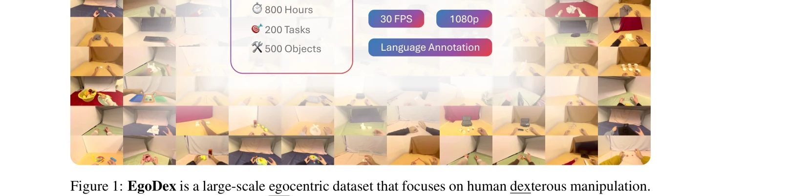
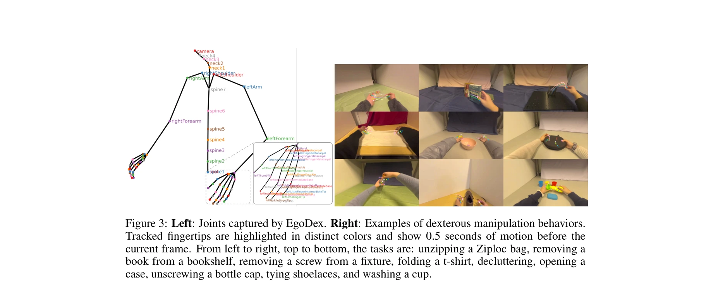

# EgoDex: Learning Dexterous Manipulation from Large-Scale Egocentric Video

> **저자**: Ryan Hoque, Peide Huang, David J. Yoon, Mouli Sivapurapu, Jian Zhang | **날짜**: 2025-05-16 | **URL**: [https://arxiv.org/abs/2505.11709](https://arxiv.org/abs/2505.11709)

---

## Essence

*Figure 1: EgoDex is a large-scale egocentric dataset that focuses on human dexterous manipulation.*

Apple Vision Pro를 활용하여 829시간의 3D 손 추적 주석이 포함된 대규모 자아중심 비디오 데이터셋 EgoDex를 수집하고, 이를 통해 기술적 조작 모방 학습을 위한 벤치마크를 제시한다.

## Motivation

- **Known**: 로봇 모방 학습은 텔레오퍼레이션 기반 DROID, RT-X 등의 데이터셋이 존재하며, Ego4D 같은 대규모 자아중심 비디오 데이터셋도 있지만 정확한 손 자세 주석이 부족하다.
- **Gap**: 기술적 조작을 위한 인터넷 규모의 데이터 코퍼스가 없으며, 기존 자아중심 비디오 데이터셋들은 조작에 집중하거나 정밀한 3D 손 관절 추적을 제공하지 않는다.
- **Why**: 대규모 데이터는 LLM과 시각 모델의 성공을 입증했으며, 수동 수집이 필요 없는 패시브 스케일 가능한 데이터가 로봇 조작 분야의 진전을 가속화할 수 있다.
- **Approach**: Apple Vision Pro의 다중 보정 카메라와 온디바이스 SLAM을 활용하여 194개의 일상 조작 작업에 대한 자아중심 비디오와 실시간 3D 손 자세 추적 데이터를 동시 수집한다.

## Achievement

*Figure 1: EgoDex is a large-scale egocentric dataset that focuses on human dexterous manipulation.*

- **대규모 데이터셋 구축**: 829시간(90M 프레임), 338K 에피소드, 194개 작업, 500개 객체를 포함한 기존 조작 데이터셋 대비 최대 규모의 자아중심 조작 데이터셋 제시
- **멀티모달 주석**: 30 FPS 1080p 비디오와 함께 모든 손 관절의 정밀한 3D 포즈, 카메라 외부 매개변수, 언어 주석을 제공
- **벤치마크 및 평가**: Hand trajectory prediction을 위한 imitation learning 정책을 체계적으로 평가하는 메트릭 및 벤치마크 제시
- **공개 배포**: 연구 커뮤니티의 접근성을 위해 전체 데이터셋을 공개 제공

## How

*Figure 3: Left: Joints captured by EgoDex. Right: Examples of dexterous manipulation behaviors.*

- Apple Vision Pro 디바이스의 내장 카메라와 SLAM 기술을 활용한 실시간 3D 손 자세 추적
- 다중 보정 카메라를 통한 높은 정확도의 관절별 포즈 데이터 수집
- 194개의 다양한 일상 조작 작업(끈 묶기, 세탁물 접기, 병 따개 등) 수행 중 자아중심 비디오 기록
- Behavioral cloning(BC) 및 Diffusion model 기반 imitation learning 정책 학습 및 평가
- Distance metrics 등 손 궤적 예측 성능 평가 메트릭 정의

## Originality

- 기존 자아중심 비디오 데이터셋(Ego4D, EPIC-KITCHENS)과 달리 실시간 정밀 3D 손 자세 추적 데이터를 동시 수집하는 혁신적 접근
- 수동 수집 필요 없는 패시브 스케일링이 가능한 텔레오퍼레이션 대안 제시
- Apple Vision Pro 같은 웨어러블 기술의 실제 활용을 통한 대규모 데이터 수집 실증
- 기술적 조작에 특화된 비디오-자세 쌍 데이터셋의 최초 대규모 공개 제공

## Limitation & Further Study

- Apple Vision Pro 하드웨어 의존성으로 인한 데이터 수집 환경의 제한
- Hand trajectory prediction 벤치마크만 제시되었으며, 실제 로봇 정책 전이(sim-to-real transfer) 성능 평가 부재
- 수집된 조작이 주로 테이블 상단의 일상 물체 작업에 제한되어 있어 복잡한 환경에서의 일반화 가능성 미검증
- 현재 imitation learning 성능 분석이 초기 단계로, 보다 정교한 학습 알고리즘 개발 필요
- 후속 연구: 다양한 자구축과의 손-로봇 형태 전이 학습, 3D 비전 기반 객체 이해 통합, 장기 시간 계획 능력을 갖춘 정책 학습

## Evaluation

- Novelty: 4/5
- Technical Soundness: 3/5
- Significance: 4/5
- Clarity: 4/5
- Overall: 4/5

**총평**: EgoDex는 기술적 조작 학습을 위한 획기적인 대규모 데이터셋을 제공하며, 웨어러블 기술의 실제 활용을 통해 로봇 조작 분야의 '인터넷 규모 데이터' 시대를 개척한다. 데이터셋의 규모와 정밀도는 탁월하나, 실제 로봇 정책 전이의 실효성 검증이 후속 과제로 남아있다.
