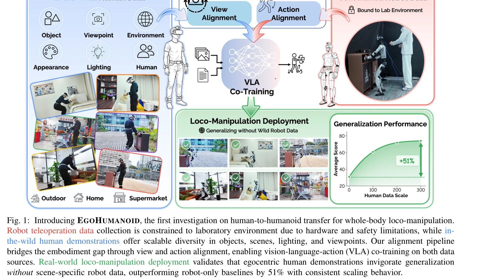
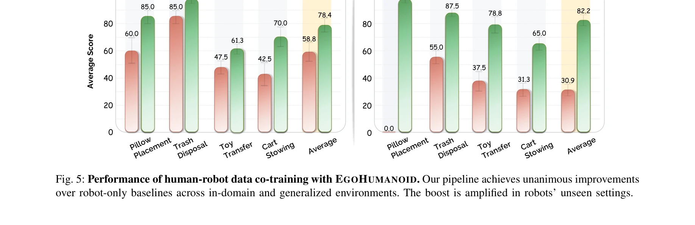
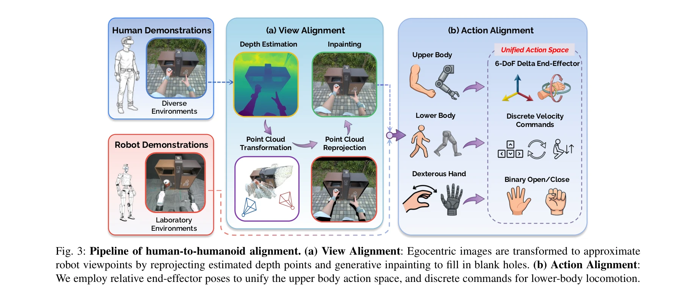

# EgoHumanoid: Unlocking In-the-Wild Loco-Manipulation with Robot-Free Egocentric Demonstration

> **저자**: Modi Shi, Shijia Peng, Jin Chen, Haoran Jiang, Yinghui Li, Di Huang, Ping Luo, Hongyang Li, Li Chen | **날짜**: 2026-02-10 | **DOI**: [10.48550/arXiv.2602.10106](https://doi.org/10.48550/arXiv.2602.10106)

---

## Essence

*Fig. 1: Introducing EGOHUMANOID, the first investigation on human-to-humanoid transfer for whole-body loco-manipulation.*

EgoHumanoid는 로봇 없이 수집한 대규모 인간 egocentric 시연과 제한된 로봇 데이터를 co-train하여 휴머노이드 로봇이 다양한 현실 환경에서 loco-manipulation을 수행하도록 하는 첫 번째 프레임워크이다. View alignment와 action alignment로 구성된 embodiment 정렬 파이프라인을 통해 인간-로봇 간의 신체 형태, 관점, 동역학의 차이를 극복한다.

## Motivation

- **Known**: Robot teleoperation을 통한 데이터 수집은 높은 비용과 복잡성으로 인해 실험실 환경에 제한되며, 최근 wearable sensing을 활용한 egocentric human data가 로봇 학습을 위한 유망한 대안으로 등장했다. 그러나 기존 연구는 고정된 팔 조작에만 집중했고, 휴머노이드 loco-manipulation으로의 확장은 미흡했다.
- **Gap**: 휴머노이드 로봇은 인간과 신체 형태, 운동학, 관찰 관점이 본질적으로 다르기 때문에 egocentric human demonstrations을 직접 적용할 수 없으며, 이러한 embodiment gap을 체계적으로 다루는 human-to-humanoid transfer 방법이 부재하다.
- **Why**: 휴머노이드 로봇은 가정 보조부터 야외 서비스까지 인간 중심 환경에서 작동해야 하므로, 다양한 현실 환경에서의 loco-manipulation 학습이 중요하다. 인간 데이터의 환경적 다양성과 확장성을 활용하면 로봇 전용 데이터의 데이터 부족 문제를 해결하고 일반화 능력을 향상시킬 수 있다.
- **Approach**: Portable VR 기반 data collection 시스템으로 인간 egocentric 데이터와 teleoperated 로봇 데이터를 모두 수집하고, depth-based reprojection과 inpainting을 통한 view alignment, 그리고 delta end-effector pose와 discrete locomotion command로 통일된 action space를 활용한 action alignment를 제시한다.

## Achievement

*Fig. 5: Performance of human-robot data co-training with EGOHUMANOID. Our pipeline achieves unanimous improvements*

- **Human-to-humanoid transfer의 첫 실증**: Egocentric human data의 co-training이 humanoid loco-manipulation에 효과적임을 입증하는 첫 번째 연구
- **성능 향상**: Human data를 포함한 co-training이 robot-only baseline을 평균 20% 향상시키고, 미지의 장면에서는 51% 향상을 달성
- **체계적 embodiment 정렬 파이프라인**: View alignment와 action alignment를 통해 인간-로봇 간의 신체 형태, 관점, 동역학 차이를 실질적으로 해소
- **확장성 입증**: Human data의 scaling 효과를 분석하여 더 많은 데이터 수집이 성능 개선으로 이어짐을 확인
- **현실 세계 검증**: Unitree G1 humanoid를 이용한 4가지 indoor/outdoor loco-manipulation 작업에서 실제 성능 검증

## How

*Fig. 3: Pipeline of human-to-humanoid alignment. (a) View Alignment: Egocentric images are transformed to approximate*

- **Data collection system**: VR headset, body tracker, egocentric camera를 통합한 portable human data collection과 VR-based teleoperation을 통한 robot data collection
- **View alignment**: Depth-based reprojection과 inpainting을 이용하여 human egocentric view를 robot viewpoint로 변환
- **Action alignment**: Delta end-effector pose (상체 제어)와 discrete command (locomotion)로 통일된 action space 구성
- **Vision-language-action (VLA) co-training**: 두 데이터 소스의 정렬된 observation과 action으로 joint policy 학습
- **Ablation studies**: Sub-task 별 transfer 효과, scaling behavior, alignment pipeline의 critical design choice 검증
- **High-level behavior 추출**: Low-level action의 embodiment 차이에도 불구하고 navigation route, object approach 전략 등의 고수준 행동 전이

## Originality

- **첫 번째 humanoid loco-manipulation human-to-robot transfer**: 기존 human-to-robot 연구가 fixed-base manipulation이나 navigation에만 집중한 것과 달리, 복합된 whole-body loco-manipulation에 처음 적용
- **Embodiment gap 해결의 체계성**: Hardware design부터 data processing까지 아우르는 통합적 정렬 파이프라인으로, 단순 representation 학습을 넘어 관점-동작 변환을 명시적으로 다룸
- **Co-training 패러다임 확장**: 기존 pretraining-then-finetuning을 넘어 aligned observation과 action을 통한 직접적 co-training 가능성을 humanoid context에서 처음 입증
- **Portable data collection infrastructure**: Robot hardware 없이 scalable human data 수집 가능한 실용적 시스템 개발

## Limitation & Further Study

- **View alignment의 한계**: Depth-based reprojection과 inpainting에 의존하므로 depth estimation 오류가 변환 품질을 제한할 수 있음
- **Action space의 단순화**: Delta end-effector pose와 discrete locomotion command로 통일된 action space가 인간 동작의 미묘한 변화(예: body sway, balance strategy)를 충분히 포착하지 못할 가능성
- **Scaling behavior의 상세 분석 부족**: Human data의 scaling이 성능 개선으로 이어짐을 보였으나, optimal data composition과 비율에 대한 심도있는 분석 필요
- **Task 다양성의 제한**: 4가지 loco-manipulation task에서만 평가되었으므로, 복잡도가 높거나 매우 이상한 작업으로의 일반화 미검증
- **후속연구**: (1) 고급 depth estimation 또는 generative model을 활용한 view alignment 개선, (2) 인간 body dynamics를 더 정확히 모델링하는 action alignment, (3) 더 다양한 humanoid 플랫폼과 task에 대한 transfer 학습, (4) Semantic-level behavior 추출을 통한 더 높은 수준의 지식 전이

## Evaluation

- Novelty: 4/5
- Technical Soundness: 3/5
- Significance: 4/5
- Clarity: 4/5
- Overall: 4/5

**총평**: EgoHumanoid는 휴머노이드 loco-manipulation 분야에서 human egocentric data 활용의 새로운 가능성을 체계적으로 보여주는 획기적인 작업이다. Practical embodiment alignment pipeline, 현실 환경에서의 강력한 성능 개선(51%), 그리고 scalability 분석은 향후 humanoid 로봇 학습의 중요한 방향을 제시한다.
