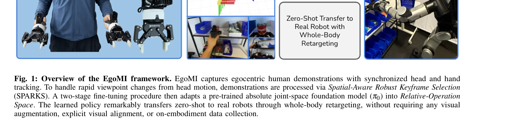

# EgoMI: Learning Active Vision and Whole-Body Manipulation from Egocentric Human Demonstrations

> **저자**: Justin Yu, Yide Shentu, Di Wu, Pieter Abbeel, Ken Goldberg, Philipp Wu | **날짜**: 2025-10-31 | **URL**: [https://arxiv.org/abs/2511.00153](https://arxiv.org/abs/2511.00153)

---

## Essence

*Fig. 1: Overview of the EgoMI framework. EgoMI captures egocentric human demonstrations with synchronized head and hand*

EgoMI는 인간의 동시화된 머리 및 손 움직임을 포착하는 egocentric 데이터 수집 프레임워크로, SPARKS 메모리 메커니즘을 통해 급속한 시점 변화를 처리하여 반인간형 로봇으로 zero-shot 전이를 달성한다.

## Motivation

- **Known**: 이미테이션 러닝은 인간 시연으로부터 로봇 기술을 습득하는 유망한 방법이며, 최근 foundation model 기반 접근법들이 대규모 데이터셋에서 우수한 성과를 보여주고 있다.
- **Gap**: 기존 방법들은 머리 움직임을 무시하거나 정적 카메라에 의존하여 인간의 active vision 전략을 재현하지 못하고, 급속한 시점 변화로 인한 context loss 문제를 해결하지 못한다.
- **Why**: 인간은 조작 중 머리와 손을 협응시켜 시점을 동적으로 조정하는데, 이를 로봇이 수행할 수 있으면 embodiment gap을 효과적으로 줄이고 복잡한 조작 작업의 성능을 크게 향상시킬 수 있다.
- **Approach**: EgoMI는 인간 머리-손 운동 데이터를 동시에 수집하는 하드웨어 시스템과, Spatial-Aware Robust Keyframe Selection (SPARKS)라는 메모리 기반 정책을 통해 rapid viewpoint changes를 처리하며, π0 foundation model을 fine-tuning하여 robot 재설정을 수행한다.

## Achievement

*Fig. 4: Tabletop Task Rollout Sequence: (Left). The images show a real 29D policy evaluation rollout where the robot (1)*

- **머리 액추에이터의 중요성 입증**: 액추에이트된 머리를 통한 관절 비선형 회전 보정과 active vision 시뮬레이션이 일상적 조작 작업에서 critical하다는 것을 실증했다.
- **SPARKS 메커니즘**: viewpoint novelty, temporal recency, motion smoothness를 기준으로 한 lightweight keyframe selection이 시각적 정보 손실을 완화하면서 분포외(out-of-distribution) 실패를 방지한다.
- **Zero-shot transfer**: augmentation, in-painting, viewpoint re-rendering 없이 실제 로봇으로 직접 전이가 가능함을 보여주었다.
- **통합 평가**: 헤드 궤적 데이터와 메모리 기반 정책이 모두 중요함을 체계적으로 입증했다.

## How

*Fig. 1: Overview of the EgoMI framework. EgoMI captures egocentric human demonstrations with synchronized head and hand*

- **하드웨어 시스템**: VR 컨트롤러, 머리 마운트 카메라, RGB-D 센서, IMU를 통합하여 동시화된 end-effector 및 head 궤적 데이터 수집
- **SPARKS 알고리즘**: 과거 keyframe에서 spatial information을 강조하고, viewpoint novelty(카메라 포즈 변화), temporal recency, motion smoothness score 계산으로 context-aware 선택
- **정책 학습**: π0 foundation model을 두 단계로 fine-tune하여 absolute joint-space에서 Relative-Operation Space로 적응
- **Whole-body retargeting**: 인간의 머리-손 운동을 반인간형 로봇의 6-DoF 팔(넥 역할) 및 그리퍼로 변환
- **메모리 증강 정책**: 선택된 과거 keyframe 이미지들을 현재 관찰과 함께 정책 입력으로 사용

## Originality

- **통합 head-hand 데이터 수집**: 기존 시스템(UMI, AirExo-2, ViA 등)은 머리 또는 손 중 하나만 추적했으나, EgoMI는 두 가지를 동시에 수집하는 최초 시도
- **SPARKS의 training-free 설계**: 학습 없이 기하학적 및 시간적 특성만으로 keyframe을 선택하는 경량 알고리즘으로 일반화 가능
- **Relative-Operation Space 개념**: absolute joint-space foundation model을 상대 좌표계로 변환하여 embodiment 편차를 자연스럽게 처리
- **Robot-free 데이터 수집**: 로봇 센서 피드백에 의존하지 않고 인간 데이터만으로 zero-shot transfer 달성

## Limitation & Further Study

- **반인간형 embodiment 제한**: 실험이 특정 반인간형 로봇(Rainbow-RBY1 + 6-DoF arm)에 한정되어 완전히 다른 형태의 로봇으로의 전이 가능성이 불명확
- **SPARKS의 정량적 검증 부족**: keyframe selection의 최적성에 대한 이론적 분석 또는 다른 메모리 메커니즘과의 비교 실험이 부족
- **데이터 수집 기술 의존성**: VR 컨트롤러 정확도(2.126±1.216 mm)가 고정도 조작에 제약이 될 수 있음
- **평가 범위**: 실험이 테이블탑 조작에 주로 집중되어 모바일 조작이나 실외 환경에서의 성능 미평가
- **후속 연구**: SPARKS를 학습 기반 메모리 메커니즘(예: attention-based transformer)과 비교, 다양한 embodiment 형태로의 확장성 검증, 더 복잡한 다단계 작업에서의 성능 평가 필요

## Evaluation

- Novelty: 4/5
- Technical Soundness: 3/5
- Significance: 4/5
- Clarity: 4/5
- Overall: 4/5

**총평**: EgoMI는 인간의 active vision과 manipulation을 동시에 포착하는 창의적 프레임워크로, SPARKS 메커니즘을 통해 급속한 시점 변화를 우아하게 처리하며 zero-shot transfer를 달성해 imitation learning의 embodiment gap 문제에 실질적 솔루션을 제시한다.

## Related Papers

- 🔄 다른 접근: [[papers/1750_Vision_in_Action_Learning_Active_Perception_from_Human_Demon/review]] — EgoMI의 SPARKS 메모리 메커니즘과 인간 시연 기반 능동 지각 학습은 서로 다른 시점에서 능동 시각을 다룹니다.
- 🧪 응용 사례: [[papers/2087_LookOut_Real-World_Humanoid_Egocentric_Navigation/review]] — LookOut의 실제 환경 자아중심 내비게이션이 EgoMI의 능동 시각 및 전신 조작 학습을 실용적으로 적용한 사례입니다.
- 🏛 기반 연구: [[papers/1903_EgoMimic_Scaling_Imitation_Learning_via_Egocentric_Video/review]] — EgoMimic의 egocentric 비디오 기반 모방 학습 스케일링 기술이 EgoMI의 능동적 시각 및 전신 조작 학습을 위한 기반 방법론을 제공한다.
- 🔄 다른 접근: [[papers/1751_Visual_Imitation_Enables_Contextual_Humanoid_Control/review]] — Visual Imitation의 맥락적 휴머노이드 제어가 egocentric 데이터 없이도 시각 기반 제어를 가능하게 하는 다른 접근 방식을 제시한다.
- 🏛 기반 연구: [[papers/1753_VisualMimic_Visual_Humanoid_Loco-Manipulation_via_Motion_Tra/review]] — egocentric vision을 활용한 전신 조작 학습에서 active vision과 loco-manipulation이라는 관련 영역을 다룬다.
- 🧪 응용 사례: [[papers/1837_Climber_Force_and_Motion_Estimation_from_Video/review]] — EgoMI의 능동 시각과 전신 조작 학습이 등반 환경에서 시각-동작 통합을 위한 실용적 응용 사례를 제공한다.
- 🏛 기반 연구: [[papers/1871_Dexterity_from_Smart_Lenses_Multi-Fingered_Robot_Manipulatio/review]] — Aria Gen 2를 통한 egocentric vision 기반 조작 학습이 EgoMI의 active vision과 whole-body manipulation의 기본 원리와 일치한다.
- 🔄 다른 접근: [[papers/2166_ULTRA_Unified_Multimodal_Control_for_Autonomous_Humanoid_Who/review]] — 둘 다 자기중심 시각 기반 전신 조작을 다루지만 이 논문은 통합 멀티모달 제어에, EgoMI는 능동 시각과 조작 학습에 중점을 둡니다.
