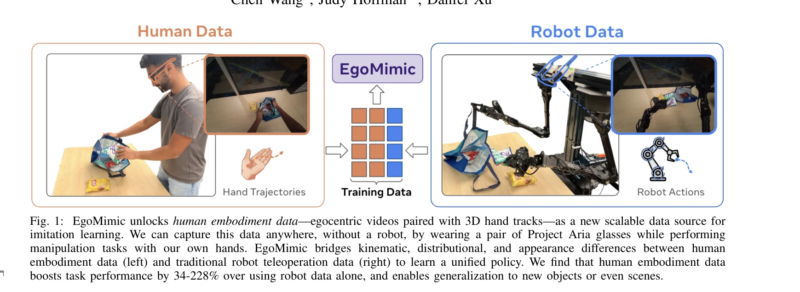
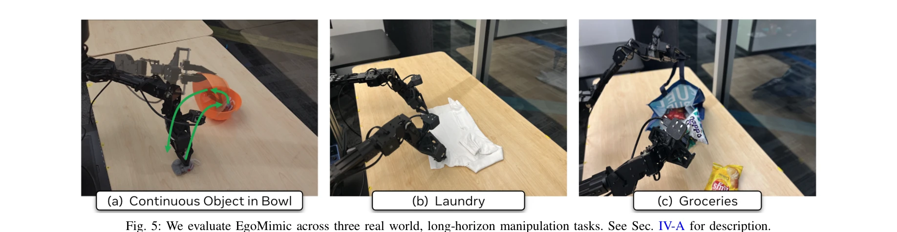

# EgoMimic: Scaling Imitation Learning via Egocentric Video

> **저자**: Simar Kareer, Dhruv Patel, Ryan Punamiya, Pranay Mathur, Shuo Cheng, Chen Wang, Judy Hoffman, Danfei Xu | **날짜**: 2024-10-31 | **URL**: [https://arxiv.org/abs/2410.24221](https://arxiv.org/abs/2410.24221)

---

## Essence

*Fig. 1: EgoMimic unlocks human embodiment data—egocentric videos paired with 3D hand tracks—as a new scalable data sourc*

EgoMimic은 Project Aria 안경을 통해 수집한 인간의 일인칭 시점 비디오와 3D 손 추적 데이터를 로봇 조작 학습에 활용하는 전체 스택 프레임워크로, 인간과 로봇 데이터를 동등한 embodied demonstration으로 취급하여 통합 정책을 학습한다.

## Motivation

- **Known**: Imitation learning은 강력한 조작 작업 학습 방법이지만 대규모 다양한 시연 데이터가 필요하고, 인간 비디오는 확장 가능한 데이터 소스이나 기존 방법들은 고수준 의도 추출에만 활용되었다.
- **Gap**: 기존 연구는 인간 비디오를 보조 데이터로만 취급하며 별도 처리를 요구했고, 인간과 로봇 데이터 사이의 kinematic, distributional, appearance 차이를 효과적으로 연결하는 통합 학습 프레임워크가 부재했다.
- **Why**: 수동적 데이터 수집이 가능한 일인칭 시점 인간 데이터를 로봇 학습에 활용하면 Internet 규모의 로봇 데이터 확보가 가능하며, 이는 로봇 조작 성능의 대규모 확장을 가능하게 한다.
- **Approach**: EgoMimic은 Project Aria 안경으로 인간 데이터를 수집하고, kinematic 갭을 최소화하는 저비용 이족 로봇을 설계하며, cross-domain data alignment 기법과 shared vision encoder를 통해 인간과 로봇 데이터를 통합 학습한다.

## Achievement

*Fig. 5: We evaluate EgoMimic across three real world, long-horizon manipulation tasks. See Sec. IV-A for description.*

- **성능 향상**: 연속 object-in-bowl, 옷 접기, 식료품 포장 등 장기간 조작 작업에서 로봇만 사용 대비 34-228% 상대 성능 개선
- **일반화 능력**: 인간 데이터에서만 나타난 새로운 객체와 장면으로 일반화 가능
- **데이터 효율성**: 추가 1시간의 hand 데이터가 1시간의 로봇 데이터보다 현저히 더 가치 있음을 실증

## How

*Fig. 2: Our human data system uses Aria glasses to capture Egocentric RGB and uses its side SLAM cameras to localize the*

- Project Aria 안경을 이용하여 일인칙 RGB 영상, 3D 손 추적, 장치 SLAM을 동시 수집
- Viper X follower arms와 WidowX leader arms로 구성된 이족 로봇 설계, 로봇의 메인 센서로도 Aria 안경 사용하여 camera-to-camera 갭 최소화
- Action distribution 정규화 및 정렬을 통해 인간과 로봇 데이터 간 distributional 차이 완화
- Visual masking을 이용하여 인간 팔과 로봇 매니퓨레이터 간 appearance 차이 축소
- 공통 vision encoder와 policy network를 사용한 unified imitation learning architecture로 hand와 로봇 데이터 co-training, 서로 다른 action space에도 shared representation 강제

## Originality

- 인간 데이터를 auxiliary source가 아닌 first-class 데이터 소스로 취급하는 새로운 관점
- 일인칭 시점 wearable 센서(Aria glasses)를 활용한 passive data collection 시스템
- kinematic, distributional, appearance 갭을 동시에 해결하는 전체 스택 설계
- 인간과 로봇 embodiment을 continuous spectrum의 데이터 소스로 통합 학습하는 unified architecture
- scaling trend 분석을 통해 인간 데이터의 상대적 가치를 정량화

## Limitation & Further Study

- 현재 평가는 3가지 장기간 조작 작업으로 제한되며, 다양한 도메인에서의 일반화 가능성 검증 필요
- Aria 안경이라는 특정 하드웨어에 의존하며, 다른 consumer-grade 일인칭 센서와의 호환성 미검토
- 인간 시연자의 skill 수준과 개인차가 학습에 미치는 영향 분석 부재
- Cross-embodiment 학습에서 인간-로봇 간 kinematic 차이의 근본적 한계(예: 인간의 유연성이 로봇에 구현 불가능)에 대한 해결 방안 미제시
- 후속연구: (1) 더 많은 manipulation 도메인 평가, (2) 다양한 센서 플랫폼 호환성, (3) 인간 skill diversity의 영향 분석, (4) embodiment 차이를 반영한 adaptive 정책 학습

## Evaluation

- Novelty: 4/5
- Technical Soundness: 3/5
- Significance: 4/5
- Clarity: 4/5
- Overall: 4/5

**총평**: EgoMimic은 인간의 일인칭 시점 데이터를 로봇 학습에 동등하게 활용하는 혁신적 접근으로, 실제 조작 작업에서 뛰어난 성능 개선과 일반화를 입증했으며, 수동적 대규모 데이터 수집의 가능성을 열어 로봇 학습의 확장성 문제 해결에 크게 기여한다.

## Related Papers

- 🔗 후속 연구: [[papers/1901_EgoHumanoid_Unlocking_In-the-Wild_Loco-Manipulation_with_Rob/review]] — EgoHumanoid가 EgoMimic의 egocentric video 학습을 loco-manipulation으로 확장하여 더 포괄적인 humanoid 제어를 실현한다.
- 🔄 다른 접근: [[papers/1904_EgoVLA_Learning_Vision-Language-Action_Models_from_Egocentri/review]] — EgoVLA가 같은 egocentric video 데이터를 VLA 모델로 접근하여 EgoMimic과 다른 학습 패러다임을 제시한다.
- 🏛 기반 연구: [[papers/1758_Whole-body_Humanoid_Robot_Locomotion_with_Human_Reference/review]] — WHOLE의 egocentric video에서 hand-object interaction 학습이 EgoMimic의 manipulation 정책 획득에 이론적 기반을 제공한다.
- 🔄 다른 접근: [[papers/1900_EgoDex_Learning_Dexterous_Manipulation_from_Large-Scale_Egoc/review]] — 둘 다 일인칭 시점 비디오에서 손 추적을 하지만 EgoMimic은 Project Aria를, EgoDex는 Apple Vision Pro를 활용한다.
- 🔗 후속 연구: [[papers/1947_Generalizable_Humanoid_Manipulation_with_3D_Diffusion_Polici/review]] — EgoMimic의 egocentric 시연 데이터를 3D Diffusion Policy와 결합하면 더 일반화 가능한 휴머노이드 조작 시스템을 구축할 수 있다.
- 🏛 기반 연구: [[papers/2124_Open-TeleVision_Teleoperation_with_Immersive_Active_Visual_F/review]] — EgoMimic의 일인칭 시점 데이터 수집 방법론이 Open-TeleVision의 몰입형 원격 조작 시스템 개발에 중요한 기반을 제공한다.
- 🔄 다른 접근: [[papers/1646_RoboMirror_Understand_Before_You_Imitate_for_Video_to_Humano/review]] — RoboMirror는 VLM 기반 motion intent 추출을, EgoMimic은 egocentric video scaling을 통해 비디오-로봇 제어를 다르게 구현함
- 🏛 기반 연구: [[papers/1252_ActiveUMI_Robotic_Manipulation_with_Active_Perception_from_R/review]] — ActiveUMI의 robot-free 데모 수집 방법론이 EgoMimic의 대규모 에고센트릭 비디오 학습 패러다임과 유사한 접근을 취한다
- 🏛 기반 연구: [[papers/1751_Visual_Imitation_Enables_Contextual_Humanoid_Control/review]] — EgoMimic의 egocentric video 모방 학습이 VIDEOMIMIC의 휴대폰 영상 처리 기술의 기반이 됩니다.
- 🔗 후속 연구: [[papers/1753_VisualMimic_Visual_Humanoid_Loco-Manipulation_via_Motion_Tra/review]] — EgoMimic의 대규모 egocentric 비디오 모방 학습 기법이 VisualMimic의 egocentric vision 기반 동작 추적을 확장할 수 있다.
- 🔄 다른 접근: [[papers/1814_Being-H0_Vision-Language-Action_Pretraining_from_Large-Scale/review]] — egocentric video 기반 imitation learning에서 하나는 인간 손 동작 모델링, 다른 하나는 일반적 모방 학습을 다룬다.
- 🏛 기반 연구: [[papers/1871_Dexterity_from_Smart_Lenses_Multi-Fingered_Robot_Manipulatio/review]] — EgoMimic의 egocentric video 학습 프레임워크가 smart lens 기반 manipulation 정책 학습의 이론적 토대를 마련한다.
- 🏛 기반 연구: [[papers/1899_EgoDemoGen_Egocentric_Demonstration_Generation_for_Viewpoint/review]] — EgoDemoGen의 egocentric viewpoint generalization이 EgoMimic의 대규모 egocentric video 기반 imitation learning의 기본 원리와 일치한다.
- 🔄 다른 접근: [[papers/1900_EgoDex_Learning_Dexterous_Manipulation_from_Large-Scale_Egoc/review]] — 둘 다 egocentric 비디오에서 손 추적 데이터를 수집하지만 EgoDex는 Apple Vision Pro를, EgoMimic은 Project Aria를 사용한다.
- 🏛 기반 연구: [[papers/1901_EgoHumanoid_Unlocking_In-the-Wild_Loco-Manipulation_with_Rob/review]] — EgoMimic의 egocentric video 학습 프레임워크가 EgoHumanoid의 robot-free egocentric 시연 학습에 기본 방법론을 제공한다.
- 🏛 기반 연구: [[papers/1902_EgoMI_Learning_Active_Vision_and_Whole-Body_Manipulation_fro/review]] — EgoMimic의 egocentric 비디오 기반 모방 학습 스케일링 기술이 EgoMI의 능동적 시각 및 전신 조작 학습을 위한 기반 방법론을 제공한다.
- 🏛 기반 연구: [[papers/1904_EgoVLA_Learning_Vision-Language-Action_Models_from_Egocentri/review]] — EgoMimic의 egocentric video 프레임워크가 EgoVLA의 Vision-Language-Action 모델 학습에 기본 데이터 처리 방법론을 제공한다.
- 🔗 후속 연구: [[papers/1947_Generalizable_Humanoid_Manipulation_with_3D_Diffusion_Polici/review]] — 3D Diffusion Policy를 EgoMimic의 egocentric 시연 데이터와 결합하면 더 다양한 환경에서의 일반화 가능한 조작이 가능하다.
- 🔄 다른 접근: [[papers/1961_H-RDT_Human_Manipulation_Enhanced_Bimanual_Robotic_Manipulat/review]] — 둘 다 egocentric 데이터를 통한 모방 학습을 다루지만 H-RDT는 bimanual 조작에, EgoMimic은 일반적인 모방에 초점을 맞춘다.
- 🔗 후속 연구: [[papers/1966_Hand-Eye_Autonomous_Delivery_Learning_Humanoid_Navigation_Lo/review]] — 에고센트릭 비디오를 통한 모방 학습이 손-눈 학습 프레임워크의 확장된 형태이다.
- 🔄 다른 접근: [[papers/1969_HDMI_Learning_Interactive_Humanoid_Whole-Body_Control_from_H/review]] — 인간 비디오에서 로봇 학습을 HDMI는 물체 상호작용 중심으로, EgoMimic은 광범위한 스킬 모방으로 접근한다.
- 🔗 후속 연구: [[papers/2000_Humanoid_Policy__Human_Policy/review]] — EgoMimic의 large-scale egocentric video imitation이 HAT의 cross-embodiment learning을 더 큰 규모의 데이터로 확장할 수 있다.
- 🔗 후속 연구: [[papers/2022_In-N-On_Scaling_Egocentric_Manipulation_with_in-the-wild_and/review]] — 에고센트릭 비디오 기반 모방 학습을 Human0 정책의 학습 데이터 확장 방법론으로 활용할 수 있다.
- 🏛 기반 연구: [[papers/2093_Masquerade_Learning_from_In-the-wild_Human_Videos_using_Data/review]] — 자아중심적 비디오를 통한 모방 학습 확장의 이론적 기반을 제공한다.
- 🏛 기반 연구: [[papers/2099_MimicDroid_In-Context_Learning_for_Humanoid_Robot_Manipulati/review]] — 자아중심적 비디오를 통한 모방 학습 확장의 이론적 기반을 제공한다.
- 🏛 기반 연구: [[papers/2115_OKAMI_Teaching_Humanoid_Robots_Manipulation_Skills_through_S/review]] — EgoMimic의 single video demonstration learning이 OKAMI의 single RGB-D video 기반 manipulation skill 학습에 방법론적 토대를 제공했다
