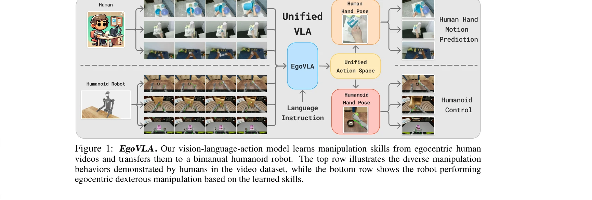
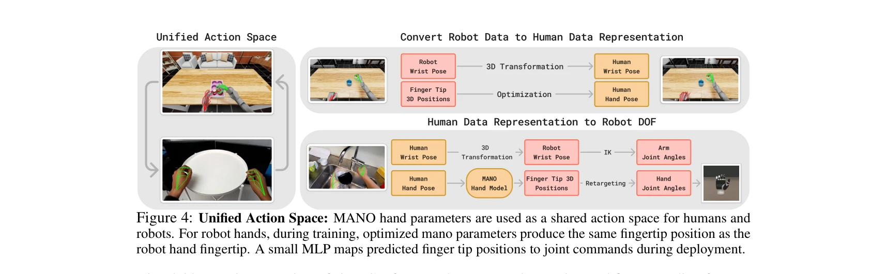
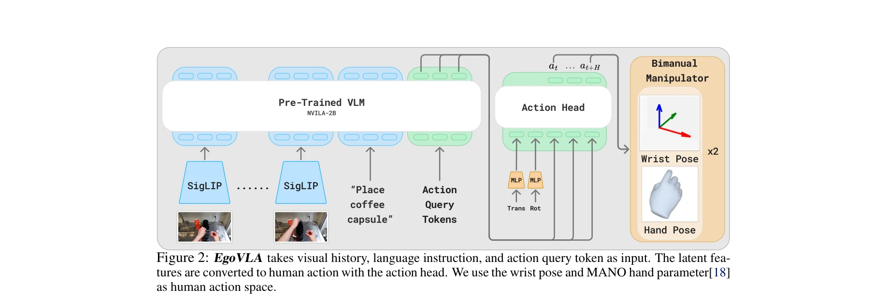

# EgoVLA: Learning Vision-Language-Action Models from Egocentric Human Videos

> **저자**: Ruihan Yang, Qinxi Yu, Yecheng Wu, Rui Yan, Borui Li, An-Chieh Cheng, Xueyan Zou, Yunhao Fang, Xuxin Cheng, Ri-Zhao Qiu, Hongxu Yin, Sifei Liu, Song Han, Yao Lu, Xiaolong Wang | **날짜**: 2025-07-16 | **URL**: [https://arxiv.org/abs/2507.12440](https://arxiv.org/abs/2507.12440)

---

## Essence

*Figure 1: EgoVLA. Our vision-language-action model learns manipulation skills from egocentric human*

egocentric human 비디오로부터 Vision-Language-Action (VLA) 모델을 학습하여 로봇 조작 정책을 획득하고, Inverse Kinematics과 retargeting을 통해 인간 행동을 로봇 행동으로 변환한다.

## Motivation

- **Known**: 대규모 실제 로봇 데이터 수집은 로봇 조작 학습에 효과적이지만 로봇 하드웨어 요구로 인해 데이터 규모가 제한된다. VLA 모델은 다중모드 인식-행동 통합에서 강한 성능을 보인다.
- **Gap**: 현존하는 VLA 모델은 로봇 데이터에 의존하여 확장성이 떨어지며, egocentric human 비디오의 풍부한 장면과 작업 다양성을 활용하지 못한다.
- **Why**: 인간 비디오는 로봇 데이터보다 대규모이고 다양한 환경과 작업을 포함하며, 80억의 인간이 전 세계 환경에서 조작 행동을 수행하므로 이를 활용하면 로봇 정책 학습의 확장성과 견고성을 크게 향상할 수 있다.
- **Approach**: NVILA-2B backbone 기반 VLA를 egocentric human manipulation 데이터셋에서 학습하고, unified action space (MANO hand parameters)를 통해 인간 행동을 로봇 행동으로 변환한 후, 소수의 로봇 시연으로 fine-tuning한다.

## Achievement

*Figure 4: Unified Action Space: MANO hand parameters are used as a shared action space for humans and*

- **대규모 egocentric human 데이터셋 구성**: HOI4D, HOT3D, HoloAssist, TACO로부터 약 500,000개의 image-action pair를 통합하여 다양한 조작 작업 커버
- **Unified action space 설계**: MANO hand parameters를 공유 표현으로 사용하여 인간과 로봇 간 행동 변환 가능하게 구현
- **Ego Humanoid Manipulation Benchmark 제안**: 12개의 다양한 bimanual manipulation 작업을 포함한 시뮬레이션 벤치마크 구축
- **상당한 성능 향상**: baseline 대비 short-horizon 및 long-horizon 작업에서 유의미한 개선을 달성하고 visual observation과 spatial location에 걸친 일반화 능력 입증

## How

*Figure 2: EgoVLA takes visual history, language instruction, and action query token as input. The latent fea-*

- egocentric RGB observations, wrist poses, hand poses, camera poses를 포함한 인간 비디오 데이터셋 구성
- world-frame camera poses를 사용하여 future wrist positions를 현재 camera frame에 투영하여 일관성 있는 supervision 보장
- 3 FPS 샘플링으로 6개의 RGB frames (1초 history) 및 language instructions, action query tokens, human proprioception state를 입력으로 VLA 학습
- MANO hand parameters로 표현된 인간 행동을 Inverse Kinematics와 retargeting을 통해 로봇 action space로 변환
- 인간 VLA로부터 적은 수의 로봇 시연으로 fine-tuning하여 최종 로봇 정책 EgoVLA 획득
- NVIDIA IsaacSim 기반 Ego Humanoid Manipulation Benchmark에서 다양한 specialist 및 generalist baseline 대비 평가

## Originality

- egocentric human 비디오를 VLA 학습의 primary source로 활용하여 기존의 로봇 데이터 의존성 극복
- unified action space (MANO hand parameters)를 통한 인간-로봇 embodiment gap bridging 방식이 기하학적 변환만으로 행동 변환 가능하게 설계
- 대규모 인간 egocentric 데이터와 소량의 로봇 시연을 결합한 hybrid training 전략
- bimanual dexterous manipulation에 특화된 Ego Humanoid Manipulation Benchmark 제안

## Limitation & Further Study

- MANO hand parameters 기반 action space가 모든 로봇 hand morphology를 충분히 표현하지 못할 가능성
- HoloAssist 데이터의 noisy hand pose annotations를 1/10로 down-sampling하여 데이터 활용도 저하 가능성
- 현재 평가가 NVIDIA IsaacSim 시뮬레이션 환경에 한정되어 실제 로봇에서의 성능 검증 필요
- egocentric human 비디오와 로봇 작업 간의 embodiment gap을 완전히 해소하지 못하여 robot-specific fine-tuning이 여전히 필요
- 후속 연구로 실제 로봇 플랫폼에서의 transfer learning 성능 평가 및 다양한 로봇 morphology에 대한 일반화 능력 검증 필요

## Evaluation

- Novelty: 4/5
- Technical Soundness: 3/5
- Significance: 4/5
- Clarity: 4/5
- Overall: 4/5

**총평**: 본 논문은 egocentric human 비디오를 활용한 VLA 학습이라는 혁신적 접근으로 로봇 데이터 수집의 확장성 문제를 효과적으로 해결하며, unified action space 설계와 종합적인 벤치마크 제안을 통해 높은 실용성과 학술적 기여를 제시한다.
