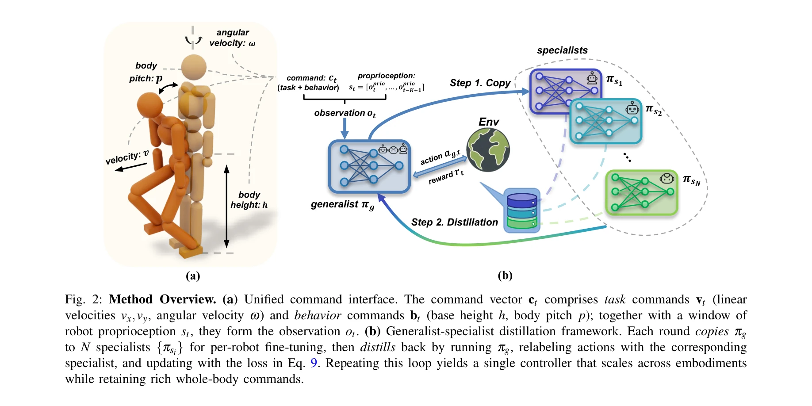
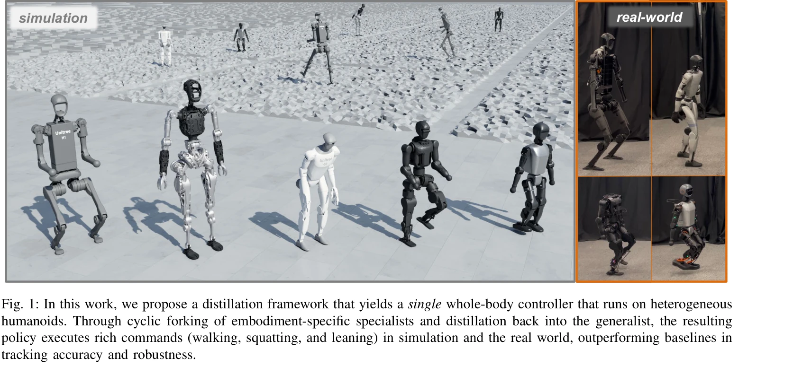

# Embodiment-Aware Generalist Specialist Distillation for Unified Humanoid Whole-Body Control

> **저자**: Quanquan Peng, Yunfeng Lin, Yufei Xue, Jiangmiao Pang, Weinan Zhang | **날짜**: 2026-02-27 | **DOI**: [10.48550/arXiv.2602.02960](https://doi.org/10.48550/arXiv.2602.02960)

---

## Essence

*Fig. 2: Method Overview. (a) Unified command interface. The command vector ct comprises task commands vt (linear*

EAGLE는 다양한 휴머노이드 로봇을 단일 정책으로 제어하기 위한 embodiment-aware generalist-specialist distillation 프레임워크로, 반복적인 전문가 미세조정과 일반화 정책으로의 지식 증류를 통해 여러 이종 로봇에서 보행, 스쿼팅, 기울임 등 다양한 whole-body 제어를 가능하게 한다.

## Motivation

- **Known**: RL 기반 휴머노이드 whole-body controller는 높은 성능을 보이지만 대부분 단일 로봇 embodiment을 대상으로 한다. Domain randomization이나 diffusion model 기반 접근법이 존재하지만 주로 저차원 속도 명령만 지원하고 실제 하드웨어에서 검증되지 않았다.
- **Gap**: DoF, dynamics, kinematic topology가 다른 이종 휴머노이드들을 단일 정책으로 제어하면서 동시에 단순 보행 이상의 다양한 행동(스쿼팅, 기울임)을 지원하는 것이 미해결 과제다. 특히 로봇별 reward tuning 없이 확장 가능한 방법이 부족하다.
- **Why**: 로봇 군집의 효율적 운영과 배포 시간 단축, 새로운 로봇 플랫폼 도입 시 전체 학습 파이프라인 재설정 불필요로 인한 비용 절감이 중요하며, fleet-level humanoid control이 실제 응용에서 필수적이다.
- **Approach**: generalist 정책에서 embodiment별 specialist를 분기하여 각 로봇에서 미세조정한 후, DAgger 기반 distillation으로 새로운 기술을 generalist로 역증류하는 반복 사이클을 구성했다. 통합된 고차원 명령 인터페이스(선형/각속도, 높이, 몸통 pitch)로 다양한 행동을 single policy로 지원한다.

## Achievement

*Fig. 1: In this work, we propose a distillation framework that yields a single whole-body controller that runs on hetero*

- **Cross-embodiment generalization**: Unitree H1, G1, Fourier N1, Booster T1, PNDbotics Adam 등 5개 시뮬레이션 환경과 4개 실제 로봇에서 검증된 단일 통합 정책 개발
- **Rich behavior support**: 보행, 스쿼팅, 기울임, 기본 높이 조절 등 고차원 명령을 단일 정책으로 지원
- **Reward tuning 제거**: 로봇별 reward function 조정 필요 없음으로 배포 시간 단축
- **Superior performance**: baseline 방법 대비 명령 추적 정확도 및 robustness 향상 입증
- **Scalability**: fleet-level humanoid control을 위한 확장 가능한 프레임워크 제시

## How

*Fig. 2: Method Overview. (a) Unified command interface. The command vector ct comprises task commands vt (linear*

- Unified command interface 설계: 작업 명령(vx, vy, ω)과 행동 명령(h, p) 분리로 5차원 명령 벡터 구성
- Embodiment-aware observation 구성: K=5 프레임의 proprioception(관절 위치/속도, base angular velocity, projected gravity)과 gait clock function 추가
- Asymmetric actor-critic paradigm 적용: critic만 privileged information(base linear velocity, height error, foot clearance, contact forces) 사용
- Iterative generalist-specialist distillation loop: (1) generalist를 N개 specialist로 복제, (2) 각 specialist를 해당 로봇에서 미세조정, (3) generalist를 실행하고 specialist로 action relabel, (4) pooled embodiment set에서 학습하여 generalist 업데이트, (5) 수렴까지 반복
- HugWBC 프레임워크 기반: 검증된 high-dimensional command space 아키텍처 활용

## Originality

- Embodiment-aware generalist-specialist distillation 루프의 혁신적 구조로 이종 로봇 제어의 scalability 달성
- DAgger 기반 on-policy distillation을 통한 specialist 지식의 효율적 역증류 메커니즘
- Unified high-dimensional command interface로 단순 보행을 넘어 스쿼팅, 기울임 등 rich behavior 지원
- 시뮬레이션과 실제 하드웨어(4개 물리 로봇) 모두에서 광범위하게 검증된 실증적 접근
- Per-robot reward tuning 제거로 배포 복잡도 대폭 감소

## Limitation & Further Study

- 현재 5개 시뮬레이션 로봇과 4개 실제 로봇으로 제한되어 있어 더욱 다양한 morphology(팔 개수, kinematic structure 차이 등)에 대한 일반화 검증 필요
- Specialist 미세조정 과정에서 compute cost 분석 부재로 실제 운영 비용 평가 어려움
- Command interface의 5차원이 모든 복잡한 whole-body behavior를 충분히 표현하는지 확인 필요(예: 복잡한 manipulation과 동시 로코모션)
- Real-world sim-to-real gap 분석 제시 부족; 어떤 embodiment 특성이 전이에 가장 큰 장애물인지 상세 분석 필요
- 후속 연구로 온라인 적응(online adaptation) 메커니즘 추가, 더 큰 morphology 차이 극복, multi-task hierarchical control 확장 고려

## Evaluation

- Novelty: 4/5
- Technical Soundness: 3/5
- Significance: 4/5
- Clarity: 4/5
- Overall: 4/5

**총평**: EAGLE는 generalist-specialist distillation을 통해 이종 휴머노이드의 통합 제어라는 어려운 문제에 대한 실증적 해결책을 제시하며, 시뮬레이션과 실제 하드웨어에서의 광범위한 검증으로 fleet-level 휴머노이드 제어의 실현 가능성을 보여주는 의미 있는 기여다.

## Related Papers

- 🏛 기반 연구: [[papers/1962_H-Zero_Cross-Humanoid_Locomotion_Pretraining_Enables_Few-sho/review]] — H-Zero의 cross-humanoid locomotion pretraining이 EAGLE의 embodiment-aware 다중 로봇 제어를 위한 기본적인 사전 학습 방법론을 제공한다.
- 🔗 후속 연구: [[papers/1665_Scalable_and_General_Whole-Body_Control_for_Cross-Humanoid_L/review]] — scalable whole-body control for cross-humanoid learning이 EAGLE의 generalist-specialist distillation을 더 확장 가능한 형태로 발전시킨다.
- 🔄 다른 접근: [[papers/1943_GBC_Generalized_Behavior-Cloning_Framework_for_Whole-Body_Hu/review]] — GBC의 generalized behavior-cloning이 EAGLE과 다른 접근으로 multiple humanoid control의 일반화 문제를 해결한다.
- 🔄 다른 접근: [[papers/1961_H-RDT_Human_Manipulation_Enhanced_Bimanual_Robotic_Manipulat/review]] — H-RDT의 bimanual 로봇 조작 향상 연구가 단일 정책 기반이 아닌 다른 방식으로 다양한 로봇 제어 문제를 해결하는 접근을 제시한다.
- 🧪 응용 사례: [[papers/2161_Trinity_A_Modular_Humanoid_Robot_AI_System/review]] — Trinity의 모듈형 휴머노이드 로봇 AI 시스템이 EAGLE의 여러 이종 로봇 제어 프레임워크를 실제 통합 시스템에 적용하는 구체적인 사례를 제공한다.
- 🏛 기반 연구: [[papers/1665_Scalable_and_General_Whole-Body_Control_for_Cross-Humanoid_L/review]] — embodiment-aware한 일반화 전문가 증류 방법의 기초 개념을 제공한다.
- 🔄 다른 접근: [[papers/1744_Unleashing_Humanoid_Reaching_Potential_via_Real-world-Ready/review]] — 휴머노이드의 범용성을 위해 서로 다른 접근(스킬 공간 기반 vs embodiment-aware distillation)을 통해 효율적이고 sim2real 전이 가능한 제어를 구현한다.
- 🔄 다른 접근: [[papers/1943_GBC_Generalized_Behavior-Cloning_Framework_for_Whole-Body_Hu/review]] — 둘 다 다양한 휴머노이드 embodiment 간 일반화를 다루지만 GBC는 행동 모방에, Embodiment-Aware는 specialist distillation에 초점을 맞춘다.
