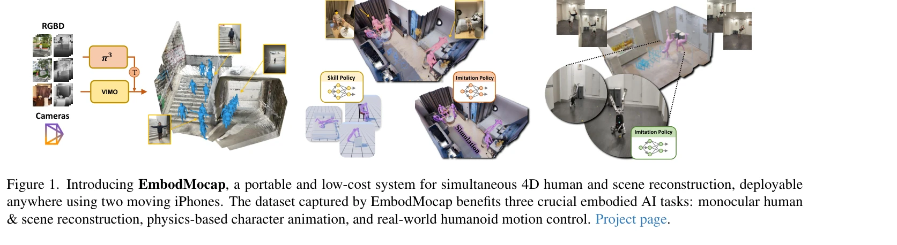
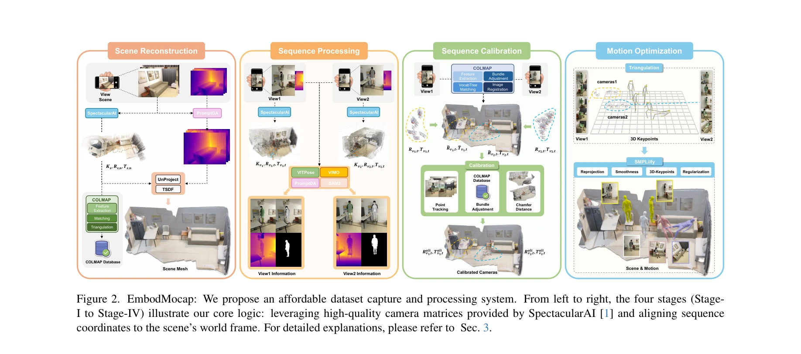

# EmbodMocap: In-the-Wild 4D Human-Scene Reconstruction for Embodied Agents

> **저자**: Wenjia Wang, Liang Pan, Huaijin Pi, Yuke Lou, Xuqian Ren, Yifan Wu, Zhouyingcheng Liao, Lei Yang, Rishabh Dabral, Christian Theobalt, Taku Komura | **날짜**: 2026-02-26 | **URL**: [https://arxiv.org/abs/2602.23205](https://arxiv.org/abs/2602.23205)

---

## Essence

*Figure 1. Introducing EmbodMocap, a portable and low-cost system for simultaneous 4D human and scene reconstruction, dep*

EmbodMocap은 두 개의 이동하는 iPhone을 사용하여 실외 환경에서 메트릭 스케일의 인간 동작과 3D 장면을 동시에 재구성하는 저비용 데이터 수집 파이프라인을 제안한다. 이 시스템은 모노큘러 재구성, 물리 기반 캐릭터 애니메이션, 로봇 제어 등 세 가지 embodied AI 작업을 지원한다.

## Motivation

- **Known**: 기존 motion capture 시스템은 PROX, RICH, EgoBody 등의 고비용 멀티뷰 스튜디오 환경이나 IMU, EM 센서 등 웨어러블 장치에 의존하고 있다. 이들은 높은 품질을 제공하지만 환경과 비용의 제약이 크다.
- **Gap**: 대규모 실외 환경에서 human-scene 상호작용을 포함한 고품질 4D 데이터를 저비용으로 수집할 수 있는 방법이 부족하다. 또한 depth ambiguity로 인해 메트릭 스케일 정확도를 유지하기 어렵다.
- **Why**: embodied AI는 현실 환경에서의 인간 행동과 장면 컨텍스트를 포함한 데이터로 학습되어야 하므로, 실제 환경에서 수집 가능한 고품질 4D 데이터는 로봇 제어, VR, 컴퓨터 비전 등 다양한 분야의 진전을 가능하게 한다.
- **Approach**: 두 개의 이동하는 RGB-D iPhone을 동시에 사용하여 dual-view RGB-D 시퀀스를 캡처하고, 이들을 통합된 월드 좌표계에서 jointly calibrate하여 인간과 장면을 모두 재구성한다. Dual-view 설정이 depth ambiguity를 완화하면서도 메트릭 스케일 정확도를 보장한다.

## Achievement

*Figure 3. Our dual view vs. single view results in optical studio.*

- **저비용 포터블 시스템**: 웨어러블 센서, 멀티뷰 카메라 리그, 또는 LiDAR 스캐너 없이 두 개의 iPhone만으로 메트릭 스케일의 4D 인간-장면 재구성을 수행
- **고품질 데이터셋**: 다양한 실외 환경에서 수집한 human-scene 상호작용 데이터 제공으로 embodied AI 모델 학습 지원
- **Dual-view depth ambiguity 해결**: 단일 iPhone 또는 모노큘러 방식 대비 우수한 정렬과 재구성 성능 달성
- **다중 응용 검증**: 모노큘러 재구성, physics-based character animation, sim-to-real humanoid control 세 가지 embodied AI 작업에서 효과성 입증

## How

*Figure 2. EmbodMocap: We propose an affordable dataset capture and processing system. From left to right, the four stage*

- 정적 장면을 단일 RGB-D 시퀀스에서 먼저 재구성하여 월드 스케일 정의
- 동기화된 dual-view RGB-D 비디오로 인간 동작 캡처
- 기하학적 정렬(geometric alignment)과 동작 최적화(motion optimization)를 수행하여 월드-앵커된 인간 포즈 복구
- Dual RGB-D input의 joint calibration and optimization으로 인간 메시와 장면 point cloud를 통합 좌표계에서 재구성
- Human3R 및 다른 feedforward model들을 수집된 데이터로 fine-tune하여 monocular human-scene reconstruction 수행
- 물리 시뮬레이션 프레임워크에서 physics-based character skills 학습 및 scene-aware motion tracking 수행
- Sim-to-real RL을 통해 humanoid robot이 비디오의 인간 동작을 모방하도록 훈련

## Originality

- **최소한의 하드웨어 요구**: 웨어러블 센서나 멀티뷰 카메라 리그 없이 두 개의 이동하는 consumer device만으로 메트릭 스케일 4D 재구성 달성하는 것은 기존 접근법과 근본적으로 다름
- **Dual-view RGB-D joint optimization**: 단일 RGB-D 카메라의 depth ambiguity 문제를 dual-view 설정의 상호 보완을 통해 해결하는 novel approach
- **Practical scalability**: 실외 환경에서 웨어러블 장치 없이 자연스러운 인간 외형을 보존하면서 실시간 capture 가능
- **Comprehensive embodied AI validation**: monocular reconstruction, physics-based animation, real-world robot control까지 일관된 데이터로 세 가지 주요 embodied AI 작업을 지원하는 통합적 검증

## Limitation & Further Study

- **Depth 센서의 본질적 한계**: iPhone의 RGB-D 카메라는 여전히 전문 depth 센서 대비 노이즈와 오류가 있을 수 있으며, 특히 복잡한 텍스처에서 성능 저하 가능성
- **실외 조명 변동성**: 야외 환경의 빠른 조명 변화가 RGB-D 캡처의 일관성에 영향을 미칠 수 있음
- **Occlusion 처리 제약**: 완전히 가려진 신체 부분이나 복잡한 human-scene interaction은 여전히 재구성 오류 가능
- **데이터셋 규모**: 논문에서 제시된 데이터셋의 절대적 크기와 활동 다양성이 명확하지 않음
- **후속 연구 방향**: 더 많은 실외 환경과 복잡한 그룹 상호작용 데이터 수집, 동적 장면에 대한 확장, 더 정교한 contact 감지 알고리즘 개발 필요

## Evaluation

- Novelty: 4/5
- Technical Soundness: 3/5
- Significance: 4/5
- Clarity: 4/5
- Overall: 4/5

**총평**: EmbodMocap은 embodied AI 연구의 실질적 장애물인 고비용 데이터 수집을 혁신적으로 해결하는 실용적이고 확장 가능한 시스템을 제시한다. Dual-view RGB-D의 joint optimization이라는 기술적 통찰력과 함께 monocular reconstruction, physics-based animation, robot control까지 포괄적으로 검증한 점에서 높은 가치를 지닌다.
