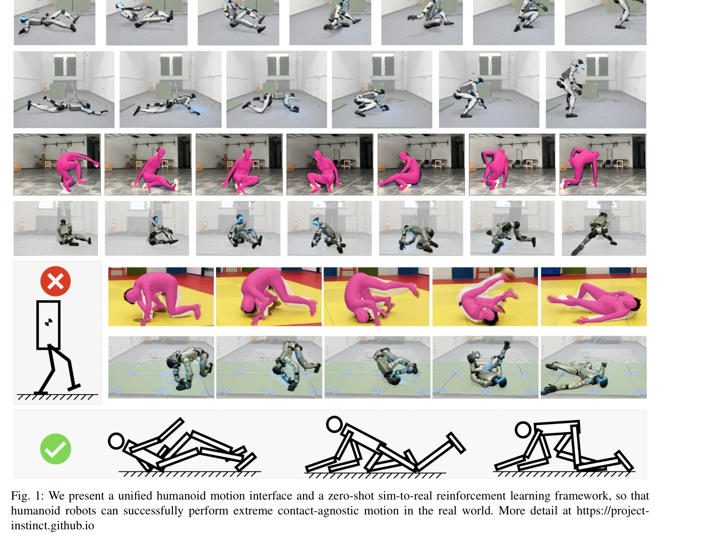

# Embrace Collisions: Humanoid Shadowing for Deployable Contact-Agnostics Motions

> **저자**: Ziwen Zhuang, Hang Zhao | **날짜**: 2025-02-03 | **URL**: [https://arxiv.org/abs/2502.01465](https://arxiv.org/abs/2502.01465)

---

## Essence

*Fig. 1: We present a unified humanoid motion interface and a zero-shot sim-to-real reinforcement learning framework, so *

본 논문은 휴머노이드 로봇이 온몸의 모든 신체 부위를 사용하여 환경과 상호작용하는 접촉-무관(contact-agnostic) 동작을 수행할 수 있도록 하는 통합 제어 프레임워크를 제안한다. GPU 가속 rigid-body simulator와 reinforcement learning을 활용하여 시뮬레이션에서 학습한 정책을 실제 로봇에 zero-shot으로 배포할 수 있음을 시연한다.

## Motivation

- **Known**: 기존 휴머노이드 로봇 연구는 발과 손만의 접촉을 가정하는 bipedal mobile manipulation 플랫폼으로 제한되어 있다. Model-predictive control과 learning-based 방법 모두 예측 불가능한 접촉 시퀀스와 extreme torso 움직임 처리에 어려움을 겪고 있다.
- **Gap**: 기존 연구는 극단적인 신체 회전(roll/pitch)과 다중 신체 부위 접촉을 포함하는 동작을 다루지 못하고 있으며, 이러한 복잡한 시나리오에 적합한 motion command interface와 termination condition 설계가 부재하다.
- **Why**: 휴머노이드 로봇의 고유한 형태학적 이점을 활용하기 위해 앉기, 누워 일어나기, 바닥에서 구르기 등 인간이 수행하는 전체 범위의 동작을 지원하는 것이 필요하다.
- **Approach**: Transformer 기반 motion command encoder, key-frame 기반 motion command 표현, advantage mixing 기법을 통해 sparse task reward와 dense regularization reward를 균형있게 처리하고, 새로운 termination condition을 설계하여 extreme rotation 상황에 대응한다.

## Achievement

*Fig. 2: Training Framework: We build an extreme-action dataset from AMASS dataset and internet videos using 4D-Human [14*

- **통합 동작 인터페이스**: robot base frame에서 모든 동작 목표를 표현하여 standing과 lying down 등 다양한 자세 간 전환을 일관되게 처리
- **극단 동작 데이터셋**: AMASS에서 극단적인 roll/pitch 방향성을 가진 extreme-action dataset 구성으로 training 데이터 확충
- **Zero-shot Sim-to-Real 전이**: 시뮬레이션에서만 학습한 정책이 실제 로봇에서 stochastic contact와 큰 base rotation에도 불구하고 성공적으로 작동
- **Hardware-safe 정책**: Advantage mixing으로 energy efficiency와 torque minimization 같은 regularization 보상을 task 신호와 균형있게 통합

## How

*Fig. 5: To handle a variable of input motion command, the*

- Transformer 기반 multi-headed self-attention encoder로 가변 개수의 motion command input 처리 가능하게 구성
- Key-frame 기반 motion command로 future motion expectation 정보 제공
- Extreme-action dataset 구축: AMASS motion에서 torso가 extreme roll/pitch 방향을 가지도록 필터링 및 augmentation
- Multi-critic advantage mixing 기법으로 sparse motion reward와 dense regularization reward 간의 갈등 해결
- Base orientation에 상관없이 작동하도록 재설계된 termination condition (motion target 편차 기반)
- Domain randomization 기법으로 sim-to-real gap 완화
- GPU-accelerated rigid-body simulator에서 전체 body collision을 고려한 정책 학습

## Originality

- 최초로 접촉-무관 humanoid 동작을 통합 프레임워크로 다룬 점
- Key-frame 기반 motion command encoder를 Transformer로 구현하여 가변 길이 입력 처리
- Advantage mixing을 통한 sparse/dense reward 균형 기법의 창의적 적용
- Base rotation 무관한 새로운 termination condition 설계로 극단 동작 지원
- Extreme-action dataset 구성으로 기존 AMASS의 한계(standing 자세 과다 표현) 극복

## Limitation & Further Study

- Extreme-action dataset의 구체적 구성 방법이 충분히 상세히 기술되지 않음 (Fig. 3, 4 참고 요청)
- Real-world 실험 결과가 논문 본문에 포함되지 않아 실제 성능 검증 부족
- Simplified collision shape 사용으로 인한 sim-to-real gap의 정량적 분석 미흡
- 다른 humanoid 플랫폼이나 morphology에 대한 generalization 가능성 미검토
- 계산 복잡도 및 real-time 성능(latency, inference time) 분석 부재
- 후속연구: 더 복잡한 manipulation task와의 통합, multiple contact 상황의 최적화, 다른 로봇 형태로의 확장

## Evaluation

- Novelty: 4/5
- Technical Soundness: 3/5
- Significance: 4/5
- Clarity: 3/5
- Overall: 4/5

**총평**: 본 논문은 접촉-무관 극단 동작을 지원하는 humanoid 제어의 중요한 진전을 이루었으며, 새로운 motion interface와 training 기법이 창의적이다. 다만 실험 검증과 기술 상세 설명이 더 필요하고, project website 의존도가 높아 독립적 평가에 제약이 있다.

## Related Papers

- 🏛 기반 연구: [[papers/1676_SimGenHOI_Physically_Realistic_Whole-Body_Humanoid-Object_In/review]] — SimGenHOI의 물리적으로 현실적인 인간-객체 상호작용이 contact-agnostic 동작에 필요한 환경 상호작용 시뮬레이션 기반을 제공한다
- 🔗 후속 연구: [[papers/1909_Embracing_Bulky_Objects_with_Humanoid_Robots_Whole-Body_Mani/review]] — 부피가 큰 객체와의 전신 조작이 Embrace Collisions의 contact-agnostic 프레임워크를 더욱 복잡하고 실용적인 상황으로 확장한다
- 🔄 다른 접근: [[papers/1965_HAIC_Humanoid_Agile_Object_Interaction_Control_via_Dynamics-/review]] — 환경과의 상호작용을 contact-agnostic shadowing과 dynamics-aware object interaction이라는 서로 다른 접근법으로 처리한다
- 🏛 기반 연구: [[papers/1845_Collision-Free_Humanoid_Traversal_in_Cluttered_Indoor_Scenes/review]] — collision-free traversal 기술이 contact-agnostic 동작에서 환경과의 충돌을 의도적으로 활용하는 상반된 접근법의 이론적 대비점을 제공한다.
- ⚖️ 반론/비판: [[papers/2117_Omni-Perception_Omnidirectional_Collision_Avoidance_for_Legg/review]] — Omni-Perception의 충돌 회피와 Embrace Collisions의 충돌 활용은 환경 상호작용에 대한 정반대 철학을 제시하여 흥미로운 대조를 이룬다.
- 🔗 후속 연구: [[papers/1836_CHIP_Adaptive_Compliance_for_Humanoid_Control_through_Hindsi/review]] — adaptive compliance control이 contact-agnostic 동작에서 다양한 접촉 상황에 대한 적응적 대응을 가능하게 하는 기술적 확장을 제공한다.
- 🔗 후속 연구: [[papers/1861_Deep_Whole-body_Parkour/review]] — Deep Whole-body Parkour의 전신 파쿠어 기술이 접촉-무관 동작의 극한 형태로 환경 상호작용을 확장한 개념입니다.
- 🏛 기반 연구: [[papers/1757_Whole-body_Multi-contact_Motion_Control_for_Humanoid_Robots/review]] — 전신 다중접촉 동작 제어 기술이 접촉-무관 동작 수행의 핵심 이론적 토대를 제공합니다.
- 🧪 응용 사례: [[papers/1714_Thor_Towards_Human-Level_Whole-Body_Reactions_for_Intense_Co/review]] — Thor의 접촉 대응 기술이 충돌을 적극 활용하는 humanoid shadowing에 직접 적용 가능합니다.
- 🏛 기반 연구: [[papers/2106_MorphoGuard_A_Morphology-Based_Whole-Body_Interactive_Motion/review]] — MorphoGuard의 복잡한 다중 접촉 관리가 Embrace Collisions의 배포 가능한 접촉 제어에서 충돌 상황 처리에 필요한 이론적 기반을 제공한다.
- 🔗 후속 연구: [[papers/2125_Opening_the_Sim-to-Real_Door_for_Humanoid_Pixel-to-Action_Po/review]] — Embrace Collisions의 deployable contact control이 문 열기 정책의 RGB-only visual policy를 물리적 접촉이 필요한 더 복잡한 manipulation으로 확장합니다.
