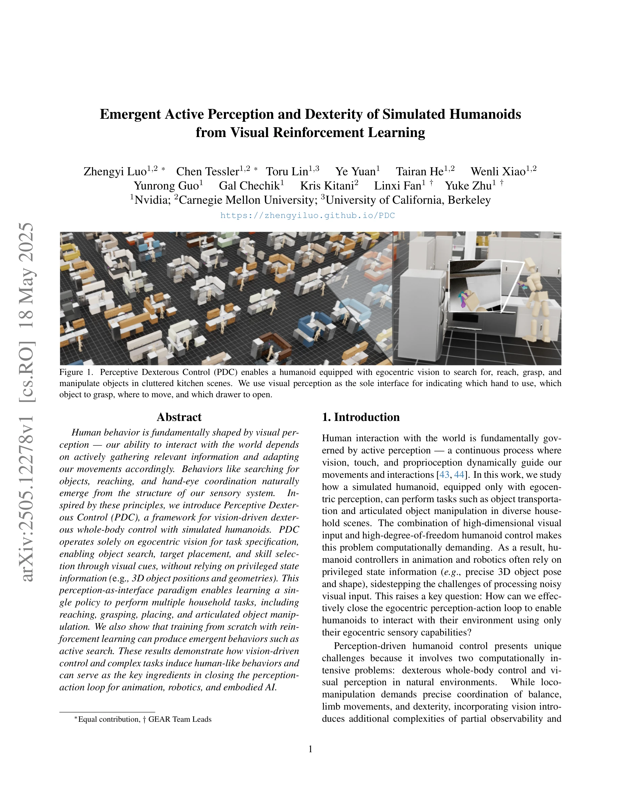
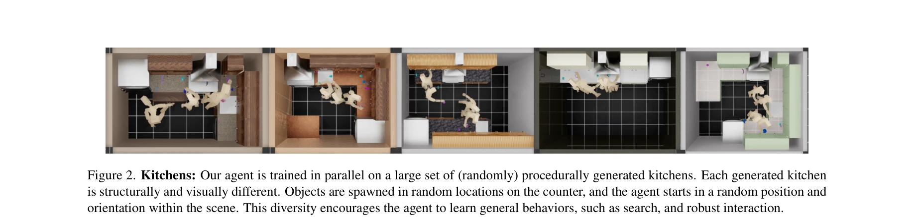

# Emergent Active Perception and Dexterity of Simulated Humanoids from Visual Reinforcement Learning

> **저자**: Zhengyi Luo, Chen Tessler, Toru Lin, Ye Yuan, Tairan He, Wenli Xiao, Yunrong Guo, Gal Chechik, Kris Kitani, Linxi Fan, Yuke Zhu | **날짜**: 2025-05-18 | **URL**: [https://arxiv.org/abs/2505.12278](https://arxiv.org/abs/2505.12278)

---

## Essence

*Figure 1. Perceptive Dexterous Control (PDC) enables a humanoid equipped with egocentric vision to search for, reach, gr*

본 논문은 egocentric vision만을 사용하여 simulated humanoid가 복잡한 household tasks를 수행하도록 하는 Perceptive Dexterous Control (PDC) 프레임워크를 제안하며, visual perception을 task specification의 인터페이스로 활용하여 active search 등의 emergent behaviors를 유도한다.

## Motivation

- **Known**: Humanoid loco-manipulation 제어와 visual dexterous manipulation은 각각 활발히 연구되고 있으나, 대부분의 기존 연구는 privileged state information (3D object pose/shape)에 의존하거나 fixed camera 등의 제약이 있다.
- **Gap**: Egocentric vision만으로 humanoid의 whole-body dexterous control을 달성하면서 동시에 human-like active search 같은 emergent behaviors를 유도하는 방법이 부재하다.
- **Why**: Vision-driven humanoid control은 로봇공학, embodied AI, animation 분야에서 실질적 응용 가치가 높으며, perception-action loop의 폐곡선화는 real-world deployment의 핵심 요소이다.
- **Approach**: Control priors를 motion capture data로부터 학습하고, visual cues (object masks, 3D markers)를 통한 perception-as-interface 패러다임으로 task를 지정하여 RL을 통해 단일 정책으로 다중 tasks를 학습한다.

## Achievement

*Figure 1. Perceptive Dexterous Control (PDC) enables a humanoid equipped with egocentric vision to search for, reach, gr*

- **Vision-driven whole-body dexterous control 실현**: RGB, RGB-D, Stereo 등 다양한 visual modalities에서 naturalistic household environments에서의 humanoid 제어 달성
- **Perception-based task specification**: Predefined state variables 없이 visual cues만으로 object selection, target placement, skill specification을 가능하게 하는 task-agnostic paradigm 제안
- **Emergent human-like behaviors**: Active search, whole-body coordination 등의 behaviors가 vision-driven RL training으로부터 자연스럽게 emergence됨을 실증
- **Visual modality별 성능 비교**: Stereo vision이 RGB 대비 9% 더 높은 success rate 달성 등 systematic evaluation 제시

## How

*Figure 2. Kitchens: Our agent is trained in parallel on a large set of (randomly) procedurally generated kitchens. Each *

- Large-scale motion capture 데이터로부터 control priors 학습을 통한 humanoid의 기본 운동 능력 확보
- Egocentric vision (RGB/RGB-D/Stereo)과 proprioception을 policy input으로 사용
- Object masks와 3D markers를 통한 visual perception-based task encoding으로 perception-as-interface 구현
- Procedurally generated diverse kitchen scenes에서의 large-scale RL training으로 generalization capability 확보
- Hierarchical RL framework의 활용으로 high-level task planning과 low-level motion execution 분리
- Multiple household tasks (reaching, grasping, placing, articulated object manipulation)에 대한 unified policy 학습

## Originality

- Egocentric vision만으로 full humanoid loco-manipulation을 handling하는 첫 시도로, privileged information 제거로 인한 partial observability 및 active perception 문제를 체계적으로 해결
- Perception-as-interface 패러다임을 humanoid control에 적용하여 task-agnostic input representation 제안, 기존 phase variables나 predefined state variables의 한계 극복
- Visual cues를 통한 task specification이 lifelong learning과 fine-tuning을 가능하게 하여 policy의 재학습 없이 새로운 tasks 처리 가능
- Emergent active search behaviors의 명시적 입증으로, vision-driven RL의 이점을 human-like behavior generation 측면에서 새롭게 해석

## Limitation & Further Study

- Simulated 환경에서의 결과이므로 sim-to-real transfer의 실행 가능성이 검증되지 않음
- Visual cues (object masks, 3D markers) 사용이 real-world deployment에서 practical하지 않을 수 있으며, end-to-end natural language instructions으로의 확장이 미충분
- Procedurally generated kitchens에 국한되어 다양한 household 환경 (living room, bathroom 등)에 대한 generalization 미검증
- Computational cost와 training sample efficiency에 대한 상세 분석 부족
- 후속 연구로 real-world humanoid에 대한 sim-to-real transfer, natural language grounding, long-horizon task planning의 개선이 필요

## Evaluation

- Novelty: 4/5
- Technical Soundness: 3/5
- Significance: 4/5
- Clarity: 4/5
- Overall: 4/5

**총평**: 본 논문은 egocentric vision을 유일한 정보원으로 하는 humanoid whole-body dexterous control의 실현이라는 도전적 문제를 perception-as-interface 패러다임과 hierarchical RL을 통해 창의적으로 해결하며, emergent active search behaviors의 명시적 입증을 통해 vision-driven control의 이점을 새롭게 조명한다.
