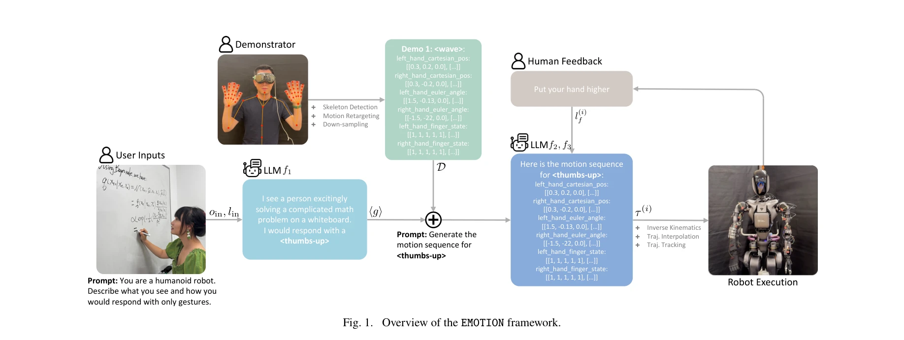

# EMOTION: Expressive Motion Sequence Generation for Humanoid Robots with In-Context Learning

> **저자**: Peide Huang, Yuhan Hu, Nataliya Nechyporenko, Daehwa Kim, Walter Talbott, Jian Zhang | **날짜**: 2024-10-30 | **URL**: [https://arxiv.org/abs/2410.23234](https://arxiv.org/abs/2410.23234)

---

## Essence

*Fig. 1. Overview of the EMOTION framework.*

EMOTION은 대규모 언어 모델(LLM)의 문맥 학습 능력을 활용하여 인간형 로봇이 표정, 제스처, 신체 움직임 등 자연스러운 비언어적 의사소통을 수행할 수 있도록 하는 프레임워크이다. 온라인 사용자 연구를 통해 생성된 모션이 인간 수행자와 동등하거나 우수함을 입증했다.

## Motivation

- **Known**: 로봇의 표현적 행동이 인간-로봇 상호작용을 개선할 수 있으며, 전통적으로 수작업으로 제작된 모션 시퀀스나 사전 녹음된 궤적에 의존하는 방법이 사용되어 왔다.
- **Gap**: 기존 방법들은 인간 비언어 의사소통의 다양성과 미묘함을 충분히 모방하지 못하며, 무한한 수의 다양한 제스처를 위해 인간이 직접 엔지니어링한 모션 프리미티브가 필요하다.
- **Why**: 인간형 로봇의 자연스러운 제스처 생성은 사용자의 만족도와 몰입도를 증대시키고, 로봇의 사회적 수용성을 높이는 데 중요하다.
- **Approach**: LLM과 vision-language model의 in-context learning 능력을 활용하여 사회적 맥락에서 표현적 모션 시퀀스를 동적으로 생성하며, 인간 피드백을 통해 반복적으로 개선하는 EMOTION++ 버전도 제시한다.

## Achievement

*Fig. 1. Overview of the EMOTION framework.*

- **제스처 생성 능력**: 10개의 서로 다른 표현적 제스처(thumbs-up, wave, stop 등)를 자동으로 생성할 수 있으며, 일부 제스처에서는 인간 수행자보다 우수한 자연스러움과 이해도를 달성했다.
- **인간 피드백 통합**: EMOTION++가 EMOTION보다 자연스러움과 이해도 측면에서 유의미하게 우수함을 보여주었다.
- **설계 시사점**: 손 위치, 움직임 패턴, 팔과 어깨 관절, 손가락 자세, 속도 등 로봇 제스처의 인간 지각에 영향을 미치는 주요 변수들을 식별했다.

## How

*Fig. 1. Overview of the EMOTION framework.*

- 사용자 언어 지시, 로봇 이미지 관찰을 입력으로 받아 LLM이 연속값 모션 시퀀스(cartesian position, euler angle, finger state)를 텍스트로 생성
- 생성된 모션 시퀀스에 inverse kinematics를 적용하여 로봇의 관절 명령으로 변환
- trajectory interpolation과 trajectory tracking을 통해 로봇에서 실행
- 인간 피드백이 제공되면 LLM에 해당 피드백을 문맥으로 추가하여 모션 시퀀스를 반복 개선
- skeleton detection, motion retargeting, down-sampling을 통해 인간 데모로부터 모션 학습 지원

## Originality

- 기존의 GenEM과 달리, 사전 정의된 고수준 스킬 라이브러리 없이 LLM이 직접 복잡한 손과 손가락 궤적을 최소한의 예제로 생성하는 점이 혁신적이다.
- 조작(manipulation) 또는 이동(locomotion) 정책이 아닌 인간-로봇 상호작용 영역에 LLM 기반 시퀀스 생성을 적용한 점이 차별화된다.
- 자연언어 인간 피드백을 직접적으로 모션 시퀀스 개선에 통합하는 반복적 개선 방식이 새롭다.

## Limitation & Further Study

- 평가된 제스처가 10개로 제한적이며, 일부 제스처(listening, jazz-hands)는 3점 미만의 낮은 평가를 받아 모든 제스처에서 성능이 일정하지 않다.
- 온라인 사용자 연구만 수행되었으며, 실제 로봇-인간 상호작용 시나리오에서의 성능 검증이 부족하다.
- LLM의 출력이 항상 유효한 모션 시퀀스를 생성하는지, 또는 에러 처리 메커니즘이 어떻게 작동하는지 명확하지 않다.
- **후속 연구**: 더 광범위한 제스처 집합에 대한 평가, 실제 인간-로봇 상호작용 환경에서의 장시간 평가, LLM의 신뢰성 및 안정성 개선, 다양한 로봇 플랫폼으로의 확장

## Evaluation

- Novelty: 4/5
- Technical Soundness: 3/5
- Significance: 4/5
- Clarity: 4/5
- Overall: 4/5

**총평**: EMOTION은 LLM의 in-context learning을 창의적으로 활용하여 인간형 로봇의 표현적 모션 생성을 자동화한 실질적 솔루션을 제시한다. 사용자 연구를 통한 검증과 인간 피드백 통합 방식은 실용성을 높이나, 다양한 제스처에 대한 성능 편차와 실제 상호작용 환경 테스트의 필요성이 향후 과제로 남아 있다.
