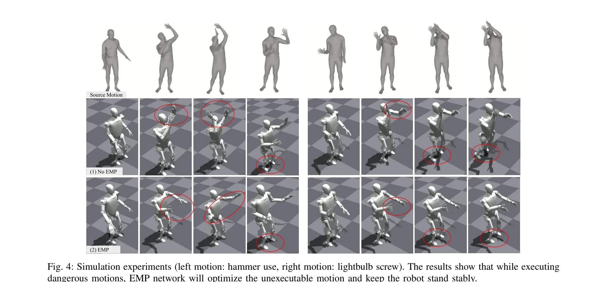

# EMP: Executable Motion Prior for Humanoid Robot Standing Upper-body Motion Imitation

> **저자**: Haocheng Xu, Haodong Zhang, Zhenghan Chen, Rong Xiong | **날짜**: 2025-07-21 | **URL**: [https://arxiv.org/abs/2507.15649](https://arxiv.org/abs/2507.15649)

---

## Essence

*Fig. 2: Overview of our framework. Motion Retargeting (section III): We train a graph convolution retargeting network to*

휴머노이드 로봇이 서 있는 자세를 유지하면서 인간의 상체 동작을 모방하기 위해 강화학습과 Executable Motion Prior(EMP) 모듈을 결합한 프레임워크를 제안한다.

## Motivation

- **Known**: 휴머노이드 로봇의 동작 모방을 위해 RL 기반 제어기가 널리 사용되고 있으며, 동작 retargeting 기술로 인간 동작을 로봇 동작으로 변환할 수 있다.
- **Gap**: 기존의 전신 제어 방식은 안정성과 동작 유사성 사이의 충돌이 발생하며, 상체 동작 목표를 직접 실행하면 로봇의 제어 범위를 초과하여 균형을 잃을 수 있다.
- **Why**: 휴머노이드 로봇이 조작 작업을 수행하기 위해서는 안정적인 서 있는 자세를 유지하면서 상체 동작을 자연스럽게 수행해야 하며, 이는 실제 로봇 배포에 필수적이다.
- **Approach**: Motion retargeting network로 대규모 상체 동작 데이터셋을 생성하고, RL 정책으로 하체 제어를 담당하면서 EMP 모듈이 로봇의 현재 상태에 기반하여 상체 목표 동작을 최적화한다.

## Achievement

*Fig. 4: Simulation experiments (left motion: hammer use, right motion: lightbulb screw). The results show that while exe*

- **Motion Retargeting Network**: Graph convolutional network와 VQ-VAE를 기반으로 한 구조로 인간 동작을 휴머노이드 동작으로 효과적으로 변환
- **Executable Motion Prior(EMP) 모듈**: 로봇의 현재 상태를 인코딩하여 불안정한 동작을 안정적인 동작으로 변환하면서 동작 진폭의 변화를 최소화
- **RL 기반 상체 모방 정책**: Domain randomization을 적용하여 강건한 정책을 학습하고 하체 제어를 통해 전체 신체 균형 유지
- **Sim-to-Real 전이**: 시뮬레이션에서 훈련된 정책을 두 종류의 실제 휴머노이드 로봇에 성공적으로 배포

## How

*Fig. 2: Overview of our framework. Motion Retargeting (section III): We train a graph convolution retargeting network to*

- Human skeleton과 humanoid skeleton을 그래프로 표현하고 graph convolutional layer를 통해 motion encoding 수행
- VQ codebook layer를 사용하여 latent space에서 이산화된 동작 표현 생성
- Upper-body 모션 목표를 추적하는 RL 정책 훈련 (reward는 상체 추적 정확도와 전신 안정성의 조합)
- VAE 기반 EMP network로 (로봇 상태, 동작 목표) 쌍을 인코딩하여 실행 가능한 목표 동작으로 디코딩
- Domain randomization (마찰, 질량, 토크 노이즈 등)을 통해 sim-to-real robustness 강화
- World model을 통해 상태 전이 과정을 시뮬레이션하고 gradient backpropagation 지원

## Originality

- 기존의 '전신 제어' vs '상체 직접 실행' 양극단을 벗어나 EMP를 통해 상체 목표를 동적으로 조정하는 중간 접근법 제시", '로봇의 현재 상태에 기반하여 실시간으로 동작 목표를 최적화하는 개념적 혁신 (인간의 위험 인지 및 동작 조정 능력을 모방)
- Motion retargeting, RL 정책, EMP network의 3단계 파이프라인을 통합한 완전한 프레임워크 구성
- 실제 로봇 배포 및 검증으로 실용성 입증

## Limitation & Further Study

- 상체 동작에만 초점을 맞추고 있어 전신 복잡한 동작에 대한 확장성이 미흡할 수 있음
- EMP network의 훈련에 사전에 생성된 motion dataset과 trained RL controller가 필요하여 초기 설정 비용이 높음
- Domain randomization의 범위와 선택이 sim-to-real 성능에 미치는 영향에 대한 상세한 분석 부족
- 다양한 신체 형태의 휴머노이드에 대한 일반화 가능성이 명확하지 않음
- 후속 연구로 전신 동작으로의 확장, EMP network의 설계 자동화, 더 강력한 sim-to-real 전이 메커니즘 개발 필요

## Evaluation

- Novelty: 4/5
- Technical Soundness: 3/5
- Significance: 4/5
- Clarity: 4/5
- Overall: 4/5

**총평**: 이 논문은 RL과 동작 prior를 결합하여 휴머노이드 로봇의 안정적인 상체 동작 모방을 실현하는 실용적인 솔루션을 제시하며, 실제 로봇 배포를 통해 그 효과를 입증한 우수한 연구이다.
