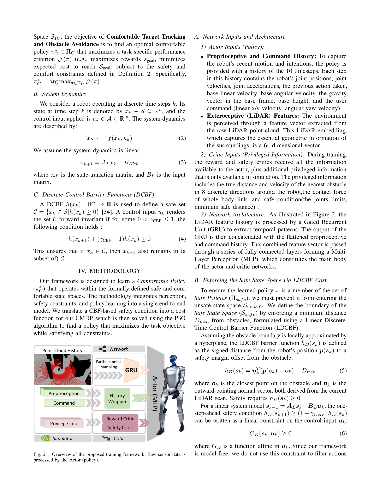

# End-to-End Humanoid Robot Safe and Comfortable Locomotion Policy

> **저자**: Zifan Wang, Xun Yang, Jianzhuang Zhao, Jiaming Zhou, Teli Ma, Ziyao Gao, Arash Ajoudani, Junwei Liang | **날짜**: 2025-08-11 | **URL**: [https://arxiv.org/abs/2508.07611](https://arxiv.org/abs/2508.07611)

---

## Essence

*Fig. 1.*

휴머노이드 로봇의 안전하고 편안한 네비게이션을 위해 LiDAR 포인트 클라우드를 모터 커맨드로 직접 매핑하는 end-to-end 정책을 제시하며, CMDP 프레임워크에서 CBF 원리를 비용 함수로 변환하여 P3O로 안전 제약을 강제한다.

## Motivation

- **Known**: RL 기반 레그드 로봇 제어는 뛰어난 민첩성을 보이지만 대부분 환경 인지가 없는 blind controller이거나, 깊이 카메라 기반 2D 높이 맵을 사용하여 비지면 장애물을 감지하지 못한다.
- **Gap**: LiDAR를 통한 실시간 3D 인지와 형식적으로 검증 가능한 안전 보장, 그리고 인간-로봇 상호작용 관점의 편안성을 동시에 달성하는 end-to-end 정책이 부재하다.
- **Why**: 휴머노이드 로봇이 인간 중심의 비정형 환경에서 배포되려면 충돌 회피를 넘어 안전성과 사회적 수용성을 갖춘 네비게이션 능력이 필수적이기 때문이다.
- **Approach**: CMDP 프레임워크에서 CBF 원리를 비용 함수로 번역하여 model-free P3O 알고리즘을 통해 훈련 중 안전 제약을 강제하고, 인간-로봇 상호작용 연구 기반의 편안함 보상을 도입한다.

## Achievement

- **LiDAR 기반 end-to-end 정책**: 원본 spatio-temporal 포인트 클라우드를 직접 처리하여 복잡한 3D 장애물 환경에서 robust 네비게이션을 실현
- **CBF-CMDP-P3O 통합 프레임워크**: model-based CBF 이론을 model-free RL과 결합하여 형식적 안전 보장과 학습 효율성을 동시에 달성
- **편안함 중심 보상 설계**: 인간 심리학 기반으로 접근 속도, 예측 가능성, 침입감을 명시적으로 최소화하는 reward 구조 구성
- **sim-to-real 성공적 전이**: 시뮬레이션에서 훈련된 정책을 물리 휴머노이드 로봇에 적용하여 정적·동적 장애물 회피 입증

## How

*Fig. 2.*

- 상태 공간을 안전(Ssafe)과 비안전(Sunsafe) 집합으로 분할하고, 편안한 상호작용 공간(Interactive Comfortable Space, ICS) 부분집합 정의
- 선형 시스템 동역학(xk+1 = ALxk + BLuk) 가정 하에서 DCBF 조건(h(xk+1) + (γCBF−1)h(xk) ≥ 0)을 CMDP의 비용 함수로 변환
- P3O 알고리즘으로 보상 최대화(JR(π))와 제약 만족(JCj(π) ≤ ϵj) 동시 달성
- LiDAR 센서로부터 3D 포인트 클라우드를 입력 받아 policy network가 motor command 출력하는 구조
- 인간 근접성, 로봇 속도, 예측 불가능한 움직임에 대한 penalty를 편안함 보상으로 추가

## Originality

- Control Barrier Function의 형식적 안전 보장 개념을 model-free RL의 CMDP 비용 함수로 창의적으로 변환한 novel 방법론
- 기존 collision penalty 기반 보상 설계의 한계를 극복하기 위해 HRI 연구 기반 comfort-oriented 보상 구조 최초 도입
- LiDAR의 lighting-invariant 특성과 3D 정보 활용을 강조하며 2D 높이 맵의 제약을 명시적으로 지적하고 해결
- Safe와 Comfortable 정책을 형식적으로 정의(Definition 1-3)하여 이론적 엄밀성 강화

## Limitation & Further Study

- 선형 시스템 동역학 가정이 복잡한 휴머노이드 로봇의 비선형 역학을 완전히 포괄하지 못할 가능성
- CMDP 제약 임계값(ϵj) 설정의 휴리스틱 특성과 최적값 결정 방법론 부재
- 시뮬레이션과 실제 로봇 간 도메인 갭(LiDAR 노이즈, 동역학 편차 등) 정량적 분석 부족
- Interactive Comfortable Space(ICS) 정의가 특정 환경·문화에 의존적이며 일반화 가능성 제한
- 후속 연구: (1) 비선형 동역학 통합, (2) 적응형 제약 임계값 학습, (3) 다양한 실제 환경·인간 피험자 대상 검증, (4) transfer learning을 통한 환경별 맞춤형 comfort 정책 개발

## Evaluation

- Novelty: 4/5
- Technical Soundness: 4/5
- Significance: 4/5
- Clarity: 4/5
- Overall: 4/5

**총평**: 본 논문은 LiDAR 기반 end-to-end 정책, CBF-CMDP-P3O 통합 프레임워크, HRI 기반 편안함 설계를 통해 휴머노이드 로봇의 안전하고 사회적으로 수용 가능한 네비게이션 문제를 종합적으로 해결한 강력한 기여를 제시한다. 형식적 안전 보장과 실제 배포의 균형을 잘 맞추었으며, 다만 비선형 동역학과 도메인 갭 분석 강화가 필요하다.

## Related Papers

- 🔄 다른 접근: [[papers/1941_Gallant_Voxel_Grid-based_Humanoid_Locomotion_and_Local-navig/review]] — 둘 다 LiDAR 기반 휴머노이드 보행을 다루지만 End-to-End 정책은 안전성을, Gallant는 3D 제약 지형 횡단을 중심으로 한다.
- 🏛 기반 연구: [[papers/1671_SHIELD_Safety_on_Humanoids_via_CBFs_In_Expectation_on_Learne/review]] — CMDP에서 CBF 원리를 비용 함수로 변환하는 접근법이 SHIELD의 CBF 기반 안전 제어 이론에 기반한다.
- 🔗 후속 연구: [[papers/1693_STATE-NAV_Stability-Aware_Traversability_Estimation_for_Bipe/review]] — End-to-End 안전 보행 정책을 STATE-NAV의 안정성 인식 횡단 추정과 결합하면 더 강건한 지형 네비게이션이 가능하다.
- 🔄 다른 접근: [[papers/1978_Hiking_in_the_Wild_A_Scalable_Perceptive_Parkour_Framework_f/review]] — Hiking in the Wild의 perceptive parkour가 CBF 기반 안전 제약이 아닌 다른 방식으로 복잡한 지형 내비게이션 문제를 해결하는 접근을 제시한다.
- 🧪 응용 사례: [[papers/1954_Geometry-Aware_Predictive_Safety_Filters_on_Humanoids_From_P/review]] — Geometry-Aware Predictive Safety Filters 연구가 end-to-end 정책의 P3O 안전 제약을 실제 휴머노이드 시스템에 적용하는 구체적인 구현 방법을 제공한다.
- 🏛 기반 연구: [[papers/1939_Gait-Adaptive_Perceptive_Humanoid_Locomotion_with_Real-Time/review]] — Gait-Adaptive의 통합 정책 기반 보행 적응이 End-to-End 안전 보행 정책의 실시간 제어 구현에 기반 기술을 제공한다.
- 🔗 후속 연구: [[papers/1941_Gallant_Voxel_Grid-based_Humanoid_Locomotion_and_Local-navig/review]] — Gallant의 3D 제약 지형 횡단 능력을 End-to-End 안전 정책과 결합하면 복잡한 환경에서도 안전한 네비게이션이 가능하다.
