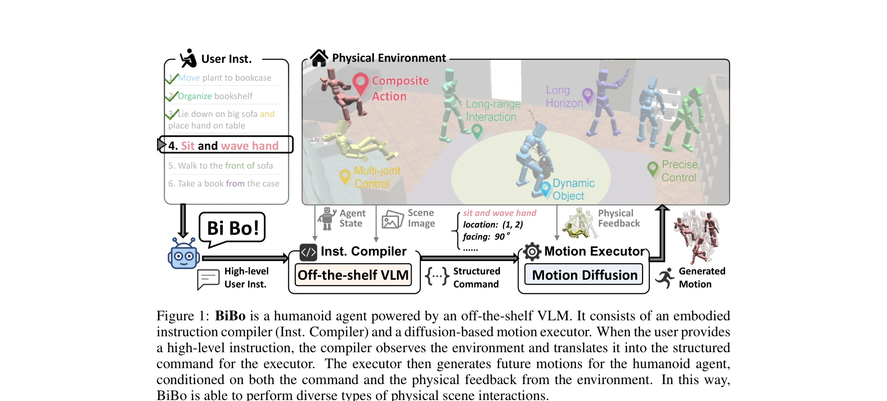

# Endowing GPT-4 with a Humanoid Body: Building the Bridge Between Off-the-Shelf VLMs and the Physical World

> **저자**: Yingzhao Jian, Zhongan Wang, Yi Yang, Hehe Fan | **날짜**: 2025-10-28 | **URL**: [https://arxiv.org/abs/2511.00041](https://arxiv.org/abs/2511.00041)

---

## Essence

*Figure 1: BiBo is a humanoid agent powered by an off-the-shelf VLM. It consists of an embodied*

off-the-shelf VLM(GPT-4)을 humanoid agent의 제어에 활용하기 위해 embodied instruction compiler와 diffusion-based motion executor로 구성된 BiBo 프레임워크를 제안하고, 이를 통해 대규모 데이터 수집 없이 개방형 환경에서의 유연한 상호작용을 가능하게 함.

## Motivation

- **Known**: Humanoid agent의 제어를 위해 대규모 human-scene interaction 데이터를 수집하여 학습하는 것이 일반적이지만, 이는 비용이 많이 들고 일반화가 어려움. 한편 GPT-4 같은 off-the-shelf VLM은 강한 open-world reasoning 능력을 보유하고 있음.
- **Gap**: 일반적으로 humanoid agent는 물리 환경에서의 flexible하고 diverse한 상호작용을 처리하기 어려우며, high-level natural language instruction을 low-level motor control로 변환하는 메커니즘이 부족함.
- **Why**: Humanoid agent는 디지털 지능과 물리 세계를 연결하는 중요한 매체이며, off-the-shelf VLM의 우수한 일반화 능력을 활용하면 데이터 수집 비용을 크게 절감할 수 있음.
- **Approach**: High-level instruction을 structured command로 변환하는 embodied instruction compiler와 physical feedback에 동적으로 적응하며 human-like motion을 생성하는 diffusion-based motion executor를 개발하여, 두 컴포넌트가 협력하여 humanoid agent를 제어함.

## Achievement

*Figure 1: BiBo is a humanoid agent powered by an off-the-shelf VLM. It consists of an embodied*

- **개방형 환경에서의 높은 성공률**: 90.2% interaction task success rate 달성
- **text-guided motion execution의 정확도 개선**: 기존 방법 대비 16.3% precision 개선
- **무제한 길이의 motion synthesis**: infinite long-sequence motion 생성 가능
- **실시간 대화형 제어**: user instruction을 통한 on-the-fly control 지원
- **structured humanoid action representation**: coarse-to-fine embodied reasoning을 가능하게 하는 신규 표현 방식

## How

- Embodied instruction compiler는 3-stage visual question-answering process를 통해 user instruction을 해석: (1) motion caption과 target object 등 기본 속성 분석, (2) agent pose 추론, (3) key joint의 target position 결정
- VLM을 coarse-to-fine 방식으로 유도하여 (motion caption, location, facing, object, joint configuration) 형태의 structured command 생성
- Diffusion-based motion executor는 LDM을 사용하여 command를 full-body humanoid motion으로 변환
- Physical feedback 적응 메커니즘: diffusion은 actual executed motion의 latent로부터 future motion latent를 확장하고, VAE는 이전과 현재 생성 motion을 jointly decode하여 smooth transition 보장
- RL tracker 대신 diffusion을 사용하여 generated motion과 executed motion 간의 discontinuity 문제 해결

## Originality

- Off-the-shelf VLM을 humanoid control의 high-level reasoning engine으로 활용하는 novel approach
- Compiler-executor 구조: computer science의 compiler-assembler 패러다임을 physical humanoid interaction에 적용한 창의적 설계
- Latent Diffusion Model의 novel application: actual executed motion의 latent로부터 future motion을 확장하면서 VAE로 smooth transition을 보장하는 새로운 피드백 적응 메커니즘
- Structured humanoid action representation의 도입으로 embodied reasoning의 정확성 향상

## Limitation & Further Study

- 평가가 주로 시뮬레이션 환경(randomly generated physical environments)에서 수행되어 실제 물리 세계의 불확실성과 복잡성이 충분히 고려되지 않을 수 있음
- VLM의 hallucination이나 오류가 instruction compiler의 명령 생성에 미치는 영향에 대한 분석 부족
- 다양한 humanoid morphology나 체형에 대한 generalization 능력의 검증 필요
- 실시간 control의 latency와 처리 속도에 대한 구체적 성능 지표 부재
- 후속 연구: 실제 로봇 시스템에서의 검증, 다양한 환경과 task에 대한 광범위한 평가, VLM의 오류 robust성 개선

## Evaluation

- Novelty: 4/5
- Technical Soundness: 3/5
- Significance: 4/5
- Clarity: 4/5
- Overall: 4/5

**총평**: 본 논문은 off-the-shelf VLM과 humanoid control을 연결하는 창의적인 프레임워크를 제시하고, structured representation과 LDM의 novel application을 통해 기술적 기여를 하였으며, 실제 데이터 수집의 병목을 해소하려는 실질적 의의가 있음. 다만 실제 물리 환경에서의 검증과 robustness 분석이 보강된다면 더욱 강력한 작업이 될 것으로 예상됨.

## Related Papers

- 🔄 다른 접근: [[papers/1813_Being-0_A_Humanoid_Robotic_Agent_with_Vision-Language_Models/review]] — GPT-4를 휴머노이드에 적용하는 것과 비전-언어 모델 기반 휴머노이드 에이전트는 유사한 목표를 다른 방식으로 달성한다.
- 🔗 후속 연구: [[papers/2012_HumanoidVLM_Vision-Language-Guided_Impedance_Control_for_Con/review]] — 비전-언어 가이드 임피던스 제어가 off-the-shelf VLM을 물리적 제어로 연결하는 확장된 구현이다.
- 🏛 기반 연구: [[papers/1847_Commanding_Humanoid_by_Free-form_Language_A_Large_Language_A/review]] — 자유형식 언어 명령 처리가 GPT-4 기반 휴머노이드 제어의 기반 기술이다.
- 🔗 후속 연구: [[papers/1912_EMOTION_Expressive_Motion_Sequence_Generation_for_Humanoid_R/review]] — BiBo 프레임워크가 EMOTION의 LLM 기반 모션 생성을 확장하여 더 복잡한 개방형 환경 상호작용을 가능하게 한다.
- 🔄 다른 접근: [[papers/1904_EgoVLA_Learning_Vision-Language-Action_Models_from_Egocentri/review]] — 둘 다 VLM을 휴머노이드 제어에 활용하지만 BiBo는 GPT-4를, EgoVLA는 egocentric 데이터 기반 VLA를 사용한다.
- 🧪 응용 사례: [[papers/2161_Trinity_A_Modular_Humanoid_Robot_AI_System/review]] — BiBo의 GPT-4 기반 embodied instruction compiler가 Trinity의 모듈형 휴머노이드 AI 시스템에 자연어 명령 처리 모듈로 통합될 수 있다.
- 🔄 다른 접근: [[papers/1893_ECHO_Edge-Cloud_Humanoid_Orchestration_for_Language-to-Motio/review]] — BiBo의 통합 프레임워크와 ECHO의 엣지-클라우드 분산 구조는 GPT-4 기반 휴머노이드 제어의 서로 다른 아키텍처입니다.
- 🔗 후속 연구: [[papers/2039_LangWBC_Language-directed_Humanoid_Whole-Body_Control_via_En/review]] — LangWBC의 언어 지향 전신 제어가 BiBo의 GPT-4 embodied instruction을 더욱 직접적인 제어 방식으로 발전시켰습니다.
- 🔗 후속 연구: [[papers/1663_SafeHumanoid_VLM-RAG-driven_Control_of_Upper_Body_Impedance/review]] — GPT-4와 휴머노이드 결합 연구를 VLM-RAG로 확장하여 더 안전하고 적응적인 상호작용을 실현한다.
- 🔗 후속 연구: [[papers/1252_ActiveUMI_Robotic_Manipulation_with_Active_Perception_from_R/review]] — GPT-4와 휴머노이드 결합 연구가 VoxPoser의 LLM 기반 affordance 추론을 실제 로봇에 적용하는 발전된 형태
- 🏛 기반 연구: [[papers/1813_Being-0_A_Humanoid_Robotic_Agent_with_Vision-Language_Models/review]] — GPT-4에 휴머노이드 몸체를 부여하는 기초 연구가 Being-0의 언어-행동 연결 메커니즘에 활용된다.
- 🏛 기반 연구: [[papers/1819_Beyond_Tools_and_Persons_Who_Are_They_Classifying_Robots_and/review]] — GPT-4에 인간형 신체를 부여하는 연구가 로봇과 AI 에이전트의 CPST 분류 프레임워크 개발에 핵심적인 실증 사례를 제공한다.
- 🏛 기반 연구: [[papers/1847_Commanding_Humanoid_by_Free-form_Language_A_Large_Language_A/review]] — GPT-4와 인간형 로봇 연결의 기본 개념을 제공합니다.
- 🔄 다른 접근: [[papers/1893_ECHO_Edge-Cloud_Humanoid_Orchestration_for_Language-to-Motio/review]] — ECHO의 엣지-클라우드 분산 구조와 BiBo의 통합 프레임워크는 LLM 기반 휴머노이드 제어의 서로 다른 아키텍처 접근법입니다.
- 🏛 기반 연구: [[papers/1904_EgoVLA_Learning_Vision-Language-Action_Models_from_Egocentri/review]] — EgoVLA의 Vision-Language-Action 모델 구조가 GPT-4 기반 BiBo 프레임워크의 embodied instruction compiler 설계에 기반 이론을 제공한다.
- 🔄 다른 접근: [[papers/1937_FRoM-W1_Towards_General_Humanoid_Whole-Body_Control_with_Lan/review]] — 둘 다 언어 지시 기반 humanoid 제어를 다루지만, FRoM-W1은 H-GPT와 H-ACT의 2단계 구조를, GPT-4 연구는 LLM과 물리적 embodiment 연결에 집중합니다.
- 🏛 기반 연구: [[papers/1912_EMOTION_Expressive_Motion_Sequence_Generation_for_Humanoid_R/review]] — EMOTION의 LLM 기반 모션 생성이 GPT-4를 휴머노이드 제어에 활용하는 BiBo 프레임워크의 기반 기술을 제공한다.
- 🏛 기반 연구: [[papers/1968_Harmon_Whole-Body_Motion_Generation_of_Humanoid_Robots_from/review]] — GPT-4를 휴머노이드에 적용하는 기초 연구가 Harmon의 언어 기반 전신 동작 생성의 이론적 토대가 된다.
- 🔗 후속 연구: [[papers/2025_INTENTION_Inferring_Tendencies_of_Humanoid_Robot_Motion_Thro/review]] — INTENTION의 직관적 물리 이해가 GPT-4 기반 휴머노이드 제어에 물리적 추론 능력을 추가하여 성능 향상 가능
- 🏛 기반 연구: [[papers/2161_Trinity_A_Modular_Humanoid_Robot_AI_System/review]] — GPT-4에 휴머노이드 신체를 부여하는 연구가 LLM, VLM, RL을 통합한 모듈식 AI 시스템 구축의 이론적 기반이 됩니다.
