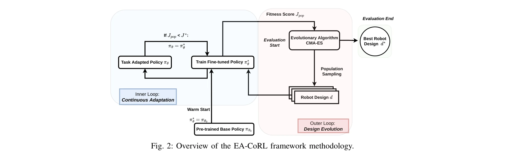

# Evolutionary Continuous Adaptive RL-Powered Co-Design for Humanoid Chin-Up Performance

> **저자**: Tianyi Jin, Melya Boukheddimi, Rohit Kumar, Gabriele Fadini, Frank Kirchner | **날짜**: 2025-09-30 | **URL**: [https://arxiv.org/abs/2509.26082](https://arxiv.org/abs/2509.26082)

---

## Essence

*Fig. 2: Overview of the EA-CoRL framework methodology.*

EA-CoRL은 진화 알고리즘과 강화학습을 결합하여 휴머노이드 로봇의 하드웨어 설계(기어비)와 제어 정책을 동시에 최적화하는 프레임워크이며, RH5 로봇의 턱걸이 작업 성공을 통해 검증되었다.

## Motivation

- **Known**: 전통적으로 로봇 설계는 순차적 프로세스를 따르며, 최근 co-design 방법론은 제어와 하드웨어를 동시에 최적화하는 추세이다. 기존 RL 기반 co-design은 설계 변경 시 정책 재학습의 필요성이라는 문제가 있다.
- **Gap**: 기존 RL 기반 co-design 방법들은 설계 변화에 따른 정책 적응이 동적이지 않고, 광범위한 설계 공간 탐색과 조기 수렴 방지를 동시에 달성하지 못한다.
- **Why**: 휴머노이드 로봇이 턱걸이 같은 고난도 동적 작업을 수행하려면 하드웨어와 제어 정책이 정합되어야 하며, 이전에 액추에이터 한계로 불가능했던 작업을 co-design으로 실현할 수 있다.
- **Approach**: EA-CoRL은 외부 루프에서 CMA-ES를 통해 설계 파라미터(기어비)를 진화시키고, 내부 루프에서 pre-trained base policy를 warm start로 사용하여 각 설계 후보에 대해 정책을 지속적으로 적응시킨다.

## Achievement

- **설계-제어 동시 최적화**: Design Evolution과 Policy Continuous Adaptation을 통합한 EA-CoRL 프레임워크로 로봇 설계와 제어 정책을 협력적으로 최적화
- **높은 적합도와 광범위한 탐색**: 기존 state-of-the-art RL 기반 co-design 방법들 대비 더 높은 fitness score를 달성하고 설계 공간을 더 광범위하게 탐색
- **실현 불가능 작업의 성공**: 액추에이터 한계로 이전에 불가능했던 RH5 휴머노이드의 턱걸이 작업을 기어비 co-design을 통해 실현
- **모델-불가지론적 정책**: 다양한 로봇 설계에 적응 가능한 범용 턱걸이 정책 개발로 전이학습 효율성 증대

## How

*Fig. 2: Overview of the EA-CoRL framework methodology.*

- CMA-ES 진화 알고리즘을 통해 기어비 파라미터 [gr_1, gr_2, gr_3, gr_4]의 설계 공간 탐색
- 각 진화 세대에서 샘플링된 설계 후보에 대해 pre-trained base policy를 warm start로 초기화
- task-adapted policy fine-tuning을 통해 새로운 설계에 대한 정책을 지속적으로 업데이트
- fitness score 개선 여부에 따라 설계와 정책을 반복적으로 개선하는 nested loop 구조
- domain randomization을 활용하여 정책의 강건성과 일반화 능력 강화

## Originality

- 연속 적응형(Continuous Adaptive) co-design 개념 도입으로 기존 일회성 재학습 방식 개선
- meta-RL이 아닌 warm start 기반 정책 전이로 더 간단하면서도 효과적인 설계 변화 대응
- 기어비 같은 액추에이터 설계 파라미터에 중점을 둔 새로운 설계 공간 탐색 (기존은 주로 링크 길이 최적화)
- RH5 휴머노이드의 turnk-up 같은 고난도 전신 동작 co-design 최초 시도

## Limitation & Further Study

- 실제 하드웨어 검증 부재: 시뮬레이션 환경에서만 검증되었으며 실제 로봇 구현 및 성능 검증 필요
- 설계 공간 제한: 기어비만 최적화하며 링크 길이, 모터 종류 등 다른 설계 매개변수는 고정
- 계산 비용 분석 부족: CMA-ES와 RL fine-tuning의 반복으로 인한 계산 오버헤드 정량화 필요
- 정책 일반화 한계: 턱걸이 작업 중심으로 검증되었으며 다른 동적 작업으로의 전이 가능성 미검증
- **후속 연구**: 실제 로봇 플랫폼 적용, 다중 작업 co-design, 구조적 파라미터 최적화 확장, 시뮬레이션-실제 간격(sim-to-real) 해결 필요

## Evaluation

- Novelty: 4/5
- Technical Soundness: 3/5
- Significance: 4/5
- Clarity: 4/5
- Overall: 4/5

**총평**: EA-CoRL은 continuous adaptive 정책 최적화를 통해 RL 기반 co-design의 실질적 문제를 해결한 창의적 프레임워크이며, 이전 불가능했던 고난도 동적 작업 실현의 가능성을 보였다. 다만 실제 하드웨어 검증과 설계 공간 확장이 이루어진다면 실용적 영향력이 더욱 크게 증대될 것으로 예상된다.

## Related Papers

- 🔄 다른 접근: [[papers/1621_PPF_Pre-training_and_Preservative_Fine-tuning_of_Humanoid_Lo/review]] — 둘 다 하드웨어와 제어 정책의 동시 최적화를 다루지만 EA-CoRL은 진화 알고리즘을, PPF는 사전학습을 사용한다.
- 🏛 기반 연구: [[papers/1910_Embracing_Evolution_A_Call_for_Body-Control_Co-Design_in_Emb/review]] — 몸체-제어 공동설계의 중요성을 강조하는 이론적 기반을 제공한다.
- 🔄 다른 접근: [[papers/2150_Toward_Humanoid_Brain-Body_Co-design_Joint_Optimization_of_C/review]] — 휴머노이드 뇌-신체 co-design이 기어비 최적화가 아닌 신경-물리적 관점에서 하드웨어-소프트웨어 동시 설계를 다루는 다른 접근을 제시한다.
- 🧪 응용 사례: [[papers/1920_Explosive_Output_to_Enhance_Jumping_Ability_A_Variable_Reduc/review]] — 점프 능력 향상을 위한 가변 감속비 설계 연구가 EA-CoRL의 기어비 최적화를 특정 운동 능력 향상에 적용하는 구체적인 사례를 제공한다.
- 🧪 응용 사례: [[papers/1800_AMOR_Adaptive_Character_Control_through_Multi-Objective_Rein/review]] — 진화적 연속 적응 RL 기반 co-design이 AMOR의 캐릭터 제어를 실제 휴머노이드 하드웨어 최적화와 결합하는 데 활용될 수 있다.
- 🔗 후속 연구: [[papers/1832_CAD-Driven_Co-Design_for_Flight-Ready_Jet-Powered_Humanoids/review]] — CAD 기반 co-design이 진화적 연속 적응 RL co-design으로 확장되어 더 동적인 형태-제어 최적화를 달성할 수 있다
- 🏛 기반 연구: [[papers/1776_A_Framework_for_Optimal_Ankle_Design_of_Humanoid_Robots/review]] — 진화적 연속 적응 RL 기반 공동 설계의 이론적 기반을 발목 최적화 프레임워크에서 찾을 수 있습니다.
- 🏛 기반 연구: [[papers/1910_Embracing_Evolution_A_Call_for_Body-Control_Co-Design_in_Emb/review]] — body-control co-design의 진화적 최적화 원리가 Evolutionary Continuous Adaptive RL의 co-design 메커니즘에 이론적 기반을 제공한다.
- 🔄 다른 접근: [[papers/1920_Explosive_Output_to_Enhance_Jumping_Ability_A_Variable_Reduc/review]] — EA-CoRL의 전체적인 co-design 접근이 무릎 관절에만 특화된 EVRR-K와는 다른 범위에서 하드웨어 최적화를 다룬다.
- 🔗 후속 연구: [[papers/2079_LEGO_Latent-space_Exploration_for_Geometry-aware_Optimizatio/review]] — LEGO의 데이터 기반 설계 프레임워크를 진화적 최적화 방법론으로 확장하여 더 포괄적인 co-design을 달성할 수 있다.
- 🔗 후속 연구: [[papers/2123_One-shot_Adaptation_of_Humanoid_Whole-body_Motion_with_Walki/review]] — Evolutionary Continuous Adaptive RL의 co-design 개념이 One-shot Adaptation의 보행-비보행 동작 통합으로 더욱 발전된 것이다
- 🔄 다른 접근: [[papers/2150_Toward_Humanoid_Brain-Body_Co-design_Joint_Optimization_of_C/review]] — RoboCraft는 fall recovery에 특화된 co-design을 제안하고 Evolutionary Continuous Adaptive RL은 연속적 적응 진화를 통한 일반화된 co-design을 추구합니다.
