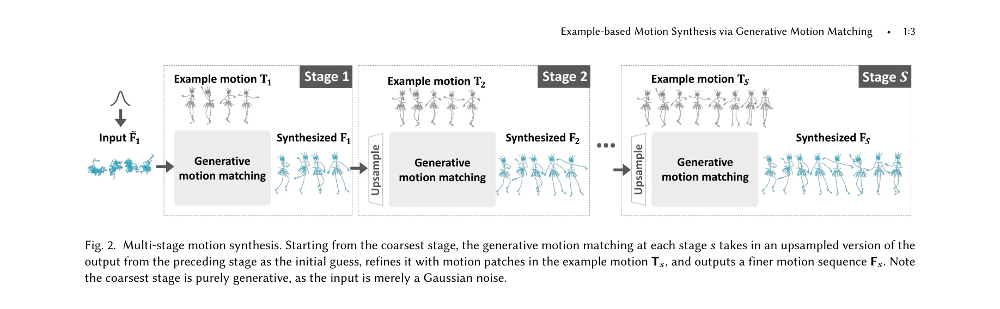
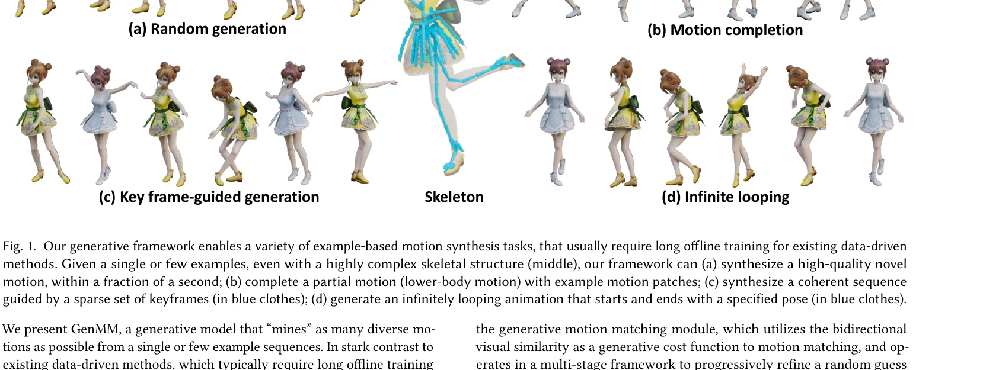

# Example-based Motion Synthesis via Generative Motion Matching

> **저자**: Weiyu Li, Xuelin Chen, Peizhuo Li, Olga Sorkine-Hornung, Baoquan Chen | **날짜**: 2023-06-01 | **URL**: [https://arxiv.org/abs/2306.00378](https://arxiv.org/abs/2306.00378)

---

## Essence

*Fig. 2. Multi-stage motion synthesis. Starting from the coarsest stage, the generative motion matching at each stage 𝑠ta*

GenMM은 단일 또는 소수의 예제 모션으로부터 다양한 모션을 생성하는 학습 불필요한 생성 모델로, Motion Matching의 품질을 유지하면서 Bidirectional similarity를 생성 비용 함수로 활용하여 다단계 프레임워크로 점진적으로 모션을 정제한다.

## Motivation

- **Known**: Motion Matching은 대규모 모션 데이터베이스를 사용하여 고품질의 자연스러운 캐릭터 애니메이션을 생성하는 산업 표준 방식이며, 최근 deep learning 기반 방법들은 다양한 모션을 생성하지만 긴 훈련 시간, visual artifacts, 복잡한 스켈레톤에 대한 확장성 부족 문제가 있다.
- **Gap**: 기존 data-driven 모션 생성 방법들은 대규모 데이터셋과 오래된 훈련 시간을 요구하며 복잡한 스켈레톤 구조에서 실패하는 반면, 소수 예제로부터 고품질 다양한 모션을 빠르게 생성할 수 있는 방법이 부족하다.
- **Why**: 모션 캡처 데이터 수집은 비용이 높고 스켈레톤 구조의 다양성이 제한되어 있으므로, 제한된 예제로부터 효과적으로 모션을 생성할 수 있는 방법이 애니메이션 제작에서 실용적으로 중요하다.
- **Approach**: Motion Matching의 nearest neighbor 개념을 재해석하여 bidirectional visual similarity를 생성 비용 함수로 사용하고, 다단계 프레임워크에서 초기 랜덤 추측을 예제 모션 패치로 점진적으로 정제하며, 가장 낮은 해상도 단계에 노이즈를 입력하여 생성 다양성을 확보한다.

## Achievement

*Fig. 1. Our generative framework enables a variety of example-based motion synthesis tasks, that usually require long of*

- **훈련 불필요한 고속 생성**: 사전 훈련 없이 단 몇 분의 1초 내에 고품질 모션 생성 가능
- **Motion Matching 품질 유지**: Motion Matching의 높은 품질과 충실도를 그대로 상속하면서 생성 능력 추가
- **복잡한 스켈레톤 확장성**: 433개 관절을 가진 매우 복잡한 스켈레톤 구조에서도 안정적으로 작동
- **다양한 응용 시나리오**: Motion completion, key frame-guided generation, infinite looping, motion reassembly 등 기본 Motion Matching으로는 불가능한 작업 수행
- **다중 예제 지원 용이성**: 여러 모션 예제 입력을 자연스럽게 확장 가능

## How

*Fig. 2. Multi-stage motion synthesis. Starting from the coarsest stage, the generative motion matching at each stage 𝑠ta*

- Skeleton-aware motion patch extraction으로 복잡한 스켈레톤 구조를 효율적으로 처리
- Bidirectional similarity를 비용 함수로 사용하여 예제의 모든 모션 패치가 합성에 포함되고, 합성 결과가 예제의 패치 분포를 따르도록 강제
- Multi-stage framework에서 coarsest stage부터 시작하여 노이즈 입력으로 초기 다양한 후보 생성
- 각 단계에서 upsampling된 이전 단계의 결과를 초기 추측으로 사용하여 점진적으로 모션 정제
- Generative matching and blending을 통해 motion patch를 적절히 선택 및 블렌딩

## Originality

- Motion Matching을 생성 모델로 재해석한 새로운 관점: 전통적인 nearest neighbor 기반 방식을 bidirectional similarity를 통해 생성 모델로 변환
- Image synthesis의 patch-based generative 개념 (Granot et al. 2022)을 모션 합성에 최초로 적용
- 다단계 프레임워크와 노이즈 기반 초기화를 통한 생성 다양성 확보 전략
- Skeleton-aware patch 추출로 복잡한 스켈레톤 구조 처리의 새로운 솔루션 제시

## Limitation & Further Study

- 예제 모션의 품질이 생성 결과의 상한선을 결정하므로, 저품질 예제로부터는 고품질 모션 생성 불가
- 단일 또는 소수 예제로부터 생성하기 때문에 매우 다양한 모션 스타일 학습의 한계
- Bidirectional similarity 계산의 계산 복잡성이 예제 길이와 생성 길이의 증가에 따라 증가할 가능성
- Motion completion이나 keyframe-guided generation 같은 조건부 생성 작업의 추가 제약 조건 처리 메커니즘의 확장 방향 제시 필요
- 다양한 모션 도메인(보행, 춤, 격투 등)에 대한 광범위한 평가 필요

## Evaluation

- Novelty: 4/5
- Technical Soundness: 3/5
- Significance: 4/5
- Clarity: 4/5
- Overall: 4/5

**총평**: GenMM은 Motion Matching의 우수한 품질을 유지하면서 학습 불필요한 생성 모델을 구현한 창의적인 접근법으로, 산업 실무에서 즉시 적용 가능한 실용성과 복잡한 스켈레톤에 대한 강력한 확장성을 제공하는 매우 가치 있는 연구이다.
