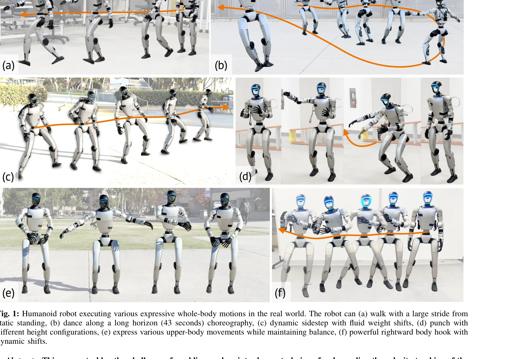

# ExBody2: Advanced Expressive Humanoid Whole-Body Control

> **저자**: Mazeyu Ji, Xuanbin Peng, Fangchen Liu, Jialong Li, Ge Yang, Xuxin Cheng, Xiaolong Wang | **날짜**: 2024-12-17 | **URL**: [https://arxiv.org/abs/2412.13196](https://arxiv.org/abs/2412.13196)

---

## Essence

*Fig. 1: Humanoid robot executing various expressive whole-body motions in the real world. The robot can (a) walk with a *

ExBody2는 휴머노이드 로봇이 인간의 모션 캡처 데이터와 시뮬레이션 데이터를 학습하여 표현력 있는 전신 동작을 수행하도록 하는 프레임워크이며, 자동화된 데이터 필터링과 teacher-student 기반의 decoupled motion-velocity 제어 전략을 통해 실제 로봇에 배포 가능하게 함.

## Motivation

- **Known**: 기존 연구들은 RL과 sim-to-real 전이학습을 통해 휴머노이드 로봇의 복잡한 전신 제어를 시연했으나, 인간 모션 데이터의 로봇 불가능 동작 필터링이 수동으로 수행되고 표현력과 안정성 간의 trade-off 문제가 여전히 존재함.
- **Gap**: 기존의 수동 데이터 필터링 방식은 비효율적이고, global keypoint 기반 추적은 실시간 추적 실패로 이어지며, 단일 policy로는 다양한 동작의 추적 성능을 동시에 달성하기 어려움.
- **Why**: 휴머노이드 로봇이 인간 수준의 표현력 있는 전신 동작을 안정적으로 수행할 수 있다면 인간 생활 공간에서의 실용성과 인간-로봇 상호작용이 크게 향상될 것임.
- **Approach**: Feasibility-Diversity 원칙을 기반으로 자동화된 데이터 필터링을 통해 generalist policy를 학습하고, 특정 동작 그룹에 대해 specialist policy로 fine-tuning하며, teacher-student framework와 decoupled motion-velocity 제어를 통해 sim-to-real 전이를 강화함.

## Achievement

*Fig. 1: Humanoid robot executing various expressive whole-body motions in the real world. The robot can (a) walk with a *

- **자동화된 데이터 필터링**: 하위 신체의 물리적으로 불가능한 동작을 제거하면서 상체의 다양성을 유지하는 Feasibility-Diversity 원칙을 제시하여 훈련 안정성과 추적 정확도를 동시에 개선
- **Generalist-Specialist 파이프라인**: 다양한 동작에 강인한 단일 generalist policy와 특정 동작에 고도로 최적화된 specialist policies를 제공하여 적응성과 정밀도의 균형 달성
- **Decoupled Motion-Velocity 제어**: 전역 keypoint 추적을 local frame의 velocity 기반 제어와 decoupling하여 실시간 추적 실패를 해결하고 로봇의 즉각적인 다음 단계 이동 가능성 확보
- **실제 로봇 배포**: Unitree G1에서 걷기, 웅크리기, 춤 등 다양한 표현력 있는 전신 동작을 43초의 장시간 안무 포함하여 성공적으로 수행

## How

*Fig. 2: Exbody2’s framework. (a) Motion retargeting adapts raw human motion datasets to fit the humanoid robot’s morphol*

- 인간 모션 데이터를 로봇의 형태학(morphology)에 맞게 retargeting
- 초기 policy π0를 필터링되지 않은 다양한 모션 데이터셋 D에 학습한 후, 각 모션 시퀀스의 추적 오류를 평가
- 하위 신체의 추적 오류 메트릭 e(s)를 기준으로 자동화된 필터링 임계값을 결정하여 불가능한 동작 제거
- 필터링된 데이터로 generalist policy π를 PPO를 통해 재학습
- Teacher policy를 실제 루트 속도, 정확한 신체 링크 위치, 마찰력 등의 privileged information으로 학습
- Student policy를 DAgger 스타일 distillation으로 학습하여 과거 관찰을 통해 privileged information 추론
- Generalist policy의 가중치를 초기값으로 하여 특정 동작 그룹에 대한 specialist policies fine-tuning
- Velocity 기반 제어와 keypoint 추적을 decoupling하여 각각이 전역 이동과 모션 모방에 집중하도록 설계

## Originality

- **자동화된 데이터 필터링 방법론**: 기존의 언어 레이블 기반 필터링(ExBody) 또는 SMPL 아바타 시뮬레이션 방식을 넘어, 실제 policy의 추적 오류를 직접 측정하여 하위 신체 동작 가능성을 객관적으로 판단하는 새로운 접근
- **Feasibility-Diversity 원칙**: 상체와 하체의 필터링 방식을 구분하여 적용함으로써, 표현력과 안정성 간의 trade-off를 원칙적으로 해결하는 개념 제시
- **Decoupled Motion-Velocity 제어 전략**: Global keypoint 추적의 한계를 velocity 기반 제어로 극복하고, 이를 local frame 변환과 결합하는 아키텍처 혁신
- **Teacher-Student Framework 적용**: Privileged information을 활용한 teacher policy와 DAgger 스타일 distillation을 통해 sim-to-real 전이 강화

## Limitation & Further Study

- **동작 간 performance trade-off**: 특정 동작에 fine-tuning된 specialist policy는 다른 동작의 성능을 저하시키는 근본적인 limitation이 존재하며, 이를 완전히 해결하는 방법이 제시되지 않음
- **동작 선택 메커니즘의 자동화 부족**: 어느 specialist policy를 선택할지 결정하기 위해 동작 레이블 또는 action recognition 모델이 필요하나, 실제 배포 환경에서의 이러한 메커니즘의 실용성이 검증되지 않음
- **특정 로봇 플랫폼에 제한**: Unitree G1을 중심으로 평가되었으며, 다른 형태학을 가진 휴머노이드 로봇에 대한 일반화 가능성이 불명확함
- **데이터 필터링 임계값 설정의 자동성**: Feasibility-Diversity 원칙의 필터링 임계값을 결정하는 과정이 완전히 자동화되지 않을 가능성이 있음
- **후속 연구 방향**: (1) Multi-task learning 기법을 통해 specialist와 generalist 사이의 성능 충돌을 완화하는 방법, (2) 동작 컨텍스트 기반으로 동적으로 policy를 선택하는 메타러닝 접근, (3) 다양한 휴머노이드 로봇 플랫폼에 대한 cross-platform 적응 전략

## Evaluation

- Novelty: 4/5
- Technical Soundness: 3/5
- Significance: 4/5
- Clarity: 4/5
- Overall: 4/5

**총평**: ExBody2는 자동화된 데이터 필터링, generalist-specialist 파이프라인, decoupled motion-velocity 제어라는 세 가지 명확한 혁신을 통해 휴머노이드 로봇의 표현력 있는 전신 제어 문제를 체계적으로 해결하며, 실제 로봇에서의 다양한 동작 성공 시연으로 실질적 기여를 입증한 우수한 연구임.
