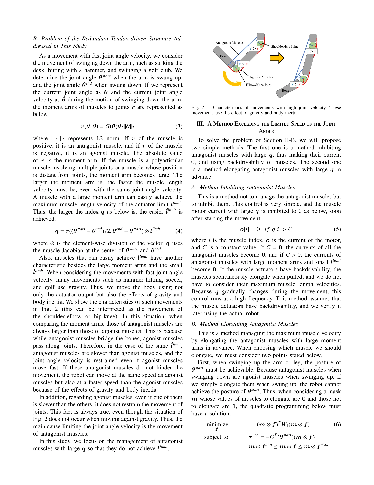

# Exceeding the Maximum Speed Limit of the Joint Angle for the Redundant Tendon-driven Structures of Musculoskeletal Humanoids

> **저자**: Kento Kawaharazuka, Yuya Koga, Kei Tsuzuki, Moritaka Onitsuka, Yuki Asano, Kei Okada, Koji Kawasaki, Masayuki Inaba | **날짜**: 2025-02-18 | **URL**: [https://arxiv.org/abs/2502.12808](https://arxiv.org/abs/2502.12808)

---

## Essence

*Fig. 2.*

중복 힘줄 구동 구조를 가진 근골격 인간형 로봇에서 가장 느린 근육에 의해 제한되는 관절 각속도 한계를 초과하는 두 가지 방법을 제안하고 실제 로봇 실험으로 검증한다.

## Motivation

- **Known**: 근골격 인간형 로봇은 중복 근육 배치를 통해 fail-safe 중복 구동과 가변 강성 제어를 달성할 수 있다. 관절 각속도를 최대화하기 위한 소프트웨어 최적화 방법들이 개발되어 왔다.
- **Gap**: 기존 최적화 방법들은 근골격 인간형 로봇의 하드웨어 특성을 활용하지 못한다. 중복 근육 배치에서 拮抗근(antagonist muscles)의 큰 moment arm이 관절 각속도를 제한하는 근본 원인에 대한 해결책이 부족하다.
- **Why**: 빠른 관절 각속도는 해머질, 골프 스윙, 축구 킥 등 동적 움직임에서 필수적이며, 근골격 로봇의 생체모방 이점을 최대한 활용하기 위해 중요하다.
- **Approach**: 관절 각속도 제약을 분석하기 위해 muscle Jacobian G(θ)와 moment arm r을 기반으로 한 지표 q를 정의하고, 拮抗근의 제어 방식을 두 가지로 나누어 제안한다.

## Achievement

- **拮抗근 억제 방법**: 조건 q[i] > C를 만족하는 拮抗근의 모터 전류를 0으로 설정하고 backdrivability를 활용하여 관절 각속도 제한을 초과하는 간단한 방법 제시
- **拮抗근 사전 길이 조정 방법**: quadratic programming을 통해 θstart를 달성 가능하게 유지하면서 拮抗근을 미리 신장시켜 속도 제약을 완화하는 방법 개발
- **실제 로봇 검증**: 근골격 인간형 로봇 Musashi를 사용한 실험을 통해 두 방법의 효과성과 장단점 비교

## How

*Fig. 2.*

- Muscle Jacobian G(θ)를 기반으로 moment arm r(θ, ˙θ)을 계산하고, 속도 제약 지표 q = r ⊘ ˙llimit을 정의
- 拮抗근 억제 방법: 각 시간 스텝마다 q[i] > C 조건을 확인하여 해당 근육의 모터 전류를 0으로 설정
- 拮抗근 길이 조정 방법: 마스크 m을 사용하여 신장할 근육 선택, 식 (6)의 quadratic programming으로 θstart 달성 가능성 검증
- 시뮬레이션 기반 평가: 식 (7)을 통해 각 마스크 m에 대한 시간 비용 tcost를 계산하여 최적의 m 선택

## Originality

- 근골격 로봇의 중복 근육 배치에서 拮抗근의 moment arm 차이가 관절 각속도 제약의 근본 원인임을 명확히 분석
- Backdrivability를 활용한 간단하면서도 실용적인 拮抗근 억제 제어 방법 제안
- 근육 중복성(muscle redundancy)을 활용하여 特정 근육만 선택적으로 신장시키는 사전 조정 방법 개발
- 일반화된 근골격 구조에 적용 가능한 프레임워크 제시 (moment arm이 일정하지 않은 복잡한 구조 지원)

## Limitation & Further Study

- 拮抗근 억제 방법은 모터에 backdrivability가 있어야 함 (모든 액추에이터에 적용 불가)
- 拮抗근 길이 조정 방법의 시뮬레이션은 모터 관성, 모델 오차, 히스테리시스 등을 고려하지 않아 정확도 제한
- 두 방법의 비교 분석이 실험 결과에만 의존하며, 일반화된 성능 비교 기준 부재
- 후속 연구: 더 정교한 동역학 모델을 반영한 최적화 알고리즘 개발, 다양한 신체 부위 및 움직임 유형에 대한 광범위한 검증 필요

## Evaluation

- Novelty: 4/5
- Technical Soundness: 3/5
- Significance: 4/5
- Clarity: 4/5
- Overall: 4/5

**총평**: 근골격 인간형 로봇의 구동 제약을 새로운 관점에서 분석하고, 실용적이면서도 독창적인 두 가지 해결 방법을 제시했다. 실제 로봇 실험 검증을 통해 이론의 타당성을 입증했으나, 시뮬레이션의 단순화와 적용 조건의 제한이 개선될 여지가 있다.
