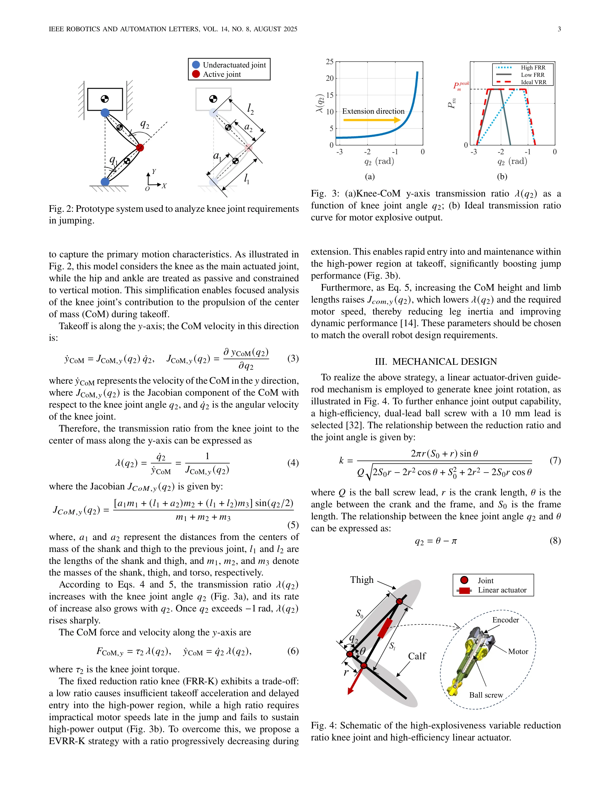

# Explosive Output to Enhance Jumping Ability: A Variable Reduction Ratio Design Paradigm for Humanoid Robots Knee Joint

> **저자**: Xiaoshuai Ma, Haoxiang Qi, Qingqing Li, Haochen Xu, Xuechao Chen, Junyao Gao, Zhangguo Yu, Qiang Huang | **날짜**: 2025-06-14 | **URL**: [https://arxiv.org/abs/2506.12314](https://arxiv.org/abs/2506.12314)

---

## Essence

*Fig. 1: Motor torque performance envelope (TPE) and power*

휴머노이드 로봇의 점프 능력을 향상시키기 위해 무릎 관절이 신장할수록 감속비가 동적으로 감소하는 EVRR-K(Explosive Variable Reduction Ratio Knee) 설계 패러다임을 제안한다.

## Motivation

- **Known**: 전기 구동 휴머노이드 로봇은 PMSM 모터와 감속기를 사용하지만, 고정 감속비로 인해 점프 시 필요한 고토크 후 고속 출력을 충족할 수 없다. 기존 로봇들은 수압식 아틀라스(0.6m 이상)에 비해 훨씬 낮은 점프 성능을 보여준다.
- **Gap**: 무릎-질량중심(CoM) 전달 비와 점프 요구사항의 불일치, 그리고 고속 구간에서 모터 성능 저하로 인해 지속적인 고출력 유지 기간이 제한된다.
- **Why**: 점프는 휴머노이드 로봇의 복잡한 지형 통과 및 장애물 극복 능력을 결정하는 중요한 운동 능력이며, 개선된 무릎 설계는 로봇의 민첩성과 기동성을 크게 향상시킬 수 있다.
- **Approach**: 모터 출력 특성과 점프 중 무릎 운동학을 분석하여 관절 각도와 감속비를 결합하는 전략을 수립하고, 선형 액추에이터 기반 가이드-로드 메커니즘으로 구현하며, 점프 제어 전략으로 최적화한다.

## Achievement

*Fig. 4: Schematic of the high-explosiveness variable reduction*

- **EVRR-K 전략**: 무릎 신장 시 감속비가 점진적으로 감소하여 점프 초기에 높은 토크를 제공하고 후기에 모터 속도 증가와 손실을 최소화하여 지속적 고출력을 유지
- **63cm 단일 관절 수직 점프**: 고정 감속비 최적 설계 대비 28.1% 이론적 개선
- **전신 휴머노이드 통합 성과**: 1.1m 수평 점프, 0.5m 수직 점프, 0.5m 박스 점프 달성
- **컴팩트한 메커니즘**: 선형 액추에이터 기반 설계로 높은 매개변수 유연성과 효율성 확보

## How

*Fig. 3: (a)Knee-CoM y-axis transmission ratio 𝜆(𝑞2) as a*

- PMSM 모터의 구리 손실, 철 손실, 기계적 손실을 분석하여 성능 곡선 도출
- 단순화된 2-자유도 다리 모델로 무릎-CoM 전달비 λ(q₂)의 관절 각도 의존성 분석
- 선형 액추에이터와 가이드-로드 기구학을 이용한 EVRR-K 메커니즘 구현
- 점프 동역학 제약 조건 하에서 최적 감속비 곡선 도출을 위한 매개변수 최적화
- 단일 관절 테스트 플랫폼과 전체 휴머노이드 로봇에서 검증

## Originality

- 동적으로 변하는 감속비 개념을 무릎 관절에 처음 적용하여 모터 성능 곡선과 운동학 요구사항의 근본적 불일치 해결
- 선형 액추에이터 기반 가이드-로드 메커니즘으로 복잡한 회전 감속기 대신 단순하고 유연한 구조 구현
- 점프 제어 전략으로부터 역으로 유도된 매개변수 최적화 방법론의 체계화

## Limitation & Further Study

- 선형 액추에이터의 행정거리 제약으로 인한 무릎 운동 범위 제한 가능성
- 메커니즘의 마찰 및 누수 등으로 인한 실제 효율이 이론값과 불일치할 가능성
- 현재 설계는 주로 점프에 최적화되어 있으며, 일상적인 보행 운동에서의 성능 영향 분석 필요
- 다리 전체의 통합 제어 및 안정성 확보 방안 추가 연구 필요
- 다양한 착지 자세 및 동적 회복 능력에 대한 추가 검증 필요

## Evaluation

- Novelty: 4/5
- Technical Soundness: 4/5
- Significance: 4/5
- Clarity: 4/5
- Overall: 4/5

**총평**: 무릎 관절의 동적 감속비 개념을 신창의적으로 도입하여 전기 구동 휴머노이드의 점프 성능을 획기적으로 개선한 우수한 연구다. 이론 분석, 메커니즘 설계, 실험 검증이 체계적으로 이루어져 있으며, 달성한 점프 성능(0.5m 수직, 1.1m 수평)은 기존 전기 로봇 대비 최고 수준이다.
