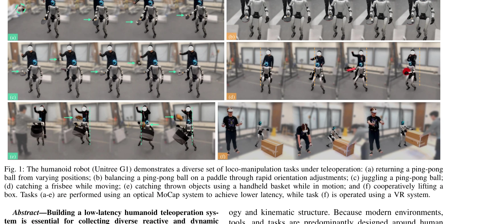

# ExtremControl: Low-Latency Humanoid Teleoperation with Direct Extremity Control

> **저자**: Ziyan Xiong, Lixing Fang, Junyun Huang, Kashu Yamazaki, Hao Zhang, Chuang Gan | **날짜**: 2026-02-11 | **URL**: [https://arxiv.org/abs/2602.11321](https://arxiv.org/abs/2602.11321)

---

## Essence

*Fig. 1: The humanoid robot (Unitree G1) demonstrates a diverse set of loco-manipulation tasks under teleoperation: (a) r*

ExtremControl은 SE(3) 포즈 기반의 직접 제어와 velocity feedforward 제어를 통해 humanoid teleoperation의 지연시간을 50ms까지 단축하는 저지연 전신 제어 프레임워크이다.

## Motivation

- **Known**: 기존 humanoid teleoperation 시스템들은 인간-휴머노이드 motion retargeting과 position-only PD 제어에 의존하여 약 200ms의 지연시간을 야기하고, 빠른 반응이 필요한 작업 수행을 제한한다.
- **Gap**: position-only PD 제어 패러다임 내에서 joint-space retargeting으로 인한 지연시간을 제거하고, 발을 포함한 전신 제어를 동시에 달성하는 방법이 부재하다.
- **Why**: 저지연 teleoperation은 탁구 발리, 저글링 등 빠른 피드백이 필요한 동작 데이터 수집을 가능하게 하며, 이는 범용 로봇 지능 학습에 필수적이다.
- **Approach**: 인간 링크 포즈를 Cartesian-space mapping을 통해 직접 휴머노이드 링크 목표치로 변환하고, velocity feedforward 제어를 저수준에서 적용하여 제어 응답성을 대폭 향상시킨다.

## Achievement

*Fig. 1: The humanoid robot (Unitree G1) demonstrates a diverse set of loco-manipulation tasks under teleoperation: (a) r*

- **저지연 달성**: 기존 200ms 대비 50ms의 end-to-end 지연시간 달성 (약 4배 개선)
- **Velocity feedforward 제어**: 저수준 제어 응답시간을 약 100ms 단축하는 velocity feedforward 항 도입
- **전신 제어**: 손, 발, 몸통을 포함한 6개 링크의 SE(3) 포즈 직접 제어로 완전한 전신 제어 달성
- **다양한 입력 모달리티 지원**: optical MoCap과 VR 기반 motion tracking 모두 지원
- **실제 작업 검증**: 탁구 발리, 저글링, 프리스비 캐칭 등 고속 반응이 필요한 실제 조작 작업 수행 증명

## How

*Fig. 2: Tracking objectives for humans and humanoids under VR and*

- 선택된 추체(extremity) 링크 6개의 SE(3) 포즈를 tracking objectives로 정의
- anthropomorphic compensation, kinematic sufficiency, input modality compatibility를 원칙으로 Cartesian-space mapping operator M 설계
- velocity feedforward 제어를 저수준 제어 루프에 통합하여 응답성 향상
- whole-body impedance calibration을 통해 시뮬레이션과 실제 로봇 간 갭 최소화
- optical flow 기반 지연시간 추정 방법 개발으로 정량적 평가 수행

## Originality

- 기존의 full-body joint-space retargeting 대신 selected extremity 링크의 SE(3) 포즈 직접 제어 제안
- velocity feedforward 항을 humanoid 제어에 통합하여 위치 제어만의 200ms 지연 장벽 돌파
- optical flow를 활용한 지연시간 추정 방법 제안으로 teleoperation 시스템 벤치마킹 표준화
- VR과 MoCap을 모두 지원하는 통합 teleoperation 시스템 구현

## Limitation & Further Study

- 발과 팔꿈치 관절 등 내부 관절 구성이 under-constrained되어 특정 고정밀 접촉 작업의 제어 정확성 제한 가능
- contact-sparse 가정 기반이므로 복잡한 다중 접촉 조작 작업에 대한 확장성 미흡
- optical flow 기반 지연시간 추정은 비디오 품질과 카메라 해상도에 의존하여 측정 정확도 변동 가능
- 후속 연구: force feedback 통합으로 촉각 정보 제공, contact-rich manipulation을 위한 framework 확장, 야외 환경에서의 robust tracking 방법 개발

## Evaluation

- Novelty: 4/5
- Technical Soundness: 3/5
- Significance: 4/5
- Clarity: 4/5
- Overall: 4/5

**총평**: ExtremControl은 velocity feedforward와 direct extremity control을 결합하여 humanoid teleoperation의 지연시간을 4배 단축하고 고속 반응 작업을 실현한 혁신적 연구로, 실제 로봇에서의 높은 응답성 달성과 통합된 시스템 구현으로 실용적 가치가 우수하다.
