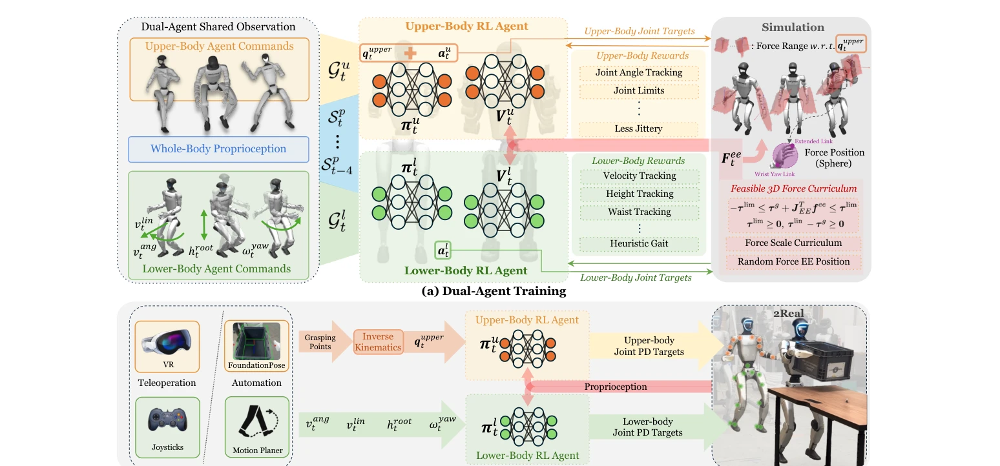
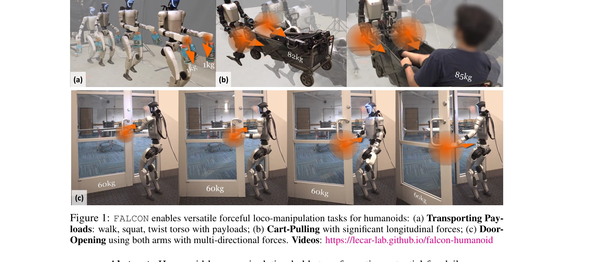

# FALCON: Learning Force-Adaptive Humanoid Loco-Manipulation

> **저자**: Yuanhang Zhang, Yifu Yuan, Prajwal Gurunath, Ishita Gupta, Shayegan Omidshafiei, Ali-akbar Agha-mohammadi, Marcell Vazquez-Chanlatte, Liam Pedersen, Tairan He, Guanya Shi | **날짜**: 2025-05-10 | **URL**: [https://arxiv.org/abs/2505.06776](https://arxiv.org/abs/2505.06776)

---

## Essence

*Figure 2: Overview of FALCON. (a) Two agents with different sub-tasks are jointly trained with*

FALCON은 이중 에이전트 강화학습 프레임워크로, 하체의 안정적 보행과 상체의 정밀한 말단 장치 위치 추적을 분리하여 학습함으로써 휴머노이드 로봇이 0-100N의 큰 외부 힘에 적응하면서 강제적 작업을 수행하도록 한다.

## Motivation

- **Known**: 휴머노이드 로봇은 보행과 조작 능력이 발전했으나, 강한 외부 힘에 적응하는 정밀한 전신 제어는 미흡하다. 기존의 Lower-RL-Upper-IK와 Monolithic-Whole-body-RL 방식 모두 강제적 상호작용을 제대로 처리하지 못한다.
- **Gap**: 휴머노이드 로봇에서 미지의 큰 끝점 힘 교란에 대응하는 강제적 로코-조작 제어가 부족하며, 기존 방법들은 샘플 효율성이 낮거나 상하체의 비효율적 조정으로 인한 과적합 문제를 겪는다.
- **Why**: 강제적 로코-조작은 문 열기, 짐 운반, 카트 끌기 등 실제 산업 및 서비스 작업에 필수적이며, 이를 일반화된 정책으로 구현할 수 있다면 휴머노이드 로봇의 실용성이 대폭 증가한다.
- **Approach**: FALCON은 하체 에이전트(보행 안정성)와 상체 에이전트(말단 위치 추적 및 암묵적 힘 보상)를 공유 고유수용감각으로 분리 학습하며, 관절 토크 제약을 존중하는 3D 힘 커리큘럼으로 점진적으로 외부 힘을 증가시킨다.

## Achievement

*Figure 1: FALCON enables versatile forceful loco-manipulation tasks for humanoids: (a) Transporting Pay-*

- **상체 관절 추적 정확도 200% 향상**: 기존 기준 대비 2배 정확한 상체 관절 추적을 달성하면서 보행 안정성 유지
- **강력한 힘 적응 범위**: 0-100N의 외부 힘에 적응하여 짐 운반(0-20N), 카트 끌기(0-100N), 문 열기(0-40N) 수행
- **빠른 학습 수렴**: 이중 에이전트 분해로 인한 효율적 탐색으로 학습 속도 향상
- **일반화 가능성**: Unitree G1, Booster T1 등 다양한 휴머노이드 플랫폼에서 최소한의 조정으로 정책 배포 가능
- **embodiment-무관 학습**: 특정 로봇 형태에 맞춘 보상 함수나 커리큘럼 튜닝 없이 다중 플랫폼 배포 가능

## How

*Figure 2: Overview of FALCON. (a) Two agents with different sub-tasks are jointly trained with*

- 하체 에이전트와 상체 에이전트를 분리하되, 전체 신체 고유수용감각(관절 위치/속도, 루트 각속도, 중력 투영, 과거 행동)을 공유하여 상호 인식 유지
- 하체 보상은 원하는 보행 속도, 스턴스 지표, 루트 높이, 허리 요 각 추적에 초점
- 상체 보상은 목표 관절 구성 추적(jittery motion 최소화)에 초점
- 3D 힘 커리큘럼 설계: 관절 토크 제약을 역 동역학으로 계산하여 각 훈련 단계에서 적용 가능한 최대 힘 범위 결정, 점진적으로 스케일 계수 α 증가
- 시뮬레이션에서 이중 에이전트 공동 훈련 후, sim-to-real 전이로 실제 로봇 배포
- 배포 시 VR/조이스틱 원격 조작, FoundationPose 기반 자세 추정, IK 기반 상체 명령 변환 활용

## Originality

- 기존의 Lower-RL-Upper-IK(지연된 힘 보상)와 Monolithic-Whole-body-RL(샘플 비효율)의 한계를 극복하는 새로운 이중 에이전트 학습 구조
- 휴머노이드의 관절 토크 제약을 명시적으로 고려한 최초의 3D 힘 커리큘럼 설계
- 암묵적 적응형 힘 보상(explicit force estimation 없이)을 통해 미지의 동적 힘에 대응
- embodiment-무관 정책 학습으로 다중 휴머노이드 플랫폼으로의 일반화 달성

## Limitation & Further Study

- 시뮬레이션-현실 간 갭 극복을 위한 구체적 도메인 무작위화(Domain Randomization) 전략이 논문에서 충분히 상술되지 않음
- 현실 환경에서의 다양한 접촉 시나리오(예: 미끄러운 표면, 비정상 힘 분포)에 대한 강건성 평가 부족
- 계산 복잡도 및 실시간 제어 성능(지연, CPU/GPU 사용량)에 대한 상세 분석 미흡
- 후속 연구: 더 정교한 힘 추정 및 적응 메커니즘, 양손 조작 작업으로의 확장, 동적 이동 환경(예: 불규칙한 지형)에서의 성능 평가

## Evaluation

- Novelty: 4/5
- Technical Soundness: 3/5
- Significance: 4/5
- Clarity: 4/5
- Overall: 4/5

**총평**: FALCON은 휴머노이드의 강제적 로코-조작 문제를 이중 에이전트 분해와 힘 커리큘럼 설계로 효과적으로 해결하며, 다중 플랫폼 배포와 2배의 추적 정확도 향상을 입증함으로써 실용적 가치가 높다. 다만 sim-to-real 갭 극복 메커니즘과 극단적 환경 강건성에 대한 분석이 더 필요하다.
